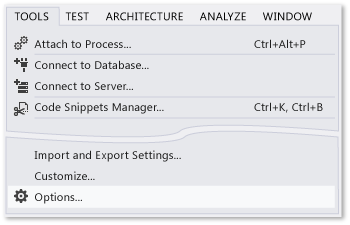
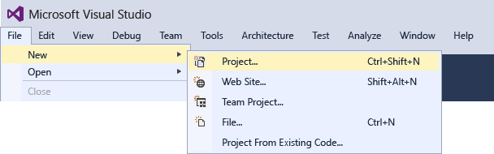
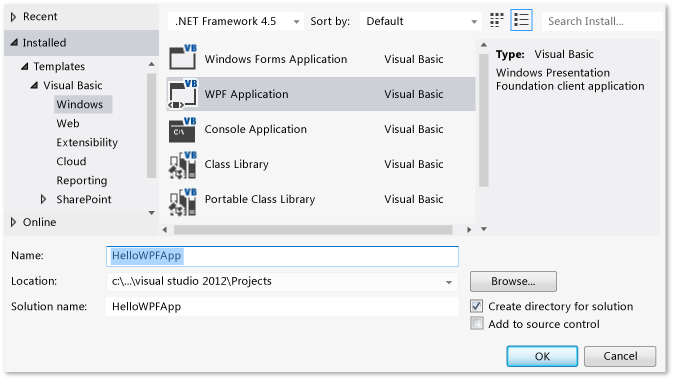
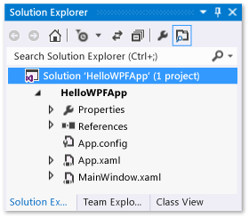
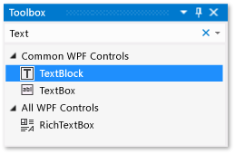
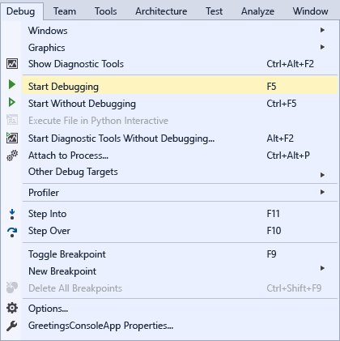
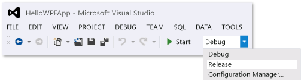

# Walkthrough: Create a Simple Application with Visual C# or Visual Basic
[!INCLUDE[vs2017banner](../includes/vs2017banner.md)]

By completing this walkthrough, you’ll become familiar with many of the tools, dialog boxes, and designers that you can use when you develop applications with Visual Studio. You’ll create a simple “Hello, World”-style application, design the UI, add code, and debug errors, while you learn more about working in the integrated development environment (IDE).

 This topic contains the following sections:

 [Configure the IDE](../ide/walkthrough-create-a-simple-application-with-visual-csharp-or-visual-basic.md#BKMK_ConfigureIDE)

 [Create a simple application](../ide/walkthrough-create-a-simple-application-with-visual-csharp-or-visual-basic.md#BKMK_CreateApp)

 [Debug and test the application](../ide/walkthrough-create-a-simple-application-with-visual-csharp-or-visual-basic.md#BKMK_DebugTest)

> [!NOTE]
> This walkthrough is based on Visual Studio Professional, which offers the WPF Application template on which you'll build the project for this walkthrough. Visual Studio Express for Windows Desktop also offers that template, but Visual Studio Express for Windows and Visual Studio Express for Web don't. For introductory information about how to use Visual Studio Express for Windows, see the [Developer Center for Windows Store apps](https://msdn.microsoft.com/windows/apps/br229519). For introductory information about how to use Visual Studio Express for Web, see [Get Started with ASP.NET](https://dotnet.microsoft.com/learn/aspnet/hello-world-tutorial/intro). In addition, your edition of Visual Studio and the settings that you use determine the names and locations of some elements of the user interface. See [Customizing Development Settings in Visual Studio](https://msdn.microsoft.com/22c4debb-4e31-47a8-8f19-16f328d7dcd3).

## <a name="BKMK_ConfigureIDE"></a> Configure the IDE
 When you start Visual Studio for the first time, Visual Studio prompts you to sign in with a Microsoft Service Account (MSA), [Sign into Visual Studio](https://devblogs.microsoft.com/visualstudio/welcome-sign-in-to-visual-studio/). You do not need to sign in and can do that later.

 On your Visual Studio launch, you next must choose a settings combination that applies a set of pre-defined customizations to the IDE. Each settings combination has been designed to make it easier for you to develop applications.

 This walkthrough assume you applied **General Development Settings**, which applies the least amount of customization to the IDE. If you have already chosen C# or Visual Basic (both are good choices), you don’t have to change your settings.  If you want to change your settings, you can use the **Import and Export Settings Wizard**. See [Customizing Development Settings in Visual Studio](https://msdn.microsoft.com/22c4debb-4e31-47a8-8f19-16f328d7dcd3).

 After you open Visual Studio, you can identify the tool windows, the menus and toolbars, and the main window space. Tool windows are docked on the left and right sides of the application window, with **Quick Launch**, the menu bar, and the standard toolbar at the top. In the center of the application window is the **Start Page**. When you load a solution or project, editors and designers appear in the space where the **Start Page** is. When you develop an application, you’ll spend most of your time in this central area.

 Figure 2: Visual Studio IDE

 

 You can make additional customizations to Visual Studio, such as changing the font face and size of the text in the editor or the color theme of the IDE, by using the **Options** dialog box. Depending on the settings combination that you’ve applied, some items in that dialog box might not appear automatically. You can make sure that all possible options appear by choosing the **Show all settings** check box.

 Figure 3: Options dialog box

 

 In this example, you’ll change the color theme of the IDE from light to dark.  You can skip ahead to create a project if you like.

#### To change the color theme of the IDE

1. Open the **Options** dialog box by choosing the **Tools** menu at the top and then the **Options …** item.

    

2. Change the **Color theme** to **Dark**, then click **OK**.

    

   The colors in Visual Studio should match the following image:

   

   The color theme used for pictures in the rest of this walkthrough is the light theme. For more information about customizing the IDE, see [Customizing Development Settings in Visual Studio](https://msdn.microsoft.com/22c4debb-4e31-47a8-8f19-16f328d7dcd3).

## <a name="BKMK_CreateApp"></a> Create a simple application

### Create the project
 When you create an application in Visual Studio, you first create a project and a solution. For this example, you’ll create a Windows Presentation Foundation (WPF) project.

##### To create the WPF project

1. Create a new project. On the menu bar, choose **File**, **New**, **Project…**.

    

    You can also type **New Project** in the **Quick Launch** box to do the same thing.

    

2. Choose the Visual Basic or the Visual C# WPF Application template by choosing in the left pane **Installed**, **Templates**, **Visual C#**, **Windows**, for example, and then choosing WPF Application in the middle pane.  Name the project HelloWPFApp at the bottom of the New Project dialog.

    

    OR

    

   Visual Studio creates the HelloWPFApp project and solution, and the **Solution Explorer** shows the various files. The WPF Designer shows a design view and an XAML view of MainWindow.xaml in a split view. You can slide the splitter to show more or less of either view.  You can choose to see only the visual view or only the XAML view. (For more information, see [WPF Designer for Windows Forms Developers](https://msdn.microsoft.com/47ad0909-e89b-4996-b4ac-874d929f94ca)). The following items appear in **Solution Explorer**:

   Figure 5: Project items

   

   After you create the project, you can customize it. By using the **Properties** window (found on the **View** menu), you can display and change options for project items, controls, and other items in an application. By using the project properties and property pages, you can display and change options for projects and solutions.

##### To change the name of MainWindow.xaml

1. In the following procedure, you’ll give MainWindow a more specific name. In **Solution Explorer**, select MainWindow.xaml. You should see the **Properties** window, but if you don’t, choose the **View** menu and the **Property Window** item. Change the **File Name** property to `Greetings.xaml`.

    

    **Solution Explorer** shows that the name of the file is now Greetings.xaml, and if you expand the MainWindow.xaml node (by putting focus in the node and pressing the rightarrow key), you see the name of MainWindow.xaml.vb or MainWindow.xaml.cs is now Greetings.xaml.vb or Greetings.xaml.cs. This code file is nested under the .xaml file node to show they are very closely related to each other.

   > [!WARNING]
   > This change causes an error that you will learn how to debug and fix in a later step.

2. In **Solution Explorer**, open Greetings.xaml in the Designer view (by pressing the Enter key while the node has focus) and select the title bar of the window by using the mouse.

3. In the **Properties** window, change the value of the **Title** property to `Greetings`.

   The title bar for MainWindow.xaml now reads Greetings.

### Design the user interface (UI)
 We will add three types of controls to this application: a TextBlock control, two RadioButton controls, and a Button control.

##### To add a TextBlock control

1. Open the **Toolbox** window by choosing the **View** menu and the **Toolbox** item.

2. In the **Toolbox**, search for the TextBlock control.

    

3. Add a TextBlock control to the design surface by choosing the TextBlock item and dragging it to the window on the design surface.  Center the control near the top of the window.

   Your window should resemble the following illustration:

   Figure 7: Greetings window with TextBlock control

   

   The XAML markup should look something like the following:

```
<TextBlock HorizontalAlignment="Center" TextWrapping="Wrap" VerticalAlignment="Center" RenderTransformOrigin="4.08,2.312" Margin="237,57,221,238"><Run Text="TextBlock"/><InlineUIContainer><TextBlock TextWrapping="Wrap" Text="TextBlock"/>
```

##### To customize the text in the text block

1. In the XAML view, locate the markup for TextBlock and change the Text attribute: `Text=”Select a message option and then choose the Display button.”`

2. If the TextBlock does not expand to fit the In the Design view, enlarge the TextBlock control (using the grab handles on the edges) so that it displays all the text.

3. Save your changes by pressing Ctrl-s or using the **File** menu item.

   Next, you’ll add two [RadioButton](https://msdn.microsoft.com/library/6c9ba847-eab7-4bba-9c74-6b56ef72067b) controls to the form.

##### To add radio buttons

1. In the **Toolbox**, search for the RadioButton control.

    

2. Add two RadioButton controls to the design surface by choosing the RadioButton item and dragging it to the window on the design surface twice, and move the buttons (by selecting them and using the arrow keys) so that the buttons appear side by side under the TextBlock control.

    Your window should look like this:

    Figure 8: RadioButtons in the Greetings window.

    

3. In the **Properties** window for the left RadioButton control, change the **Name** property (the property at the top of the **Properties** window) to `RadioButton1`.  Make sure you have selected the RadioButton and not the background Grid on the form; the Type field of the Property Window under the Name field should say RadioButton.

4. In the **Properties** window for the right RadioButton control, change the **Name** property to `RadioButton2`, and then save your changes by pressing Ctrl-s or using the **File** menu item.  Make sure you selected the RadioButton before changing and saving.

   You can now add display text for each RadioButton control. The following procedure updates the **Content** property for a RadioButton control.

##### To add display text for each radio button

1. On the design surface, open the shortcut menu for RadioButton1 by pressing the right mouse button while selecting RadioButton1, choose **Edit Text**, and then enter `Hello`.

2. Open the shortcut menu for RadioButton2 by pressing the right mouse button while selecting RadioButton2, choose **Edit Text**, and then enter `Goodbye`.

   The final UI element that you’ll add is a [Button](https://msdn.microsoft.com/library/a9d8f5a5-c98c-463e-808a-5a4e63173098) control.

##### To add the button control

1. In the **Toolbox**, search for the **Button** control, and then add it to the design surface under the RadioButton controls by selecting Button and dragging it to the form in the design view.

2. In the XAML view, change the value of **Content** for the Button control from `Content=”Button”` to `Content=”Display”`, and then save the changes (Ctrl-s or use the **File** menu).

    The markup should resemble the following example: `<Button Content="Display" HorizontalAlignment="Left" VerticalAlignment="Top" Width="75" Margin="215,204,0,0"/>`

   Your window should resemble the following illustration.

   Figure 9: Final Greetings UI

   

### Add code to the Display Button
 When this application runs, a message box appears after a user first chooses a radio button and then chooses the **Display** button. One message box will appear for Hello, and another will appear for Goodbye. To create this behavior, you’ll add code to the Button_Click event in Greetings.xaml.vb or Greetings.xaml.cs.

##### Add code to display message boxes

1. On the design surface, double-click the **Display** button.

     Greetings.xaml.vb or Greetings.xaml.cs opens, with the cursor in the Button_Click event. You can also add a click event handler as follows (if the pasted code has a red squiggle under any names, then you probably did not select the RadioButton controls on the design surface and rename them):

     For Visual Basic, the event handler should look like this:

    ```vb
    Private Sub Button_Click_1(sender As Object, e As RoutedEventArgs)

    End Sub
    ```

     For Visual C#, the event handler should look like this:

    ```csharp
    private void Button_Click_1(object sender, RoutedEventArgs e)
    {

    }
    ```

2. For Visual Basic, enter the following code:

    ```vb
    If RadioButton1.IsChecked = True Then
        MessageBox.Show("Hello.")
    Else RadioButton2.IsChecked = True
        MessageBox.Show("Goodbye.")
    End If

    ```

     For Visual C#, enter the following code:

    ```
    if (RadioButton1.IsChecked == true)
    {
        MessageBox.Show("Hello.");
    }
    else
    {
        RadioButton2.IsChecked = true;
        MessageBox.Show("Goodbye.");
    }
    ```

3. Save the application.

## <a name="BKMK_DebugTest"></a> Debug and test the application
 Next, you’ll debug the application to look for errors and test that both message boxes appear correctly. The following instructions tell you how to build and launch the debugger, but later you might read [Building a WPF Application (WPF)](https://msdn.microsoft.com/library/a58696fd-bdad-4b55-9759-136dfdf8b91c) and [Debugging WPF](../debugger/debugging-wpf.md) for more information.

### Find and fix errors
 In this step, you’ll find the error that we caused earlier by changing the name of the main window XAML file.

##### To start debugging and find the error

1. Start the debugger by selecting **Debug**, then **Start Debugging**.

    

    A dialog box appears, indicating that an IOException has occurred: Cannot locate resource ‘mainwindow.xaml’.

2. Choose the **OK** button, and then stop the debugger.

    

   We renamed Mainwindow.xaml to Greetings.xaml at the start of this walkthrough, but  the code still refers to Mainwindow.xaml as the startup URI for the application, so the project can't start.

##### To specify Greetings.xaml as the startup URI

1. In **Solution Explorer**, open the App.xaml file (in the C# project) or the Application.xaml file (in the Visual Basic project) in the XAML view (it cannot be opened in the Design view) by selecting the file and pressing Enter or by double clicking it.

2. Change `StartupUri="MainWindow.xaml"` to `StartupUri="Greetings.xaml"`, and then save the changes with Ctrl-s.

   Start the debugger again (press F5). You should see the Greetings window of the application.

### To debug with breakpoints
 By adding some breakpoints, you can test the code during debugging. You can add breakpoints by choosing **Debug** on the main menu, then **Toggle Breakpoint** or by clicking in the left margin of the editor next to the line of code where you want the break to occur.

##### To add breakpoints

1. Open Greetings.xaml.vb or Greetings.xaml.cs, and select the following line: `MessageBox.Show("Hello.")`

2. Add a breakpoint from the menu by selecting **Debug**, then **Toggle Breakpoint**.

     

     A red circle appears next to the line of code in the far left margin of the editor window.

3. Select the following line: `MessageBox.Show("Goodbye.")`.

4. Press the F9 key to add a breakpoint, and then press the F5 key to start debugging.

5. In the **Greetings** window, choose the **Hello** radio button, and then choose the **Display** button.

     The line `MessageBox.Show("Hello.")` is highlighted in yellow. At the bottom of the IDE, the Autos, Locals, and Watch windows are docked together on the left side, and the Call Stack, Breakpoints, Command, Immediate, and Output windows are docked together on the right side.

6. On the menu bar, choose **Debug**, **Step Out**.

     The application resumes execution, and a message box with the word “Hello” appears.

7. Choose the **OK** button on the message box to close it.

8. In the **Greetings** window, choose the **Goodbye** radio button, and then choose the **Display** button.

     The line `MessageBox.Show("Goodbye.")` is highlighted in yellow.

9. Choose the F5 key to continue debugging. When the message box appears, choose the **OK** button on the message box to close it.

10. Press the SHIFT + F5 keys (press shift first, and while holding it down, press F5) to stop debugging.

11. On the menu bar, choose **Debug**, **Disable All Breakpoints**.

### Build a release version of the application
 Now that you’ve verified that everything works, you can prepare a release build of the application.

##### To clean the solution files and build a release version

1. On the main menu, select **Build**, then **Clean solution** to delete intermediate files and output files that were created during previous builds.  This is not necessary, but it cleans up the debug build outputs.

    

2. Change the build configuration for HelloWPFApp from **Debug** to **Release** by using the dropdown control on the toolbar (it says “Debug” currently).

    

3. Build the solution by choosing **Build**, then **Build Solution** or press the F6 key.

    

   Congratulations on completing this walkthrough! You can find the .exe you built under your solution and project directory (…\HelloWPFApp\HelloWPFApp\bin\Release\\). If you want to explore more examples, see [Visual Studio Samples](../ide/visual-studio-samples.md).

## See Also
 [What's New in Visual Studio 2015](../what-s-new-in-visual-studio-2015.md)
 [Get Started Developing with Visual Studio](../ide/get-started-developing-with-visual-studio.md)
 [Productivity Tips](../ide/productivity-tips-for-visual-studio.md)
