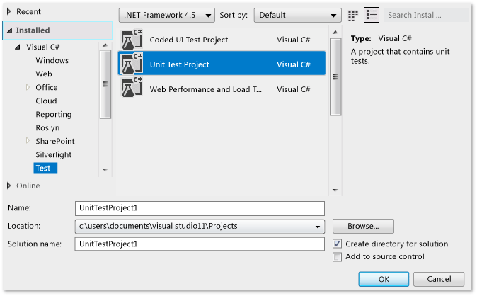
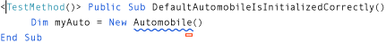
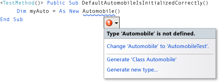
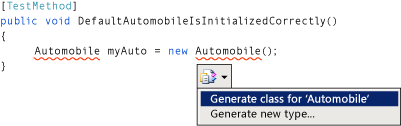
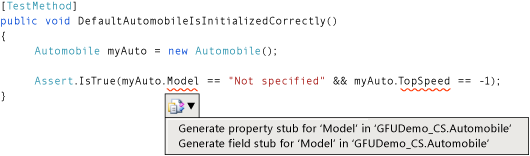
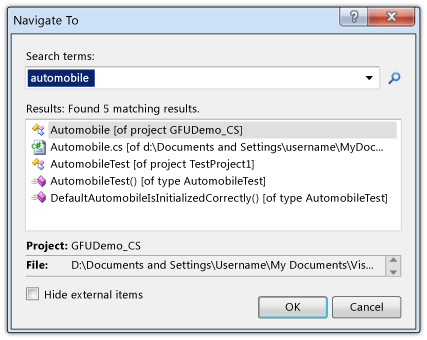

# Walkthrough: Test-First Support with the Generate From Usage Feature
[!INCLUDE[vs2017banner](../includes/vs2017banner.md)]

This topic demonstrates how to use the [Generate From Usage](../misc/generate-from-usage.md) feature, which supports test-first development.

 *Test-first development* is an approach to software design in which you first write unit tests based on product specifications, and then write the source code that is required to make the tests succeed. [!INCLUDE[vsprvs](../includes/vsprvs-md.md)] supports test-first development by generating new types and members in the source code when you first reference them in your test cases, before they are defined.

 [!INCLUDE[vsprvs](../includes/vsprvs-md.md)] generates the new types and members with minimal interruption to your workflow. You can create stubs for types, methods, properties, fields, or constructors without leaving your current location in code. When you open a dialog box to specify options for type generation, the focus returns immediately to the current open file when the dialog box closes.

 The Generate From Usage feature can be used with test frameworks that integrate with [!INCLUDE[vsprvs](../includes/vsprvs-md.md)]. In this topic, the Microsoft Unit Testing Framework is demonstrated.

 [!INCLUDE[note_settings_general](../includes/note-settings-general-md.md)]

### To create a Windows Class Library project and a Test project

1. In [!INCLUDE[csprcs](../includes/csprcs-md.md)] or [!INCLUDE[vbprvb](../includes/vbprvb-md.md)], create a new Windows Class Library project. Name it `GFUDemo_VB` or `GFUDemo_CS`, depending on which language you are using.

2. In **Solution Explorer**, right-click the solution icon at the top, point to **Add**, and then click **New Project**. In the **New Project** dialog box, in the **Project Types** pane on the left, click **Test**.

3. In the **Templates** pane, click **Unit Test Project** and accept the default name of UnitTestProject1. The following illustration shows the dialog box when it appears in [!INCLUDE[csprcs](../includes/csprcs-md.md)]. In [!INCLUDE[vbprvb](../includes/vbprvb-md.md)], the dialog box looks similar.

     
New Project dialog box

4. Click **OK** to close the **New Project** dialog box.

5. In your class project, in **Solution Explorer**, right-click the **References** entry and click **Add Reference**.

6. In the **Reference Manager** dialog box, select **Projects** and then select your unit test project.

7. Click **OK** to close the **Reference Manager** dialog box.

8. In the **Class1** file, immediately after the last of the existing **using** statements, add a **using** statement for the test project:

    * In Visual Basic, add `Using UnitTestProject1`

    * In C#, add `using UnitTestProject1;`

9. Save your solution. You are now ready to begin writing tests

### To generate a new class from a unit test

1. The test project contains a file that is named UnitTest1. Double-click this file in **Solution Explorer** to open it in the Code Editor. A test class and test method have been generated.

2. Locate the declaration for class `UnitTest1` and rename it to `AutomobileTest`. In C#, if a `UnitTest1()` constructor is present, rename it to `AutomobileTest()`.

    > [!NOTE]
    > IntelliSense now provides two alternatives for IntelliSense statement completion: *completion mode* and *suggestion mode*. Use suggestion mode for situations in which classes and members are used before they are defined. When an IntelliSense window is open, you can press CTRL+ALT+SPACEBAR to toggle between completion mode and suggestion mode. See [Using IntelliSense](../ide/using-intellisense.md) for more information. Suggestion mode will help when you are typing `Automobile` in the next step.

3. Locate the `TestMethod1()` method and rename it to `DefaultAutomobileIsInitializedCorrectly()`. Inside this method, create a new instance of a class named `Automobile`, as shown in the following illustrations. A wavy underline appears, which indicates a compile-time error, and a smart tag appears under the type name. The exact location of the smart tag varies, depending on whether you are using [!INCLUDE[vbprvb](../includes/vbprvb-md.md)] or [!INCLUDE[csprcs](../includes/csprcs-md.md)].

     
Visual Basic

     
Visual C#

4. Rest the mouse pointer over the smart tag to see an error message that states that no type named `Automobile` is defined yet. Click the smart tag or press CTRL+. (CTRL+period) to open the Generate From Usage shortcut menu, as shown in the following illustrations.

     
Visual Basic

     
Visual C#

5. Now you have two choices. You could click **Generate 'Class Automobile'** to create a new file in your test project and populate it with an empty class named `Automobile`. This is a quick way to create a new class in a new file that has default access modifiers in the current project. You can also click **Generate new type** to open the **Generate New Type** dialog box. This provides options that include putting the class in an existing file and adding the file to another project.

     Click **Generate new type** to open the **Generate New Type** dialog box, which is shown in the following illustration. In the **Project** list, click **GFUDemo_VB** or **GFUDemo_CS** to instruct [!INCLUDE[vsprvs](../includes/vsprvs-md.md)] to add the file to the source code project instead of the test project.

     
Generate New Type dialog box

6. Click **OK** to close the dialog box and create the new file.

7. In **Solution Explorer**, look under the GFUDemo_VB or GFUDemo_CS project node to verify that the new Automobile.vb or Automobile.cs file is there. In the Code Editor, the focus is still in `AutomobileTest.DefaultAutomobileIsInitializedCorrectly`. You can continue to write your test with a minimum of interruption.

### To generate a property stub

1. Assume that the product specification states that the `Automobile` class has two public properties named `Model` and `TopSpeed`. These properties must be initialized with default values of `"Not specified"` and `-1` by the default constructor. The following unit test will verify that the default constructor sets the properties to their correct default values.

     Add the following line of code to `DefaultAutomobileIsInitializedCorrectly`.

     [!code-csharp[VbTDDWalkthrough#1](../snippets/csharp/VS_Snippets_VBCSharp/vbtddwalkthrough/cs/unittest1.cs#1)]
     [!code-vb[VbTDDWalkthrough#1](../snippets/visualbasic/VS_Snippets_VBCSharp/vbtddwalkthrough/vb/unittest1.vb#1)]

     Because the code references two undefined properties on `Automobile`, a smart tag appears. Click the smart tag for `Model` and then click **Generate property stub**. Generate a property stub for the `TopSpeed` property also.

     In the `Automobile` class, the types of the new properties are correctly inferred from the context.

     The following illustration shows the smart tag shortcut menu.

     
Visual Basic

     
Visual C#

### To locate the source code

1. Use the **Navigate To** feature to navigate to the Automobile.cs or Automobile.vb source code file so that you can verify that the new properties have been generated.

     The **Navigate To** feature enables you to quickly enter a text string, such as a type name or part of a name, and go to the desired location by clicking the element in the result list.

     Open the **Navigate To** dialog box by clicking in the Code Editor and pressing CTRL+, (CTRL+comma). In the text box, type `automobile`. Click the **Automobile** class in the list, and then click **OK**.

     The **Navigate To** window is shown in the following illustration.

     
Navigate To window

### To generate a stub for a new constructor

1. In this test method, you will generate a constructor stub that will initialize the `Model` and `TopSpeed` properties to have values that you specify. Later, you will add more code to complete the test. Add the following additional test method to your `AutomobileTest` class.

     [!code-csharp[VbTDDWalkthrough#2](../snippets/csharp/VS_Snippets_VBCSharp/vbtddwalkthrough/cs/intermediate.cs#2)]
     [!code-vb[VbTDDWalkthrough#2](../snippets/visualbasic/VS_Snippets_VBCSharp/vbtddwalkthrough/vb/intermediate.vb#2)]

2. Click the smart tag under the new class constructor and then click **Generate constructor stub**. In the `Automobile` class file, notice that the new constructor has examined the names of the local variables that are used in the constructor call, found properties that have the same names in the `Automobile` class, and supplied code in the constructor body to store the argument values in the `Model` and `TopSpeed` properties. (In [!INCLUDE[vbprvb](../includes/vbprvb-md.md)], the `_model` and `_topSpeed` fields in the new constructor are the implicitly defined backing fields for the `Model` and `TopSpeed` properties.)

3. After you generate the new constructor, a wavy underline appears under the call to the default constructor in `DefaultAutomobileIsInitializedCorrectly`. The error message states that the `Automobile` class has no constructor that takes zero arguments. To generate an explicit default constructor that does not have parameters, click the smart tag and then click **Generate constructor stub**.

### To generate a stub for a method

1. Assume that the specification states that a new `Automobile` can be put into a Running state if its `Model` and `TopSpeed` properties are set to something other than the default values. Add the following lines to the `AutomobileWithModelNameCanStart` method.

     [!code-csharp[VbTDDWalkthrough#3](../snippets/csharp/VS_Snippets_VBCSharp/vbtddwalkthrough/cs/unittest1.cs#3)]
     [!code-vb[VbTDDWalkthrough#3](../snippets/visualbasic/VS_Snippets_VBCSharp/vbtddwalkthrough/vb/unittest1.vb#3)]

2. Click the smart tag for the `myAuto.Start` method call and then click **Generate method stub**.

3. Click the smart tag for the `IsRunning` property and then click **Generate property stub**. The `Automobile` class now contains the following code.

     [!code-csharp[VbTDDWalkthrough#4](../snippets/csharp/VS_Snippets_VBCSharp/vbtddwalkthrough/cs/intermediate.cs#4)]
     [!code-vb[VbTDDWalkthrough#4](../snippets/visualbasic/VS_Snippets_VBCSharp/vbtddwalkthrough/vb/intermediate.vb#4)]

### To run the tests

1. On the **Unit Test** menu, point to **Run Unit Tests**, and then click **All Tests**. This command runs all tests in all test frameworks that are written for the current solution.

     In this case, there are two tests, and they both fail, as expected. The `DefaultAutomobileIsInitializedCorrectly` test fails because the `Assert.IsTrue` condition returns `False`. The `AutomobileWithModelNameCanStart` test fails because the `Start` method in the `Automobile` class throws an exception.

     The **Test Results** window is shown in the following illustration.

     
Test Results window

2. In the **Test Results** window, double-click on each test result row to go to the location of each test failure.

### To implement the source code

1. Add the following code to the default constructor so that the `Model`, `TopSpeed` and `IsRunning` properties are all initialized to their correct default values of `"Not specified"`, `-1`, and `True` (`true`).

     [!code-csharp[VbTDDWalkthrough#5](../snippets/csharp/VS_Snippets_VBCSharp/vbtddwalkthrough/cs/automobile.cs#5)]
     [!code-vb[VbTDDWalkthrough#5](../snippets/visualbasic/VS_Snippets_VBCSharp/vbtddwalkthrough/vb/automobile.vb#5)]

2. When the `Start` method is called, it should set the `IsRunning` flag to true only if the `Model` or `TopSpeed` properties are set to something other than their default value. Remove the `NotImplementedException` from the method body and add the following code.

     [!code-csharp[VbTDDWalkthrough#6](../snippets/csharp/VS_Snippets_VBCSharp/vbtddwalkthrough/cs/automobile.cs#6)]
     [!code-vb[VbTDDWalkthrough#6](../snippets/visualbasic/VS_Snippets_VBCSharp/vbtddwalkthrough/vb/automobile.vb#6)]

### To run the tests again

1. On the **Test** menu, point to **Run**, and then click **All Tests in Solution**. This time the tests pass. The **Test Results** window is shown in the following illustration.

     
Test Results window

## See Also
 [Generate From Usage](../misc/generate-from-usage.md)
 [Writing Code](../ide/writing-code-in-the-code-and-text-editor.md)
 [Using IntelliSense](../ide/using-intellisense.md)
 [Unit Test Your Code](../test/unit-test-your-code.md)
