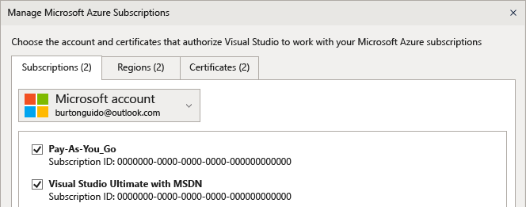
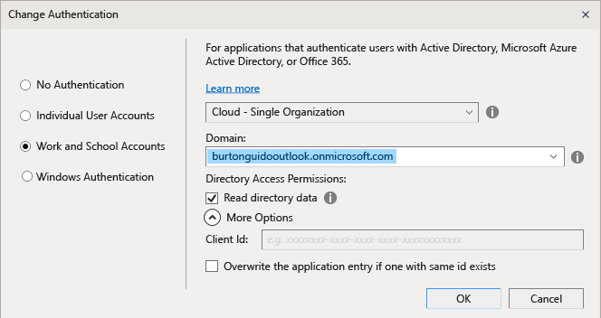
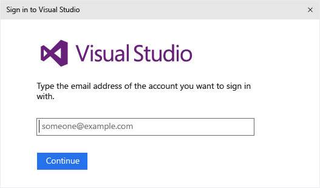

# Work with multiple user accounts
[!INCLUDE[vs2017banner](../includes/vs2017banner.md)]

If you have multiple Microsoft accounts and/or work or school accounts, you can add them all to Visual Studio so that you can access the resources from any account without having to sign in to it separately. As of the Visual Studio 2015 RTM date, Azure, Application Insights, Team Foundation Server, and Office 365 services support the streamlined sign-in experience. Additional services may become available as time goes by.

 After you add multiple accounts on one machine, that set of accounts will roam with you if you sign in to Visual Studio on another machine. It is important to note that, although the account names roam, the credentials do not. Therefore, you will be prompted to enter credentials for those other accounts the first time you attempt to use their resources on the new machine.

 This walkthrough shows how to add multiple accounts to Visual Studio, and how to see that the resources accessible from those accounts are reflected in places such as the **Add Connected Service** dialog, **Server Explorer**, and **Team Explorer**.

#### Sign in to Visual Studio

1. Sign into Visual Studio 2015 with a Microsoft account or an organizational account. You should see your user name reflected in the upper right corner of the window, similar to this:

     

### Access your Azure account in Server Explorer
 Press **Ctrl + Alt + S** to open **Server Explorer**. Click on the Azure icon and when it expands you should see the resources available in the Azure account that is associated with the ID that you used to log in to Visual Studio 2015. It should look something like this, except that you see your own resources, not Mr. Guido’s:

 

 The first time you use Visual Studio on any specific device, the dialog will only show the subscriptions registered under the ID that you signed in to the IDE with. You can access resources for any of your other accounts directly from **Server Explorer** by right-clicking on the Azure node and choosing **Manage and Filter Subscriptions** and adding your accounts from the account picker control. You can then choose another account, if desired, by clicking the down arrow and choosing from the list of accounts. After choosing the account, you can choose which subscriptions under that account you want to display in Server Explorer.

 

 The next time you open Server Explorer, the resources for that subscription(s) are displayed.

### Access your Azure account via Add Connected Service dialog

1. Create a Universal App project in C#.

2. Right click on the project node in Solution Explorer and choose **Add > Connected Service**. The Add Connected Service wizard appears and shows you the list of services in the Azure account that is associated with your Visual Studio login ID. Note that you do not have to sign in separately to Azure. However, you do need to sign in to the other accounts the first time you attempt to access their resources from a given computer.

    > [!WARNING]
    > If this is the first time you are creating a Store app in Visual Studio 2015 on a specific computer, you will be prompted to enable your device for development mode by going to **Settings &#124; . Updates and Security &#124; For Developers** on your computer. For more information, see [Enable Your Device for Development](https://msdn.microsoft.com/library/windows/apps/dn706236.aspx).

###  Access Azure Active Directory in a Web project
 Azure AD enables support for end-user single Sign-In in ASP.NET MVC web applications, or AD Authentication in Web API services. Domain authentication is different from individual user account authentication; users that have access to your Active Directory domain can use their existing Azure AD accounts to connect to your web applications. Office 365 apps can also use domain authentication. To see this in action, create a web application (**File > New Project > C# > Cloud > ASP.NET Web Application**). In the New ASP.NET Project dialog choose **Change Authentication**. The authentication wizard appears and enables you to choose what kind of authentication to use in your application.

 

 For more information about the different kinds of authentication in ASP.NET, see [Creating ASP.NET Web Projects in Visual Studio 2013](https://docs.microsoft.com/aspnet/visual-studio/overview/2013/creating-web-projects-in-visual-studio#orgauth) (the information about authentication is still relevant for Visual Studio 2015).

### Access your Visual Studio Team Services account
 From the main menu, choose **Team > Connect to Team Foundation Server** to bring up the **Team Explorer** window. Click on **Select Team Projects**, and then in the list box under **Select a Team Foundation Server**, you should see the URL for your Visual Studio Team Services account. When you select the URL you will be logged in without having to re-enter your credentials.

## Add a second user account to Visual Studio
 Click on the down arrow next to your user name in the upper right corner of Visual Studio. Then click on the **Account Settings** menu item. The **Account Manager** dialog appears and displays the account you signed in with. Click the **Add an account** link in the lower left of the dialog to add a new Microsoft account or a new work or school account.

 

 Follow the prompts to enter the new account credentials. The following illustration shows the Account Manager after a user has added his Contoso.com work account.

 

## Revisit the Add Connected Services Wizard and Server Explorer
 Now go to **Server Explorer** again, right-click on the Azure node and choose **Manage and filter subscriptions**. Choose the new account by clicking the drop down arrow next to the current account, and then choose which subscriptions you want to display in Server Explorer. You should see all the services associated with the specified subscription.Even though you are not currently signed in to the Visual Studio IDE with the second account, you are signed in to that account's services and resources. The same is true for **Project > Add Connected Service** and **Team > Connect to Team Foundation Server**.
