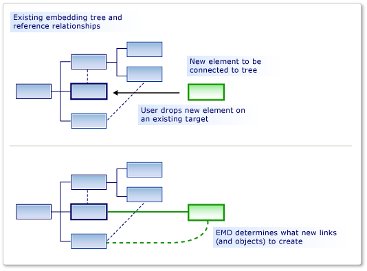
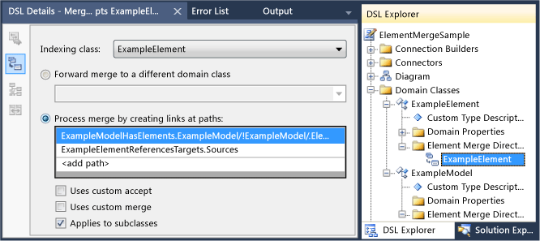

# Customizing Element Creation and Movement
[!INCLUDE[vs2017banner](../includes/vs2017banner.md)]

You can allow an element to be dragged onto another, either from the toolbox or in a paste or move operation. You can have the moved elements linked to the target elements, using the relationships that you specify.

 An element merge directive (EMD) specifies what happens when one model element is *merged* into another model element. This happens when:

- The user drags from the toolbox onto the diagram or a shape.

- The user creates an element by using an Add menu in the explorer or a compartment shape.

- The user moves an item from one swimlane to another.

- The user pastes an element.

- Your program code calls the element merge directive.

  Although the creation operations might seem to be different from the copy operations, they actually work in the same way. When an element is added, for example from the toolbox, a prototype of it is replicated. The prototype is merged into the model in the same manner as elements that have been copied from another part of the model.

  The responsibility of an EMD is to decide how an object or group of objects should be merged into a particular location in the model. In particular, it decides what relationships should be instantiated to link the merged group into the model. You can also customize it to set properties and to create additional objects.

  
  The role of an Element Merge Directive

  An EMD is generated automatically when you define an embedding relationship. This default EMD creates an instance of the relationship when users add new child instances to the parent. You can modify these default EMDs, for example by adding custom code.

  You can also add your own EMDs in the DSL definition, to let users drag or paste different combinations of merged and receiving classes.

## Defining an Element Merge Directive
 You can add element merge directives to domain classes, domain relationships, shapes, connectors, and diagrams. You can add or find them in DSL Explorer under the receiving domain class. The receiving class is the domain class of the element that is already in the model, and onto which the new or copied element will be merged.

 

 The **Indexing Class** is the domain class of elements that can be merged into members of the receiving class. Instances of subclasses of the Indexing Class will also be merged by this EMD, unless you set **Applies to subclasses** to False.

 There are two kinds of merge directive:

- A **Process Merge** directive specifies the relationships by which the new element should be linked into the tree.

- A **Forward Merge** directive redirects the new element to another receiving element, typically a parent.

  You can add custom code to merge directives:

- Set **Uses custom accept** to add your own code to determine whether a particular instance of the indexing element should be merged into the target element. When the user drags from the toolbox, the "invalid" pointer shows if your code disallows the merge.

   For example, you could allow the merge only when the receiving element is in a particular state.

- Set **Uses custom merge** to add provide own code to define the changes that are made to the model when the merge is performed.

   For example, you could set properties in the merged element by using data from its new location in the model.

> [!NOTE]
> If you write custom merge code, it affects only merges that are performed by using this EMD. If there are other EMDs that merge the same type of object, or if there is other custom code that creates these objects without using the EMD, then they will not be affected by your custom merge code.
>
> If you want to make sure that a new element or new relationship is always processed by your custom code, consider defining an `AddRule` on the embedding relationship and a `DeleteRule` on the element’s domain class. For more information, see [Rules Propagate Changes Within the Model](../modeling/rules-propagate-changes-within-the-model.md).

## Example: Defining an EMD without custom code
 The following example lets users create an element and a connector at the same time by dragging from the toolbox onto an existing shape. The example adds an EMD to the DSL Definition. Before this modification, users can drag tools onto the diagram, but not onto existing shapes.

 Users can also paste elements onto other elements.

#### To let users create an element and a connector at the same time

1. Create a new DSL by using the **Minimal Language** solution template.

    When you run this DSL, it lets you create shapes and connectors between the shapes. You cannot drag a new **ExampleElement** shape from the toolbox onto an existing shape.

2. To let users merge elements onto `ExampleElement` shapes, create a new EMD in the `ExampleElement` domain class:

   1. In **DSL Explorer**, expand **Domain Classes**. Right-click `ExampleElement` and then click **Add New Element Merge Directive**.

   2. Make sure that the **DSL Details** window is open, so that you can see the details of the new EMD. (Menu: **View**, **Other Windows**, **DSL Details**.)

3. Set the **Indexing class** in the DSL Details window, to define what class of elements can be merged onto `ExampleElement` objects.

    For this example, select `ExampleElements`, so that the user can drag new elements onto existing elements.

    Notice that the Indexing class becomes the name of the EMD in DSL Explorer.

4. Under **Process merge by creating links**, add two paths:

   1. One path links the new element to the parent model. The path expression that you need to enter navigates from the existing element, up through the embedding relationship to the parent model. Finally, it specifies the role in the new link to which the new element will be assigned. The path is as follows:

       `ExampleModelHasElements.ExampleModel/!ExampleModel/.Elements`

   2. The other path links the new element to the existing element. The path expression specifies the reference relationship and the role to which the new element will be assigned. This path is as follows:

       `ExampleElementReferencesTargets.Sources`

      You can use the path navigation tool to create each path:

   3. Under **Process merge by creating links at paths**, click **\<add path>**.

   4. Click the drop-down arrow to the right of the list item. A tree view appears.

   5. Expand the nodes in the tree to form the path that you want to specify.

5. Test the DSL:

   1. Press F5 to rebuild and run the solution.

        Rebuilding will take longer than usual because the generated code will be updated from text templates to conform to the new DSL Definition.

   2. When the experimental instance of [!INCLUDE[vsprvs](../includes/vsprvs-md.md)] has started, open a model file of your DSL. Create some example elements.

   3. Drag from the **Example Element** tool onto an existing shape.

        A new shape appears, and it is linked to the existing shape with a connector.

   4. Copy an existing shape. Select another shape and paste.

        A copy of the first shape is created.  It has a new name and it is linked to the second shape with a connector.

   Notice the following points from this procedure:

- By creating Element Merge Directives, you can allow any class of element to accept any other. The EMD is created in the receiving domain class, and the accepted domain class is specified in the **Index class** field.

- By defining paths, you can specify what links should be used to connect the new element to the existing model.

     The links that you specify should include one embedding relationship.

- The EMD affects both creation from the toolbox and also paste operations.

     If you write custom code that creates new elements, you can explicitly invoke the EMD by using the `ElementOperations.Merge` method. This makes sure that your code links new elements into the model in the same way as other operations. For more information, see [Customizing Copy Behavior](../modeling/customizing-copy-behavior.md).

## Example: Adding Custom Accept code to an EMD
 By adding custom code to an EMD, you can define more complex merge behavior. This simple example prevents the user from adding more than a fixed number of elements to the diagram. The example modifies the default EMD that accompanies an embedding relationship.

#### To write Custom Accept code to restrict what the user can add

1. Create a DSL by using the **Minimal Language** solution template. Open the DSL Definition diagram.

2. In DSL Explorer, expand **Domain Classes**, `ExampleModel`, **Element Merge Directives**. Select the element merge directive that is named `ExampleElement`.

     This EMD controls how the user can create new `ExampleElement` objects in the model, for example by dragging from the toolbox.

3. In the **DSL Details** window, select **Uses custom accept**.

4. Rebuild the solution. This will take longer than usual because the generated code will be updated from the model.

     A build error will be reported, similar to: "Company.ElementMergeSample.ExampleElement does not contain a definition for CanMergeExampleElement…"

     You must implement the method `CanMergeExampleElement`.

5. Create a new code file in the **Dsl** project. Replace its content with the following code and change the namespace to the namespace of your project.

    ```csharp
    using Microsoft.VisualStudio.Modeling;

    namespace Company.ElementMergeSample // EDIT.
    {
      partial class ExampleModel
      {
        /// <summary>
        /// Called whenever an ExampleElement is to be merged into this ExampleModel.
        /// This happens when the user pastes an ExampleElement
        /// or drags from the toolbox.
        /// Determines whether the merge is allowed.
        /// </summary>
        /// <param name="rootElement">The root element in the merging EGP.</param>
        /// <param name="elementGroupPrototype">The EGP that the user wants to merge.</param>
        /// <returns>True if the merge is allowed</returns>
        private bool CanMergeExampleElement(ProtoElementBase rootElement, ElementGroupPrototype elementGroupPrototype)
        {
          // Allow no more than 4 elements to be added:
          return this.Elements.Count < 4;
        }
      }
    }

    ```

     This simple example restricts the number of elements that can be merged into the parent model. For more interesting conditions, the method can inspect any of the properties and links of the receiving object. It can also inspect the properties of the merging elements, which are carried in a <xref:Microsoft.VisualStudio.Modeling.ElementGroupPrototype>. For more information about `ElementGroupPrototypes`, see [Customizing Copy Behavior](../modeling/customizing-copy-behavior.md). For more information about how to write code that reads a model, see [Navigating and Updating a Model in Program Code](../modeling/navigating-and-updating-a-model-in-program-code.md).

6. Test the DSL:

    1. Press F5 to rebuild the solution. When the experimental instance of [!INCLUDE[vsprvs](../includes/vsprvs-md.md)] opens, open an instance of your DSL.

    2. Create new elements in several ways:

        1. Drag from the **Example Element** tool onto the diagram.

        2. In the **Example Model Explorer**, right-click the root node and then click **Add New Example Element**.

        3. Copy and paste an element on the diagram.

    3. Verify that you cannot use any of these ways to add more than four elements to the model. This is because they all use the Element Merge Directive.

## Example: Adding Custom Merge code to an EMD
 In custom merge code, you can define what happens when the user drags a tool or pastes onto an element. There are two ways to define a custom merge:

1. Set **Uses Custom Merge** and supply the required code. Your code replaces the generated merge code. Use this option if you want to completely redefine what the merge does.

2. Override the `MergeRelate` method, and optionally the `MergeDisconnect` method. To do this, you must set the **Generates Double Derived** property of the domain class. Your code can call the generated merge code in the base class. Use this option if you want to perform additional operations after the merge has been performed.

   These approaches only affect merges that are performed by using this EMD. If you want to affect all ways in which the merged element can be created, an alternative is to define an `AddRule` on the embedding relationship and a `DeleteRule` on the merged domain class. For more information, see [Rules Propagate Changes Within the Model](../modeling/rules-propagate-changes-within-the-model.md).

#### To override MergeRelate

1. In the DSL definition, make sure that you have defined the EMD to which you want to add code. If you want, you can add paths and define custom accept code as described in the previous sections.

2. In the DslDefinition diagram, select the receiving class of the merge. Typically it is the class at the source end of an embedding relationship.

     For example, in a DSL generated from the Minimal Language solution, select `ExampleModel`.

3. In the **Properties** window, set **Generates Double Derived** to **true**.

4. Rebuild the solution.

5. Inspect the content of **Dsl\Generated Files\DomainClasses.cs**. Search for methods named `MergeRelate` and examine their contents. This will help you write your own versions.

6. In a new code file, write a partial class for the receiving class, and override the `MergeRelate` method. Remember to call the base method. For example:

    ```csharp
    partial class ExampleModel
    {
      /// <summary>
      /// Called when the user drags or pastes an ExampleElement onto the diagram.
      /// Sets the time of day as the name.
      /// </summary>
      /// <param name="sourceElement">Element to be added</param>
      /// <param name="elementGroup">Elements to be merged</param>
      protected override void MergeRelate(ModelElement sourceElement, ElementGroup elementGroup)
      {
        // Connect the element according to the EMD:
        base.MergeRelate(sourceElement, elementGroup);

        // Custom actions:
        ExampleElement mergingElement = sourceElement as ExampleElement;
        if (mergingElement != null)
        {
          mergingElement.Name = DateTime.Now.ToLongTimeString();
        }
      }
    }

    ```

#### To write Custom Merge code

1. In **Dsl\Generated Code\DomainClasses.cs**, inspect methods named `MergeRelate`. These methods create links between a new element and the existing model.

    Also, inspect methods named `MergeDisconnect`. These methods unlink an element from the model when it is to be deleted.

2. In **DSL Explorer**, select or create the Element Merge Directive that you want to customize. In the **DSL Details** window, set **Uses Custom Merge**.

    When you set this option, the **Process Merge** and **Forward Merge** options are ignored. Your code is used instead.

3. Rebuild the solution. It will take longer than usual because the generated code files will be updated from the model.

    Error messages will appear. Double-click the error messages to see the instructions in the generated code. These instructions ask you to supply two methods, `MergeRelate`*YourDomainClass* and `MergeDisconnect`*YourDomainClass*

4. Write the methods in a partial class definition in a separate code file. The examples you inspected earlier should suggest what you need.

   Custom merge code will not affect code that creates objects and relationships directly, and it will not affect other EMDs. To make sure that your additional changes are implemented regardless of how the element is created, consider writing an `AddRule` and a `DeleteRule` instead. For more information, see [Rules Propagate Changes Within the Model](../modeling/rules-propagate-changes-within-the-model.md).

## Redirecting a Merge Operation
 A forward merge directive redirects the target of a merge operation. Typically, the new target is the embedding parent of the initial target.

 For example, in a DSL that was created with the component diagram template, Ports are embedded in Components. Ports are displayed as small shapes on the edge of a component shape. The user creates ports by dragging the Port tool onto a Component shape. But sometimes, the user mistakenly drags the Port tool onto an existing port, instead of the component, and the operation fails. This is an easy mistake when there are several existing ports. To help the user to avoid this nuisance, you can allow ports to be dragged onto an existing port, but have the action redirected to the parent component. The operation works as if the target element were the component.

 You can create a forward merge directive in the Component Model solution. If you compile and run the original solution, you should see that users can drag any number of **Input Port** or **Output Port** elements from the **Toolbox** to a **Component** element. However, they cannot drag a port to an existing port. The Unavailable pointer alerts them that this move is not enabled. However, you can create a forward merge directive so that a port that is unintentionally dropped on an existing **Input Port** is forwarded to the **Component** element.

#### To create a forward merge directive

1. Create a [!INCLUDE[dsl](../includes/dsl-md.md)] solution by using the Component Model template.

2. Display the **DSL Explorer** by opening DslDefinition.dsl.

3. In the **DSL Explorer**, expand **Domain Classes**.

4. The **ComponentPort** abstract domain class is the base class of both **InPort** and **OutPort**. Right-click **ComponentPort** and then click **Add New Element Merge Directive**.

     A new **Element Merge Directive** node appears under the **Element Merge Directives** node.

5. Select the **Element Merge Directive** node and open the **DSL Details** window.

6. In the Indexing class list, select **ComponentPort**.

7. Select **Forward merge to a different domain class**.

8. In the path selection list, expand **ComponentPort**, expand **ComponentHasPorts**, and then select **Component**.

     The new path should resemble this one:

     **ComponentHasPorts.Component/!Component**

9. Save the solution, and then transform the templates by clicking the rightmost button on the **Solution Explorer** toolbar.

10. Build and run the solution. A new instance of [!INCLUDE[vsprvs](../includes/vsprvs-md.md)] appears.

11. In **Solution Explorer**, open Sample.mydsl. The diagram and the **ComponentLanguage Toolbox** appear.

12. Drag an **Input Port** from the **Toolbox** to another **Input Port.** Next, drag an **OutputPort** to an **InputPort** and then to another **OutputPort**.

     You should not see the Unavailable pointer, and you should be able to drop the new **Input Port** on the existing one. Select the new **Input Port** and drag it to another point on the **Component**.

## See Also
 [Navigating and Updating a Model in Program Code](../modeling/navigating-and-updating-a-model-in-program-code.md)
 [Customizing Tools and the Toolbox](../modeling/customizing-tools-and-the-toolbox.md)
