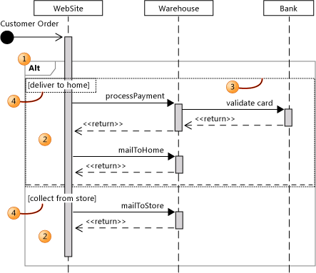

# Describe control flow with fragments on UML sequence diagrams
[!INCLUDE[vs2017banner](../includes/vs2017banner.md)]

In a UML sequence diagram, *combined fragments* let you show loops, branches, and other alternatives.

 A combined fragment consists of one or more *interaction operands*, and each of these encloses one or more messages, interaction uses, or combined fragments.

> [!NOTE]
> This topic is about fragments in sequence diagrams. For more information about how to read UML sequence diagrams, see [UML Sequence Diagrams: Reference](../modeling/uml-sequence-diagrams-reference.md). For more information about how to draw UML sequence diagrams, see [UML Sequence Diagrams: Guidelines](../modeling/uml-sequence-diagrams-guidelines.md).

 

 The elements shown in the figure are as follows.

1. A combined fragment. There are several kinds of combined fragments. This example is an Alt combined fragment, which you can use to show that alternative sequences of messages can occur.

2. Interaction operands. Every combined fragment contains at least one interaction operand, which can contain messages, interaction uses, and smaller combined fragments. In this example, the Alt combined fragment has two interaction operations, showing two alternative sequences of messages.

3. You can select each interaction operand separately by clicking inside it. In this example, the top interaction operand is selected, so that its boundary can be seen. Typically, only the dividing line between interaction operands is visible.

    > [!NOTE]
    > To select the top interaction operand, you must not click too close to the top of the combined fragment.

4. Guards. You can give each interaction operand a guard. This describes the condition under which the messages inside the interaction operand will be performed.

## Creating Combined Fragments
 For a list of the kinds of fragment you can create, see [Kinds of Combined Fragment](#KindsOfFragment).

#### To create a combined fragment

1. Select one message, or a sequence of messages, that all begin on the same lifeline or execution occurrence.

   > [!NOTE]
   > If you select more than one message, they must form an uninterrupted sequence.

2. Right-click one of the messages, point to **Surround With**, and then click the kind of combined fragment that you want, such as **Alt Combined Fragment**.

    A new combined fragment appears. The heading indicates the kind of combined fragment you selected, such as **Alt**.

    Inside the combined fragment, there is a fragment that contains the messages that you selected.

   You can add more interaction operands to some kinds of combined fragment.

   After you rearrange messages within a combined fragment, choose **Rearrange Layout** on the shortcut menu to resize the combined fragment frame.

#### To add a new interaction operand to a combined fragment

1. Right-click in a blank space inside the interaction operand (2), outside any contained fragment, and below the heading of the combined fragment.

2. Point to **Add**.

3. Click **Interaction Operand Before**, or **Interaction Operand After**.

4. You can add messages inside the new interaction operand using the message tools, or by copying and pasting existing messages.

   You can set the **Guard** property of an interaction operand to describe the conditions in which the messages inside it are performed. For example, in a **Loop** combined fragment, you can use the guard to specify the condition during which the loop continues. In an **Alt** combined fragment, you can specify a separate condition for each interaction operand.

#### To set the guard of an interaction operand

1. Click in a blank space inside the interaction operand (2), outside any contained fragment.

    A selection border appears around the interaction operand, and around the guard condition.

    The heading in the **Properties** window shows **Interaction Operand**.

2. Type the guard condition.

    The condition will appear near the top of the fragment (4).

   You can set the properties of some kinds of combined fragments.

#### To set or view the properties of a combined fragment

- Right-click in the title of the combined fragment, and then click **Properties**.

    > [!NOTE]
    > Different kinds of combined fragment have different properties.

##  Kinds of Combined Fragment

### Fragments Describing Control Flow
 A simple sequence diagram shows just one typical sequence. You can use the following types of combined fragments to describe variations that may occur on different occasions.

|Fragment type|Description|
|-------------------|-----------------|
|**Opt**|Optional. Encloses a sequence that might or might not happen. You can specify, in the guard, the condition under which it occurs.|
|**Alt**|Contains a list of fragments that contain alternative sequences of messages. Only one sequence occurs on any occasion.   You can put a guard in each fragment to indicate under what condition it can run. A guard of **else** indicates a fragment that should run if no other guard is true. If all guards are false and there is no **else**, then none of the fragments executes.|
|**Loop**|The fragment repeats some number of times. You can indicate in the guard the condition under which it should repeat.   Loop combined fragments have the properties **Min** and **Max**, which indicate the minimum and maximum number of times that the fragment can be repeated. The default is no restriction.|
|**Break**|If this fragment is executed, the rest of the sequence is abandoned. You can use the guard to indicate the condition in which the break will occur.|
|**Par**|Parallel. The events in the fragments can be interleaved.|
|**Critical**|Used within a Par or Seq fragment. Indicates that the messages in this fragment must not be interleaved with other messages.|
|**Seq**|There are two or more operand fragments. Messages involving the same lifeline must occur in the order of the fragments. Where they do not involve the same lifelines, messages from different fragments may be interleaved in parallel.|
|**Strict**|There are two or more operand fragments. The fragments must occur in the order given.|

### Fragments about How to Interpret the Sequence
 By default, the sequence diagram states a series of messages that can happen. In the running system, other messages can happen that you have not chosen to show on the diagram.

 The following fragment types can be used to change this interpretation.

|Fragment type|Description|
|-------------------|-----------------|
|**Consider**|Specifies a list of the messages that this fragment describes. Other messages can occur in the running system, but are not significant for the purposes of this description.   Type the list in the **Messages** property.|
|**Ignore**|A list of the messages that this fragment does not describe. They can occur in the running system, but are not significant for the purposes of this description.   Type the list in the **Messages** property.|
|**Assert**|The operand fragment specifies the only valid sequences. Typically used within a Consider or Ignore fragment.|
|**Neg**|The sequence shown in this fragment must not happen. Typically used within a Consider or Ignore fragment.|

## See Also
 [UML Sequence Diagrams: Guidelines](../modeling/uml-sequence-diagrams-guidelines.md)
 [UML Sequence Diagrams: Reference](../modeling/uml-sequence-diagrams-reference.md)
 [Edit UML models and diagrams](../modeling/edit-uml-models-and-diagrams.md)
