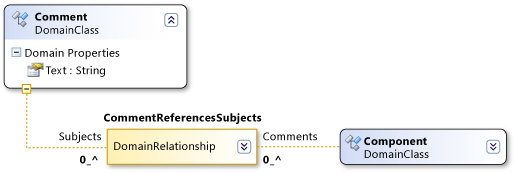

# Domain Path Syntax
[!INCLUDE[vs2017banner](../includes/vs2017banner.md)]

DSL Definitions use an XPath-like syntax to locate specific elements in a model.

 Ordinarily you do not have to work with this syntax directly. Where it appears in DSL Details or Properties window, you can click the downward arrow and use the path editor. However, the path appears in this form in the field after you have used the editor.

 A domain path takes the following form:

 *RelationshipName.PropertyName/!Role*

 

 The syntax traverses the tree of the model. For example, the domain relationship **CommentReferencesSubjects** in the illustration above has a **Subjects** role. The path segment **/!Subjectt** specifies that the path finishes on elements accessed through the **Subjects** role.

 Each segment starts with the name of a domain relationship. If the traversal is from an element to a relationship, the path segment appears as *Relationship.PropertyName*. If the hop is from a link to an element, the path segment appears as *Relationship/!RoleName*.

 Slashes separate the syntax of a path. Each path segment is either a hop from an element to a link (an instance of a relationship) or from a link to an element. Path segments frequently appear in pairs. One path segment represents a hop from an element to a link, and the next segment represents a hop from the link to the element at the other end. (Any link can also be the source or target of a relationship itself).

 The name that you use for the element-to-link hop is the value of the role's `Property Name`. The name that you use for the link-to-element hop is the target role name.

## See Also
 [Understanding Models, Classes and Relationships](../modeling/understanding-models-classes-and-relationships.md)
