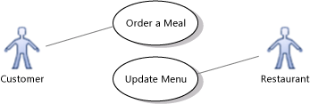
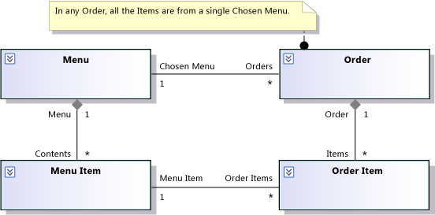
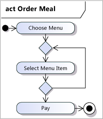
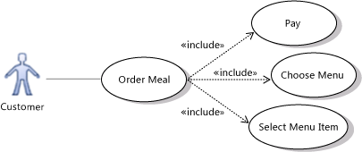

# Model user requirements
[!INCLUDE[vs2017banner](../includes/vs2017banner.md)]

Visual Studio helps you understand, discuss, and communicate your users' needs by drawing diagrams about their activities and the part your system plays in helping them achieve their goals. A requirements model is a set of these diagrams, each of which focuses on a different aspect of the users' needs. For a video demonstration, see: [Modeling the Business Domain](https://channel9.msdn.com/blogs/clinted/uml-with-vs-2010-part-3-modeling-the-business-domain).

 To see which versions of Visual Studio support each type of model, see [Version support for architecture and modeling tools](../modeling/what-s-new-for-design-in-visual-studio.md#VersionSupport).

 A requirements model helps you:

- Focus on the system's external behavior, separately from its internal design.

- Describe the users' and stakeholders' needs with much less ambiguity than you can in natural language.

- Define a consistent glossary of terms that can be used by users, developers, and testers.

- Reduce gaps and inconsistencies in the requirements.

- Reduce the work needed to respond to requirements changes.

- Plan the order in which features will be developed.

- Use the models as a basis for system tests, making a clear relationship between the tests and the requirements. When the requirements change, this relationship helps you update the tests correctly. This makes sure that the system meets the new requirements.

  A requirements model provides greatest benefit if you use it to focus discussions with the users or their representatives, and revisit it at the beginning of each iteration. You do not have to complete it in detail before writing code. A partially working application, even if very much simplified, generally forms the most stimulating basis for discussion of the requirements with users. The model is an effective way to summarize the results of those discussions. For more information, see [Use models in your development process](../modeling/use-models-in-your-development-process.md).

> [!NOTE]
> Throughout these topics, "system" means the system or the application that you are developing. It might be a large collection of many software and hardware components; or a single application; or a software component inside a larger system. In every case, the requirements model describes the behavior that is visible from outside your system, whether through a user interface or API.

## Common Tasks
 You can create several different views of the users' requirements.  Each view provides a particular type of information.  When you create these views, it is best to move frequently from one to another. You can start from any view.

|Diagram or document|What it describes in a requirements model|Section|
|-------------------------|-----------------------------------------------|-------------|
|Use case diagram|Who uses the system and what they do with it.|[Describing how your system is used](#UseCases)|
|Conceptual class diagram|Glossary of types that are used to describe the requirements; the types visible at the system's interface.|[Defining terms used to describe requirements](#RequirementsClasses)|
|Activity diagram|Flow of work and information between activities performed by users and system or its parts.|[Showing work flow between users and your system](#Workflow)|
|Sequence diagram|Sequence of interactions between users and system or its parts. An alternative view to the activity diagram.|[Showing interactions between users and your system](#Sequences)|
|Additional documents or work items|Performance, security, usability and reliability criteria.|[Describing quality of service requirements](#QoSRequirements)|
|Additional documents or work items|Constraints and rules not specific to a particular use case|[Showing business rules](#BusinessRules)|

 Notice that most of the diagram types can be used for other purposes. For an overview of diagram types, see [Create models for your app](../modeling/create-models-for-your-app.md). For basic information about drawing diagrams, see [Edit UML models and diagrams](../modeling/edit-uml-models-and-diagrams.md).

##  Describing how your system is used
 Create use case diagrams to describe who uses the system, and what they use it for. A use case represents a goal of a user of the system, and the procedure they perform to achieve the goal.

 As an example, an online meal selling system must allow customers to choose items from a menu, and must allow the providing restaurants to update the menu. You can summarize this in a use case diagram:

 

 You can also show how a use case is composed of smaller cases. For example, ordering a meal is part of buying a meal, which also includes payment and delivery:

 

 You can also show which use cases are included in the scope of the system that you are developing. For example, the system in the illustration does not take part in the Deliver Meal use case. This helps set the context for the development work. (In a use case diagram, subsystem containers can be used to represent the system or its components.)

 It also helps your team discuss what will be included in successive releases. For example, you could discuss whether, in the initial release of the system, Pay for Meal is arranged directly between the restaurant and the customer, instead of going through the system. In that case, you could move Pay for Meal outside the Dinner Now System rectangle for the initial release.

 A use case diagram only provides a summary of the use cases. To provide more detailed descriptions, you can link the use cases on the diagram to separate documents, and to other diagrams. To learn how to do this, see [Link a use case to documents and diagrams](../modeling/link-a-use-case-to-documents-and-diagrams.md).

 Drawing a use case diagram helps your team:

- Focus on what the users expect to do with the system, without being distracted by details of the implementation.

- Discuss the scope of your system or particular releases of the system.

  The following topics provide more information:

|To learn about|Read|
|--------------------|----------|
|More detailed information about how to create use cases|[UML Use Case Diagrams: Guidelines](../modeling/uml-use-case-diagrams-guidelines.md)|
|Elements on a use case diagram|[UML Use Case Diagrams: Reference](../modeling/uml-use-case-diagrams-reference.md)|
|How to develop code from use cases|[Model your app's architecture](../modeling/model-your-app-s-architecture.md)|

##  Defining Terms Used to Describe Requirements
 You can use UML class diagrams to help you develop a consistent vocabulary of the business concepts used for the following purposes:

- By the users themselves to discuss the business in which the system works.

- To describe the users' needs, for example in the descriptions of use cases, business rules, and user stories.

- The types of information exchanged at the system's API or through the user interface.

- Descriptions of system or acceptance tests.

  When they are used for this purpose, the content of a UML class diagram is called a conceptual class diagram. (It is also known as a *domain model* or *analysis class model*.)

  In a conceptual class diagram, you show just those classes needed in descriptions of the requirements, without showing any of the detail of the system's internal design. The diagram does not show any of the detail of the system's internal design. You would not usually show operations or interfaces on conceptual classes.

  For example, you could draw these conceptual classes for the Dinner Now system:

  

  A conceptual class diagram provides the vocabulary of terms that you use throughout the requirements model. For example, in the detailed description of the use case Order a Meal, you might write:

  The customer chooses a *Menu* from which to construct an *Order*, and then creates *Order Items* in the *Order* by selecting *Menu Items* from the *Menu*.

  Notice how the terms used in that description are the names of classes in the model. The diagram removes ambiguities from relationships between those classes. For example, it shows clearly that each Order is associated with just one Menu.

  Misunderstandings about users' requirements can frequently be traced to misunderstandings about the detailed meanings of words. For example, most restaurants will have a shared understanding of the terms Menu and Order, but the difference between an item on an Order and an item on a Menu is less clear. When the requirements are being discussed with the business stakeholders, it is important to expose those differences. The class diagram is a useful tool to help you clarify the terms and their relationships.

  The conceptual class model can form the basic vocabulary by which your system's business logic can be described. But the classes in the software will typically be much more complex than the conceptual model, because your implementation must consider issues such as performance, distribution, flexibility, and other factors. Several different implementations of a conceptual class are frequently found in one system.

  For example, Orders could be represented in XML, SQL, HTML, and C# in different parts of the system and at different interfaces between the parts. The association between an Order and a Menu could be represented in many different ways, such as references within C# code, relations in a database, or cross-referenced IDs in XML. But despite these variations, the conceptual model provides important information that is true in every part of the software. The class diagram in the example tells us that in every implementation, there will be only one Menu associated with each Order.

  Drawing a requirements class diagram helps your team:

- Define and standardize the basic terms used in discussions of the users' needs.

- Clarify the relationships between those terms.

  The following topics provide more information:

|To learn about|Read|
|--------------------|----------|
|More detailed information about finding requirements classes|[UML Class Diagrams: Guidelines](../modeling/uml-class-diagrams-guidelines.md)|
|Elements on a conceptual class diagram|[UML Class Diagrams: Reference](../modeling/uml-class-diagrams-reference.md)|
|How to develop code from conceptual classes|[Model your app's architecture](../modeling/model-your-app-s-architecture.md)|

 In a conceptual class diagram, it is typically not useful to place arrows on the associations to represent navigability. This is because the diagram does not represent an implementation. The associations represent relationships between real-world objects. The following [!INCLUDE[vsprvs](../includes/vsprvs-md.md)] Extension make non-directional arrows the default: [Sample: UML Domain Modeling features](https://go.microsoft.com/fwlink/?LinkId=213849).

##  Showing Business Rules
 A business rule is a requirement that is not associated with a particular use case, and should be observed throughout the system.

 Many business rules are constraints on the relationships among the conceptual classes. You can write these *static business rules* as comments associated with the relevant classes on a conceptual class diagram. For example:

 

 *Dynamic business rules* constrain the allowable sequences of events. For example, you use a sequence or activity diagram to show that a user must log in before performing other operations on your system.

 However, many dynamic rules can be more effectively and generically stated by replacing them with static rules. For example, you could add a Boolean attribute 'Logged In' to a class in the conceptual class model. You would add Logged In as the postcondition of the log in use case, and add it as a precondition of most of the other use cases. This approach lets you avoid defining all the possible combinations of sequences of events. It is also more flexible when you need to add new use cases to the model.

 Notice that the choice here is about how you define the requirements, and that this is independent of how you implement the requirements in the program code.

 The following topics provide more information:

|To learn about|Read|
|--------------------|----------|
|More detailed information about finding and recording static business rules|[UML Class Diagrams: Guidelines](../modeling/uml-class-diagrams-guidelines.md)|
|Elements on a conceptual class diagram|[UML Class Diagrams: Reference](../modeling/uml-class-diagrams-reference.md)|
|How to develop code that adheres to business rules|[Model your app's architecture](../modeling/model-your-app-s-architecture.md)|

##  Describing Quality of Service Requirements
 There are several categories of quality of service requirement. They include the following:

- Performance

- Security

- Usability

- Reliability

- Robustness

  You can include some of these requirements in the descriptions of particular use cases. Other requirements are not specific to use cases, and are most effectively written in a separate document. When you can, it is useful to adhere to the vocabulary defined by the requirements model. In the following example, notice that the main words used in the requirement are the titles of actors, use cases, and classes in the preceding illustrations:

  If a Restaurant deletes a Menu Item while a Customer is Ordering a Meal, any Order Item that refers to that Menu Item will be displayed in red.

  The following topics provide more information:

|To learn about|Read|
|--------------------|----------|
|Attaching additional documents to use cases|[Link a use case to documents and diagrams](../modeling/link-a-use-case-to-documents-and-diagrams.md)|
|How to develop code that adheres to quality of service requirements|[Model your app's architecture](../modeling/model-your-app-s-architecture.md)|

##  Showing work flow between users and your system
 You can use an activity diagram to show the flow of work between different use cases. It is frequently useful to begin a requirements model by drawing an activity diagram showing the major tasks that users perform - both with the system and outside it.

 For example:

 

 You can draw use case diagrams and activity diagrams to show different views of the same information.  The use case diagram is more effective at showing the nesting of the smaller actions within the larger activity, but does not show the flow of work. For example:

 

 Notice that you can also use activity diagrams to depict algorithms within your software, but when you use the diagrams for the business process, you focus on the actions that are visible outside the system.

 The following topics provide more information:

|To learn about|Read|
|--------------------|----------|
|More information about how to define business work flows|[UML Activity Diagrams: Guidelines](../modeling/uml-activity-diagrams-guidelines.md)|
|Elements on an activity diagram|[UML Activity Diagrams: Reference](../modeling/uml-activity-diagrams-reference.md)|
|How to develop code from activity diagrams|[Model your app's architecture](../modeling/model-your-app-s-architecture.md)|

##  Showing interactions between users and your system
 You can use a sequence diagram to show the interchange of messages between your system and external actors, or between parts of your system. This provides a view of the steps in a use case that shows very clearly the sequence of interactions. Sequence diagrams are especially useful where there are several interacting parties in a use case, and also where your system has an API.

 For example:

 

 One advantage of sequence diagrams is that it is easy to see what messages come in to the system that you are constructing. To design the system, you can replace the single System lifeline with a separate lifeline for each of its components, and then show the interactions between them in response to each incoming message.

 The following topics provide more information:

|To learn about|Read|
|--------------------|----------|
|More information about how to define interactions|[UML Sequence Diagrams: Guidelines](../modeling/uml-sequence-diagrams-guidelines.md)|
|Elements on an sequence diagram|[UML Sequence Diagrams: Reference](../modeling/uml-sequence-diagrams-reference.md)|
|How to develop code from sequence diagrams|[Model your app's architecture](../modeling/model-your-app-s-architecture.md)|

## Using a Model to Reduce Inconsistencies
 Creating a model usually results in a significant reduction in inconsistencies and ambiguities in the users' requirements. Different stakeholders frequently have different understandings of the business world in which the system works. Therefore your first task is to resolve these differences between your clients.

 You will find that many questions about the business domain arise naturally while you are creating a model. By putting these questions to your users, you will reduce the need for changes at a later stage in the project. Here are some specific questions that you can ask yourself at first, and then ask the business stakeholders if the answer is unclear:

- For each class in the requirements model, ask "What use case creates instances of this class?" For example, in an online meal-ordering service, you might ask, "What use case creates instances of the Restaurant Menu class?" This would lead to a discussion of how a new restaurant is signed up to the service and contributes its menu. You can ask similar questions about what creates or changes attributes and associations.

- For each use case in the requirements model, try to describe the outcome, or postcondition, of each use case in words provided by the class diagrams. It is frequently useful to show the effect of a use case by sketching instances of the classes before and after an occurrence of the use case. For example, if the use case postcondition says "a menu item is added to the customer's order," sketch instances of the Order and Menu Item classes. Show the effects of the use case, such as a new link or a new object, in a different color or in a new drawing. This frequently leads to discussions about what information is necessary in the model. Although requirements classes are not directly concerned with implementation, they do describe the information that your system will need to store and transmit.

- Ask about the constraints on attributes and associations, especially constraints involving more than one attribute or association.

- Ask about valid and invalid sequences of use cases, drawing sequence or activity diagrams to illustrate them.

  By examining the relationships between the views that different diagrams provide, you can quickly understand the main concepts with which your users work, and help them to understand what they need from the system. You also reach a better understanding of what requirements the stakeholders are least certain about. You can plan to develop those features, at least in simplified form, at an early stage of the project, to allow users to experiment with them.

## See Also
 [Edit UML models and diagrams](../modeling/edit-uml-models-and-diagrams.md)
 [Develop tests from a model](../modeling/develop-tests-from-a-model.md)
 [Use models in your development process](../modeling/use-models-in-your-development-process.md)
 [Model your app's architecture](../modeling/model-your-app-s-architecture.md)
 [Sample VS Extension: UML Domain Modeling features](https://go.microsoft.com/fwlink/?LinkId=213849)
 [Sample VS Extension: Color UML Elements by Stereotype](https://go.microsoft.com/fwlink/?LinkID=213841)
 [Sample VS Extension: Link UML Elements to Diagrams, Files, and other Elements](https://go.microsoft.com/fwlink/?LinkID=213813)
 [Sample VS Extension: Align Shapes on a UML Diagram](https://go.microsoft.com/fwlink/?LinkID=213809)
 [Video: Modeling the Business Domain](https://channel9.msdn.com/blogs/clinted/uml-with-vs-2010-part-3-modeling-the-business-domain)
