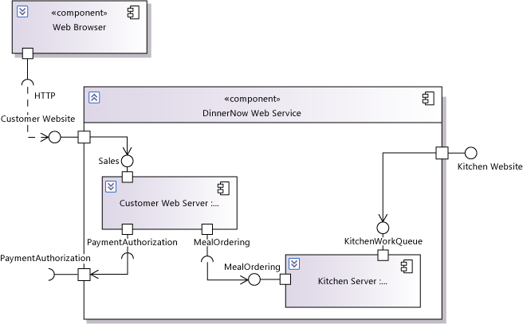

# Model your app&#39;s architecture
[!INCLUDE[vs2017banner](../includes/vs2017banner.md)]

To help ensure that your software system or application meets your users' needs, you can create models in Visual Studio as part of your description of the overall structure and behavior of your software system or application. Using models, you can also describe patterns that are used throughout the design. These models help you understand the existing architecture, discuss changes, and communicate your intentions clearly.

 To see which versions of Visual Studio support this feature, see [Version support for architecture and modeling tools](../modeling/what-s-new-for-design-in-visual-studio.md#VersionSupport).

 The purpose of a model is to reduce the ambiguities that occur in natural-language descriptions, and to help you and your colleagues to visualize the design and to discuss alternative designs. A model should be used together with other documents or discussions. By itself, a model does not represent a complete specification of the architecture.

> [!NOTE]
> Throughout this topic, "system" means the software that you are developing. It might be a large collection of many software and hardware components, or a single application, or a part of an application.

 The architecture of a system can be divided into two areas:

- [High-level Design](#Structure). This describes the major components and how they interact with one another to fulfill each requirement. If the system is large, each component might have its own high-level design that shows how it is composed of smaller components.

- [Design Patterns](#Patterns) and conventions used throughout the designs of the components. A pattern describes a particular approach to achieving a programming goal. By using the same patterns throughout a design, your team can reduce the cost of making changes and developing new software.

##  High-level Design
 A high-level design describes the major components of your system and how they interact with one another to achieve the goals of the design. The activities in the following list are involved in developing the high level design, although not necessarily in a particular sequence.

 If you are updating existing code, you might begin by describing the major components. Make sure you understand any changes to the user requirements and then add or modify interactions between the components. If you are developing a new system, begin by understanding the main features of the users' needs. You can then explore sequences of interactions for the main use cases, and then consolidate the sequences into a component design.

 In every case, it is helpful to develop the different activities in parallel, and to develop code and tests at an early stage. Avoid trying to complete one of these aspects before you start another. Typically, both the requirements and your understanding of the best way to design the system will change while you are writing and testing the code. Therefore, you should begin by understanding and coding the main features of the requirements and your design. Fill in the details in later iterations of the project.

- [Understanding the Requirements](#Requirements). The starting point of any design is a clear understanding of the users' needs.

- [Architectural Patterns](#BigDecisions). The choices you made about core technologies and architectural elements of the system.

- [Components and their Interfaces](#Components). You can draw component diagrams to show the major parts of the system, and show the interfaces through which they interact with one another. The interfaces of each component include all the messages that you identified in the sequence diagrams.

- [Interactions between Components](#Interactions). For each use case, event, or incoming message, you can draw a sequence diagram that shows how the major components of the system interact to achieve the required response.

- [Data Model of the Components and Interfaces](#Data). You can draw class diagrams to describe the information that is passed between components and stored inside the components.

##  Understanding the Requirements
 The high-level design of a complete application is most effectively developed together with a requirements model or other description of the users' needs. For more information about requirements models, see [Model user requirements](../modeling/model-user-requirements.md).

 If the system that you are developing is a component in a larger system, part or all of your requirements might be embodied in programmatic interfaces.

 The requirements model provides these essential pieces of information:

- Provided interfaces. A provided interface lists the services or operations that the system or component must provide to its users, whether they are human users or other software components.

- Required interfaces. A required interface lists the services or operations that the system or component can use. In some cases, you will be able to design all these services as part of your own system. In other cases, especially if you are designing a component that can be combined with other components in many configurations, the required interface will be set by external considerations.

- Quality of service requirements. The performance, security, robustness, and other goals and constraints that the system must meet.

  The requirements model is written from the point of view of your system's users, whether they are people or other software components. They know nothing of the internal workings of your system. By contrast, your goal in an architectural model is to describe the internal workings and show how they meet the users' needs.

  Keeping the requirements and architectural models separate is useful because it makes it easier to discuss the requirements with the users. It also helps you refactor the design and consider alternative architectures while keeping the requirements unchanged.

  You can separate the requirements and architectural models in two alternative ways:

- Keep them in the same solution but different projects. They will appear as separate models in UML Model Explorer. Different team members can work in parallel on the models. Limited kinds of tracing can be created between the models.

- Put them in the same UML model, but in different packages. This makes it easier to trace dependencies between the models, but prevents more than one person at a time from working on the model. Additionally, a very large model will take longer to load into Visual Studio. This approach is therefore less suitable for large projects.

  The amount of detail that you should put into either a requirements or an architectural model depends on the scale of the project and the size and distribution of the team. A small team on a short project might go no further than sketching a class diagram of the business concepts and some design patterns; a large project distributed over more than one region would need significantly more detail.

##  Architectural Patterns
 Early in a development, you have to choose the major technologies and elements on which the design depends. The areas in which these choices must be made include the following:

- Base technology choices, such as the choice between a database and a file system, and the choice between a networked application and a Web client, and so on.

- Frameworks choices, such as a choice between Windows Workflow Foundation or ADO.NET Entity Framework.

- Integration method choices, for example between an enterprise service bus or a point-to-point channel.

  These choices are frequently determined by quality of service requirements such as scale and flexibility, and can be made before the detailed requirements are known. In a large system, the configuration of hardware and software are strongly interrelated.

  The selections that you make affect how you use and interpret the architectural model. For example, in a system that uses a database, associations in a class diagram might represent relations or foreign keys in the database, whereas in a system that is based on XML files, associations might indicate cross-references that use XPath. In a distributed system, messages in a sequence diagram can represent messages on a wire; in a self-contained application, they can represent function calls.

##  Components and their Interfaces
 The major recommendations of this section are as follows:

- Create component diagrams to show the major parts of your system.

- Draw dependencies between the components or their interfaces to show the structure of the system.

- Use interfaces on the components to show the services that each component provides or requires.

- In a large design, you can draw separate diagrams to decompose each component into smaller parts.

  These points are elaborated in the rest of this section.

### Components
 The central views of an architecture model are the component diagrams that show the major parts of the system and how they depend on one another. For more information about component diagrams, see [UML Component Diagrams: Reference](../modeling/uml-component-diagrams-reference.md).

 

 A typical component diagram for a large system might include components like these:

- Presentation. The component that provides access to the user, typically running on a Web browser.

- Web service components. Provides connection between clients and servers.

- Use case controllers. Conduct the user through the steps of each scenario.

- Business core. Contains classes that are based on classes in the requirements model, implements the key operations, and imposes business constraints.

- Database. Stores the business objects.

- Logging and error handling components.

### Dependencies between Components
 In addition to the components themselves, you can show the dependencies between them. A dependency arrow between two components shows that changes in the design of one could affect the design of the other. This usually happens because one component uses the services or functions that are provided by the other component, either directly or indirectly.

 A well-structured architecture has a clear arrangement of dependencies, in which these conditions are true:

- There are no loops on a code map.

- The components can be arranged into layers in which every dependency goes from a component in one layer to a component in the next. All the dependencies between any two layers go in the same direction.

  You can show dependencies directly between components, or you can show dependencies between required and provided interfaces that are attached to the components. By using interfaces, you can define what operations are used in each dependency. Typically, dependencies are shown between components when the diagrams are first drawn, and then replaced by dependencies between interfaces as more information is added. Both versions are correct descriptions of the software, but the version with interfaces provides more detail than the earlier version.

  Managing dependencies is most important for the production of maintainable software. The component diagrams should reflect all the dependencies in your code. If the code already exists, make sure that all the dependencies are shown in the diagrams. If the code is being developed, make sure that it does not include dependencies that are not planned in the component diagram. To help you discover dependencies in the code, you can generate layer diagrams. To help you ensure that your planned dependency constraints are met, you can validate the code against layer diagrams. For more information, see [Layer Diagrams: Reference](../modeling/layer-diagrams-reference.md).

### Interfaces
 By placing interfaces on your components, you can separate and name the major groups of operations that are provided by each component. For example, components in a web-based sales system might have an interface through which customers buy goods, an interface through which suppliers update their catalogs, and a third interface through which the system is managed.

 A component can have any number of provided and required interfaces. Provided interfaces show services that the component provides for other components to use. Required interfaces show services that the component uses in other components.

 If you define both provided and required interfaces, this helps you separate the component cleanly from the rest of the design, so that you can use these techniques:

- Place the component into a test harness in which the surrounding components are simulated by the test harness.

- Develop your component independently of the other components.

- Reuse the component in other contexts by coupling its interfaces to different components.

  When you want to define the list of operations in an interface, you can create another view of the interface on a UML class diagram. To do this, locate the interface in UML Model Explorer, and drag it onto a class diagram. You can then add operations to the interface.

  An operation in a UML interface can represent any way in which a behavior of a component can be invoked. It might represent a Web service request, a signal or interaction of some other kind, or an ordinary program function call.

  To determine what operations to add, create sequence diagrams to show how the components interact with one another. See [Interactions between Components](#Interactions). Each of these sequence diagrams shows the interactions that occur in a different use case. In this manner, you can gradually add to the list of operations in each component's interface, as you explore the use cases.

### Decomposing a Component into Parts
 You can apply the procedure that is described in the preceding sections to each component.

 Within each component, you can show its sub-components as Parts. A Part is effectively an attribute of its parent component, which is a kind of class. Each Part has its own type, which can be a component. You can place this component on a diagram and show its parts. For more information, see [UML Component Diagrams: Guidelines](../modeling/uml-component-diagrams-guidelines.md).

 It is useful to apply this technique to the whole system. Draw it as a single component, and show its major components as parts. This helps you identify clearly the interfaces of your system with the external world.

 When your design for a component uses another component, you frequently have a choice about whether to represent it as a part or as a separate component that you access through a Requires Interface.

 Use Parts in the following situations:

- The design of the parent component must always use the Part's component type. Therefore, the design of the part is integral to the design of the parent component.

- The parent component has no concrete existence of its own. For example, you could have a conceptual component called Presentation Layer that represents a collection of real components that handle views and user interactions.

  Use separate components accessed through required interfaces in these situations:

- The requiring component can be coupled through its interfaces to different providing components at run time.

- The design is such that it would be easy to replace one provider with another.

  The use of required interfaces is usually preferable to the use of parts. Although the design can take longer, the resulting system is more flexible. It is also easier to test the components separately. This allows less coupling in their development plans.

##  Interactions between Components
 The major recommendations of this section are as follows:

- Identify the use cases of your system.

- For each use case, draw one or more diagrams to show how the components of your system achieve the required outcome by collaborating with one another and with the users. Usually, these are sequence diagrams or activity diagrams.

- Use Interfaces to specify the messages received by each component.

- Describe the effects of the Operations in the Interfaces.

- Repeat the procedure for each component, showing how its parts interact.

  For example, in a web-based sales system, the requirements model might define a customer purchase as a use case. You can create a sequence diagram to show the interactions that the customer has with the components in the presentation layer, and to show the interactions that they have with the warehouse and accounting components.

### Identifying the initiating events
 The work done by most software systems can be conveniently divided up by the responses it gives to different inputs or events. The initiating event might be one of the following events:

- The first action in a use case. It might appear in the requirements model as a step in a use case, or an action in an activity diagram. For more information, [UML Use Case Diagrams: Guidelines](../modeling/uml-use-case-diagrams-guidelines.md) and [UML Activity Diagrams: Guidelines](../modeling/uml-activity-diagrams-guidelines.md).

- A message at a programmatic interface. If the system that you are developing is a component in a larger system, it should be described as an operation in one of the component's interfaces. See [Components and their Interfaces](#Components).

- A particular condition that is monitored by your system, or a regular event such as a time of day.

### Describe the computations
 Draw sequence diagrams to show how the components respond to the initial event.

 Draw a lifeline for each component instance that takes part in a typical sequence. In some cases, there might be more than one instance of each type. If you have described your whole system as a single component, there should be one lifeline for each Part that it contains.

 For more information, see [UML Sequence Diagrams: Guidelines](../modeling/uml-sequence-diagrams-guidelines.md).

 Activity diagrams are also useful in some cases. For example, if your components have a continuous flow of data, you can describe it as an object flow. If your component has a complex algorithm, you can describe it as a control flow. Make sure that you make it clear which component performs each action, for example by using comments. For more information, see [UML Activity Diagrams: Guidelines](../modeling/uml-activity-diagrams-guidelines.md).

### Specify the operations
 The diagrams show operations that are performed by each component, represented either as messages on a sequence diagram, or actions in an activity diagram.

 Collect these operations together for each component. Create Provided Interfaces on the component, and add the operations to the interfaces. Typically, a separate interface is used for each type of client. The operations are most easily added to the interfaces in **UML Model Explorer**. In the same manner, collect the operations that each component uses from the other components, and place them in Required Interfaces attached to the component.

 It is useful to add comments to the activity or sequence diagrams, to note what has been achieved after each operation. You can also write the effect of each operation in its **Local Postcondition** property.

###  Data Model of the Components and Interfaces
 Define the parameters and return values of each operation in the component interfaces. Where the operations represent invocations such as Web service requests, the parameters are those pieces of information that are sent as part of the request. Where several values are returned from an operation, you can use parameters with the **Direction** property set to **Out**.

 Each parameter and return value has a type. You can define these types using UML Class Diagrams. You do not have to represent implementation detail in these diagrams. For example, if you are describing data that is transmitted as XML, you can use an association to represent any kind of cross-reference between nodes of the XML, and use classes to represent nodes.

 Use comments to describe business constraints on the associations and attributes. For example, if all the items on a customer's order must come from the same supplier, you can describe this by reference to the associations between the order items and the items on the product catalog, and between the catalog item and its supplier.

##  Design Patterns
 A design pattern is an outline of how to design a particular aspect of the software, especially one that recurs in different parts of the system. By adopting a uniform approach across the project, you can reduce the cost of design, ensure consistency in the user interface, and reduce the cost of understanding and changing the code.

 Some general design patterns such as Observer are well-known and widely applicable. In addition, there are patterns that are applicable just to your project. For example, in a Web sales system, there will be several operations in the code where changes are made to a customer's order. To ensure that the state of the order is accurately displayed at every stage, all these operations must follow a particular protocol to update the database.

 Part of the work of software architecture is to determine what patterns should be adopted across the design. This is usually an ongoing task, because new patterns and improvements to existing patterns will be discovered as the project progresses. It is helpful to organize the development plan so that you exercise each of your major design patterns at an early stage.

 Most design patterns can be partly embodied in framework code. Part of the pattern can be reduced to requiring the developer to use particular classes or components, such as a database access layer that ensures the database is handled correctly.

 A design pattern is described in a document, and typically includes these parts:

- Name.

- Description of the context in which it is applicable. What criteria should make a developer consider applying this pattern?

- Brief explanation of the problem it solves.

- Model of the major parts and their relationships. These might be classes or components and interfaces, with associations and dependencies between them. The elements usually fall into two categories:

  - Elements that the developer must replicate in every part of the code where the pattern is used. You can use template types to describe these. For more information, see [UML Use Case Diagrams: Reference](../modeling/uml-use-case-diagrams-reference.md).

  - Elements describing framework classes that the developer should use.

- Model of the interactions between the parts, using sequence or activity diagrams.

- Naming conventions.

- Description of how the pattern solves the problem.

- Description of variations that developers might be able to adopt.

## See Also
 [Edit UML models and diagrams](../modeling/edit-uml-models-and-diagrams.md)
 [Visualize code](../modeling/visualize-code.md)
 [Model user requirements](../modeling/model-user-requirements.md)
 [Develop tests from a model](../modeling/develop-tests-from-a-model.md)
 [Use models in your development process](../modeling/use-models-in-your-development-process.md)
