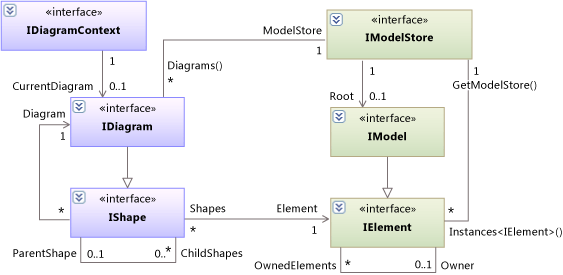

# Navigate the UML model
[!INCLUDE[vs2017banner](../includes/vs2017banner.md)]

This topic introduces the main types of the UML model.

## The Model Elements, Model, and Model Store
 The types defined in the assembly **Microsoft.VisualStudio.Uml.Interfaces.dll** correspond to the types defined in the [UML Specification, version 2.1.2](https://www.omg.org/spec/UML/2.1.2/Superstructure/PDF/).

 Types in the UML Specification are realized as interfaces in Visual Studio. The letter 'I' is prepended to the name of each type. For example: [IElement](/previous-versions/dd516035(v=vs.140)), [IClass](/previous-versions/dd523539%28v%3dvs.140%29), [IOperation](/previous-versions/dd481186(v=vs.140)).

 All the types except IElement inherit properties from one or more supertypes.

- For a summary of the model types, see [UML model element types](../modeling/uml-model-element-types.md).

- For full details of the API, see [API Reference for UML Modeling Extensibility](../modeling/api-reference-for-uml-modeling-extensibility.md).

### Relationships
 Properties and relationships that are defined in the UML Specification are implemented as .NET properties.

 Most relationships are navigable in both directions. A relationship corresponds to a pair of properties, with one property on the type at each end. For example, the properties `IElement.Owner` and `IElement.OwnedElements` represent two ends of a relationship. Therefore, this expression will always evaluate to true:

 `IElement c; ...  c.OwnedElements.All(x => x.Owner == c)`

 Many relationships, such as IAssociation, are also represented by an object that can have its own properties.

 If you delete an element from the model, any relationship in which it takes part is automatically deleted, and the property at the other end is updated.

 If the UML Specification assigns a multiplicity of 0..1 to a property, it may have the value `null`. A multiplicity with maximum greater than 1 means that the .NET property has the type: `IEnumerable<`*Type*`>`.

 For more information about traversing relationships, see [Navigate relationships with the UML API](../modeling/navigate-relationships-with-the-uml-api.md).

### The Ownership Tree
 A model contains a tree of [IElement](/previous-versions/dd516035(v=vs.140)) objects. Every element has properties `OwnedElements` and `Owner`.

 In most cases, the targets of the `Owner` and `OwnedElements` properties are also referenced by other properties that have more specific names. For example, every UML operation is owned by a UML class. Therefore [IOperation](/previous-versions/dd481186(v=vs.140)) has a property named [IOperation.Class](/previous-versions/dd473473%28v%3dvs.140%29), and in every [IOperation](/previous-versions/dd481186(v=vs.140)) object, `Class == Owner`.

 The topmost element of the tree, which has no Owner, is an `AuxiliaryConstructs.IModel`. The IModel is contained within a `IModelStore`, in which it is the [IModelStore.Root](/previous-versions/ee789368(v=vs.140)).

 Every model element is created with an Owner. For more information, see [Create elements and relationships in UML models](../modeling/create-elements-and-relationships-in-uml-models.md).

 

## Shapes and Diagrams
 Elements in the UML model can be displayed on diagrams. Different types of diagrams can display different subtypes of IElement.

 In some cases, an element can appear on more than one diagram. For example, an IUseCase element can have several IShapes, which can appear on one diagram or different diagrams.

 Shapes are arranged in a tree. The edges of the tree are represented by the ParentShape and ChildShapes properties. Diagrams are the only shapes that do not have parents. The shapes on the surface of a diagram are composed of smaller parts. For example, a class shape has compartments for attributes and operations.

 For more information about shapes, see [Display a UML model on diagrams](../modeling/display-a-uml-model-on-diagrams.md).

## Access to the Model in Extensions
 In [!INCLUDE[vsprvs](../includes/vsprvs-md.md)] extensions defined as MEF Components, you can declare properties that import information from the context in which the extension runs.

|Attribute type|What this provides access to|More information|
|--------------------|----------------------------------|----------------------|
|Microsoft.VisualStudio.ArchitectureTools.Extensibility.Presentation<br /><br /> .IDiagramContext<br /><br /> (in Microsoft.VisualStudio.ArchitectureTools.Extensibility.dll)|The current focus diagram.|[Define a menu command on a modeling diagram](../modeling/define-a-menu-command-on-a-modeling-diagram.md)|
|Microsoft.VisualStudio.Modeling.ExtensionEnablement<br /><br /> .ILinkedUndoContext<br /><br /> (in Microsoft.VisualStudio.Modeling.Sdk.[version].dll)|Allows you to group changes into transactions.|[Link UML model updates by using transactions](../modeling/link-uml-model-updates-by-using-transactions.md)|
|Microsoft.VisualStudio.Shell .SVsServiceProvider<br /><br /> (in Microsoft.VisualStudio.Shell.Immutable.[version].dll)|The host [!INCLUDE[vsprvs](../includes/vsprvs-md.md)]. From there you can access files, projects and other aspects.|[Open a UML model by using the Visual Studio API](../modeling/open-a-uml-model-by-using-the-visual-studio-api.md)|

### To get the Context
 Declare one or both of the following interfaces inside your extension class:

```
[Import] public IDiagramContext DiagramContext { get; set; }

```

 The Managed Extensibility Framework (MEF) will bind these to definitions from which you can obtain the current diagram, model store, root object, and so on:

```
IDiagram diagram = this.DiagramContext.CurrentDiagram;
IClassDiagram classDiagram = diagram as IClassDiagram;
       // or diagrams of other types
IModelStore modelStore = diagram.ModelStore;
IModel model = modelStore.Root;
foreach (IDiagram diagram in modelStore.Diagrams) {...}
foreach (IElement element in modelStore.AllInstances<IUseCase>) {...}
```

### To get the current selection

```
// All selected shapes and their elements
foreach (IShape shape in diagram.SelectedShapes)
{
   IDiagram selectedDiagram = shape as IDiagram;
   if (selectedDiagram != null)
   { // no shape selected - user right-clicked the diagram
     ... Context.CurrentDiagram ...
   }
   else
   {
     IElement selectedElement = shape.Element;
   ...}
// All selected shapes that display a specfic type of element
foreach (IShape<IInterface> in
   diagram.GetSelectedShapes<IInterface>())
{...}
```

## Accessing another model or diagrams
 You can:

- Use [!INCLUDE[vsprvs](../includes/vsprvs-md.md)] model bus to create links between elements in different models. For more information, see [Integrate UML models with other models and tools](../modeling/integrate-uml-models-with-other-models-and-tools.md).

- Load a modeling project and diagrams in read-only mode without making it visible in the [!INCLUDE[vsprvs](../includes/vsprvs-md.md)] user interface. For more information, see [Read a UML model in program code](../modeling/read-a-uml-model-in-program-code.md).

- Open a modeling project and its diagrams in [!INCLUDE[vsprvs](../includes/vsprvs-md.md)], and then access the contents. For more information, see [Open a UML model by using the Visual Studio API](../modeling/open-a-uml-model-by-using-the-visual-studio-api.md).

## See also

- [Extend UML models and diagrams](../modeling/extend-uml-models-and-diagrams.md)
- [Programming with the UML API](../modeling/programming-with-the-uml-api.md)
