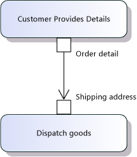
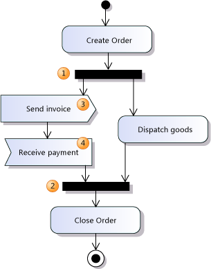
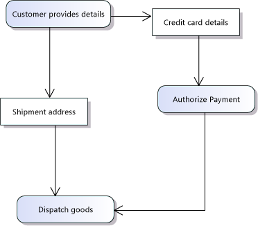

# UML Activity Diagrams: Guidelines
[!INCLUDE[vs2017banner](../includes/vs2017banner.md)]

In Visual Studio, you can draw an activity diagram to describe a business process or a software algorithm as a flow of work through a series of actions. People, software components, or devices can perform these actions. For a video demonstration, see: [Capture Business Workflows by using Activity Diagrams](https://channel9.msdn.com/blogs/clinted/uml-with-vs-2010-part-4-capture-business-workflows).

 To see which versions of Visual Studio support this feature, see [Version support for architecture and modeling tools](../modeling/what-s-new-for-design-in-visual-studio.md#VersionSupport).

 To create a UML activity diagram, on the **Architecture** menu, click **New UML or Layer Diagram**.

 You can use an activity diagram for many purposes:

- To describe a business process or a flow of work between users and your system. For more information, see [Model user requirements](../modeling/model-user-requirements.md).

- To describe the steps performed in a use case. For more information, see [UML Use Case Diagrams: Guidelines](../modeling/uml-use-case-diagrams-guidelines.md).

- To describe a method, function or operation in software. For more information, see [Model your app's architecture](../modeling/model-your-app-s-architecture.md).

  Drawing an activity diagram can help you improve a process. If the diagram of an existing process proves to be very complex, you can consider how the process could be simplified.

  For reference information about the elements on activity diagrams, see [UML Activity Diagrams: Reference](../modeling/uml-activity-diagrams-reference.md).

##  Relationship to Other Diagrams
 If you draw an activity diagram to describe a business process, or a way in which users use your system, you can draw a use case diagram to show a different view of the same information. In the use case diagram, you draw actions as use cases. Give the use cases the same names as the corresponding actions. The advantages of the use case view are that you can:

- Show in one diagram how larger actions/use cases are composed of smaller ones, using the Includes relation.

- Connect each action/use case explicitly to the users or external systems involved in its execution.

- Draw boundaries around the actions/use cases supported by your system, or each major component of it.

  You can also draw an activity diagram to describe the detailed design of a software operation.

  In an activity diagram, you can show the flow of data passed between actions. See the section on [Describing Data Flow](#DataFlows). But an activity diagram does not describe the structure of the data. For that purpose, you can draw a UML class diagram. For information see [UML Class Diagrams: Guidelines](../modeling/uml-class-diagrams-guidelines.md).

##  Basic Steps for Drawing Activity Diagrams
 Detailed steps for creating any of the modeling diagrams are described in [Edit UML models and diagrams](../modeling/edit-uml-models-and-diagrams.md).

#### To draw an activity diagram

1. On the **Architecture** menu, click **New UML or Layer Diagram**.

2. Under **Templates**, click **UML Activity Diagram**.

3. Name the diagram.

4. In **Add to Modeling Project**, select an existing modeling project in your solution, or **Create a New Modeling Project**.

#### To draw elements on an activity diagram

1. Drag elements from the toolbox onto the diagram.

     Start by placing the main activities on the diagram, connecting them, and then adding final touches such as the initial and final nodes.

    > [!NOTE]
    > You cannot drag existing elements onto the diagram from UML Model Explorer.

2. To connect the elements, follow these steps:

    1. In the **Activity Diagram** toolbox, click **Connector**.

    2. On the diagram, click the source element.

    3. Click the target element.

        > [!NOTE]
        > To use a tool multiple times, double-click the tool in the toolbox.

#### To move an activity to another package

- In **UML Model Explorer**, drag the activity into a package.

     \- or -

- In **UML Model Explorer**, right-click the activity and click **Cut**. Then right-click the package and click **Paste**.

    > [!NOTE]
    > The activity will appear in UML Model Explorer only when you add the first element to the diagram.

##  Describing Control Flow
 An activity diagram describes a business process or software algorithm as a series of actions. Connector arrows show how control is passed sequentially from one action to the next. Ordinarily, an action can start only after the previous action has been completed.

 The following figure is an example of how you can show a sequence of actions with actions, connectors, branches and loops. Each element is explained in more detail in the following sections.

 

 Activity diagrams use **Actions** and **Connectors** to describe your system or application as a series of actions with the control flowing sequentially from one action to the next.

- Create an **Action** (1) for each major task that is performed by a user, the system, or both in collaboration.

  > [!NOTE]
  > Try to describe your process or algorithm with just a few actions. You can use **Call Behavior Actions** to define each action in more detail in a separate diagram, as described in [Describing Sub-activities with Call Behavior Actions](#Subactivities).

- Make sure that the title of each action clearly indicates what it typically achieves.

- Link the actions in sequence with **Connectors** (2).

- Each action ends before the next action in the control flow begins. If you want to describe actions that overlap, use a **Fork Node** as described in the section [Concurrent Flows](#Concurrent).

  Although the diagram describes the sequence of actions, it does not describe how the actions are executed, or how control is passed from one action to the next. If you use the diagram to represent a business process, control might be passed, for example, when one person sends an e-mail message to another. If you use the diagram to represent a software design, control might be passed by the normal flow of execution from one statement to the next.

### Describing Decisions and Loops

- Use a **Decision Node** (3) to indicate a point where the outcome of a decision dictates the next step. You can draw as many outgoing paths as you want.

- If you use the activity diagram to define part of an application, you should define the guards (4) so that it is clear when each path should be taken. Right-click the connector, click **Properties**, and in the **Properties** window, type a value for the **Guard** field.

- It is not always necessary to define the guards. For example, if you use the activity diagram to describe a business process or an interaction protocol, a branch defines the range of options open to the user or to the interacting components.

- Use a **Merge Node** (5) to bring together two or more alternative flows that branched at a **Decision Node**.

    > [!NOTE]
    > You should use a **Merge Node** to bring together alternative flows, instead of bringing the flows together at an action. In the example, it would not be correct to connect from the decision node directly back to **Choose Menu Item**. This is because an action does not start until threads of control have arrived at all its incoming connectors. Therefore, you should bring only concurrent flows together at an action. For more information, see [Concurrent Flows](#Concurrent).

- Use branches to describe loops, as shown in the example.

    > [!NOTE]
    > Try to nest loops in a well-structured way, as you would in program code. If you are describing an existing business process, this might reveal some opportunities for improving it.

### Starting the Activity
 There are two ways to indicate entry points into an activity:

- **Initial Node**

     Create one **Initial Node** (6) to indicate the first action of the activity.

     This method is most useful when you are describing a sub-activity, or where you do not have to explicitly state what initiates the activity. For example, the activity Order a Meal clearly begins when a customer gets hungry.

- **Accept Event Node**

     Create **Accept Event Nodes**, as described in the section [Concurrent Flows](#Concurrent), to indicate the start of a thread that responds to a particular event, such as a user input. Do not provide an incoming flow to the node. Omitting an incoming flow indicates that a thread will be started every time that the event occurs.

     This method is most useful when you describe a response to a specific external event.

### Ending the Activity
 Use an **Activity Final Node** (7) to indicate the end of an activity.

- When a thread of control reaches an **Activity Final Node**, all the activity's concurrent actions and sub-activities terminate.

- You can use more than one Activity Final Node to reduce the clutter of additional connectors.

### Interrupting the Activity
 To describe how the ordinary flow of an activity can be interrupted, for example, if the user decides to cancel the process, you can create an Accept Event Node that listens for that event. For more information, see the section [Concurrent Flows](#Concurrent). Create a control flow from that to an Activity Final Node (7).

### Swimlanes
 It is sometimes useful to arrange the actions of an activity into areas corresponding to different objects or business roles that perform the actions. These areas are conventionally arranged in columns and are called *swimlanes*.

- Use lines or rectangles from the **Simple Shapes** section of the Toolbox to draw swimlanes or other areas.

- To label each swimlane, create a comment and set its **Transparent** property to **True**.

  Simple shapes do not form part of the UML model, and do not appear in UML Model Explorer.

##  Describing Data Flow
 You can describe the data passing in and out of an activity in either of two ways:

- Use an **Object Node**. This is the simplest method of describing the information flowing between activities. An object node is like a variable in a program. It represents something that stores one or more values that are passing from one action to another.

- Use an **Output Pin** and an **Input Pin**. This method lets you separately describe the outputs from one action and the inputs to another. Pins are like parameters in a program. Pins represent ports where objects can enter and leave an action.

    > [!NOTE]
    > For an overview of the elements used in this section, see the Data Flows section of the topic see [UML Activity Diagrams: Reference](../modeling/uml-activity-diagrams-reference.md).

### Describing Data Flow with Object Nodes
 Most control flows carry data. For example, the output flow from the "Customer provides details" action carries a reference to the shipping address.

 If you want to describe that data on your diagram, you can replace a connector with an object node and two connectors as shown in the following figure.

 

 Notice that the round-cornered rectangles, such as Dispatch Goods, represent actions, where processing occurs. The square-cornered rectangles, such as Shipment Address, represent a flow of objects from one action to another.

 Give the object node a name that reflects the role of the node as a conduit or buffer of the objects that flow between the actions.

 You can set the **Type** of the object node in the Properties window. The type can be a primitive type such as Integer, or a class, interface, or enumeration that you have defined in a class diagram. For example, you could create a class Shipment Address, with attributes of Street Address, City, and so on, together with an association to another class that is named Customer. For more information, see [UML Class Diagrams: Guidelines](../modeling/uml-class-diagrams-guidelines.md).

> [!NOTE]
> If you type the name of a type that has not yet been defined, an item will be added under **Unspecified Types** in UML Model Explorer. If you subsequently define a type of that name in a class diagram, you should reset the type of the object node so that it refers to the new type.

#### Buffering data in object nodes
 An object node can act as a buffer for multiple objects. In the following illustration, the control flow shows that the user can go around the [choose more] loop (1) many times, while the Chosen Menu Items object node (2) accumulates the user's choices. Finally, when the user has completed his or her selection, control passes to the Confirm Order action (3), which accepts the complete list of choices from the Chosen Menu Items buffer.

 

 You can specify how the items in a buffer are stored by setting properties of the object node:

- Set the **Ordering** property:

  - **Unordered** to specify a random or unspecified order. (Default.)

  - **Ordered** to specify an order according to a specific key.

  - **Fifo** to specify an order of first-in, first-out.

  - **Lifo** to specify an order of last-in, first-out.

- Set the **Upper Bound** property to specify the maximum number of objects that can be contained in the buffer. The default is *. This means that there is no limit.

### Describing Data Flow with Input and Output Pins
 Use an **Output Pin** and an **Input Pin** to separately describe the outputs from one action and the inputs to another.

 

 To create a pin, click **Input Pin** or **Output Pin** on the toolbox and then click an action. You can then move the pin around the perimeter of the action, and change its name. You can create input and output pins on any kind of action, including **Call Behavior Actions**, **Call Operation Actions**, **Send Signal Actions**, and **Accept Event Actions**.

 A connector between two pins represents an object flow, just as the flows to and from an object node do.

 Give each pin a name that indicates the role of the objects it produces or accepts, such as a parameter name.

 You can set the type of objects transmitted in the **Type** property. This must be a type that you have created in a UML Class Diagram.

 The objects flowing between connected pins must be compatible in some way. This could be because the objects produced by the output pin belong to a derived type of the input pin's type.

 Alternatively you can specify that the object flow includes a transformation that converts data between the type of the output pin and the type of the input pin. The most common transformation of this kind just extracts the appropriate part from a larger type. The example in the figure implies the existence of a transformation that extracts the Shipping Address from the Order Detail.

##  Defining an Action in More Detail
 In addition to using the name of the action to make clear the result it should ordinarily achieve, here are some ways you can add more detail to an action:

- Write a more detailed description in the **Body** property. For example, you could write a fragment of program code or pseudo code, or a complete description of the results achieved.

- Replace the action with a Call Behavior Action, and describe its detailed behavior within a separate activity diagram. See [Describing Sub-activities with Call Behavior Actions](#Subactivities).

- Set the action's **Local Postconditions** and **Local Preconditions** properties to describe its outcome in more specific detail. For more information, see [Defining Postconditions and Preconditions](#Postcondition).

###  Describing Sub-activities with Call Behavior Actions
 You can describe the detailed behavior of an action using a separate activity diagram. A called behavior is an activity diagram that is represented on your main activity diagram by a Call Behavior Action. You can also use the Call Behavior Action to describe behavior that is shared between different activities so that you do not have to draw the sub-activity multiple times.

 In the following figure, Diagram 1 shows an activity that has a Call Behavior Action and Diagram 2 shows the sub-activity diagram that shows the called behavior.

 

##### To describe a sub-activity with a Call Behavior Action

1. To create the diagram for the sub-activity, in **Solution Explorer**, right-click your modeling project, point to **Add**, and then click **New Item**.

2. In the **Add New Item** dialog box, under **Templates** click **Activity Diagram** and in the **Name** box type the name that you plan to give your **Call Behavior Action**.

3. Draw the detailed work flow for the sub-activity. This is the called behavior.

    - In the called sub-activity diagram, the **Initial Node** indicates where control starts when the called behavior is invoked. The **Activity Final Node** shows where control should return to the parent activity.

4. Set the **Behavior** property of the **Call Behavior Action** to refer to the called behavior diagram.

    > [!NOTE]
    > The sub-activity diagram must have some elements on it or the diagram will not be available in the drop-down list for the **Behavior** property. Also, the trident icon will not appear on your **Call Behavior Action** shape until you set its **Behavior** property.

5. Set the **Is Synchronous** property of the action to indicate whether your activity waits for the called activity to complete.

    - If you set **Is Synchronous** to false, you are indicating that the flow can continue to the next action before the called activity finishes. You should not define output pins or outgoing data flows from the action.

### Describing data flow in and out of sub-activities
 You can describe the data flowing in and out of sub-activities, in the same way that you use parameters in software.

- Create input and output pins (1) on the Called Behavior Action, for each piece of data that flows into or out of the action. Name each one appropriately.

- In the sub-activity diagram, create an **Activity Parameter Node** (2) for each input and output pin on the calling action. Give each node the same name as its corresponding pin.

  > [!NOTE]
  > An activity parameter node resembles an object node. To check what type of node that you are looking at, right-click the node and then click **Properties**. The type of node is shown in the header of the Properties window.

- In the sub-activity diagram, draw connectors that show the flow of objects into or out of each activity parameter node.

  

###  Defining Postconditions and Preconditions
 You can use the **Local Postconditions** and **Local Preconditions** properties to specify in detail the outcome of an action. These properties describe the effect of the action without describing how the effect is achieved.

 To set these properties, right-click the action and then click **Properties**. Type values into the properties in the Properties window.

#### Local Postconditions
 A postcondition is a condition that should be satisfied before the action can be considered completed. In the example action Confirm Order, the postcondition might be:

 The customer has provided complete and valid details that are required for processing his or her credit card.

 A postcondition can express a relationship between the states before and after the action has occurred. For example:

 The interest rate is double what it was before.

 You can write postconditions in a more formal style, referring to specific attributes of the data dealt with in the actions. For example:

 `InvoiceTotal == Sum(OrderItem.MenuItem.Price)`

#### Local Preconditions
 A precondition is a condition that should be true when the action is ready to begin. For example, the Confirm Order action might have the precondition:

 Customer has chosen at least one item from the menu.

### Describing Calls to Operations
 Generally, an action describes work that is performed by any mixture of people, software, or machines. But you can use a Call Operation Action to describe a call to a specific software method or function.

- Set the name of the Call Operation Action to indicate what operation is called, and on what object or component.

- Add input and output pins to the Call Operation Action, to describe parameters and return values.

- You can set the **Is Synchronous** property of the action to indicate whether your activity waits for the operation to complete.

  - If you set **Is Synchronous** to false, you are indicating that the flow can continue to the next action before the called operation is complete. You should not define output pins or outgoing data flows from the action.

##  Concurrent Flows
 You can use the **Fork Node** and the **Join Node** to describe two or more threads of activities that can execute at the same time.

 

 The effect of the **Fork Node** (1) is to divide the thread of control into two or more threads. When the previous action ends, all the actions on the output side of the fork can start.

 A **Join Node** (2) brings concurrent threads together. The action after the **Join Node** may not start until all the actions leading to the **Join Node** are complete.

### Describing Signals and Events
 You can show a step in a process that sends a signal as a Send Signal Action in an activity. You can show a step that waits for a specific signal or event before the step can continue as an Accept Event Action.

 For example, you might show a step that sends an order and then another step that must receive the order before it processes that order.

#### Sending a Signal
 Use a Send Signal Action (3) to indicate that a signal or message of some kind is sent to other activities or processes. Use the name of the action to indicate what kind of message it sends.

- Control immediately passes to the next action in the control flow, if there is one.

- You cannot use a Send Signal Action to describe how your process responds to any returned information. To do that, use a separate Accept Event Action.

- You can show incoming data flow to a Send Signal Action, to indicate what data can be sent with the outgoing message. For more information, see [Describing Data Flow](#DataFlows).

#### Waiting for a signal or event
 Use an Accept Event Action (4) to indicate that this activity waits for some external event or incoming message. Use the name of the action to indicate the type of event that it waits for.

- To show that your activity waits for an external event or message at a specific point in its flow, draw an Accept Event Action with an incoming flow, at the appropriate place in the activity.

- To show that your activity can respond to an external event or message at any time, draw an Accept Event Action without any incoming flow. When the named external event occurs, a new thread will begin in your activity, starting from the Accept Event Action.

- You cannot use an Accept Event Action to describe any value returned to the sender of the signal. Use a separate Send Signal Action for that purpose.

- You can show outgoing data flows from the action, to show how your activity processes data that is received in the signal. If you want to show more than one output flow, you should set the **IsUnmarshall** property of the Accept Event Action, which indicates that the action parses the incoming signal into its separate components. For more information, see [Describing Data Flow](#DataFlows).

### Describing Multiple Data Flows
 You can draw more than one control flow or object flow coming out of an action to indicate that more than one thread emerges when the action ends. The effect resembles that of a fork, except that you can use a mixture of control and object flows.

 The following example shows multiple flows out of and into actions.

 

 When the "Customer provides details" action completes, it produces two objects: "Shipment address" and "Credit card details." The two objects go forward for processing by different actions.

 Because an action requires all its inputs to be available before it can start, the last action does not start until all the actions that lead to it are complete.

### Streams
 You can use an activity diagram to help you describe a pipeline or a series of actions that execute at the same time, and continuously pass data from one action to another.

 The intention in the following example is that each action can produce objects and continue to work. Because there are no control flows, each action can start as soon as it receives its first objects.

 Notice that the connectors in this example are object flows, because they all have at least one end on an Activity Parameter Node, Object Node, or on an Input or Output Pin.

 

 1. The example has three Activity Parameter Nodes, which represent its inputs and outputs.

 2. Object Nodes, Input Pins and Output Pins can represent buffers. You can set the Upper Bound property of an Object Node to state how many objects can be in the buffer at the same time.

 3. You can use Decision nodes to show that a stream divides, sending different objects down different branches. You can use comments or the titles of the nodes to explain what the dividing criterion is.

 4. You can use Fork nodes to show that two or more copies of the objects are made, sending them for concurrent processing.

 5. You can use Join nodes to show that two streams of processing are merged back into one.

### Selection and Transformation
 You can specify that the objects in an object flow are transformed, selected, or both. An object flow is a flow to or from a pin or an object node.

- A transformation describes how objects entering a flow are converted to another type.

- A selection describes how only some of the objects entering a flow are transmitted to the receiving action.

  The example shows a transformation. The first action in Diagram 1 produces a postal code, or zip code, at an output pin. This is connected to an input pin on the second action. But the second action expects a fully-specified address. The conversion from one type to another is specified in a second activity, Address Lookup. This is referenced from the Transformation property of the object flow. The Address Lookup activity contains one Activity Parameter Node for the incoming postal code, and another Activity Parameter Node for the outgoing full address.

  

  You can specify a transformation or selection in two ways:

- Attach a comment to the input or output pin.

  - To distinguish this description from a general comment, you can begin the comment with <\<**transformation**>> or <\<**selection**>>.

- Specify the transformation or selection in detail in a separate activity diagram.

  - If you use this method, attach a comment also, to make it clear to readers that the transformation has been defined.

##### To specify a transformation or selection in a separate activity diagram

1. Create a new Activity Diagram in which to describe the transformation or selection flow.

   - In **Solution Explorer**, right-click your project, point to **Add**, click **New Item**, and then click **Activity Diagram**. Give the diagram an appropriate name for the transformation or selection flow. Click **Add**.

2. In the new diagram:

   1. Create two Activity Parameter Nodes, one for the input flow and one for the output.

   2. Create actions interconnected with object flows. This shows how the transformation or selection works.

3. In any diagram where you want to use the transformation or selection:

   1. Create an object flow, that is, a connector to or from an input or output pin, an object node, or an activity parameter node.

   2. Right-click the object flow and then click **Properties**.

   3. In the **Transformation** or **Selection** property, select the diagram where you specified the transformation or selection flow.

   You can also define a selection for an object node, and on individual input and output pins. Define a selection activity as in the previous procedure, and then set the **Selection** property of the object node, or input or output pin.

## See Also
 [Edit UML models and diagrams](../modeling/edit-uml-models-and-diagrams.md)
 [UML Sequence Diagrams: Reference](../modeling/uml-sequence-diagrams-reference.md)
 [UML Component Diagrams: Reference](../modeling/uml-component-diagrams-reference.md)
 [UML Use Case Diagrams: Reference](../modeling/uml-use-case-diagrams-reference.md)
 [UML Class Diagrams: Reference](../modeling/uml-class-diagrams-reference.md)
 [UML Component Diagrams: Reference](../modeling/uml-component-diagrams-reference.md)
 [Video: Capture Business Workflows by using Activity Diagrams](https://channel9.msdn.com/blogs/clinted/uml-with-vs-2010-part-4-capture-business-workflows)
