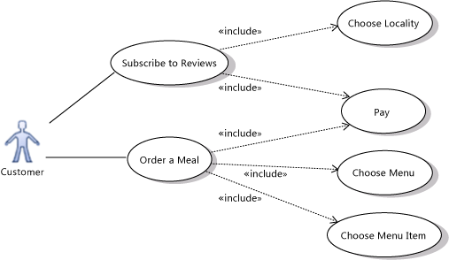
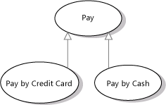
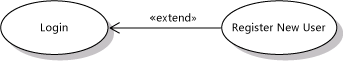
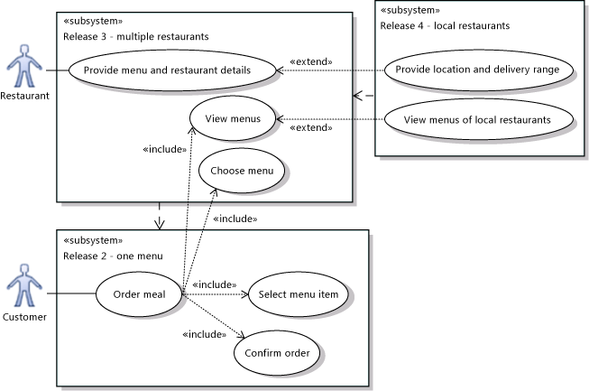

# UML Use Case Diagrams: Guidelines
[!INCLUDE[vs2017banner](../includes/vs2017banner.md)]

In Visual Studio, you can draw a *use case diagram* to summarize who uses your application or system, and what they can do with it. To create a UML use case diagram, on the **Architecture** menu, click **New UML or Layer Diagram**.

 For a video demonstration, see [Organizing Features into Use Cases](https://channel9.msdn.com/blogs/clinted/uml-with-vs-2010-part-2-organizing-features-into-use-cases).

 To see which versions of Visual Studio support this feature, see [Version support for architecture and modeling tools](../modeling/what-s-new-for-design-in-visual-studio.md#VersionSupport).

 With the help of a use case diagram, you can discuss and communicate:

- The scenarios in which your system or application interacts with people, organizations, or external systems.

- The goals that it helps those actors achieve.

- The scope of your system.

  A use case diagram does not show the detail of the use cases: it only summarizes some of the relationships between use cases, actors, and systems. In particular, the diagram does not show the order in which steps are performed to achieve the goals of each use case. You can describe those details in other diagrams and documents, which you can link to each use case. For more information, see [Describing Use Cases in Detail](#Details) in this topic.

  The descriptions you provide for use cases will use several terms related to the domain in which the system works, such as Sale, Menu, Customer, and so on. It is important to define these terms and their relationships clearly, and you can do that with the help of a UML Class Diagram. For more information, see [UML Class Diagrams: Guidelines](../modeling/uml-class-diagrams-guidelines.md).

  Use cases deal only in the functional requirements for a system. Other requirements such as business rules, quality of service requirements, and implementation constraints must be represented separately. Architecture and internal details must also be described separately. For more information about how to define user requirements, see [Model user requirements](../modeling/model-user-requirements.md).

  The examples used in this topic relate to a Web site on which customers can order meals from local restaurants.

  

- An *actor* (1) is a class of person, organization, device, or external software component that interacts with your system. Example actors are **Customer**, **Restaurant**, **Temperature Sensor**, **Credit Card Authorizer.**

- A *use case* (2) represents the actions that are performed by one or more actors in the pursuit of a particular goal. Example use cases are **Order Meal**, **Update Menu**, **Process Payment**.

   On a use case diagram, use cases are associated (3) with the actors that perform them.

- Your *system (4)* is whatever you are developing. It might be a small software component, whose actors are just other software components; or it might be a complete application; or it might be a large distributed suite of applications deployed over many computers and devices. Example subsystems are **Meal Ordering Website**, **Meal Delivery Business**, **Website Version 2**.

   A use case diagram can show which use cases are supported by your system or its subsystems.

##  Basic Steps for Drawing Use Case Diagrams

> [!NOTE]
> Detailed steps for creating any of the modeling diagrams are described in [Edit UML models and diagrams](../modeling/edit-uml-models-and-diagrams.md).

#### To create a new use case diagram

1. On the **Architecture** menu, click **New UML or Layer Diagram**.

2. Under **Templates**, click **UMLUse Case Diagram**.

3. Name the diagram.

4. In **Add to Modeling Project**, select an existing modeling project in your solution, or **Create a New Modeling Project**, and then click **OK**.

#### To draw a use case diagram

1. Drag **Subsystem** boundaries from the toolbox onto the diagram, to represent either your whole system or its major components.

    - You can draw a use case diagram without system boundaries if you do not want to describe which use cases are supported by your system or its components.

    - Drag the corner of a system to make it bigger, if it is necessary.

    - Rename it appropriately.

2. Drag **Actors** from the toolbox onto the diagram (placing them outside any system boundary).

    - Actors represent classes of users, organizations, and external systems that interact with your system.

    - Rename them. For example: **Customer, Restaurant, Credit card agency.**

3. Drag **Use Cases** from the toolbox onto the appropriate systems.

    - Use cases represent the activities that actors perform with the help of your system.

    - Rename them by using titles the actors themselves would understand. Do not use titles that are related to your code. For example: **Order Meal, Pay for Meal, Deliver Meal**.

    - Begin with major transactions such as **Order Meal**, leaving until later smaller interactions such as **Select Menu Item**.

    - Place each use case in the system or major subsystem that supports it (ignoring any façade or component involved only in connecting to the user).

    - You can draw a use case outside the system boundary to show that it is not supported by your system, perhaps in a particular version or release.

4. Click **Association** on the toolbox, then a use case, and then an actor that participates in the use case. Link each actor to its use cases in this manner.

5. Structure the use cases with the **Include**, **Extend** and **Generalization** relationships. To create each of these links, click the tool, then the source use case, then the target. See the following section titled [Structuring Use Cases](#Structuring).

6. Describe the use cases in more detail. See the following section titled [Describing Use Cases in Detail](#Details).

7. Draw separate diagrams to focus on different subsystems or different groups of related use cases. All the diagrams in one modeling project are views of the same model.

##  Drawing Actors and Use Cases
 The main purpose of a use case diagram is to show who interacts with your system, and the main goals they achieve with it.

- Create **Actors** to represent classes of people, organizations, other systems, software or devices that interact with your system or subsystem.

  - To learn how to draw actors and other elements, see [Edit UML models and diagrams](../modeling/edit-uml-models-and-diagrams.md).

  - For each distinct set of goals, identify actors by their type or role, even though the physical persons or entities might be the same. For example, Restaurant and Customer are separate actors, even though a restaurant employee might sometimes be a customer.

- Create **Use Cases** for each of the goals that each actor seeks to achieve with the system.

  - Name and describe the use cases in words that the actor would understand, instead of implementation terms.

- Use **Associations** to link actors to use cases.

### Inheritance between Actors
 

 You can draw a **Generalization** link between Actors. The specialized actor, such as Club Customer in the example, inherits the use cases of the generalized actor, such as Customer. The arrowhead should point at the more general actor, such as Customer. When you create the link, point first at the more specialized actor.

 The specialized actor can have its own additional use cases that are not available to the other actors.

> [!CAUTION]
> You should not make loops of generalization relationships that result in an actor generalizing itself. Loops may generate errors.

### Alternative Actor Icons
 You can use custom icons to represent an actor, instead of the standard stick figure. For example, you could change it to resemble a device, restaurant, bank, and so on.

##### To change the appearance of an actor

1. Right-click the actor and then click **Properties**.

     The **Properties** window appears.

2. Set the **Image Path** property to the location of an image file.

    - You can use any of several image formats, including .gif, .jpg, and .bmp.

    - Use a file that is included in the solution or project source control so that it is still available when the solution is moved or copied.

3. To replicate this appearance in other use case diagrams, copy the actor and paste it into another diagram.

    - The change of image applies only to the view in a particular diagram. It does not apply to the underlying model element. If you drag the actor from UML Model Explorer onto another diagram, it will appear as the standard stick figure.

### Multiplicities between Actors and Use Cases
 The association between an actor and a use case can show a *multiplicity* at each end.

 

> [!NOTE]
> The multiplicities of an association on a use case diagram are hidden if they are both **1**.

 By default, each multiplicity is **1**. In a strict interpretation of the model, a multiplicity of 1 means that, for example, only one customer is involved in ordering each meal and that each customer orders only one meal at a time.

 You can change these multiplicities.

 For example:

 

- To state that several actors of the same class can take part in a single occurrence of a use case, set the multiplicity at the actor end of the association to **1..\***.

   In the illustration, one or more restaurants can take part in fulfilling the same meal order.

- To show that each actor can participate at the same time in several occurrences of a use case, set the multiplicity at the use case end of the association to **\***.

   In the illustration, each restaurant can work on fulfilling more than one order at a time.

##### To set multiplicities on an association

1. Right-click the association and then click **Properties**.

2. Expand either **First Role** or **Second Role**.

    *Role* means the element at one end of the association.

3. Set the Multiplicity property, choosing from the list:

   - **1** to state that exactly one instance of this role participates in each link.

   - **1..\*** to state that one or more instance of this role participate in each link.

   - **0..1** to state that participation is optional.

   - **\*** to state that zero or more instances of this role participate in the link.

> [!NOTE]
> Many teams do not place multiplicity information on use case diagrams, leaving the multiplicities at the default value of 1. Instead, they provide the information in separate descriptions of the use cases. In this case, all the multiplicities in the use case diagrams will be hidden.

### Using an actor or use case on multiple diagrams
 You can show the same actors and use cases on several diagrams. For example:

- You can describe in different diagrams the different use cases in which one actor is involved.

- You can use one diagram to show the actors and subsystems with which a use case is associated, and use another diagram to show how the use case is structured into included and extended use cases.

##### To show the same actor or use case on different diagrams

1. Create the actor or use case on one diagram.

2. Create another use case diagram.

3. Drag an actor or use case off **Model Explorer** onto the new diagram.

    > [!NOTE]
    > If you place on the new diagram an actor and a use case that are already associated, the association between them will automatically appear on the new diagram.

##  Describing use cases in detail
 A use case represents:

- A goal of an actor in using the system, such as **Buy a Meal**; and

- One or more *scenarios*, that is, sequences of steps performed in pursuing the goal, such as: {**Order Meal, Pay, Deliver**}. In addition to success scenarios, there might be several exception or failure scenarios, such as **Credit Card Rejected**.

  A use case can be described in different levels of detail. At an early stage of design, just the name on the use case diagram is sufficient.  Later, more detailed descriptions of the scenarios can be written.

  In Visual Studio Ultimate, you can describe a use case in several ways, which can be used separately or together:

- Link the use case to another diagram or diagrams in the project.

  - An activity diagram helps you explain a more complex process where there are loops, branches and parallel threads. It can also show the flow of data between parts of the process. For more information, see [UML Activity Diagrams: Guidelines](../modeling/uml-activity-diagrams-guidelines.md).

  - A sequence diagram helps you explain a complex series of interactions between different actors. You can also use it to show what happens inside the system in response to each use case. For more information, see [UML Sequence Diagrams: Guidelines](../modeling/uml-sequence-diagrams-guidelines.md).

- Link the use case to a OneNote page, section, or paragraph that describes the use case in detail.

- Link the use case to a Word document, in which you use text, screen shots, and so on to describe the use case's scenarios. For more information, see [Model user requirements](../modeling/model-user-requirements.md).

#### To link a use case to a diagram or file in the same solution

1. Draw a diagram such as a sequence diagram or activity diagram to illustrate a scenario of the use case.

2. Go back to the use case diagram.

3. Drag the diagram or file from Solution Explorer onto a blank part of the use case diagram.

4. Connect from the artifact to the use case using a **Dependency**.

#### To link to a solution file such as a Word document or PowerPoint presentation

1. Write a document that uses text, screen shots, and so on to describe the scenario of the use case.

2. Add the document to the solution.

    1. Move the Word document into the same Windows folder as the solution.

    2. In Solution Explorer, right-click the solution, point to **Add**, and then click **Existing Item**.

    3. Navigate to the Word document and click **Add**.

         The Word document appears in a solution folder in Solution Explorer.

3. Drag the Word document from Solution Explorer onto a blank part of the use case diagram.

     A new Artifact appears.

4. Connect from the artifact to the use case using a **Dependency**.

#### To link to a shared document, OneNote element, or web page

1. Obtain the URL of the shared element. This can be, for example, a network file path beginning '\\\\', or a web page or Sharepoint URL beginning 'http://', or a link to a OneNote section, page, or paragraph beginning 'onenote:'.

2. In the Toolbox, click **Artifact** and then click in the use case diagram.

3. With the new artifact selected, type or paste the URL into the **Hyperlink** property.

> [!NOTE]
> You can double-click an Artifact to open the diagram or document to which it links.

### Linking use cases to work items
 If your project uses [!INCLUDE[vstsTfsRosarioLong](../includes/vststfsrosariolong-md.md)] and you have [!INCLUDE[esprtfc](../includes/esprtfc-md.md)], you can link each use case to a work item in [!INCLUDE[esprfound](../includes/esprfound-md.md)]. To learn how to make these links, see [Link model elements and work items](../modeling/link-model-elements-and-work-items.md).

 This enables you to:

- Describe the use case in the linked work item. In particular, if your project uses the Visual Studio Formal Process Template, you can link to a Use Case Work Item. This work item type provides fields for describing the goals and scenarios of the use case.

- Link test cases to the use case so that you can obtain reports on how far the code being developed implements the use case.

- Link tasks to the use case so that you can track the progress of development work.

##  Structuring Use Cases
 You should try to describe your system's behavior with just a few major use cases. Each large use case defines a major goal that an actor achieves, such as buying a product, or, from the vendor's point of view, providing products for sale.

 When you have made these goals clear, you can go into more detail about how the each goal is achieved, and about variations in the basic goals.

 Avoid decomposing the use cases into too much detail. Use cases are about the users' experience of your system, instead of its internal workings. Additionally, you will generally find it more productive to create early working versions of the code, instead of spending time structuring use cases into fine detail.

 You can summarize on a use case diagram the relationships between major and more detailed use cases. The following sections describe this:

- [Showing the details of a use case with Include](#Include)

- [Sharing goals with Generalization](#Inheritance)

- [Separating out variant cases with Extend](#Extend)

###  Showing the details of a use case with Include
 Use an **Include** relation to show that one use case describes some of the detail of another. In the illustration, **Order a Meal** includes **Pay**, **Choose Menu**, and **Choose Menu Item**. Each of the included, more detailed use cases is a step that the actor or actors might have to perform to achieve the overall goal of the including use case. The arrow should point at the more detailed, included use case.

> [!CAUTION]
> You should not make loops of include relationships that result in a use case including itself. Loops can generate errors.

 You can share included use cases. In the example, the **Order a Meal** and **Subscribe to Reviews** use cases both include **Pay**.

 

 The goal and scenarios of an included use case should make sense independently so that it can be included in use cases that are designed later.

 Separating use cases into including and included parts is useful to achieve the following goals:

- Structure your use case descriptions into different layers of detail.

- Avoid repeating shared scenarios in different use cases.

####  Defining the order of the detailed steps
 The use case diagram says nothing about the order in which the more detailed steps must be performed, nor about whether each of them is always necessary.

 To make the order of the steps clear, you can use an **Artifact** to attach a separate document to the including use case. In the following example, an activity diagram attached to the Order a Meal use case. Alternatively, you could use a text document that has a list of steps or a sequence of screen shots. For more information, see [Describing Use Cases in Detail](#Details).

 Notice these naming conventions when you use an activity diagram:

- The name of the whole activity is the same as the including use case.

- The actions in the activity diagram have the same names as the included use cases.

  For more information, see [UML Activity Diagrams: Guidelines](../modeling/uml-activity-diagrams-guidelines.md).

  

###  Sharing goals with Generalization
 Use a Generalization relation to show that a *specialized* use case is a particular way to achieve the goals expressed by another *general* use case. The open arrowhead should point at the more general use case.

 

 For example, **Pay** generalizes **Pay by Credit Card** and **Pay by Cash**.

> [!CAUTION]
> You should not make loops of generalization relationships, that result in an actor generalizing itself. Loops might generate errors.

 Specialized use cases can help you show different ways that your system can achieve the same goal.

 The specialized use cases are considered to inherit the goals and actors of the general use case. The general use case does not have to have scenarios of its own; its specializations describe different ways of achieving the goals.

##### To refactor common goals from two or more use cases

1. Create and name the new general use case.

2. Create a **Generalization** relation with the large arrow pointing at the new general use case.

    1. Click **Generalization** in the toolbox.

    2. Click a specialized use case (**Pay by Credit Card** in the example).

    3. Click the general use case (**Pay** in the example).

3. If you have described the goals for the specialized use cases, move the common parts into the description of the general use case.

4. Actors that are shared between the specialized use cases can be moved to the general use case.

###  Separating variant cases with Extend
 Use an Extend link to show that one use case may add functionality to another use case under certain circumstances. The arrow should point at the main, extended use case.

 

> [!CAUTION]
> You should not make loops of extend relationships, that result in an actor generalizing itself. Loops might generate errors.

 For example, the **Login** use case of a typical Web site can include **Register New User** - but only when the user does not already have an account.

##### To separate a use case into main and extending parts

1. Create and name the new extension use case.

2. Create an **Extend** relation with the arrow pointing at the extended use case.

   1. Click **Extend** in the toolbox.

   2. Click the extending use case (**Register New User** in the example).

   3. Click the extended use case (**Login** in the example).

       > [!NOTE]
       > Avoid creating a loop of Extend relations in the diagram. It is incorrect for a use case to be an extension of itself.

3. If you have already created scenarios for the extended use case, move the relevant steps into the scenario of the extension.

4. The description of the extension (**Register New User** in the example) should include details of where in the main use case scenarios it will occur, and under what circumstances. Think of it as modifying the main case's description.

   The extension use case represents scenario steps that would otherwise be part of the main use case's scenarios. The scenario and goal of the extension will always be read in the context of the main use case, therefore they do not have to be useful independently.

   Separating out extensions can be useful to describe these situations:

- There are additional actors who are involved only in the extension use case. For example, an administrator is required to approve a customer's registration on the Web site.

- A separate subsystem will deal with the extension use case.

- This extension will be available only in specific versions of the system. You can show each version as a separate subsystem in the use case diagram.

##  Using Subsystem Boundaries
 Use a subsystem boundary to show what use cases are within the scope of your system.

#### To draw a subsystem boundary

1. In the toolbox, click **Subsystem**, then click the diagram.

    A subsystem appears on the diagram.

2. Drag the corners of the subsystem to adjust its size.

3. Drag existing use cases into or out of the subsystem to adjust its contents.

   \- or -

   To create a new use case directly in a subsystem, click **Use Case** in the toolbox, then click inside the subsystem.

> [!NOTE]
> The **Subjects** property of a use case indicates what subsystem it is contained within.

### Use cases outside the system scope
 It is frequently useful to include on the diagram use cases that are part of the business but not dealt with by the system that you are developing. This helps developers understand the context of their work. For example, Deliver Meal could be shown as a use case involving the actors Restaurant and Customer, but outside the responsibility of the Meal Ordering Web Site.

### Multiple subsystems
 You can create several subsystem boundaries to show how different use cases are dealt with by different components of the system. For example, **Add Restaurant Appraisal** may be dealt with on a separate forum Web site. Remember that a use case diagram should deal with what is visible to the user. If you want to describe the internal division of work in the system, consider using a component diagram.

### System versions
 You can use different subsystem boundaries to illustrate different versions of the system. For example, the Pay use case might be included in Website Version 2 but not in Version 1.This implies that the system helps customers make their orders. However, they have to pay the restaurant directly.

 Use **Dependency** relations to link subsystems representing different versions or variants.

 

## See Also
 [Model user requirements](../modeling/model-user-requirements.md)
 [UML Sequence Diagrams: Guidelines](../modeling/uml-sequence-diagrams-guidelines.md)
 [Edit UML models and diagrams](../modeling/edit-uml-models-and-diagrams.md)
 [UML Use Case Diagrams: Reference](../modeling/uml-use-case-diagrams-reference.md)
 [UML Class Diagrams: Reference](../modeling/uml-class-diagrams-reference.md)
 [UML Component Diagrams: Reference](../modeling/uml-component-diagrams-reference.md)
 [UML Activity Diagrams: Guidelines](../modeling/uml-activity-diagrams-guidelines.md)
 [Video: Organizing Features into Use Cases](https://channel9.msdn.com/blogs/clinted/uml-with-vs-2010-part-2-organizing-features-into-use-cases)
