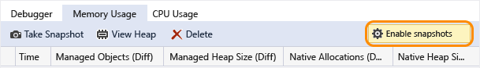
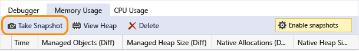
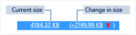
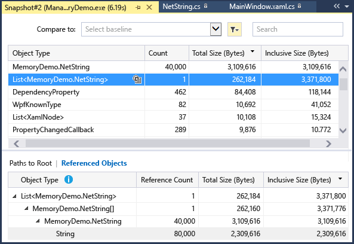
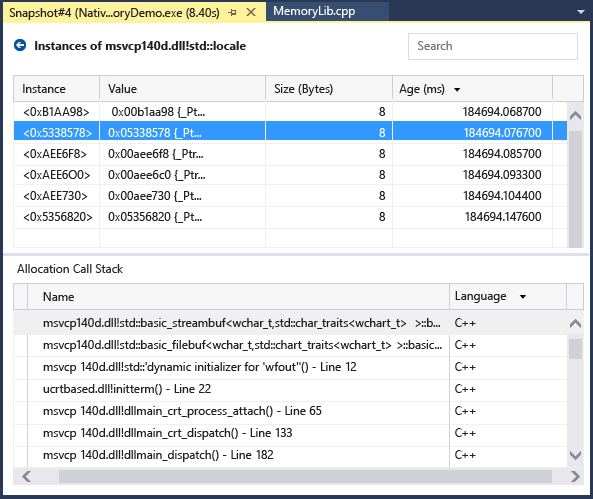
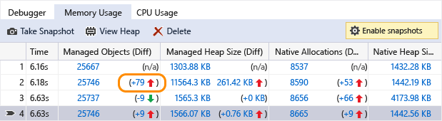
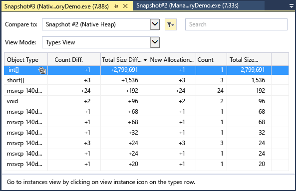

# Memory Usage
[!INCLUDE[vs2017banner](../includes/vs2017banner.md)]

Find memory leaks and inefficient memory while you’re debugging with the debugger-integrated **Memory Usage** diagnostic tool. The Memory Usage tool lets you take one or more *snapshots* of the managed and native memory heap. You can collect snapshots of .NET, native, or mixed mode (.NET and native) apps.  
  
- You can analyze a single snapshot to understand the relative impact of the object types on memory use, and to find code in your app that uses memory inefficiently.  
  
- You can also compare (diff) two snapshots of an app to find areas in your code that cause the memory use to increase over time.  
  
  The following graphic shows the **Diagnostic Tools** window in Visual Studio 2015 Update 1:  
  
    
  
  Although you can collect memory snapshots at any time in the **Memory Usage** tool, you can use the Visual Studio debugger to control how your application executes while investigating performance issues. Setting breakpoints, stepping, Break All, and other debugger actions can help you focus your performance investigations on the code paths that are most relevant. Performing those actions while your app is running can eliminates the noise from the code that doesn’t interest you and can significantly reduce the amount of time it takes you to diagnose an issue.  
  
  You can also use the memory tool outside of the debugger. See [Memory Usage without Debugging](https://msdn.microsoft.com/library/8883bc5f-df86-4f84-aa2b-a21150f499b0).  
  
> [!NOTE]
> **Custom Allocator Support** The native memory profiler works by collecting allocation [ETW](https://msdn.microsoft.com/library/windows/desktop/bb968803\(v=vs.85\).aspx) event data emitted by during runtime.  Allocators in the CRT and Windows SDK have been annotated at the source level so that their allocation data can be captured.  If you are writing your own allocators, than any functions that return a pointer to newly allocated heap memory can be decorated with [__declspec](https://msdn.microsoft.com/library/832db681-e8e1-41ca-b78c-cd9d265cdb87)(allocator), as seen in this example for myMalloc:  
>   
> `__declspec(allocator) void* myMalloc(size_t size)`  
  
## Analyze memory use with the debugger  
  
> [!NOTE]
> Because collecting memory data can affect the debugging performance of your native or mixed-mode apps, memory snapshots are disabled by default. To enable snapshots native or mixed-mode apps, start a debugging session (Shortcut key: **F5**). When the **Diagnostic Tools** window appears, choose the Memory Usage tab, and then choose **Enable snapshots**.  
>   
>   
>   
> Stop (Shortcut key: **Shift + F5**) and restart debugging.  
  
 Whenever you want to capture the state of memory, choose **Take snapshot** on the **Memory Usage** summary toolbar.  
  
   
  
> [!TIP]
> - To create a baseline for memory comparisons, consider taking a snapshot at the start of your debugging session.  
>   - Because it can be challenging to capture the memory profile of an operation that interests you when your app frequently allocates and de-allocates memory, set breakpoints at the start and end of the operation or step through the operation to find the exact point that memory changed.  
  
## Viewing memory snapshot details  
 The rows of Memory Usage summary table lists the snapshots that you have taken during the debugging session.  
  
 The columns of the row depend on the debugging mode you choose in the project properties: .NET, native, or mixed (both .NET and native).  
  
- The **Managed Object**s and **Native Allocations** columns display the number of objects in .NET and native memory when the snapshot was taken.  
  
- The **Managed Heap Size** and **Native Heap Size** columns display the number of bytes in the .NET and native heaps  
  
- When you have taken multiple snapshots, the cells of the summary table include the change in the value between the row snapshot and the previous snapshot.  
  
     
  
  **To view a detail report:**  
  
- To view details of only the selected snapshot choose the current link.  
  
- To view details of the difference between the current snapshot and the previous snapshot, choose the change link.  
  
  The report appears in a separate window.  
  
## Memory Usage details reports  
  
### Managed types reports  
 Choose the current link of a **Managed Objects** or **Managed Heap Size** cell in the Memory Usage summary table.  
  
   
  
 The top pane shows the count and size of the types in the snapshot, including the size of all objects that are referenced by the type (**Inclusive Size**).  
  
 The **Paths to Root** tree in the bottom pane displays the objects that reference the type selected in the upper pane. The .NET Framework garbage collector cleans up the memory for an object only when the last type that references it has been released.  
  
 The **Referenced Types** tree displays the references that are held by the type selected in the upper pane.  
  
   
  
 To display the instances of a selected type in the upper pane, choose the  icon.  
  
   
  
 The **Instances** view displays the instances of the selected object in the snapshot in the upper pane. The Paths to Root and Referenced Objects pane display the objects that reference the selected instance and the types that the selected instance references. When the debugger is stopped at the point where the snapshot was taken, you can hover over the Value cell to display the values of the object in a tool tip.  
  
### Native type reports  
 Choose the current link of a **Native Allocations** or **Native Heap Size** cell in the Memory Usage summary table of the **Diagnostic Tools** window.  
  
   
  
 The **Types View** displays the number and size of the types in the snapshot.  
  
- Choose the instances icon () of a selected type to display information about the objects of the selected type in the snapshot.  
  
     The **Instances** view displays each instance of the selected type. Selecting an instance displays the call stack that resulted in the creation of the instance in the **Allocation Call Stack** pane.  
  
       
  
- Choose **Stacks View** in the **View Mode** list to see the allocation stack for the selected type.  
  
       
  
### Change (Diff) reports  
  
- Choose the change link in a cell of the summary table of the **Memory Usage** tab on the **Diagnostic Tools** window.  
  
     
  
- Choose a snapshot in the **Compare To** list of a managed or native report.  
  
     
  
  The change report adds columns (marked with **(Diff)**) to the base report that show the difference between the base snapshot value and the comparison snapshot. Here’s how a Native Type View diff report might look:  
  
    
  
## Blogs and videos  
 [Diagnostic Tools debugger window in Visual Studio 2015](https://devblogs.microsoft.com/devops/diagnostic-tools-debugger-window-in-visual-studio-2015/)  
  
 [Blog: Memory Usage Tool while debugging in Visual Studio 2015](https://devblogs.microsoft.com/devops/memory-usage-tool-while-debugging-in-visual-studio-2015/)  
  
 [Visual C++ Blog: Native Memory Diagnostics in VS2015 Preview](https://devblogs.microsoft.com/cppblog/native-memory-diagnostics-in-vs2015-preview/)  
  
 [Visual C++ Blog: Native Memory Diagnostic Tools for Visual Studio 2015 CTP](https://devblogs.microsoft.com/cppblog/native-memory-diagnostic-tools-for-visual-studio-14-ctp/)
