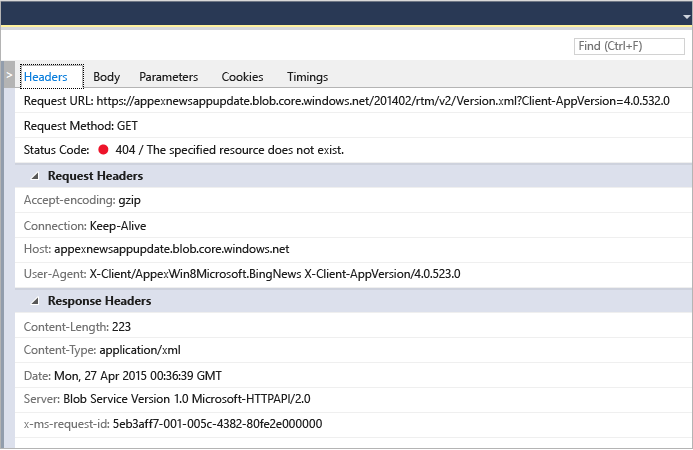

# Network Usage
[!INCLUDE[vs2017banner](../includes/vs2017banner.md)]

The Visual Studio **Network** diagnostics tool collects data about network operations performed using the [Windows.Web.Http API](https://msdn.microsoft.com/library/windows/apps/windows.web.http.aspx). Analyzing the data can help you resolve issues like access and authentication problems, incorrect cache-use, and poor display and download performance.  
  
 The Network tool supports only Windows Universal Platform apps. Other platforms are not supported at this time.  
  
> [!NOTE]
> For a more complete description of the Network tool, see [Introducing Visual Studio’s network tool](https://devblogs.microsoft.com/visualstudio/?m=20155).  
  
## Collecting network tool data  
 You should run the **Network** tool with an open Visual Studio project on the Visual Studio computer.  
  
1. Open the project in Visual Studio.  
  
2. On the  menu, click **Debug / Performance Profiler...**. Choose **Network**, and then choose **Start**.  
  
3. The network tool begins collecting your app’s HTTP traffic.  
  
    As you run your app, the summary view in the left pane automatically displays a list of captured HTTP operations. Select an item on the summary view to see more information in the details panel in the right pane.  
  
4. Choose **Stop** to close the app.  
  
   The report window should look something like this:  
  
     
  
## Analyzing data  
 You can analyze captured HTTP traffic while your app is running, or even after the app has been closed, by selecting any of the network operations displayed on the summary view.  
  
 The **Network** summary view shows data for each network operation in the run of your app. Choose a column header to sort the list, or choose the content types to display in the **Content Type** filter view.  
  
 Choose the **Save as HAR** to create a JSON file that can be consumed by third-party tools like Fiddler.  
  
 The **Network** details views displays more information about a network operation in the summary view.  
  
   
  
|||  
|-|-|  
|**Headers**|Information about the request headers of the event.|  
|**Body**|The request and response payload data.|  
|**Parameters**|The query string parameter names and values.|  
|**Cookies**|Response and request cookie data.|  
|**Timings**|A graph of stages in acquiring the selected resources.|  
  
 The Network **summary** bar shows the number of network operations that are displayed at any given point, how much data was transferred, how much time it took to download them, and how many errors (requests with 4xx or 5xx responses) are visible.  
  
### Analysis tips  
 This tool highlights certain areas that can be useful when you are running network related analysis:  
  
1. Requests that are fully served from the cache are shown as **(from cache)** in the **Received** column. This can help you determine whether you are using the cache effectively to save user bandwidth, or whether you are caching responses by mistake and providing the end-user of your application with outdated data.  
  
2. Error responses (4xx or 5xx) are displayed in the in the **Results** column with a red status code and are also highlighted in the summary bar. This makes it easy to spot errors among the many potential requests on your application.  
  
3. The response pretty printing button (inside the body tab) can help you parse through JSON, XML, HTML, CSS, JavaScript and TypeScript response payloads by increasing the readability of the content.  
  
## See Also  
 [Run profiling tools without debugging](https://msdn.microsoft.com/library/e97ce1a4-62d6-4b8e-a2f7-61576437ff01)   
 [Visual Studio blog: Introducing Visual Studio’s network inspector](https://go.microsoft.com/fwlink/?LinkId=535022)   
 [Channel 9 Video: VS Diagnostics tools – New Network Profiler](https://channel9.msdn.com/Series/ConnectOn-Demand/206)
