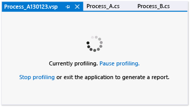

# Setting General Performance Session Options
[!INCLUDE[vs2017banner](../includes/vs2017banner.md)]

You can set the collection method and profiling data naming conventions for a [!INCLUDE[vsprvs](../includes/vsprvs-md.md)] Profiling Tools performance session on the **General** page of the properties dialog box for the performance session. To open this dialog box from **Performance Explorer**, right-click the performance session, and then click **Properties**.  
  
 **Requirements**  
  
- [!INCLUDE[vsUltLong](../includes/vsultlong-md.md)], [!INCLUDE[vsPreLong](../includes/vsprelong-md.md)], [!INCLUDE[vsPro](../includes/vspro-md.md)]  
  
## Choosing Data Collection Methods  
 You set the base collection method by selecting one of the options under **Profiling collection**. The options are described following in the following table:  
  
|||  
|-|-|  
|**Sampling**. The sampling method collects profiling information at regular intervals. This method is useful for finding processor utilization issues and is the suggested method for starting most performance investigations.|-   [Collecting Performance Statistics by Using Sampling](../profiling/collecting-performance-statistics-by-using-sampling.md)|  
|**Instrumentation**. The instrumentation method injects into a copy of a module profiling code that records each entry, exit, and function call of the functions in the module during a profiling run. This method is useful for gathering detailed timing information about a section of your code and for understanding the impact of input and output operations on application performance.|-   [Collecting Detailed Timing Data by Using Instrumentation](../profiling/collecting-detailed-timing-data-by-using-instrumentation.md)|  
|**Concurrency**. The concurrency method collects data for each event that blocks execution of your code, such as when a thread waits for locked access to an application resource to be freed. This method is useful for analyzing multi-threaded applications.|-   [Collecting Thread and Process Concurrency Data](../profiling/collecting-thread-and-process-concurrency-data.md)|  
  
 You can collect .NET memory data by using the sampling or instrumentation methods. You select the type of data under **.NET memory profiling**.  
  
|||  
|-|-|  
|**Collect .NET object allocation information**. By default, data includes the number and size of allocated objects. Select or clear this check box to enable or disable .NET memory data collection.   **Also collect .NET object lifetime information**. Select this check box to include data about the garbage collection generations that were used to reclaim the memory objects.|-   [Collecting .NET Memory Allocation and Lifetime Data](../profiling/collecting-dotnet-memory-allocation-and-lifetime-data.md)|  
  
 A profiling session page appears when you start to profile an application, where you can pause, resume, and stop profiling.  
  
   
  
## Setting Profiling Datra File Options  
  
|||  
|-|-|  
|**Report**. By default, the profiling data (.vsp) file is given the name of the profiled application and is located in the solution or project folder. A date string is also appended to the name, and an incremented number is added to data files that otherwise would have duplicate names. You can change these options.|-   [How to: Set Performance Data File Name Options](../profiling/how-to-set-performance-data-file-name-options.md)|
