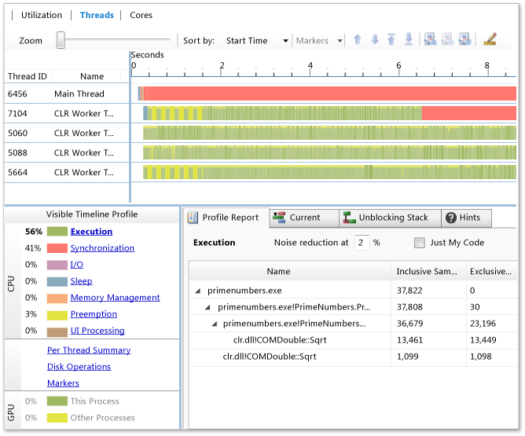

# Threads View (Parallel Performance)
[!INCLUDE[vs2017banner](../includes/vs2017banner.md)]

Threads View is the most detailed and feature-rich view in the Concurrency Visualizer. By using this view, you can identify whether the threads are executing or blocking because of synchronization, I/O, or some other reason.  
  
 During profile analysis, the Concurrency Visualizer examines all operating system context-switch events for each application thread. Context switches can occur for many reasons, such as these:  
  
- A thread is blocked on a synchronization primitive.  
  
- The quantum of a thread expires.  
  
- A thread makes a blocking I/O request.  
  
  Threads View assigns a category to each context switch when a thread has stopped executing. The categories are shown in the legend in the lower-left part of the view. The Concurrency Visualizer categorizes context-switch events by searching the call stack of the thread for well-known blocking APIs. If there is no call stack match, the wait reason that's provided by [!INCLUDE[TLA#tla_mswin](../includes/tlasharptla-mswin-md.md)] is used. However, the [!INCLUDE[TLA#tla_mswin](../includes/tlasharptla-mswin-md.md)] category may be based on an implementation detail and may not reflect the intent of the user. For example, [!INCLUDE[TLA#tla_mswin](../includes/tlasharptla-mswin-md.md)] reports the wait reason for blocking on a native slim reader-writer lock as I/O instead of synchronization. In most cases, you can identify the root cause of a blocking event by examining the call stacks that correspond to context-switch events.  
  
  The Threads View also shows dependencies between threads. For example, if you identify a thread that's blocked on a synchronization object, you can look for the thread that unblocked it, and you can examine the activity on the call stack for that thread at the point when it unblocked the other one.  
  
  When threads are executing, the Concurrency Visualizer collects samples. In the Threads View, you can analyze which code is executed by one or more threads during an execution segment. You can also examine blocking reports, and reports that profile call-stack tree execution.  
  
## Usage  
 Here are some ways that you can use the Threads View:  
  
- Identify reasons why the user interface (UI) of an app is unresponsive during certain execution phases.  
  
- Identify the amount of time that's spent blocking on synchronization, I/O, page faults, and other events.  
  
- Identify the degree of interference from other processes that are executing on the system.  
  
- Identify load-balancing issues for parallel execution.  
  
- Identify the reasons for scalability that is suboptimal or nonexistent (for example, why the performance of a parallel app does not improve when more logical cores are available).  
  
- Understand the degree of concurrency in the app, to help in parallelization.  
  
- Understand dependencies among worker threads and critical paths of execution.  
  
## Examining Specific Time Intervals and Threads  
 The Threads View shows a timeline. You can zoom and pan within the timeline to examine specific intervals and threads of your application. On the x-axis is time and on the y-axis are several channels:  
  
- Two I/O channels for each disk drive on the system, one channel for reads and one for writes.  
  
- A channel for each thread in the process.  
  
- Marker channels, if there are marker events in the trace. Marker channels initially appear under the thread channels that generated those events.  
  
- GPU channels.  
  
  Here's an illustration of the Threads View:  
  
    
  Threads View  
  
  Initially, the threads are sorted in the order in which they are created, so that the main application thread is first. You can use the sort option in the upper-left corner of the view to sort threads by another criterion (for example, by most execution work performed).  
  
  You can hide threads that are not performing work by selecting their names in the column at the left and then choosing the **Hide Selected Threads** button on the toolbar. We recommend that you hide threads that are completely blocked because their statistics are irrelevant and can clog the reports.  
  
  To identify additional threads to hide, in the active legend, choose the **Per Thread Summary** report on the **Profile Report** tab. This displays the Execution Breakdown graph, which shows the state of threads for the currently selected time interval. At some zoom levels, some threads might not be displayed. When this occurs, ellipses are displayed at the right.  
  
  When you have selected an interval of time and some threads in it, you can start your performance analysis.  
  
## Analysis Tools  
 This section describes reports and other analysis tools.  
  
### Thread-Blocking Details  
 To get information about a blocking event in a particular region on a thread, rest the pointer on that region to display a tooltip. It contains information such as category, region start time, blocking duration, and a blocking API if there is one. If you select the blocking region, the stack at that point in time is displayed in the bottom pane, together with the same information that's displayed in the tooltip. By examining the call stack, you can determine the underlying reason for the thread-blocking event. You can find additional process and thread information by selecting the segment and examining the Current tab.  
  
 A path of execution may have multiple blocking events. You can examine these by blocking category so that you can find problem areas more quickly. Just choose one of the blocking categories in the legend on the left.  
  
### Dependencies Between Threads  
 The Concurrency Visualizer can show dependencies between threads in your process so that you can determine what a blocked thread was trying to do and learn what other thread enabled it to execute. To determine which thread unblocked another thread, select the relevant blocking segment. If the Concurrency Visualizer can determine the unblocking thread, it draws a line between the unblocking thread and the executing segment that follows the blocking segment. In addition, the **Unblocking stack** tab shows the relevant call stack.  
  
### Thread Execution Details  
 In the timeline graph of a thread, the green segments show when it was executing code. You can get more detailed information about an execution segment.  
  
 When you select a point in an execution segment, the Concurrency Visualizer looks for that point in time on the relevant call stack and then displays a black caret above the selected point in the execution segment and displays the call stack itself on the **Current stack** tab. You can select multiple points on the execution segment.  
  
> [!NOTE]
> The Concurrency Visualizer might not be able to resolve a selection on an execution segment. Typically, this occurs when the duration of the segment is less than one millisecond.  
  
 To get an execution profile for all enabled (unhidden) threads in the currently selected time range, choose the **Execution** button in the active legend.  
  
### Timeline Graph  
 The timeline graph shows the activity of all threads in the process and all physical disk devices on the host computer. It also displays GPU activity and marker events.  You can zoom in to view more detail or out to view a longer interval of time. You can also select points on the graph to get details about categories, start times, durations, and call stack states.  
  
 In the timeline graph, a color indicates the state of a thread at a given time. For example, green segments were executing, red segments were blocked for synchronization, yellow segments were preempted, and purple segments were engaged in device I/O. You can use this view to examine the balance of work among threads that are involved in a parallel loop or in concurrent tasks. If a thread is taking longer to complete than the others, the work might be unbalanced. You can use this information to improve the performance of your program by distributing work more evenly among the threads.  
  
 If only one thread is green (executing) at a point in time, the app may not be taking full advantage of the concurrency on the system. You can use the timeline graph to examine dependencies between threads and the temporal relationships between blocking and blocked threads. To rearrange threads, select a thread and then on the toolbar, choose the up or down button. To hide threads, select them and then choose the **Hide Threads** button.  
  
### Profile Reports  
 Below the timeline graph is a timeline profile and a pane that has tabs for various reports. The reports automatically update as you change the Threads View. For large traces, the reports pane might be unavailable while the updates are calculated. Each report has two filter adjustments: noise reduction and Just My Code. Use noise reduction to filter out call tree entries where little time is spent. The default filter value is 2 percent, but you can adjust it from 0 percent to 99 percent. To view only the call tree for your code, select the **Just My Code** check box. To view all call trees, clear it.  
  
#### Profile Report  
 This tab shows reports that correspond to the entries in the active legend. To display a report, choose one of the entries.  
  
#### Current Stack  
 This tab shows the call stack for a selected point on a thread segment in the timeline graph. The call stacks are trimmed to show only activity that is related to your program.  
  
#### Unblocking Stack  
 To see which thread unblocked the selected thread, and at what line of code, choose the **Unblocking stack** tab.  
  
#### Execution  
 The Execution Report shows the breakdown of the time the application spent in execution.  
  
 To find the line of code in which execution time is spent, expand the call tree and then, on the shortcut menu for the call tree entry, choose **View Source** or **View Call Sites**. **View Source** locates the executed line of code. **View Call Sites** locates the line of code that called the executed line of code. If only one call site exists, its line of code is highlighted. If multiple call sites exist, you can select the one you want in the dialog box that appears and then choose the **Go to source** button to highlight the call site code. It's often most useful to locate the call site that has the most instances, the most time, or both. For more information, see [Execution Profile Report](../profiling/execution-profile-report.md).  
  
#### Synchronization  
 The synchronization report shows the calls that are responsible for synchronization blocks, together with the aggregate blocking times of each call stack. For more information, see [Synchronization Time](../profiling/synchronization-time.md).  
  
#### I/O  
 The I/O report shows the calls that are responsible for I/O blocks, together with the aggregate blocking times of each call stack. For more information, see [I/O Time (Threads View)](../profiling/i-o-time-threads-view.md).  
  
#### Sleep  
 The sleep report shows the calls that are responsible for sleep blocks, together with the aggregate blocking times of each call stack. For more information, see [Sleep Time](../profiling/sleep-time.md).  
  
#### Memory Management  
 The memory management report shows the calls where memory management blocks occurred, together with the aggregate blocking times of each call stack. You can use this information to identify areas that have excessive paging or garbage collection issues.  For more information, see [Memory Management Time](../profiling/memory-management-time.md).  
  
#### Preemption  
 The Preemption report shows the instances where processes on the system preempted the current process and the individual threads that replaced threads in the current process. You can use this information to identify the processes and threads that are most responsible for preemption. For more information, see [Preemption Time](../profiling/preemption-time.md).  
  
#### UI Processing  
 The UI processing report shows the calls that are responsible for UI processing blocks, together with the aggregate blocking times of each call stack. For more information, see [UI Processing Time](../profiling/ui-processing-time.md).  
  
#### Per Thread Summary  
 This tab shows a color-coded column view of the total time that each thread spent in the run, blocked, I/O and other states. The columns are labeled at the bottom. When you adjust the zoom level in the timeline graph, this tab is automatically updated. At some zoom levels, some threads might not be displayed. When this occurs, ellipses are displayed at the right. If the thread you want does not appear, you can hide other threads. For more information, see [Per Thread Summary Report](../profiling/per-thread-summary-report.md).  
  
#### Disk Operations  
 This tab shows which processes and threads were involved in disk I/O on behalf of the current process, which files they touched (for example, DLLs that were loaded), how many bytes were read, and other information. You can use this report to evaluate time that is spent in accessing files during execution, especially when your process seems to be I/O bound. For more information, see [Disk Operations Report](../profiling/disk-operations-report-threads-view.md).  
  
## See Also  
 [Concurrency Visualizer](../profiling/concurrency-visualizer.md)
