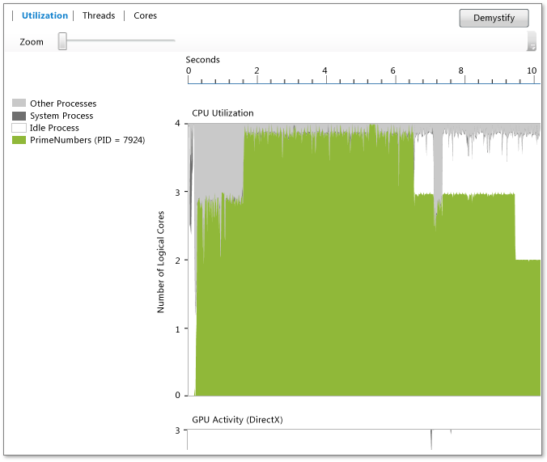

# Utilization View
[!INCLUDE[vs2017banner](../includes/vs2017banner.md)]

The **Utilization View** displays information about the CPU, GPU, and other system resources that are used by the current process. It shows the average core utilization by the analyzed process, the Idle process, the System process, and other processes that are running on the system over time. It doesn't show which specific core is active at any given time. For example, if two cores are each running at 50 percent capacity for a given time period, then this view shows one logical core being utilized. The view is generated by dividing the profiling time into short time segments. For each segment, the graph plots the average number of process threads that are executing on logical cores during that interval.  
  
   
  
 The graph shows time (on the x-axis) and the average logical cores that are utilized by the target process, the Idle process, and the System process. (The Idle process shows idle cores. The System process is a process in Windows that can perform work on behalf of other processes.) The remaining processes that are running on the system account for the utilization of any remaining cores.  
  
 The number of logical cores is shown on the y-axis. Windows treats simultaneous multithreading support in hardware as logical cores (for example, Hyper-Threading). Therefore, a system that has a quad-core processor that's supporting two hardware threads per core appears as an eight-logical-core system. This also applies to the Cores View. For more information, see [Cores View](../profiling/cores-view.md).  
  
 The GPU Activity chart shows the number of DirectX engines in use over time.  An engine is in use if it's processing a DMA packet.  The chart doesn't show specific DirectX engine (for example, 3D Engine, Video Engine, and the others).  
  
## Purpose  
 We recommend the Utilization View as the starting point for performance investigations when you use the Concurrency Visualizer. Because it provides an overview of the degree of concurrency in an app over time, you can use it to quickly identify areas that require performance tuning or parallelization.  
  
 If you're interested in performance tuning, you might be trying to identify behavior that doesn't meet your expectations. You may also be looking for the existence and cause of regions that have low utilization of logical CPU cores. You might also be looking for patterns of usage between the CPU and the GPU.  
  
 If you're interested in parallelizing an app, you're probably looking for either CPU-bound areas of execution or areas where you are not utilizing the CPU.  
  
 CPU-bound areas are green. The graph shows one core being utilized if the app is serial.  
  
 Areas where you are not utilizing the CPU are gray. These might represent points at which the app is idle or performing blocking I/O that provide opportunities for parallelism by overlapping with other CPU-bound work.  
  
 When you find a behavior of interest, you can zoom in on that region by selecting it. After you zoom, you can switch to the Threads View or the Cores View for more detailed analysis.  
  
 If you're using the GPU by using C++ AMP or DirectX, you might be interested in identifying the number of GPU engines in use or areas where the GPU is unexpectedly idle.  
  
## Zooming  
 To zoom in on the CPU Utilization graph or the GPU Activity graph, select a section or use the zoom slider tool above the graph. The zoom setting persists as you switch to other views. To zoom out again, use the zoom slider tool. You can also zoom by using Ctrl+scroll.  
  
## See Also  
 [Concurrency Visualizer](../profiling/concurrency-visualizer.md)   
 [Cores View](../profiling/cores-view.md)
