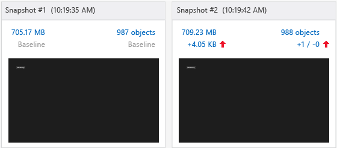
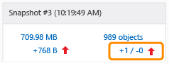
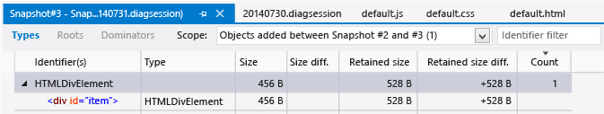
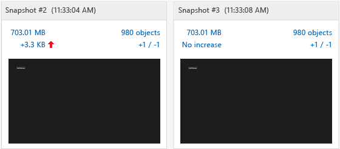

# Walkthrough: Find a memory leak (JavaScript)
[!INCLUDE[vs2017banner](../includes/vs2017banner.md)]

Applies to Windows and Windows Phone](../Image/windows_and_phone_content.png "windows_and_phone_content")  
  
 This walkthrough leads you through the process of identifying and fixing a simple memory issue by using the JavaScript memory analyzer. The JavaScript memory analyzer is available in Visual Studio for Windows Store apps built for Windows using JavaScript. In this scenario, you create an app that incorrectly retains DOM elements in memory instead of disposing of elements at the same rate in which they are created.  
  
 Although the cause of the memory leak in this app is very specific, the steps shown here demonstrate a workflow that is typically effective in isolating objects that are leaking memory.  
  
### Running the JavaScript memory analyzer test app  
  
1. In Visual Studio, choose **File**, **New**, **Project**.  
  
2. Choose **JavaScript** in the left pane, and then choose **Windows**, **Windows 8**, then either **Universal** or **Windows Phone Apps**.  
  
    > [!IMPORTANT]
    > The memory usage results shown in this topic are tested against a Windows 8 app.  
  
3. Choose the **Blank App** project template in the middle pane.  
  
4. In the **Name** box, specify a name such as `JS_Mem_Tester`, and then choose **OK**.  
  
5. In **Solution Explorer**, open default.html and paste the following code between the \<body> tags:  
  
    ```html  
    <div class="wrapper">  
        <div id="item"></div>  
        <button class="memleak" style="display: block" >Leak Memory</button>  
    </div>  
    ```  
  
    > [!IMPORTANT]
    > If you are using a Windows 8.1 universal app template, you need to update HTML and CSS code in both the .Windows and the .WindowsPhone projects.  
  
6. Open default.css and add the following CSS code:  
  
    ```css  
    .memleak {  
        position: absolute; top: 100px; left: 100px;  
    }  
    ```  
  
7. Open default.js and replace all the code with this code:  
  
    ```javascript  
    (function () {  
        "use strict";  
  
        var app = WinJS.Application;  
        var activation = Windows.ApplicationModel.Activation;  
  
        var wrapper;  
        var elem;  
  
        app.onactivated = function (args) {  
            if (args.detail.kind === activation.ActivationKind.launch) {  
                if (args.detail.previousExecutionState !== activation.ApplicationExecutionState.terminated) {  
                } else {  
                }  
                args.setPromise(WinJS.UI.processAll());  
  
                elem = document.getElementById("item");  
                wrapper = document.querySelector(".wrapper");  
                var btn = document.querySelector(".memleak");  
                btn.addEventListener("click", btnHandler);  
                run();  
            }  
        };  
  
        app.oncheckpoint = function (args) {  
        };  
  
        app.start();  
  
        function run() {  
            initialize();  
            load();  
        }  
  
        function initialize() {  
  
            if (wrapper != null) {  
                elem.removeNode(true);  
            }  
        }  
  
        function load() {  
  
            var newDiv = document.createElement("div");  
  
            newDiv.style.zIndex = "-1";  
            newDiv.id = "item";  
  
            wrapper.appendChild(newDiv);  
        }  
  
        function btnHandler(args) {  
            run();  
        }  
  
    })();  
    ```  
  
8. Choose the F5 key to start debugging. Verify that the **Leak Memory** button appears on the page.  
  
9. Switch back to Visual Studio (Alt+Tab), and then choose Shift+F5 to stop debugging.  
  
     Now that you've verified that the app works, you can examine the memory usage.  
  
### Analyzing the memory usage  
  
1. On the **Debug** toolbar, in the **Start Debugging** list, choose the debug target for the updated project: either one of the Windows Phone Emulators or **Simulator**.  
  
   > [!TIP]
   > For a Windows Store app, you can also choose **Local Machine** or **Remote Machine** in this list. However, the advantage of using the emulator or the simulator is that you can place it next to Visual Studio and easily switch between the running app and the JavaScript memory analyzer. For more info, see [Run apps from Visual Studio](../debugger/run-store-apps-from-visual-studio.md) and [Run Windows Store apps on a remote machine](../debugger/run-windows-store-apps-on-a-remote-machine.md).  
  
2. On the **Debug** menu, choose **Performance Profiler...**.  
  
3. In **Available Tools**, choose **JavaScript Memory**, and then choose **Start**.  
  
    In this tutorial, you'll be attaching the memory analyzer to the startup project. For info about other options, like attaching the memory analyzer to an installed app, see [JavaScript Memory](../profiling/javascript-memory.md).  
  
    When you start the memory analyzer, you might see a User Account Control requesting your permission to run VsEtwCollector.exe. Choose **Yes**.  
  
4. Choose the **Leak Memory** button four times in succession.  
  
    When you choose the button, the event handling code in default.js does work that will result in a memory leak. You'll use this for diagnostic purposes.  
  
   > [!TIP]
   > Repeating the scenario that you want to test for a memory leak makes it easier to filter out uninteresting info, such as objects that are added to the heap during app initialization or when loading a page.  
  
5. From the running app, switch to Visual Studio (Alt+Tab).  
  
    The JavaScript memory analyzer displays information in a new tab in Visual Studio.  
  
    The memory graph in this summary view shows process memory usage over time. The view also provides commands like **Take heap snapshot**. A snapshot provides detailed information about memory usage at a particular time. For more info, see [JavaScript Memory](../profiling/javascript-memory.md).  
  
6. Choose **Take heap snapshot**.  
  
7. Switch to the app and choose **Leak Memory**.  
  
8. Switch to Visual Studio and choose **Take heap snapshot** again.  
  
    This illustration shows the baseline snapshot (#1) and Snapshot #2.  
  
      
  
   > [!NOTE]
   > The Windows Phone Emulator does not show a screenshot of the app at the time the snapshot was taken.  
  
9. Switch to the app and choose the **Leak Memory** button again.  
  
10. Switch to Visual Studio and choose **Take heap snapshot** for the third time.  
  
    > [!TIP]
    > By taking a third snapshot in this workflow, you can filter out changes from the baseline snapshot to the second snapshot that aren't associated with memory leaks. For example, there may be expected changes such as updating headers and footers on a page, which will generate some changes in memory usage but may be unrelated to memory leaks.  
  
     This illustration shows Snapshot #2 and Snapshot #3.  
  
       
  
11. In Visual Studio, choose **Stop** to stop profiling.  
  
12. In Visual Studio, compare the snapshots. Snapshot #2 shows the following:  
  
    - The heap size (shown by the red up arrow on the left) has increased by several KB compared to Snapshot #1.  
  
      > [!IMPORTANT]
      > Exact memory usage values for the heap size depend on the debug target.  
  
    - The number of objects on the heap (shown by the red up arrow on the right) has increased compared to Snapshot #1. One object has been added (+1) and no objects have been removed (-0).  
  
      Snapshot #3 shows the following:  
  
    - The heap size has increased again by several hundred bytes compared to Snapshot #2.  
  
    - The number of objects on the heap has increased again compared to Snapshot #2. One object has been added (+1) and no objects have been removed (-0).  
  
13. In Snapshot #3, choose the link text on the right, which shows a value of +1 / -0 next to the red up arrow.  
  
       
  
     This opens a differential view of the objects on the heap, called **Snapshot #3 - Snapshot #2**, with the Types view showing by default. By default, you see a list of objects added to the heap between Snapshot #2 and Snapshot #3.  
  
14. In the **Scope** filter, choose **Objects left over from Snapshot #2**.  
  
15. Open the HTMLDivElement object at the top of the object tree as shown here.  
  
       
  
     This view shows helpful information about the memory leak, such as the following:  
  
    - This view shows a DIV element with an ID of `item`, and the retained size for the object is several hundred bytes (exact value will vary).  
  
    - This object is a leftover object from Snapshot #2 and represents a potential memory leak.  
  
      Some knowledge of the app helps at this point: Choosing the **Leak Memory** button should remove a DIV element and add an element, so the code doesn't seem to be working right (that is, it leaks memory). The next section explains how to fix that.  
  
    > [!TIP]
    > Sometimes, locating an object in relation to the `Global` object may help identify that object. To do this, open the shortcut menu for the identifier, and then choose **Show in roots view**.  
  
## <a name="FixingMemory"></a> Fixing the memory issue  
  
1. Using data revealed by the profiler, you examine code that is responsible for removing DOM elements with an ID of "item". That occurs in the `initialize()` function.  
  
   ```javascript  
   function initialize() {  
  
       if (wrapper != null) {  
           elem.removeNode(true);  
       }  
   }  
   ```  
  
    `elem.removeNode(true)` is, perhaps, not working correctly. You examine how the code is caching the DOM element and find an issue; the reference to the cached element is not getting updated.  
  
2. In default.js, add the following line of code to the load function, just before calling `appendChild`:  
  
   ```javascript  
   elem = newDiv;  
   ```  
  
    This code updates the reference to the cached element so that the element is correctly removed when you choose the **Leak Memory** button. The complete code for the load function now looks like this:  
  
   ```javascript  
   function load() {  
  
       wrapper = document.querySelector(".wrapper");  
  
       var newDiv = document.createElement("div");  
  
       newDiv.style.zIndex = "-1";  
       newDiv.id = "item";  
       elem = newDiv;  
  
       wrapper.appendChild(newDiv);  
   }  
   ```  
  
3. On the **Debug** menu, choose **Performance and Diagnostics**.  
  
4. In **Available Tools**, choose **JavaScript Memory**, and then choose **Start**.  
  
5. Follow the same procedure as before to take three snapshots. The steps are summarized here:  
  
   1. In the app, choose the **Leak Memory** button four times in succession.  
  
   2. Switch to Visual Studio and choose **Take heap snapshot** for the baseline snapshot.  
  
   3. In the app, choose the **Leak Memory** button.  
  
   4. Switch to Visual Studio and choose **Take heap snapshot** for the second snapshot.  
  
   5. In the app, choose the **Leak Memory** button.  
  
   6. Switch to Visual Studio and choose **Take heap snapshot** for the third snapshot.  
  
      Snapshot #3 now shows the heap size as **No increase** from Snapshot #2, and the object count as +1 / -1, which indicates that one objects has been added and one object has been removed. This is the desired behavior.  
  
      The following illustration shows Snapshot #2 and Snapshot #3.  
  
        
  
## See Also  
 [JavaScript Memory](../profiling/javascript-memory.md)
