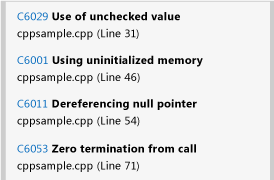
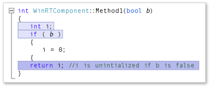

# Analyze C++ code quality of Store apps using Visual Studio static code analysis
[!INCLUDE[vs2017banner](../includes/vs2017banner.md)]

Applies to Windows and Windows Phone](../Image/windows_and_phone_content.png "windows_and_phone_content")

 The code analysis tool in Visual Studio express editions examines your code for a set of common problems and violations of good programming practice. Code analysis warnings differ from compiler errors and warnings because code analysis searches for specific code patterns that are valid but could still create issues for you or other people who use your code. Code analysis can also find defects in your code that are difficult to discover through testing. Running the code analysis tool at regular intervals during your development process can enhance the quality of your completed app.

> [!NOTE]
> In Visual Studio Ultimate, Visual Studio Premium, and Visual Studio Professional, you can use the full functionality of code analysis tools. See [Analyzing Application Quality by Using Code Analysis Tools](https://msdn.microsoft.com/library/dd264897.aspx) in the MSDN Library.

##  Running code analysis
 To run code analysis on your Visual Studio solution:

- On the **Build** menu, choose **Run Code Analysis on Solution**.

  To automatically run code analysis each time you build a project:

1. Choose the project name in Solution Explorer and then choose **Properties**.

2. In the project property page, choose **Code Analysis** and then choose **Enable Code Analysis for C/C++ on Build**.

   The solution is compiled and code analysis runs. Results appear in the Code Analysis window.

   

##  Analyzing and resolving code analysis warnings
 To analyze a specific warning, choose the title of the warning in the Code Analysis window. The warning expands to display detailed information about the issue. When possible, code analysis displays the line number and analysis logic that led to the warning.

 

 When you expand a warning, the lines of code that caused the warning are highlighted in the Visual Studio code editor.

 

 After you understand the problem, you can resolve it in your code. Then rerun code analysis to make sure that the warning no longer appears in the Code Analysis window, and that your fix has not raised new warnings.

> [!TIP]
> You can rerun code analysis from the Code Analysis window. Choose the **Analyze** button and then choose the scope of the analysis. You can rerun analysis on the entire solution or on a selected project.

##  Suppressing code analysis warnings
 There are times when you might decide not to fix a code analysis warning. You might decide that resolving the warning requires too much recoding in relation to the probability that the issue will arise in any real-world implementation of your code. Or you might believe that the analysis that is used in the warning is inappropriate for the particular context. You can suppress individual warnings so that they no longer appear in the Code Analysis window.

 To suppress a warning:

1. If the detailed information is not displayed, expand the title of the warning.

2. Choose the **Actions** link at the bottom of the warning.

3. Choose to **Suppress Message** and then choose **In Source**.

   Suppressing a message inserts `#pragma(warning:`*WarningId*`)` that suppresses the warning for the line of code.

##  Searching and filtering code analysis results
 You can search long lists of warning messages and you can filter warnings in multi-project solutions.

 

##  C++ code analysis warnings
 Code analysis raises the following warnings for C++ code:

|                                      Rule                                      |                                                  Description                                                  |
|--------------------------------------------------------------------------------|---------------------------------------------------------------------------------------------------------------|
|                       [C6001](../code-quality/c6001.md)                        |                                          Using Uninitialized Memory                                           |
|                       [C6011](../code-quality/c6011.md)                        |                                          Dereferencing Null Pointer                                           |
|                       [C6029](../code-quality/c6029.md)                        |                                            Use Of Unchecked Value                                             |
|                       [C6053](../code-quality/c6053.md)                        |                                          Zero Termination From Call                                           |
|                       [C6059](../code-quality/c6059.md)                        |                                               Bad Concatenation                                               |
|                       [C6063](../code-quality/c6063.md)                        |                                  Missing String Argument To Format Function                                   |
|                       [C6064](../code-quality/c6064.md)                        |                                  Missing Integer Argument To Format Function                                  |
|                       [C6066](../code-quality/c6066.md)                        |                                  Missing Pointer Argument To Format Function                                  |
|                       [C6067](../code-quality/c6067.md)                        |                              Missing String Pointer Argument To Format Function                               |
|                       [C6101](../code-quality/c6101.md)                        |                                        Returning uninitialized memory                                         |
|                       [C6200](../code-quality/c6200.md)                        |                                         Index Exceeds Buffer Maximum                                          |
|                       [C6201](../code-quality/c6201.md)                        |                                      Index Exceeds Stack Buffer Maximum                                       |
|                       [C6270](../code-quality/c6270.md)                        |                                   Missing Float Argument To Format Function                                   |
|                       [C6271](../code-quality/c6271.md)                        |                                       Extra Argument To Format Function                                       |
|                       [C6272](../code-quality/c6272.md)                        |                                     Non-Float Argument To Format Function                                     |
|                       [C6273](../code-quality/c6273.md)                        |                                    Non-Integer Argument To Format Function                                     |
|                       [C6274](../code-quality/c6274.md)                        |                                   Non-Character Argument To Format Function                                   |
|                       [C6276](../code-quality/c6276.md)                        |                                              Invalid String Cast                                              |
|                       [C6277](../code-quality/c6277.md)                        |                                          Invalid CreateProcess Call                                           |
|                       [C6284](../code-quality/c6284.md)                        |                                  Invalid Object Argument To Format Function                                   |
|                       [C6290](../code-quality/c6290.md)                        |                                      Logical-Not Bitwise-And Precedence                                       |
|                       [C6291](../code-quality/c6291.md)                        |                                       Logical-Not Bitwise-Or Precedence                                       |
|                       [C6302](../code-quality/c6302.md)                        |                             Invalid Character String Argument To Format Function                              |
|                       [C6303](../code-quality/c6303.md)                        |                           Invalid Wide Character String Argument To Format Function                           |
|                       [C6305](../code-quality/c6305.md)                        |                                         Mismatched Size And Count Use                                         |
|                       [C6306](../code-quality/c6306.md)                        |                                   Incorrect Variable Argument Function Call                                   |
|                       [C6328](../code-quality/c6328.md)                        |                                       Potential Argument Type Mismatch                                        |
|                       [C6385](../code-quality/c6385.md)                        |                                                 Read Overrun                                                  |
|                       [C6386](../code-quality/c6386.md)                        |                                                 Write Overrun                                                 |
|                       [C6387](../code-quality/c6387.md)                        |                                            Invalid Parameter Value                                            |
|                       [C6500](../code-quality/c6500.md)                        |                                          Invalid Attribute Property                                           |
|                       [C6501](../code-quality/c6501.md)                        |                                     Conflicting Attribute Property Values                                     |
|                       [C6503](../code-quality/c6503.md)                        |                                           References Cannot Be Null                                           |
|                       [C6504](../code-quality/c6504.md)                        |                                              Null On Non-Pointer                                              |
|                       [C6505](../code-quality/c6505.md)                        |                                               MustCheck On Void                                               |
|                       [C6506](../code-quality/c6506.md)                        |                                      Buffer Size On Non-Pointer Or Array                                      |
| [C6507](https://msdn.microsoft.com/18f88cd1-d035-4403-a6a4-12dd0affcf21)        |                                       Null Mismatch At Dereference Zero                                       |
|                       [C6508](../code-quality/c6508.md)                        |                                           Write Access On Constant                                            |
|                       [C6509](../code-quality/c6509.md)                        |                                          Return Used On Precondition                                          |
|                       [C6510](../code-quality/c6510.md)                        |                                        Null Terminated On Non-Pointer                                         |
|                       [C6511](../code-quality/c6511.md)                        |                                          MustCheck Must Be Yes Or No                                          |
|                       [C6513](../code-quality/c6513.md)                        |                                       Element Size Without Buffer Size                                        |
|                       [C6514](../code-quality/c6514.md)                        |                                        Buffer Size Exceeds Array Size                                         |
|                       [C6515](../code-quality/c6515.md)                        |                                          Buffer Size On Non-Pointer                                           |
|                       [C6516](../code-quality/c6516.md)                        |                                          No Properties On Attribute                                           |
|                       [C6517](../code-quality/c6517.md)                        |                                       Valid Size On Non-Readable Buffer                                       |
|                       [C6518](../code-quality/c6518.md)                        |                                     Writable Size On Non-Writable Buffer                                      |
| [C6521](https://msdn.microsoft.com/e98d0ae3-6f13-47b2-9a15-15d4055af9ef)  |                                        Invalid Size String Dereference                                        |
|                       [C6522](../code-quality/c6522.md)                        |                                           Invalid Size String Type                                            |
| [C6523](https://msdn.microsoft.com/11397a31-b224-46b0-afb7-d49ca576a3bb)  |                                         Invalid Size String Parameter                                         |
|                       [C6525](../code-quality/c6525.md)                        |                                   Invalid Size String Unreachable Location                                    |
| [C6526](https://msdn.microsoft.com/59c590c7-0098-4166-a1ac-87f324596002)  |                                        Invalid Size String Buffer Type                                        |
|                       [C6527](../code-quality/c6527.md)                        |              Invalid annotation: 'NeedsRelease' property may not be used on values of void type               |
|                       [C6530](../code-quality/c6530.md)                        |                                       Unrecognized Format String Style                                        |
|                       [C6540](../code-quality/c6540.md)                        | The use of attribute annotations on this function will invalidate all of its existing __declspec annotations  |
|                       [C6551](../code-quality/c6551.md)                        |                              Invalid size specification: expression not parsable                              |
|                       [C6552](../code-quality/c6552.md)                        |                              Invalid Deref= or Notref=: expression not parsable                               |
|                       [C6701](../code-quality/c6701.md)                        |                                  The value is not a valid Yes/No/Maybe value                                  |
|                       [C6702](../code-quality/c6702.md)                        |                                        The value is not a string value                                        |
|                       [C6703](../code-quality/c6703.md)                        |                                           The value is not a number                                           |
|                       [C6704](../code-quality/c6704.md)                        |                                    Unexpected Annotation Expression Error                                     |
|                       [C6705](../code-quality/c6705.md)                        |     Expected number of arguments for annotation does not match actual number of arguments for annotation      |
|                       [C6706](../code-quality/c6706.md)                        |                                  Unexpected Annotation Error for annotation                                   |
|                      [C28021](../code-quality/c28021.md)                       |                                The parameter being annotated must be a pointer                                |
|                      [C28182](../code-quality/c28182.md)                       |         Dereferencing NULL pointer. The pointer contains the same NULL value as another pointer did.          |
|                      [C28202](../code-quality/c28202.md)                       |                                    Illegal reference to non-static member                                     |
|                      [C28203](../code-quality/c28203.md)                       |                                     Ambiguous reference to class member.                                      |
|                      [C28205](../code-quality/c28205.md)                       |                           \_Success\_ or \_On_failure\_ used in an illegal context                            |
|                      [C28206](../code-quality/c28206.md)                       |                                   Left operand points to a struct, use '->'                                   |
|                      [C28207](../code-quality/c28207.md)                       |                                       Left operand is a struct, use '.'                                       |
|                      [C28210](../code-quality/c28210.md)                       |                 Annotations for the __on_failure context must not be in explicit pre context                  |
|                      [C28211](../code-quality/c28211.md)                       |                                 Static context name expected for SAL_context                                  |
|                      [C28212](../code-quality/c28212.md)                       |                                  Pointer expression expected for annotation                                   |
|                      [C28213](../code-quality/c28213.md)                       | The \_Use_decl_annotations\_ annotation must be used to reference, without modification, a prior declaration. |
|                      [C28214](../code-quality/c28214.md)                       |                                   Attribute parameter names must be p1...p9                                   |
|                      [C28215](../code-quality/c28215.md)                       |                    The typefix cannot be applied to a parameter that already has a typefix                    |
|                      [C28216](../code-quality/c28216.md)                       |        The checkReturn annotation only applies to postconditions for the specific function parameter.         |
|                      [C28217](../code-quality/c28217.md)                       |            For function, the number of parameters to annotation does not match that found at file             |
|                      [C28218](../code-quality/c28218.md)                       |             For function parameter, the annotation's parameter does not match that found at file              |
|                      [C28219](../code-quality/c28219.md)                       |                 Member of enumeration expected for annotation the parameter in the annotation                 |
|                      [C28220](../code-quality/c28220.md)                       |                  Integer expression expected for annotation the parameter in the annotation                   |
|                      [C28221](../code-quality/c28221.md)                       |                        String expression expected for the parameter in the annotation                         |
|                      [C28222](../code-quality/c28222.md)                       |                               __yes, \__no, or \__maybe expected for annotation                               |
|                      [C28223](../code-quality/c28223.md)                       |                       Did not find expected Token/identifier for annotation, parameter                        |
|                      [C28224](../code-quality/c28224.md)                       |                                        Annotation requires parameters                                         |
|                      [C28225](../code-quality/c28225.md)                       |                     Did not find the correct number of required parameters in annotation                      |
|                      [C28226](../code-quality/c28226.md)                       |                          Annotation cannot also be a PrimOp (in current declaration)                          |
|                      [C28227](../code-quality/c28227.md)                       |                          Annotation cannot also be a PrimOp (see prior declaration)                           |
|                      [C28228](../code-quality/c28228.md)                       |                             Annotation parameter: cannot use type in annotations                              |
|                      [C28229](../code-quality/c28229.md)                       |                                    Annotation does not support parameters                                     |
|                      [C28230](../code-quality/c28230.md)                       |                                     The type of parameter has no member.                                      |
|                      [C28231](../code-quality/c28231.md)                       |                                       Annotation is only valid on array                                       |
|                      [C28232](../code-quality/c28232.md)                       |                               pre, post, or deref not applied to any annotation                               |
|                      [C28233](../code-quality/c28233.md)                       |                                    pre, post, or deref applied to a block                                     |
|                      [C28234](../code-quality/c28234.md)                       |                              __at expression does not apply to current function                               |
|                      [C28235](../code-quality/c28235.md)                       |                               The function cannot stand alone as an annotation                                |
|                      [C28236](../code-quality/c28236.md)                       |                                The annotation cannot be used in an expression                                 |
|                      [C28237](../code-quality/c28237.md)                       |                              The annotation on parameter is no longer supported                               |
|                      [C28238](../code-quality/c28238.md)                       |      The annotation on parameter has more than one of value, stringValue, and longValue. Use paramn=xxx       |
|                      [C28239](../code-quality/c28239.md)                       |  The annotation on parameter has both value, stringValue, or longValue; and paramn=xxx. Use only paramn=xxx   |
|                      [C28240](../code-quality/c28240.md)                       |                             The annotation on parameter has param2 but no param1                              |
|                      [C28241](../code-quality/c28241.md)                       |                          The annotation for function on parameter is not recognized                           |
|                      [C28243](../code-quality/c28243.md)                       |   The annotation for function on parameter requires more dereferences than the actual type annotated allows   |
|                      [C28245](../code-quality/c28245.md)                       |                     The annotation for function annotates 'this' on a non-member-function                     |
|                      [C28246](../code-quality/c28246.md)                       |                The parameter annotation for function does not match the type of the parameter                 |
|                      [C28250](../code-quality/c28250.md)                       |                    Inconsistent annotation for function: the prior instance has an error.                     |
|                      [C28251](../code-quality/c28251.md)                       |                       Inconsistent annotation for function: this instance has an error.                       |
|                      [C28252](../code-quality/c28252.md)                       |           Inconsistent annotation for function: parameter has another annotations on this instance.           |
|                      [C28253](../code-quality/c28253.md)                       |           Inconsistent annotation for function: parameter has another annotations on this instance.           |
|                      [C28254](../code-quality/c28254.md)                       |                               dynamic_cast<>() is not supported in annotations                                |
|                      [C28262](../code-quality/c28262.md)                       |                    A syntax error in the annotation was found in function, for annotation                     |
|                      [C28263](../code-quality/c28263.md)                       |                 A syntax error in a conditional annotation was found for Intrinsic annotation                 |
|                      [C28267](../code-quality/c28267.md)                       |                    A syntax error in the annotations was found annotation in the function.                    |
|                      [C28272](../code-quality/c28272.md)                       |      The annotation for function, parameter when examining is inconsistent with the function declaration      |
|                      [C28273](../code-quality/c28273.md)                       |                    For function, the clues are inconsistent with the function declaration                     |
|                      [C28275](../code-quality/c28275.md)                       |                                   The parameter to \_Macro_value\_ is null                                    |
|                      [C28279](../code-quality/c28279.md)                       |                           For symbol, a 'begin' was found without a matching 'end'                            |
|                      [C28280](../code-quality/c28280.md)                       |                           For symbol, an 'end' was found without a matching 'begin'                           |
|                      [C28282](../code-quality/c28282.md)                       |                                    Format Strings must be in preconditions                                    |
|                      [C28285](../code-quality/c28285.md)                       |                                    For function, syntax error in parameter                                    |
|                      [C28286](../code-quality/c28286.md)                       |                                    For function, syntax error near the end                                    |
|                      [C28287](../code-quality/c28287.md)                       |                For function, syntax Error in \_At\_() annotation (unrecognized parameter name)                |
|                      [C28288](../code-quality/c28288.md)                       |                  For function, syntax Error in \_At\_() annotation (invalid parameter name)                   |
|                      [C28289](../code-quality/c28289.md)                       |                For function: ReadableTo or WritableTo did not have a limit-spec as a parameter                |
|                      [C28290](../code-quality/c28290.md)                       |           the annotation for function contains more Externals than the actual number of parameters            |
|                      [C28291](../code-quality/c28291.md)                       |                        post null/notnull at deref level 0 is meaningless for function.                        |
|                      [C28300](../code-quality/c28300.md)                       |                            Expression operands of incompatible types for operator                             |
|                      [C28301](../code-quality/c28301.md)                       |                               No annotations for first declaration of function.                               |
|                      [C28302](../code-quality/c28302.md)                       |                             An extra \_Deref\_ operator was found on annotation.                              |
|                      [C28303](../code-quality/c28303.md)                       |                           An ambiguous \_Deref\_ operator was found on annotation.                            |
|                      [C28304](../code-quality/c28304.md)                       |                     An improperly placed \_Notref\_ operator was found applied to token.                      |
|                      [C28305](../code-quality/c28305.md)                       |                                An error while parsing a token was discovered.                                 |
|                      [C28350](../code-quality/c28350.md)                       |                  The annotation describes a situation that is not conditionally applicable.                   |
|                      [C28351](../code-quality/c28351.md)                       |         The annotation describes where a dynamic value (a variable) cannot be used in the condition.          |
