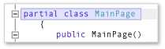

# Analyze Visual Basic and C# code quality in Store apps using Visual Studio static code analysis

[!INCLUDE[vs2017banner](../includes/vs2017banner.md)]

Applies to Windows and Windows Phone](../Image/windows_and_phone_content.png "windows_and_phone_content")

 The code analysis tool in  Visual Studio Express examines your code for a set of common defects and violations of good programming practice. Code analysis warnings differ from compiler errors and warnings because the code analysis tool searches for specific code patterns that are valid but could still create issues for you or other people who use your code. Code analysis can also find defects in your code that are difficult to discover through testing. Running the code analysis tool at regular intervals during your development process can enhance the quality of your completed app.

> [!NOTE]
> In Visual Studio Ultimate, Visual Studio Premium, and Visual Studio Professional, you can use the full functionality of code analysis. See [Analyzing Application Quality by Using Code Analysis Tools](https://msdn.microsoft.com/library/dd264897.aspx) in the MSDN Library.

## In this topic
 You can learn about:

 [Running code analysis](../test/analyze-visual-basic-and-csharp-code-quality-in-store-apps-using-visual-studio-static-code-analysis.md#BKMK_Run)

 [Analyzing and resolving code analysis warnings](../test/analyze-visual-basic-and-csharp-code-quality-in-store-apps-using-visual-studio-static-code-analysis.md#BKMK_Analyze)

 [Suppressing code analysis warnings](../test/analyze-visual-basic-and-csharp-code-quality-in-store-apps-using-visual-studio-static-code-analysis.md#BKMK_Suppress)

 [Searching and filtering code analysis results](../test/analyze-visual-basic-and-csharp-code-quality-in-store-apps-using-visual-studio-static-code-analysis.md#BKMK_Search)

 [Visual Basic and C# code analysis warnings](../test/analyze-visual-basic-and-csharp-code-quality-in-store-apps-using-visual-studio-static-code-analysis.md#BKMK_Warnings)

##  Running code analysis
 To run code analysis on your Visual Studio solution:

- On the **Build** menu, choose **Run Code Analysis on Solution**.

  To automatically run code analysis each time you build a project:

1. Right-click the project name in Solution Explorer and then choose **Properties**.

2. In the project property page, choose **Code Analysis** and then choose **Enable Code Analysis on Build (defines CODEANALYSIS constant)**.

   The solution is compiled and code analysis runs. Results appear in the Code Analysis window.

   

##  Analyzing and resolving code analysis warnings
 To analyze a specific warning, click the title of the warning in the Code Analysis window. The warning expands to display detailed information about the issue.

 

 When you expand a warning, the line of code that caused the warning is highlighted in the Visual Studio code editor.

 

 After you understand the issue, you can resolve it in your code. Then rerun code analysis to make sure that the warning no longer appears in the Code Analysis window, and that your fix has not raised new warnings.

> [!TIP]
> You can rerun code analysis from the Code Analysis window. Click the **Analyze** button and choose the scope of the analysis. You can rerun analysis on the entire solution or on a selected project.

##  Suppressing code analysis warnings
 There are times when you might decide not to fix a code analysis warning. You might decide that resolving the warning requires too much recoding in relation to the probability that the issue will arise in any real-world implementation of your code. Or you might believe that the analysis that is used in the warning is inappropriate for the particular context. You can suppress individual warnings so that they no longer appear in the Code Analysis window.

 To suppress a warning:

1. If the detailed information is not displayed, click the title of the warning to expand it.

2. Choose the **Actions** link at the bottom of the warning.

3. Point to **Suppress Message** and then choose either **In Source** or **In Suppression File**.

   - **In Source** inserts a `SuppressMessage` attribute in the source file above the method that generated the warning. This makes the suppression more discoverable.

   - **In Suppression File** adds a `SuppressMessage` attribute to the **GlobalSuppressions.cs** file of the project. This can make the management of suppressions easier. Note that the `SuppressMessage` attribute added to **GlobalSuppression.cs** also targets the method that generated the warning. It does not suppress the warning globally.

     Your decision whether to suppress the warning in the source file or in the suppression file depends on your coding style and needs.

##  Searching and filtering code analysis results
 You can search long lists of warning messages and you can filter warnings in multi-project solutions.

 

 In [!INCLUDE[vs_dev11_expwin_long](../includes/vs-dev11-expwin-long-md.md)], all code analysis warnings have the severity level of Warning.

##  Visual Basic and C# code analysis warnings
 Code analysis raises the following warnings:

 [CA1001: Types that own disposable fields should be disposable](https://msdn.microsoft.com/library/ms182172.aspx)

 [CA1821: Remove empty finalizers](https://msdn.microsoft.com/library/bb264476.aspx)

 [CA2213: Disposable fields should be disposed](https://msdn.microsoft.com/library/ms182328.aspx)

 [CA2229: Implement serialization constructors](https://msdn.microsoft.com/library/ms182343.aspx)

 [CA2231: Overload operator equals on overriding ValueType.Equals](https://msdn.microsoft.com/library/ms182359.aspx)
