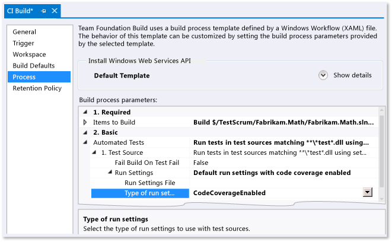

# Analyzing Code Coverage in Build Verification Tests
[!INCLUDE[vs2017banner](../includes/vs2017banner.md)]

Code coverage analysis in Microsoft Visual Studio shows you how much of your code is being exercised by automated tests. For more information, see [Using Code Coverage to Determine How Much Code is being Tested](../test/using-code-coverage-to-determine-how-much-code-is-being-tested.md).

 When you check in your code, your tests will run on the build server, along with all the other tests from other team members. (If you haven’t already set this up, see [Run tests in your build process](https://msdn.microsoft.com/library/d05743a1-c5cf-447e-bed9-bed3cb595e38).) It’s useful to analyze code coverage on the build service, because that provides the most up-to-date and comprehensive picture of coverage in the whole project. It will also include automated system tests and other coded tests that you don’t usually run on the development machines.

1. In Team Explorer, open **Builds**, and then add or edit a build definition.

2. On the **Process** page, expand **Automated Tests**, **Test Source**, **Run Settings**. Set **Type of Run Settings File** to **Code Coverage Enabled**.

    If you have more than one Test Source definition, repeat this step for each one.

   - <em>But there is no field named **Type of Run Settings File</em>*.*

      Under **Automated Tests**, select **Test Assembly** and choose the ellipsis button **[...]** at the end of the line. In the **Add/Edit Test Run** dialog box, under **Test Runner**, choose **Visual Studio Test Runner**.

   

   After the build runs, the code coverage results appear in the build summary.

## See Also
 [Using Code Coverage to Determine How Much Code is being Tested](../test/using-code-coverage-to-determine-how-much-code-is-being-tested.md)
