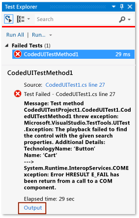
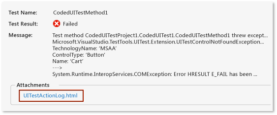
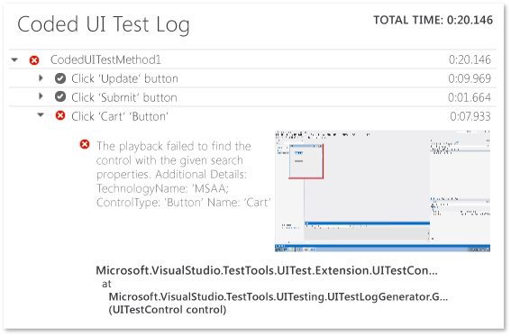

# Analyzing Coded UI Tests Using Coded UI Test Logs
[!INCLUDE[vs2017banner](../includes/vs2017banner.md)]

Coded UI test logs filter and record important information about your coded UI test runs.

 **Requirements**

- Visual Studio Enterprise

## Why should I do this?
 The logs are presented in a format that allows for debugging issues quickly.

## How do I do this?

### Step 1: Enable logging
 Depending on your scenario, use one of the following methods to enable the log.

- Target .NET Framework version 4 with no App.config file present in the test project

  - Open the **QTAgent32_40.exe.config** file.

    By default, this file is located in **\<drvie>:\Program Files (x86)\Microsoft Visual Studio 12.0\Common7\IDE**.

    Modify the value for EqtTraceLevel to the log level you want.

    Save the file.

- Target .NET Framework version 4.5 with no App.config file present in the test project

  - Open the **QTAgent32.exe.config** file.

    By default, this file is located in **\<drvie>:\Program Files (x86)\Microsoft Visual Studio 12.0\Common7\IDE**.

    Modify the value of the EqtTraceLevel to the log level you want.

    Save the file.

- App.config file present in the test project

  - Open App.config file in the project.

    Add the following code under the configuration node:

    `<system.diagnostics>     <switches>       <add name="EqtTraceLevel" value="4" />     </switches>  </system.diagnostics>`

- Enable logging from the test code itself

  - <xref:Microsoft.VisualStudio.TestTools.UITesting.PlaybackSettings.LoggerOverrideState%2A> = HtmlLoggerState.AllActionSnapshot;

### Step 2: Run your coded UI test and view the log
 When you run a coded UI test with the modifications to the **QTAgent32.exe.config** file in place, you will see there is an output link in the Test Explorer results. Log files are produced not only when your test fails, but also for successful tests when the trace level is set to “verbose.”

1. On the **TEST** menu, choose **Windows** and then select **Test Explorer**.

2. On the **BUILD** menu, choose **Build Solution**.

3. In Test Explorer, select the coded UI test you want to run, open its shortcut menu, and then choose **Run Select Tests**.

     The automated tests will run and indicate if they passed or failed.

    > [!TIP]
    > To view Test Explorer from the **Test menu**, point to **Windows** and then choose **Test Explorer**.

4. Choose the **Output** link in the Test Explorer results.

     

     This displays the output for the test which will include a link to the action log.

     

5. Choose the UITestActionLog.html link.

     The log is displayed in your web browser.

     

## Q & A

### Q: What happened to the EnableHtmlLogger key?
 In previous versions of Visual Studio, there were two more configuration settings for enabling Html Logger in Coded UI Test:

```

<add key="EnableHtmlLogger" value="true"/>

<add key="EnableSnapshotInfo" value="true"/>

```

 Both of these settings have been deprecated since Visual Studio 2012. EqtTraceLevel is the only setting which is required to be modified to enable HtmlLogger.

## See Also
 [Use UI Automation To Test Your Code](../test/use-ui-automation-to-test-your-code.md)
 [How to: Run Tests from Microsoft Visual Studio](https://msdn.microsoft.com/library/1a1207a9-2a33-4a1e-a1e3-ddf0181b1046)
