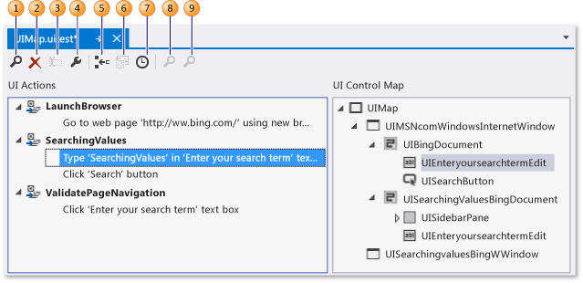
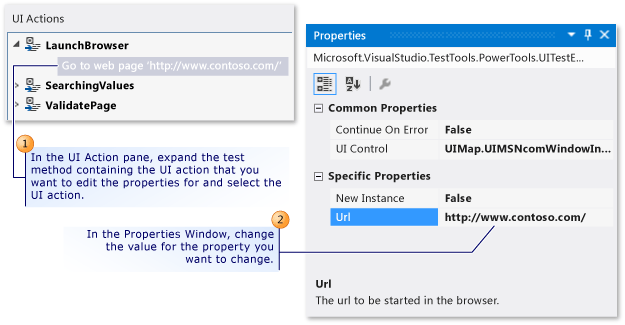
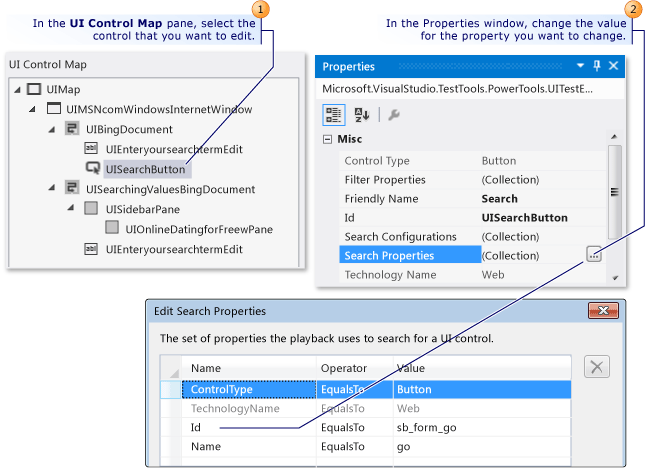
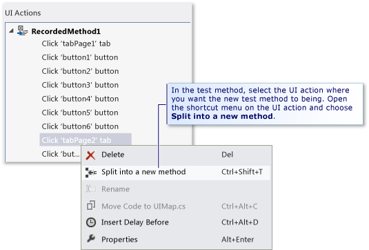
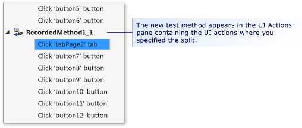
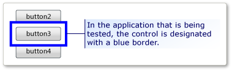

# Editing Coded UI Tests Using the Coded UI Test Editor
[!INCLUDE[vs2017banner](../includes/vs2017banner.md)]

The Coded UI Test Editor lets you easily modify your coded UI tests. Using the Coded UI Test Editor, you can locate, view, and edit the properties of your test methods and UI actions. In addition, you can use the UI control map to view and edit their corresponding controls.

 **Requirements**

- Visual Studio Enterprise

## Why should I do this?
 Using the Coded UI Test Editor is quicker and more efficient than editing the code in your coded UI test methods using the Code Editor. With the Coded UI Test Editor, you can use the toolbar and shortcut menus to quickly locate and modify property values associated with UI actions and controls. For example, you can use the Coded UI Test Editor’s toolbar to perform the following commands:

 

1. [Find](../ide/finding-and-replacing-text.md) helps you locate UI actions and controls.

2. [Delete](#CodedUITestEditor_DeleteUIActions) removes unwanted UI actions.

3. **Rename** changes the names for test methods and controls.

4. **Properties** opens the Properties Window for selected item.

5. [Split into a new method](#CodedUITestEditor_SplitMethods) lets you modularize the UI actions.

6. [Move Code](#CodedUITestEditor_MoveMethods) adds custom code to your test methods.

7. [Insert Delay Before](#CodedUITestEditor_InsertDelay) adds a pause prior to a UI action, specified in milliseconds.

8. [Locate the UI Control](#CodedUITestEditor_LocateUIControl) identifies the location of the control in the UI of application under test.

9. [Locate All](#CodedUITestEditor_LocateDecendants) helps you verify control property and significant changes to the application’s controls.

## How do I do this?
 In [!INCLUDE[vs_dev11_long](../includes/vs-dev11-long-md.md)], opening the UIMap.uitest file affiliated with your coded UI test in your coded UI test project will automatically display the coded UI test in the Coded UI Test Editor. The following procedures describe how you can then locate and edit your test methods, and properties for the UI actions, and controls using the editor’s toolbar and shortcut menus.

## Open a coded UI test
 You can view and edit your Visual C# and Visual Basic-based coded UI test using the Coded UI Test Editor.

 

 In Solution Explorer, open the shortcut menu for **UIMap.uitest** and choose **Open**. The coded UI test is displayed in the Coded UI Test Editor. You can now view and edit the recorded methods, actions, and corresponding controls in the coded UI test.

> [!TIP]
> When you select a UI action that is located in a method in the **UI Actions** pane, the corresponding control is highlighted. You can also modify the UI action or the controls properties.

 *I don't see* the Coded UI Test Editor.
 You might be using version of Visual Studio Enterprise prior to 2012. The Coded UI Test Editor was also available in Visual Studio 2010 Feature Pack 2 with an MSDN subscription. [!INCLUDE[crdefault](../includes/crdefault-md.md)][Microsoft Visual Studio 2010 Feature Pack 2](https://go.microsoft.com/fwlink/?LinkID=204119).

##  Modify UI action properties and their corresponding control properties
 Using the Coded UI Test Editor, you can quickly locate and view all the UI actions in your test methods. When you select the UI action in the editor, the corresponding control is automatically highlighted. Likewise, if you select a control, the associated UI actions are highlighted. When you select either a UI action or a control, it is then easy to use the Properties window to modify the properties that correspond with it.

 
Edit UI action properties

 To modify the properties for a UI action, in the **UI Action** pane, expand the test method that contains a UI action that you want to edit the properties for, select the UI action, and then modify the properties using the Properties window.

 For example, if a server is unavailable, and you have a UI action associated with your Web browser that states **Go to Web page ‘<http://Contoso1/default.aspx’>**, you could change the URL to `‘http://Contoso2/default.aspx’`.

 
Edit control properties

 Modifying the properties for a control is done in the same way as the UI actions. In the **UI Control Map** pane, select the control that you want to edit and modify its properties using the Properties window.

 For example, a developer might have changed the **(ID)** property on a button control in the source code for the application being tested from “idSubmit” to “idLogin.” With the **(ID)** property changed in the application, the coded UI test will not be able to locate the button control and will fail. In this case, the tester can open the **Search Properties** collection and change the **Id** property to match the new value that the developer used in the application. The tester could also change the **Friendly Name** property value from “Submit” to “Login.” By making this change, the associated UI action in the Coded UI Test Editor is updated from “Choose ‘Submit’ button” to “Choose ‘Login’ button.”

 After completing your modifications, save the changes to the UIMap.Designer file by choosing **Save** on the [!INCLUDE[vsprvs](../includes/vsprvs-md.md)] toolbar.

 *What else should I know?*
 **Tips**

-  If the Properties window is not displayed, press and hold **Alt** while you press **Enter**, or alternatively press **F4**.

-  To undo the property changes you made, select **Undo** from the **Edit** menu, or press Ctrl+Z.

-  You can use the **Find** button in the Coded UI Test editor toolbar to open the Find and Replace tool in Visual Studio. You can then use the Find control to locate a UI action in the Coded UI Test editor. For example, you can try to find “Click ‘Login’ button.” This can be useful in large tests. Note that you cannot use the replace functionality in the Find and Replace tool in the Coded UI Test Editor. For more information, see Find control in [Finding and Replacing Text](../ide/finding-and-replacing-text.md).

-  Sometimes, it can be difficult to visualize where controls are located in the UI of the application under test. One of the capabilities of the coded UI Test Editor is that you can select a control listed in the UI control map and view its location in the application under test. [!INCLUDE[crdefault](../includes/crdefault-md.md)][Locating a UI Control in the application under Test](#CodedUITestEditor_LocateUIControl) located further below in this topic.

-  It might be necessary to expand the container control that contains the control that you want to edit. [!INCLUDE[crdefault](../includes/crdefault-md.md)][Locating a control and its descendants](#CodedUITestEditor_LocateDecendants) located further below in this topic.

##  Delete unwanted UI actions
 You can easily remove unwanted UI actions in your coded UI test.

 

 In the **UI Action** pane, expand the test method that contains the UI action that you want to delete. Open the shortcut menu for the UI action and choose **Delete**.

##  Split a test method into two separate methods
 You can split a test method to refine or to modularize the UI actions. For example, your test might have a single test method with UI actions in two container controls. The UI actions might be better modularized in two methods that correspond with one container.

 

 

 In the **UI Action** pane, expand the test method that you want to split into two separate methods and select the UI action where you want the new test method to begin. Either open the shortcut menu for the UI action and then choose **Split into a new method**, or choose the **Split into a new method** button on the Coded UI Test Editor toolbar. The new test method appears in the UI Actions pane. It contains the UI actions starting from the action where you specified the split.

 After you are done splitting the method, save the changes to the UIMap.Designer file by choosing **Save** on the [!INCLUDE[vsprvs](../includes/vsprvs-md.md)] toolbar.

 *What else should I know?*
 **Important issues**

-  **Warning:** If you split a method, you must modify any code that calls the existing method to also call the new method you are about to create if you still want those UI actions included. When you split a method, a Microsoft Visual Studio dialog box is displayed. It warns you that you must modify any code that calls the existing method to also call the new method you are about to create. Choose **Yes**.

  **Tips**

-  To undo the split, choose **Undo** from the **Edit** menu, or press Ctrl+Z.

-  You can rename the new method. Select it in the UI Actions pane and choose the **Rename** button in the Coded UI Test Editor toolbar.

   -or-

   Open the shortcut menu for the new test method and choose **Rename**.

   A Microsoft Visual Studio dialog box is displayed. It warns you that you must modify any code that references the method. Choose **Yes**.

##  Move a test method to the UIMap File to facilitate customization
 If you determine that one of your test methods in your coded UI test requires custom code, you must move it into either the UIMap.cs or UIMap.vb file. Otherwise, your code will be overwritten whenever the coded UI test is recompiled. If you do not move the method, your custom code will be overwritten each time the test is recompiled.

 In the **UI Action** pane, select the test method that you want to move to the UIMap.cs or UIMap.vb file to facilitate custom code functionality that won’t be overwritten when the test code is recompiled. Next, choose the **Move Code** button on the Coded UI Test Editor toolbar, or open the shortcut menu for the test method and choose **Move Code**. The test method is removed from the UIMap.uitest file and no longer is displayed in the UI Actions pane. To edit the test file that you moved, open the UIMap.cs or the UIMap.vb file from Solution Explorer.

 After you are done moving the method, save the changes to the UIMap.Designer file by choosing **Save** on the [!INCLUDE[vsprvs](../includes/vsprvs-md.md)] toolbar.

 *What else should I know?*
 **Important issues**

-  **Warning:** Once you have moved a method, you can no longer edit it using the Coded UI Test Editor. You must add your custom code and maintain it using the Code Editor. When you move a method, a Microsoft Visual Studio dialog box is displayed. It warns you that the method will be moved from the UIMap.uitest file to the UIMap.cs or UIMap.vb file and that you will no longer be able to edit the method using the Coded UI Test Editor. Choose **Yes**.

  **Tips**

-  To undo the move, select **Undo** from the **Edit** menu, or press Ctrl+Z. However, you must then manually remove the code from the UIMap.cs or UIMap.vb file.

##  Locating a UI Control in the application under test
 Sometimes, it can be difficult to visualize where controls are located in the UI of the application under test. One of the capabilities of the coded UI Test Editor is that you can select a control listed in the UI control map and view its location in the application under test. Using the **Locate the UI Control** feature on the application under test can also be used to verify search property modifications you have made to a control.

 

 

 In the **UI Control Map** pane, select the control that you want to locate in the application associated with the test. Next, open the shortcut menu for the control and then choose **Locate the UI Control**. In the application that is being tested, the control is designated with a blue border.

 *What else should I know?*
 **Important issues**

-  **Warning:** Before you locate a UI control, verify that the application associated with the test is running.

  **Tips**

-  Alternatively, you can use the **Locate All** option to verify that all the controls under a container can be correctly located. This option is described in the next section.

##  Locating a control and its descendants
 You can verify that all the controls under a container can be correctly located in the UI of the application under test. This can be helpful in verifying search property changes you may have made on the container. Additionally, if there have been significant changes in the UI of the application under test, you can validate that the existing control search properties are still correct.

 

 

 In the **UI Control Map** pane, select the container control that you want to locate and view all the descendants for. Next, open the shortcut menu for the control and choose **Locate All**. The container control, and all its descendant controls, are marked in the Coded UI Test Editor with either a green check mark or a red ‘X’. These marks let you know if the controls were successfully located in the application under test.

 *What else should I know?*
 **Important issues**

-  **Warning:** Prior to locating the UI controls, verify that the application associated with the test is running.

##  Inserting a delay before a UI action
 Sometimes, you might want to make the test wait for certain events to occur, such as a window to appear, the progress bar to disappear, and so on. Using the Coded UI Test Editor, you can accomplish this by inserting a delay before a UI action. You can specify how many seconds you want the delay to be.

 

 

 In the **UI Action** pane, expand the test method that contains the UI action that you want to insert a delay before. Select the UI action. Next, open the shortcut menu for the UI action and choose **Insert Delay Before**. A delay is inserted and highlighted before the selected UI action with the following text: **Wait for 1 seconds for user delay between actions**. In the Properties window, change the value for the **Delay** property to the desired number of milliseconds.

 After you are done inserting the delay, save the changes to the UIMap.Designer file by choosing **Save** on the [!INCLUDE[vsprvs](../includes/vsprvs-md.md)] toolbar.

 *What else should I know?*
 **Notes**

-  If you need to ensure that a specific control is available before a UI action, you should consider adding custom code to your test method using the appropriate UITestControl.WaitForControlXXX() method. [!INCLUDE[crdefault](../includes/crdefault-md.md)][Making Coded UI Tests Wait For Specific Events During Playback](../test/making-coded-ui-tests-wait-for-specific-events-during-playback.md).

  **Tips**

-  If the Properties window is not displayed, press and hold Alt while you press Enter, or alternatively, press F4.

## External resources

### Guidance
 [Testing for Continuous Delivery with Visual Studio 2012 – Chapter 2: Unit Testing: Testing the Inside](https://go.microsoft.com/fwlink/?LinkID=255188)

### FAQ
 [Coded UI Tests FAQ - 1](https://go.microsoft.com/fwlink/?LinkID=230576)

 [Coded UI Tests FAQ -2](https://go.microsoft.com/fwlink/?LinkID=230578)

### Forum
 [Visual Studio UI Automation Testing (includes CodedUI)](https://go.microsoft.com/fwlink/?LinkID=224497)

## See Also
 [Use UI Automation To Test Your Code](../test/use-ui-automation-to-test-your-code.md)
 [Creating Coded UI Tests](../test/use-ui-automation-to-test-your-code.md#VerifyingCodeUsingCUITCreate)
 [Creating a Data-Driven Coded UI Test](../test/creating-a-data-driven-coded-ui-test.md)
 [Generating a Coded UI Test from an Existing Action Recording](https://msdn.microsoft.com/library/56736963-9027-493b-b5c4-2d4e86d1d497)
 [Walkthrough: Creating, Editing and Maintaining a Coded UI Test](../test/walkthrough-creating-editing-and-maintaining-a-coded-ui-test.md)
