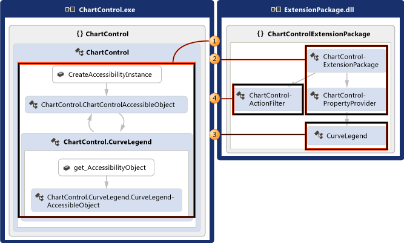
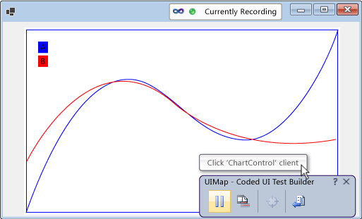
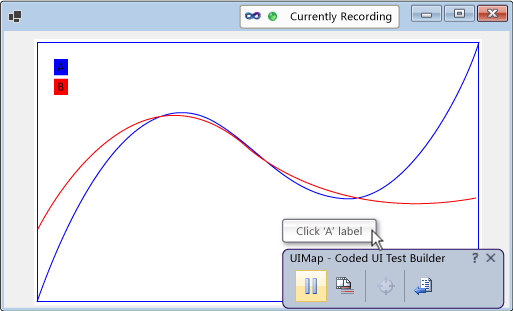
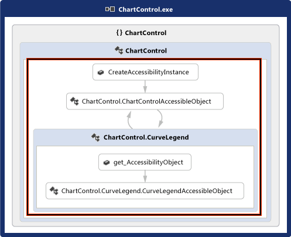
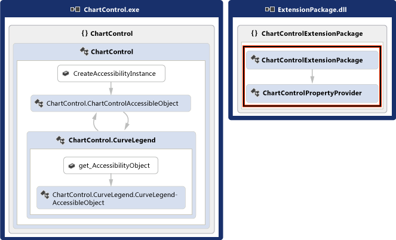
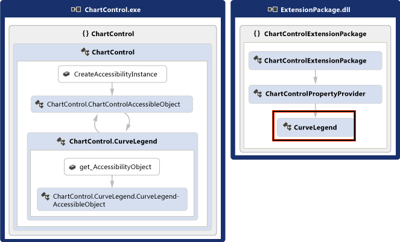
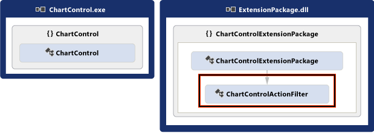

# Enable Coded UI Testing of Your Controls
[!INCLUDE[vs2017banner](../includes/vs2017banner.md)]

Your control can be more easily tested if you implement support for the coded UI testing framework. You can add increasing levels of support incrementally. You can start by supporting record and playback and property validation. You can build on that to allow the coded UI test builder to recognize your control’s custom properties, and provide custom classes to access those properties from generated code. You can also help the coded UI test builder capture actions in a way that is closer to the intent of the action being recorded.

 **In this topic:**

1. [Support Record and Playback and Property Validation by implementing Accessibility](../test/enable-coded-ui-testing-of-your-controls.md#recordandplayback)

2. [Support Custom Property Validation by implementing a Property Provider](../test/enable-coded-ui-testing-of-your-controls.md#customproprties)

3. [Support Code Generation by implementing a Class to Access Custom Properties](../test/enable-coded-ui-testing-of-your-controls.md#codegeneration)

4. [Support Intent-Aware Actions by implementing an Action Filter](../test/enable-coded-ui-testing-of-your-controls.md#intentawareactions)

   

## <a name="recordandplayback"></a> Support Record and Playback and Property Validation by implementing Accessibility
 The coded UI test builder captures information about the controls that it encounters during a recording and then generates code to replay that session. If your control doesn't support accessibility, then the coded UI test builder will capture actions (like mouse clicks) using screen coordinates. When the test is played back, the generated code will issue those mouse clicks in the same screen coordinates. If your control appears in a different place on the screen when the test is played back, the generated code will fail to perform that action on your control. This can result in failures if the test is played back on different screen configurations, in different environments, or after there have been changes to the UI layout.

 

 If you implement accessibility, though, the coded UI test builder will use that to capture information about your control when it records a test and generates code. Then, when you run the test, the generated code will replay those events against your control, even if it's somewhere else in the user interface. Test authors will also be able create asserts using the basic properties of your control.

 

### To support record and playback, property validation, and navigation for a Windows forms control
 Implement accessibility for your control as outlined in the following procedure, and explained in detail in <xref:System.Windows.Forms.AccessibleObject>.

 

1. Implement a class that derives from <xref:System.Windows.Forms.Control.ControlAccessibleObject>, and override the <xref:System.Windows.Forms.Control.AccessibilityObject%2A> property to return an object of your class.

    ```csharp
    public partial class ChartControl : UserControl
    {
        // Overridden to return the custom AccessibleObject for the control.
        protected override AccessibleObject CreateAccessibilityInstance()
        {
            return new ChartControlAccessibleObject(this);
        }

        // Inner class ChartControlAccessibleObject represents accessible information
        // associated with the ChartControl and is used when recording tests.
        public class ChartControlAccessibleObject : ControlAccessibleObject
        {
            ChartControl myControl;
            public ChartControlAccessibleObject(ChartControl ctrl)
                : base(ctrl)
            {
                myControl = ctrl;
            }
        }
    }
    ```

2. Override the accessible object’s <xref:System.Windows.Forms.AccessibleObject.Role%2A>, <xref:System.Windows.Forms.AccessibleObject.State%2A>, <xref:System.Windows.Forms.AccessibleObject.GetChild%2A> and <xref:System.Windows.Forms.AccessibleObject.GetChildCount%2A> properties and methods.

3. Implement another accessibility object for the child control and   override the child control’s <xref:System.Windows.Forms.Control.AccessibilityObject%2A> property to return that accessibility object.

4. Override the <xref:System.Windows.Forms.AccessibleObject.Bounds%2A>, <xref:System.Windows.Forms.AccessibleObject.Name%2A>, <xref:System.Windows.Forms.AccessibleObject.Parent%2A>, <xref:System.Windows.Forms.AccessibleObject.Role%2A>, <xref:System.Windows.Forms.AccessibleObject.State%2A>, <xref:System.Windows.Forms.AccessibleObject.Navigate%2A>, and <xref:System.Windows.Forms.AccessibleObject.Select%2A> properties and methods for the child control’s accessibility object.

> [!NOTE]
> This topic starts with the accessibility sample in <xref:System.Windows.Forms.AccessibleObject> in this procedure, and then builds on that in the remaining procedures. If you want to create a working version of the accessibility sample, create a console application and then replace the code in Program.cs with the sample code. You’ll need to add references to Accessibility, System.Drawing, and System.Windows.Forms. You should change the **Embed Interop Types** for Accessibility to **False** to eliminate a build warning. You can change the project’s output type to from **Console Application** to **Windows Application** so that a console window doesn’t appear when you run the application.

## <a name="customproprties"></a> Support Custom Property Validation by implementing a Property Provider
 Once you’ve implemented basic support for record and playback and property validation, you can make your control’s custom properties available to coded UI tests by implementing a <xref:Microsoft.VisualStudio.TestTools.UITesting.UITestPropertyProvider> plug-in. For example, the following procedure creates a property provider that allows coded UI tests to access the State property of the chart control’s CurveLegend child controls.

 

### To support custom property validation
 

1. Override the curve legend accessible object’s <xref:System.Windows.Forms.AccessibleObject.Description%2A> property to pass rich property values in the description string, separated from the main description (and each other if you are implementing multiple properties) by semicolons (;).

    ```csharp
    public class CurveLegendAccessibleObject : AccessibleObject
    {
        // add the state property value to the description
        public override string Description
        {
            get
            {
                // Add “;” and the state value to the end
                // of the curve legend’s description
                return "CurveLegend; " + State.ToString();
            }
        }
    }
    ```

2. Create a UI test extension package for your control by creating a class library project and add references to Accessibility, Microsoft.VisualStudio.TestTools.UITesting, Microsoft.VisualStudio.TestTools.UITest.Common, and Microsoft.VisualStudio.TestTools.Extension. Change the **Embed Interop Types** for Accessibility to **False**.

3. Add a property provider class that’s derived from <xref:Microsoft.VisualStudio.TestTools.UITesting.UITestPropertyProvider>.

    ```csharp
    using System;
    using System.Collections.Generic;
    using Accessibility;
    using Microsoft.VisualStudio.TestTools.UITesting;
    using Microsoft.VisualStudio.TestTools.UITest.Extension;
    using Microsoft.VisualStudio.TestTools.UITesting.WinControls;
    using Microsoft.VisualStudio.TestTools.UITest.Common;

    namespace ChartControlExtensionPackage
    {
        public class ChartControlPropertyProvider : UITestPropertyProvider
        {
        }
    }
    ```

4. Implement the property provider by placing property names and property descriptors in a <xref:System.Collections.Generic.Dictionary%602>.

    ```csharp
    // Define a map of property descriptors for CurveLegend
    private static Dictionary<string, UITestPropertyDescriptor> curveLegendPropertiesMap = null;
    private static Dictionary<string, UITestPropertyDescriptor> CurveLegendPropertiesMap
    {
        get
        {
            if (curveLegendPropertiesMap == null)
            {
                UITestPropertyAttributes read =
                    UITestPropertyAttributes.Readable |
                    UITestPropertyAttributes.DoNotGenerateProperties;
                curveLegendPropertiesMap =
                    new Dictionary<string, UITestPropertyDescriptor>
                        (StringComparer.OrdinalIgnoreCase);
                curveLegendPropertiesMap.Add("State",
                    new UITestPropertyDescriptor(typeof(string), read));
            }
            return curveLegendPropertiesMap;
        }
    }

    // return the property descriptor
    public override UITestPropertyDescriptor GetPropertyDescriptor(UITestControl uiTestControl, string propertyName)
    {
        return CurveLegendPropertiesMap[propertyName];
    }

    // return the property names
    public override ICollection<string> GetPropertyNames(UITestControl uiTestControl)
    {
        if (uiTestControl.ControlType.NameEquals("Chart") || uiTestControl.ControlType.NameEquals("Text"))
        {
            // the keys of the property map are the collection of property names
            return CurveLegendPropertiesMap.Keys;
        }

        // this is not my control
        throw new NotSupportedException();
    }

    // Get the property value by parsing the accessible description
    public override object GetPropertyValue(UITestControl uiTestControl, string propertyName)
    {
        if (String.Equals(propertyName, "State", StringComparison.OrdinalIgnoreCase))
        {
            object[] native = uiTestControl.NativeElement as object[];
            IAccessible acc = native[0] as IAccessible;

            string[] descriptionTokens = acc.accDescription.Split(new char[] { ';' });
            return descriptionTokens[1];
        }

        // this is not my control
        throw new NotSupportedException();
    }
    ```

5. Override <xref:Microsoft.VisualStudio.TestTools.UITesting.UITestPropertyProvider.GetControlSupportLevel%2A?displayProperty=fullName> to indicate that your assembly provides control-specific support for your control and its children.

    ```csharp
    public override int GetControlSupportLevel(UITestControl uiTestControl)
    {
        // For MSAA, check the control type
        if (string.Equals(uiTestControl.TechnologyName, "MSAA",
            StringComparison.OrdinalIgnoreCase) &&
            (uiTestControl.ControlType == "Chart"||uiTestControl.ControlType == "Text"))
        {
            return (int)ControlSupport.ControlSpecificSupport;
        }

        // This is not my control, so return NoSupport
        return (int)ControlSupport.NoSupport;
    }
    ```

6. Override the remaining abstract methods of <xref:Microsoft.VisualStudio.TestTools.UITesting.UITestPropertyProvider?displayProperty=fullName>.

    ```csharp
    public override string[] GetPredefinedSearchProperties(Type specializedClass)
    {
        throw new NotImplementedException();
    }

    public override Type GetSpecializedClass(UITestControl uiTestControl)
    {
        throw new NotImplementedException();
    }

    public override Type GetPropertyNamesClassType(UITestControl uiTestControl)
    {
        throw new NotImplementedException();
    }

    public override void SetPropertyValue(UITestControl uiTestControl, string propertyName, object value)
    {
        throw new NotImplementedException();
    }

    public override string GetPropertyForAction(UITestControl uiTestControl, UITestAction action)
    {
        throw new NotImplementedException();
    }

    public override string[] GetPropertyForControlState(UITestControl uiTestControl, ControlStates uiState, out bool[] stateValues)
    {
        throw new NotImplementedException();
    }

    ```

7. Add an extension package class that’s derived from <xref:Microsoft.VisualStudio.TestTools.UITest.Extension.UITestExtensionPackage>.

    ```csharp
    using System;
    using Microsoft.VisualStudio.TestTools.UITesting;
    using Microsoft.VisualStudio.TestTools.UITest.Extension;
    using Microsoft.VisualStudio.TestTools.UITest.Common;

    namespace ChartControlExtensionPackage
    {
        internal class ChartControlExtensionPackage : UITestExtensionPackage
        {
        }
    }
    ```

8. Define the `UITestExtensionPackage` attribute for the assembly.

    ```csharp
    [assembly: Microsoft.VisualStudio.TestTools.UITest.Extension.UITestExtensionPackage(
                    "ChartControlExtensionPackage",
                    typeof(ChartControlExtensionPackage.ChartControlExtensionPackage))]
    namespace ChartControlExtensionPackage
    {
       …
    ```

9. In the extension package class, override <xref:Microsoft.VisualStudio.TestTools.UITest.Extension.UITestExtensionPackage.GetService%2A?displayProperty=fullName> to return the property provider class when a property provider is requested.

    ```csharp
    internal class ChartControlExtensionPackage : UITestExtensionPackage
    {
        public override object GetService(Type serviceType)
        {
            if (serviceType == typeof(UITestPropertyProvider))
            {
                if (propertyProvider == null)
                {
                    propertyProvider = new ChartControlPropertyProvider();
                }
                return propertyProvider;
            }
            return null;
        }

        private UITestPropertyProvider propertyProvider = null;
    }
    ```

10. Override the remaining abstract methods and properties of <xref:Microsoft.VisualStudio.TestTools.UITest.Extension.UITestExtensionPackage>.

    ```csharp

    public override void Dispose() { }

    public override string PackageDescription
    {
        get { return "Supports coded UI testing of ChartControl"; }
    }

    public override string PackageName
    {
        get { return "ChartControl Test Extension"; }
    }

    public override string PackageVendor
    {
        get { return "Microsoft (sample)"; }
    }

    public override Version PackageVersion
    {
        get { return new Version(1, 0); }
    }

    public override Version VSVersion
    {
        get { return new Version(10, 0); }
    }
    ```

11. Build your binaries and copy them to **%ProgramFiles%\Common\Microsoft Shared\VSTT\10.0\UITestExtensionPackages**.

> [!NOTE]
> This extension package will be applied to any control that is of type “Text”. If you’re testing multiple controls of the same type, you’ll need to test them separately and manage which extension packages are deployed when you record the tests.

## <a name="codegeneration"></a> Support Code Generation by implementing a Class to Access Custom Properties
 When the coded UI test builder generates code from a session recording, it uses the <xref:Microsoft.VisualStudio.TestTools.UITesting.UITestControl> class to access your controls.

```csharp

      UITestControl uIAText = this.UIItemWindow.UIChartControlWindow.UIAText;
Assert.AreEqual(this.AssertMethod3ExpectedValues.UIATextState, uIAText.GetProperty("State").ToString());
```

 If you’ve implemented a property provider to provide access to your control’s custom properties, you can add a specialized class that is used to access those properties so that the generated code is simplified.

```csharp

      ControlLegend uIAText = this.UIItemWindow.UIChartControlWindow.UIAText;
Assert.AreEqual(this.AssertMethod3ExpectedValues.UIATextState, uIAText.State);
```

### To add a specialized class to access your control
 

1. Implement a class that’s derived from <xref:Microsoft.VisualStudio.TestTools.UITesting.WinControls.WinControl> and add the control’s type to the search properties collection in the constructor.

    ```csharp
    public class CurveLegend:WinControl
    {
       public CurveLegend(UITestControl c) : base(c)
       {
          // The curve legend control is a “text” type of control
          SearchProperties.Add(
             UITestControl.PropertyNames.ControlType, "Text");
       }
    }
    ```

2. Implement your control’s custom properties as properties of the class.

    ```csharp
    public virtual string State
    {
        get
        {
            return (string)GetProperty("State");
        }
    }
    ```

3. Override your property provider’s <xref:Microsoft.VisualStudio.TestTools.UITesting.UITestPropertyProvider.GetSpecializedClass%2A?displayProperty=fullName> method to return the type of the new class for the curve legend child controls.

    ```csharp
    public override Type GetSpecializedClass(UITestControl uiTestControl)
    {
       if (uiTestControl.ControlType.NameEquals("Text"))
       {
          // This is text type of control. For my control,
          // that means it’s a curve legend control.
          return typeof(CurveLegend);
       }

       // this is not a curve legend control
       return null;
    }
    ```

4. Override your property provider’s <xref:Microsoft.VisualStudio.TestTools.UITesting.UITestPropertyProvider.GetPropertyNamesClassType%2A> method to return the type of the new class’ PropertyNames method.

    ```csharp
    public override Type GetPropertyNamesClassType(UITestControl uiTestControl)
    {
        if (uiTestControl.ControlType.NameEquals("Text"))
        {
          // This is text type of control. For my control,
          // that means it’s a curve legend control.
            return typeof(CurveLegend.PropertyNames);
        }

        // this is not a curve legend control
        return null;
    }
    ```

## <a name="intentawareactions"></a> Support Intent-Aware Actions by implementing an Action Filter
 When Visual Studio records a test, it captures each mouse and keyboard event. However, in some cases, the intent of the action can be lost in the series of mouse and keyboard events. For example, if your control supports autocomplete, the same set of mouse and keyboard events may result in a different value when the test is played back in a different environment. You can add an action filter plug-in that replaces the series of keyboard and mouse events with a single action. This way, you can replace the series of mouse and keyboard events resulting in the selection of a value with a single action that sets the value. Doing that protects coded UI tests from the differences in autocomplete from one environment to another.

### To support intent-aware actions
 

1. Implement an action filter class that’s derived from [UITestActionFilter](/previous-versions/visualstudio/visual-studio-2012/dd985757(v=vs.110)), overriding the properties [ApplyTimeout](/previous-versions/visualstudio/visual-studio-2012/dd984649%28v%3dvs.110%29), [Category](/previous-versions/visualstudio/visual-studio-2012/dd986905(v=vs.110)), [Enabled](/previous-versions/visualstudio/visual-studio-2012/dd985633(v=vs.110)), [FilterType](/previous-versions/visualstudio/visual-studio-2012/dd778726(v=vs.110)), [Group](/previous-versions/visualstudio/visual-studio-2012/dd779219(v=vs.110)) and [Name](/previous-versions/visualstudio/visual-studio-2012/dd998334(v=vs.110)).

    ```csharp
    internal class MyActionFilter : UITestActionFilter
    {
       // If the user actions we are aggregating exceeds the time allowed,
       // this filter is not applied. (The timeout is configured when the
       // test is run.)
       public override bool ApplyTimeout
       {
          get { return true; }
       }

       // Gets the category of this filter. Categories of filters
       // are applied in priority order.
       public override UITestActionFilterCategory Category
       {
          get { return UITestActionFilterCategory.PostSimpleToCompoundActionConversion; }
       }

       public override bool Enabled
       {
          get { return true; }
       }

       public override UITestActionFilterType FilterType
       {
          // This action filter operates on a single action
          get { return UITestActionFilterType.Unary; }
       }

       // Gets the name of the group to which this filter belongs.
       // A group can be enabled/disabled using configuration file.
       public override string Group
       {
          get { return "ChartControlActionFilters"; }
       }

       // Gets the name of this filter.
       public override string Name
       {
          get { return "Convert Double-Click to Single-Click"; }
       }
    ```

2. Override `UITestActionFilter.ProcessRule`. The example here replaces a double-click action with a single click action.

    ```csharp
    public override bool ProcessRule(IUITestActionStack actionStack)
    {
        if (actionStack.Count > 0)
        {
            MouseAction lastAction = actionStack.Peek() as MouseAction;
            if (lastAction != null)
            {
                if (lastAction.UIElement.ControlTypeName.Equals(
                     ControlType.Text.ToString(),
                     StringComparison.OrdinalIgnoreCase))
                {
                    if(lastAction.ActionType == MouseActionType.DoubleClick)
                    {
                        // Convert to single click
                        lastAction.ActionType = MouseActionType.Click;
                    }
                }
            }
        }
        // Do not stop aggregation
        return false;
    }
    ```

3. Add the action filter to the <xref:Microsoft.VisualStudio.TestTools.UITest.Extension.UITestExtensionPackage.GetService%2A> method of your extension package.

    ```csharp
    public override object GetService(Type serviceType)
    {
       if (serviceType == typeof(UITestPropertyProvider))
       {
          if (propertyProvider == null)
          {
             propertyProvider = new PropertyProvider();
          }
          return propertyProvider;
       }
       else if (serviceType == typeof(UITestActionFilter))
       {
          if (actionFilter == null)
          {
             actionFilter = new RadGridViewActionFilter();
          }
          return actionFilter;
       }
       return null;
    }
    ```

4. Build your binaries and copy them to %ProgramFiles%\Common Files\Microsoft Shared\VSTT\10.0\UITestExtensionPackages.

> [!NOTE]
> The action filter does not depend on the accessibility implementation or on the property provider.

## Debug Your Property Provider or Action Filter
 Your property provider and action filter are implemented in an extension package that is loaded and run by the coded UI test builder in a process separate from your application.

#### To debug your property provider or action filter

1. Build the debug version of your extension package copy the .dll and .pdb files to %ProgramFiles%\Common Files\Microsoft Shared\VSTT\10.0\UITestExtensionPackages.

2. Run your application (not in the debugger).

3. Run the coded UI test builder.

     `codedUITestBuilder.exe  /standalone`

4. Attach the debugger to the codedUITestBuilder process.

5. Set breakpoints in your code.

6. In the coded UI test builder, create asserts to exercise your property provider, and record actions to exercise your action filters.

## External resources

### Guidance
 [Testing for Continuous Delivery with Visual Studio 2012 – Chapter 2: Unit Testing: Testing the Inside](https://go.microsoft.com/fwlink/?LinkID=255188)

## See also

- <xref:System.Windows.Forms.AccessibleObject>
- [Use UI Automation To Test Your Code](../test/use-ui-automation-to-test-your-code.md)
