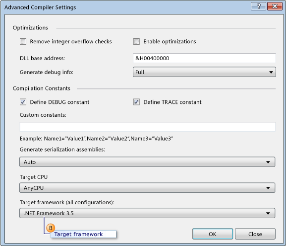
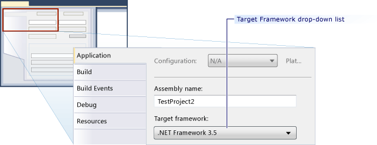

# How to: Configure Unit Tests to Target An Earlier Version of the .NET Framework
[!INCLUDE[vs2017banner](../includes/vs2017banner.md)]

When you create a test project in Microsoft Visual Studio, the most recent version of the .NET Framework is set as the target, by default. Additionally, if you upgrade test projects from previous versions of Visual Studio, they are upgraded to target the most recent version of the .NET Framework. By editing the project properties, you can explicitly re-target the project to earlier versions of the .NET Framework.

 You can create unit test projects that target specific versions of the .NET Framework. The targeted version must be 3.5 or later, and cannot be a client version. Visual Studio enables the following basic support for unit tests that target specific versions:

- You can create unit test projects and target them to a specific version of the .NET Framework.

- You can run unit tests that target a specific version of the .NET Framework from Visual Studio on your local machine.

- You can run unit tests that target a specific version of the .NET Framework by using MSTest.exe from the command prompt.

- You can run unit tests on a build agent as part of a build.

  **Testing SharePoint Applications**

  The capabilities listed above also enable you to write unit tests and integration tests for SharePoint applications using Visual Studio. [!INCLUDE[crabout](../includes/crabout-md.md)] how to develop SharePoint applications using Visual Studio, see [Create SharePoint Solutions](https://msdn.microsoft.com/library/4bfb1e59-97c9-4594-93f8-3068b4eb9631), [Building and Debugging SharePoint Solutions](https://msdn.microsoft.com/library/c9e7c9ab-4eb3-40cd-a9b9-6c2a896f70ae) and [Verifying and Debugging SharePoint Code](https://msdn.microsoft.com/library/b5f3bce2-6a51-41b1-a292-9e384bae420c).

  **Limitations**

  The following limitations apply when you re-target your test projects to use earlier versions of the .NET Framework:

- In the .NET Framework 3.5, multitargeting is supported for test projects that contain only unit tests. The .NET Framework 3.5 does not support any other test type, such as coded UI or load test. The re-targeting is blocked for test types other than unit tests.

- Execution of tests that are targeted at an earlier version of the .NET Framework is supported only in the default host adapter. It is not supported in the ASP.NET host adapter. ASP.NET applications that have to run in the ASP.NET Development Server context must be compatible with the current version of the .NET Framework.

- Data collection support is disabled when you run tests that support .NET Framework 3.5 multitargeting. You can run code coverage by using the Visual Studio command-line tools.

- Unit tests that use .NET Framework 3.5 cannot run on a remote machine.

- You cannot target unit tests to earlier client versions of the framework.

### Re-targeting to a specific version of the .NET Framework for Visual Basic Unit Test Projects

1. Create a new Visual Basic unit test project. On the **File** menu, choose **New** and then choose **Project**.

     The **New Project** dialog box is displayed.

2. Under **Installed Templates**, expand **Visual Basic**. Select **Test** and then select the **Test Project** template.

3. In the **Name** text box, type a name for your Visual Basic test project and then choose **OK**.

4. In Solution Explorer, choose **Properties** from the shortcut menu of the new Visual Basic test project.

     The properties for your Visual Basic test project are displayed.

5. On the **Compile** tab choose **Advanced Compile Options** as shown in the following illustration.

     

6. Use the **Target framework (all configurations)** drop-down list to change the target framework to **.NET Framework 3.5** or a later version as shown in callout B in the following illustration. You should not specify a client version.

     

### Re-targeting to a specific version of the .NET Framework for Visual C# Unit Test Projects

1. Create a new Visual C# unit-test project. On the **File** menu, choose **New** and then choose **Project**.

     The **New Project** dialog box is displayed.

2. Under **Installed Templates**, expand **Visual C#**. Select **Test** and then select the **Test Project** template.

3. In the **Name** text box, type a name for your Visual C# test project and then choose **OK**.

4. In Solution Explorer, choose **Properties** from the shortcut menu of your new Visual C# test project.

     The properties for your Visual C# test project are displayed.

5. On the **Application** tab choose **Target framework** and then choose **.NET Framework 3.5** or a later version from the drop-down list to change the target framework.as shown in the following illustration. You should not specify a client version.

     

### Re-targeting to a specific version of the .NET Framework for C++/CLI Unit Test Projects

1. Create a new C++ unit-test project. On the **File** menu, select **New** and then click **Project**.

     The **New Project** dialog box is displayed.

    > [!WARNING]
    > To build C++/CLI unit tests for a previous version of the .NET framework for Visual C++, you must use the corresponding version of Visual Studio. For example, to target the .NET Framework 3.5, you must install [!INCLUDE[vs_orcas_long](../includes/vs-orcas-long-md.md)] and [!INCLUDE[vs_orcas_long](../includes/vs-orcas-long-md.md)] Service Pack 1.

2. Under **Installed Templates**, expand **Visual C ++**. Select **Test** and then select the **Test Project** template.

3. In the **Name** text box, type a name for your Visual C++ test project and then click **OK**.

4. In Solution Explorer, choose **Unload Project** from your new Visual C++ test project.

5. In Solution Explorer, choose the unloaded Visual C++ test project and then choose **Edit \<project name>.vcxproj**.

     The .vcxproj file opens in the editor.

6. Set the `TargetFrameworkVersion` to version 3.5 or a later version in the `PropertyGroup` labeled `"Globals"`. You should not specify a client version:

    ```
    <PropertyGroup Label="Globals">
        <TargetName>DefaultTest</TargetName>
        <ProjectTypes>{3AC096D0-A1C2-E12C-1390-A8335801FDAB};{8BC9CEB8-8B4A-11D0-8D11-00A0C91BC942}</ProjectTypes>
        <ProjectGUID>{CE16D77A-E364-4ACD-948B-1EB6218B0EA3}</ProjectGUID>
        <TargetFrameworkVersion>3.5</TargetFrameworkVersion>
        <Keyword>ManagedCProj</Keyword>
        <RootNamespace>CPP_Test</RootNamespace>
      </PropertyGroup>

    ```

7. Save and close the .vcxproj file.

8. In Solution Explorer, choose select **Reload Project** from the shortcut menu of your new Visual C++ test project.

## See Also
 [Creating and Running Unit Tests for Existing Code](https://msdn.microsoft.com/e8370b93-085b-41c9-8dec-655bd886f173)
 [Create SharePoint Solutions](https://msdn.microsoft.com/library/4bfb1e59-97c9-4594-93f8-3068b4eb9631)
 [Building and Debugging SharePoint Solutions](https://msdn.microsoft.com/library/c9e7c9ab-4eb3-40cd-a9b9-6c2a896f70ae)
 [Advanced Compiler Settings Dialog Box (Visual Basic)](../ide/reference/advanced-compiler-settings-dialog-box-visual-basic.md)
