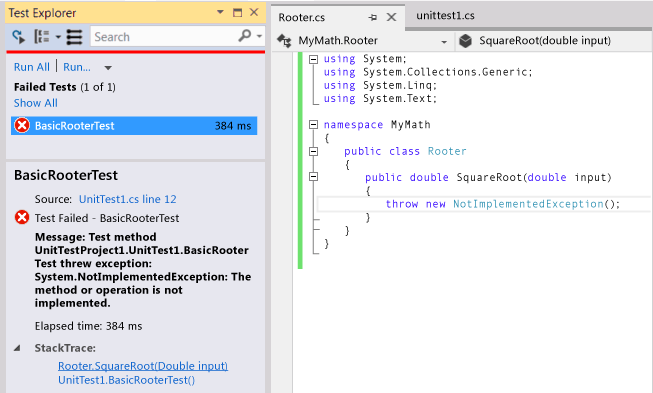
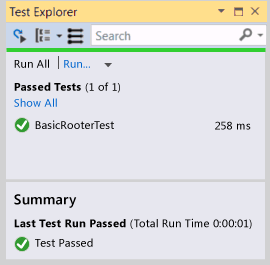
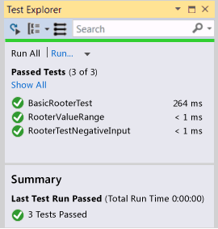

# Quick Start: Test Driven Development with Test Explorer
[!INCLUDE[vs2017banner](../includes/vs2017banner.md)]

We recommend that you create unit tests to help keep your code working correctly through many incremental steps of development. There are several frameworks that you can use to write unit tests, including some developed by third parties. Some test frameworks are   specialized to testing in different languages or platforms. Test Explorer provides a single interface for unit tests in any of these frameworks. Adapters are available for the most commonly-used frameworks, and you can write your own adapters for other frameworks.

 Test Explorer supersedes the unit test windows found in earlier editions of Visual Studio. Its benefits include:

- Run .NET, unmanaged, database and other kinds of tests using a single interface.

- Use the unit test framework of your choice, such as NUnit or MSTest frameworks.

- See in one window all the information that you need.

## Using Test Explorer
 ")

#### To Run Unit Tests by using Test Explorer

1. Create unit tests that use the test frameworks of your choice.

    For example, to create a test that uses the MSTest Framework:

   1. Create a test project.

        In the **New Project** dialog box, expand **Visual Basic**, **Visual C#**, or **Visual C++**, and then choose **Test**.

        Select **Unit Test Project**.

   2. Write each unit test as a method. Prefix each test method with the `[TestMethod]` attribute.

2. If individual tests have no dependencies that prevent them from being run in any order, turn on parallel test execution with the  toggle button on the toolbar. This can noticeably reduce the time taken to run all the tests.

3. On the menu bar, choose **Test**, **Run Unit Tests**, **All Tests**.

    The solution builds and the tests run.

    Test Explorer opens and displays a summary of the results.

   **To see a full list of tests:** Choose **Show All** in any category.

   **To see the details of a test result:** Select the test in Test Explorer to view details such as exception messages in the details pane.

   **To navigate to the code of a test:** Double-click the test in Test Explorer, or choose **Open Test** on the shortcut menu.

   **To debug a test:** Open the shortcut menu for one or more tests, and then choose **Debug Selected Tests**.

> [!IMPORTANT]
> The results that are displayed are for the most recent run. The colored results bar shows only the results for the tests that ran. For example, if you run several tests and some of them fail, and then run only the successful tests, then the results bar will show all green.

> [!NOTE]
> If no test appears, make sure that you have installed an adapter to connect Test Explorer to the test framework that you are using. For more information, see [Use a different test framework](/visualstudio/test/getting-started-with-unit-testing#use-a-third-party-test-framework).

## <a name="walkthrough"></a> Walkthrough: Using Unit Tests to Develop a Method
 This walkthrough demonstrates how to develop a tested method in C# using the Microsoft Unit Test framework. You can easily adapt it for other languages, and to use other test frameworks such as NUnit. For more information, see [Use a different test framework](/visualstudio/test/getting-started-with-unit-testing#use-a-third-party-test-framework).

#### Creating the Test and Method

1. Create a Visual C# Class Library project. This project will contain the code that we want to deliver. In this example, it is named `MyMath`.

2. Create a Test project.

   - In the **New Project** dialog, choose **Visual C#**, **Test** and then choose **Unit Test Project**.

        

3. Write a basic test method. Verify the result obtained for a specific input:

   ```csharp

   [TestMethod]
   public void BasicRooterTest()
   {
     // Create an instance to test:
     Rooter rooter = new Rooter();
     // Define a test input and output value:
     double expectedResult = 2.0;
     double input = expectedResult * expectedResult;
     // Run the method under test:
     double actualResult = rooter.SquareRoot(input);
     // Verify the result:
     Assert.AreEqual(expectedResult, actualResult,
         delta: expectedResult / 100);
   }
   ```

4. Generate the method from the test.

   1. Place the cursor on `Rooter`, and then on the shortcut menu choose **Generate**, **New Type**.

   2. In the **Generate New Type** dialog box, set **Project** to the class library project. In this example, it is `MyMath`.

   3. Place the cursor on `SquareRoot`, and then on the shortcut menu choose **Generate**, **Method Stub**.

5. Run the unit test.

   1. On the **Test** menu, choose **Run Unit Tests**, **All Tests**.

        The solution builds and runs.

        Test Explorer opens and displays the results.

        The test appears under **Failed Tests**.

6. Select the name of the test.

    The details of the test appear in the lower part of Test Explorer.

7. Select the items under **Stack Trace** to see where the test failed.

   

   At this point, you have created a test and a stub that you will modify so that the test passes.

#### After every change, make all the tests pass

1. In `MyMath\Rooter.cs`, improve the code of `SquareRoot`:

    ```csharp
    public double SquareRoot(double input)
     {
       return input / 2;
     }
    ```

2. In Test Explorer, choose **Run All**.

     The code builds and the test runs.

     The test passes.

     

#### Add tests to extend the range of inputs

1. To improve your confidence that your code works in all cases, add tests that try a broader range of input values.

    > [!TIP]
    > Avoid altering existing tests that pass. Instead, add new tests. Change existing tests only when the user requirements change. This policy helps ensure that you don’t lose existing functionality as you work to extend the code.

     In your test class, add the following test, which tries a range of input values:

    ```csharp
    [TestMethod]
    public void RooterValueRange()
    {
      // Create an instance to test:
      Rooter rooter = new Rooter();
      // Try a range of values:
      for (double expectedResult = 1e-8;
          expectedResult < 1e+8;
          expectedResult = expectedResult * 3.2)
      {
        RooterOneValue(rooter, expectedResult);
      }
    }

    private void RooterOneValue(Rooter rooter, double expectedResult)
    {
      double input = expectedResult * expectedResult;
      double actualResult = rooter.SquareRoot(input);
      Assert.AreEqual(expectedResult, actualResult,
          delta: expectedResult / 1000);
    }
    ```

2. In Test Explorer, choose **Run All**.

     The new test fails, although the first test still passes.

     To find the point of failure, select the failing test and then in the lower part of Test Explorer, select the top item of the **Stack Trace**.

3. Inspect the method under test to see what might be wrong. In the `MyMath.Rooter` class, rewrite the code:

    ```
    public double SquareRoot(double input)
    {
      double result = input;
      double previousResult = -input;
      while (Math.Abs(previousResult - result) > result / 1000)
      {
        previousResult = result;
        result = result - (result * result - input) / (2 * result);
      }
      return result;
    }
    ```

4. In Test Explorer, choose **Run All**.

     Both tests now pass.

#### Add tests for exceptional cases

1. Add a test for negative inputs:

    ```csharp
    [TestMethod]
     public void RooterTestNegativeInputx()
     {
         Rooter rooter = new Rooter();
         try
         {
             rooter.SquareRoot(-10);
         }
         catch (ArgumentOutOfRangeException e)
         {
             return;
         }
         Assert.Fail();
     }
    ```

2. In Test Explorer, choose **Run All**.

     The method under test loops, and must be canceled manually.

3. Choose **Cancel**.

     The test stops after 10 seconds.

4. Fix the method code:

    ```csharp

    public double SquareRoot(double input)
    {
      if (input <= 0.0)
      {
        throw new ArgumentOutOfRangeException();
      }
    ...
    ```

5. In Test Explorer, choose **Run All**.

     All the tests pass.

#### Refactor without changing tests

1. Simplify the code, but do not change the tests.

    > [!TIP]
    > A *refactoring* is a change that is intended to make the code perform better or to make the code easier to understand. It is not intended to alter the behavior of the code, and therefore the tests are not changed.
    >
    >  We recommend that you perform refactoring steps separately from steps that extend functionality. Keeping the tests unchanged gives you confidence that you have not accidentally introduced bugs while refactoring.

    ```csharp
    public class Rooter
    {
      public double SquareRoot(double input)
      {
        if (input <= 0.0)
        {
          throw new ArgumentOutOfRangeException();
        }
        double result = input;
        double previousResult = -input;
        while (Math.Abs(previousResult - result) > result / 1000)
        {
          previousResult = result;
          result = (result + input / result) / 2;
          //was: result = result - (result * result - input) / (2*result);
        }
        return result;
      }
    }
    ```

2. Choose **Run All**.

     All the tests still pass.

     
