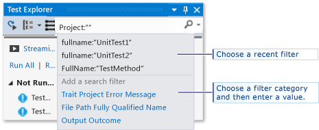

# Run unit tests for Store apps in Visual Studio
[!INCLUDE[vs2017banner](../includes/vs2017banner.md)]

This topic describes how to run unit tests by using the Test Explorer in Microsoft Visual Studio

> [!NOTE]
> The topics in this section describe the functionality of Visual Studio Express for Windows 8. Visual Studio Community, Enterprise, and Professional provide additional features for unit testing.
>
> - Use any third-party or open source unit test framework that has created an add-on adapter for the Microsoft Test Explorer. You can also analyze and display code coverage information for your tests.
>   - Run your tests after every build. You can also use Microsoft Fakes, an isolation framework for managed code to focus your tests on your own code by substituting test code for system and third-party functionality.
>
>   For more information, see [Unit Test Your Code](../test/unit-test-your-code.md) in the MSDN Library.

##  In this topic
 [Unit test frameworks and test projects](#BKMK_Unit_test_frameworks_and_test_projects)

 [Running tests in Test Explorer](#BKMK_Running_tests_in_Test_Explorer)

- [Running tests](#BKMK_Running_tests)

  [Viewing test results](#BKMK_Viewing_test_results)

- [Viewing test details](#BKMK_Viewing_test_details)

- [Viewing the source code of a test method](#BKMK_Viewing_the_source_code_of_a_test_method)

  [Organizing the test list](#BKMK_Organizing_the_test_list)

- [Grouping tests](#BKMK_Grouping_tests)

- [Searching and filtering the test list](#BKMK_Searching_and_filtering_the_test_list)

  [Debugging unit tests](#BKMK_Debugging_unit_tests)

##  Unit test frameworks and test projects
 Visual Studio Express for Windows Store Apps includes the Microsoft unit testing frameworks for managed and for native C++ code. Test Explorer can run tests from multiple test projects in a solution and from test classes that are part of the production code projects. Test projects can be any combination of the Visual C++ or the Visual C# and Visual Basic unit test frameworks. When the code under test is written for the .NET Framework, the test project can be written in any .NET Framework language, regardless of the language of the target code. Native C/C++ code projects must be tested by using a C++ unit test framework.

##  Running tests in Test Explorer
 When you build the test project, the tests appear in Test Explorer. If Test Explorer is not visible, choose **Test** on the Visual Studio menu, choose **Windows**, and then choose **Test Explorer**.

 

 As you run, write, and rerun your tests, Test Explorer displays the results in default groups of **Failed Tests**, **Passed Tests**, **Skipped Tests** and **Not Run Tests**. You can change the way Test Explorer groups your tests.

 You can perform much of the work of finding, organizing, and running tests from the Test Explorer toolbar.

 

###  Running tests
 You can run all the tests in the solution, all the tests in a group, or a set of tests that you select. Do one of the following:

- To run all the tests in a solution, choose **Run All**.

- To run all the tests in a default group, choose **Run...** and then choose the group on the menu.

- Select the individual tests that you want to run, open the shortcut menu for a selected test and then choose **Run Selected Tests**.

  The pass/fail bar at the top of the Test Explorer window is animated as the tests run. At the conclusion of the test run, the pass/fail bar turns green if all tests passed or turns red if any test failed.

##  Viewing test results
 As you run, write, and rerun your tests, Test Explorer displays the results in groups of **Failed Tests**, **Passed Tests**, **Skipped Tests** and **Not Run Tests**. The details pane at the bottom of Test Explorer displays a summary of the test run.

###  Viewing test details
 To view the details of an individual test, select the test.

 The test details pane displays the following information:

- The source file name and the line number of the test method.

- The status of the test.

- The elapsed time that the test method took to run.

  If the test fails, the details pane also displays:

- The message returned by the unit test framework for the test.

- The stack trace at the time the test failed.

###  Viewing the source code of a test method
 To display the source code for a test method in the Visual Studio editor, select the test and then choose **Open Test** on the shortcut menu (Keyboard: F12).

##  Organizing the test list

###  Grouping tests
 By default, Test Explorer displays your tests as child nodes of **Failed Tests**, **Passed Tests**, **Skipped Tests** and **Not Run Tests**.

|||
|-|-|
||To group your tests by the time it takes to execute them, open the **Group By** list and choose **Duration**. Choose **Test Outcome** to switch to the original grouping.|

###  Searching and filtering the test list
 When you have a large number of tests, you can type in the Test Explorer search box to filter the list by the specified string. You can restrict your filter to specific types of strings by choosing from the filter list before you enter the search string.

 

##  Debugging unit tests
 You can use Test Explorer to start a debugging session for your tests. Stepping through your code with the Visual Studio debugger seamlessly takes you back and forth between the unit tests and the project under test. To start debugging:

1. In the Visual Studio editor, set a breakpoint in one or more test methods that you want to debug.

   > [!NOTE]
   > Because test methods can run in any order, set breakpoints in all the test methods that you want to debug.

2. In Test Explorer, select the test methods and then choose **Debug Selected Tests** on the shortcut menu.

   For more information, about the debugger, see [Debugging in Visual Studio](../debugger/debugging-in-visual-studio.md).
