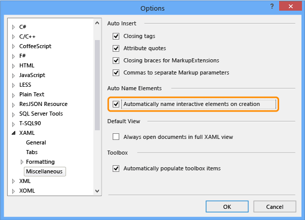
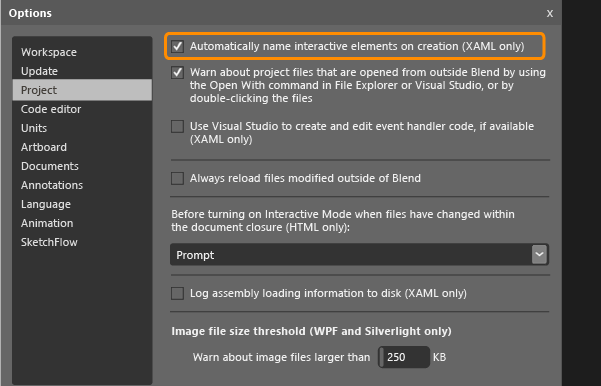

# Set a Unique Automation Property for Windows Store Controls for Testing
[!INCLUDE[vs2017banner](../includes/vs2017banner.md)]

If you want to run coded UI tests for your XAML-based Windows Store application, you must have a unique automation property that identifies each control.

 You can assign a unique automation property based on the type of XAML control in your application. Here’s how to assign this unique automation property in the following situations:

- [Static XAML definition of controls](#UniquePropertyWindowsStoreControlsStaticXAML)

- [Assign unique automation properties using Visual Studio or Blend for Visual Studio](#UniquePropertyWindowsStoreControlsExpressionBlend)

- [Use a DataTemplate](#UniquePropertyWindowsStoreControlsDataTemplate)

- [Use a control template](#UniquePropertyWindowsStoreControlsControlTemplate)

- [Dynamic controls](#UniquePropertyWindowsStoreControlsDynamicControls)

## Use methods to assign a unique automation property

### <a name="UniquePropertyWindowsStoreControlsStaticXAML"></a> Static XAML definition
 To specify a unique automation property for a control that is defined in your XAML file, you can set the AutomationProperties.AutomationId or AutomationProperties.Name implicitly or explicitly, as shown in the following examples. Setting either of these values gives the control a unique automation property that can be used to identify the control when you create a coded UI test or action recording.

 **Set the property implicitly**

 Set the AutomationProperties.AutomationId to **ButtonX** using the Name property in the XAML for the control.

```xaml
<Button Name="ButtonX" Height="31" HorizontalAlignment="Left" Margin="23,26,0,0"  VerticalAlignment="Top" Width="140" Click="ButtonX_Click" />

```

 Set the AutomationProperties.Name to **ButtonY** using the Content property in the XAML for the control.

```xaml
<Button Content="ButtonY" Height="31" HorizontalAlignment="Left" Margin="23,76,0,0" VerticalAlignment="Top" Width="140" Click="ButtonY_Click" />

```

 **Set the property explicitly**

 Set the AutomationProperties.AutomationId to **ButtonX** explicitly in the XAML for the control.

```xaml
<Button AutomationProperties.AutomationId=“ButtonX” Height="31" HorizontalAlignment="Left" Margin="23,26,0,0"  VerticalAlignment="Top" Width="140" Click="ButtonX_Click" />

```

 Set the AutomationProperties.Name to **ButtonY** explicitly in the XAML for the control.

```
<Button AutomationProperties.Name="ButtonY" Height="31" HorizontalAlignment="Left" Margin="23,76,0,0" VerticalAlignment="Top" Width="140" Click="ButtonY_Click" />
```

### <a name="UniquePropertyWindowsStoreControlsExpressionBlend"></a> Assign unique automation properties using Visual Studio or Blend for Visual Studio
 You can use Visual Studio or Blend for Visual Studio to assign unique names to interactive elements such as buttons, list boxes, combo boxes and text boxes. This gives the control a unique value for AutomationProperties.Name.

 **Visual Studio:** On the **Tools** menu, point to **Options** and then choose **Text Editor**, then **XAML**, and finally **Miscellaneous**.

 Select **Automatically name interactive elements on creation** and then choose **OK**.

 

 **Blend for Visual Studio:** Use one of the following methods to do this from Blend for Visual Studio.

> [!NOTE]
> You can only use this method for controls that are created statically using XAML.

 **To give a unique name to existing controls**

 On the **Tools** menu, choose **Name Interactive Elements**, as shown here:

 

 **To automatically give a unique name to controls that you create**

 On the **Tools** menu, point to **Options**, and then choose **Project**. Select **Automatically name interactive elements on creation** and then choose **OK**, as shown here:

 

### <a name="UniquePropertyWindowsStoreControlsDataTemplate"></a> Use a data template
 You can define a simple template using ItemTemplate to bind the values in a list box to variables using the following XAML.

```xaml

<ListBox Name="listBox1" ItemsSource="{Binding Source={StaticResource employees}}">
   <ListBox.ItemTemplate>
      <DataTemplate>
         <StackPanel Orientation="Horizontal">
            <TextBlock Text="{Binding EmployeeName}" />
            <TextBlock Text="{Binding EmployeeID}" />
         </StackPanel>
      </DataTemplate>
   </ListBox.ItemTemplate>
</ListBox>
```

 You can also use a template with ItemContainerStyle to bind the values to variables by using the following XAML.

```xaml

      <ListBox Name="listBox1" ItemsSource="{Binding Source={StaticResource employees}}">
            <ListBox.ItemContainerStyle>
                <Style TargetType="ListBoxItem">
                    <Setter Property="Template">
                        <Setter.Value>
                            <ControlTemplate TargetType="ListBoxItem">
                                <Grid>
                                    <Button Content="{Binding EmployeeName}" AutomationProperties.AutomationId="{Binding EmployeeID}"/>
                                </Grid>
                            </ControlTemplate>
                        </Setter.Value>
                    </Setter>
                </Style>
            </ListBox.ItemContainerStyle>        
        </ListBox>

```

 For both of these examples, you must then override the ToString() method of ItemSource, as shown using the following code. This code makes sure that the AutomationProperties.Name value is set and is unique, because you cannot set a unique automation property for each data bound list item using binding. Setting a unique value for the Automation Properties.Name is sufficient in this case.

> [!NOTE]
> Using this approach, the inner contents of the list item can also be set to a string in the Employee class through binding. As shown in the example, the button control inside each list item is assigned a unique automation id which is the Employee ID.

```

Employee[] employees = new Employee[]
{
   new Employee("john", "4384"),
   new Employee("margaret", "7556"),
   new Employee("richard", "8688"),
   new Employee("george", "1293")
};

listBox1.ItemsSource = employees;

public override string ToString()
{
    return EmployeeName + EmployeeID; // Unique Identification to be set as the AutomationProperties.Name
}

```

### <a name="UniquePropertyWindowsStoreControlsControlTemplate"></a> Use a control template
 You can use a control template so that each instance of a specific type obtains a unique automation property when it is defined in the code. You must create the template so that the AutomationProperty binds to a unique ID in the control instance. The following XAML demonstrates one approach to create this binding with a control template.

```xaml

<Style x:Key="MyButton" TargetType="Button">
<Setter Property="Template">
   <Setter.Value>
<ControlTemplate TargetType="Button">
   <Grid>
      <CheckBox HorizontalAlignment="Left" AutomationProperties.AutomationId="{TemplateBinding Content}"></CheckBox>
      <Button Width="90" HorizontalAlignment="Right" Content="{TemplateBinding Content}" AutomationProperties.AutomationId="{TemplateBinding Content}"></Button>
   </Grid>
</ControlTemplate>
   </Setter.Value>
</Setter>
</Style>

```

 When you define two instances of a button using this control template, the automation id is set to the unique content string for the controls in the template, as shown in the following XAML.

```xaml

<Button Content=”Button1” Style="{StaticResource MyButton}" Width="140"/>
<Button Content=”Button2” Style="{StaticResource MyButton}" Width="140"/>
```

### <a name="UniquePropertyWindowsStoreControlsDynamicControls"></a> Dynamic controls
 If you have controls that are created dynamically from your code and not created statically or through templates in XAML files, you must set the Content or Name properties for the control. This makes sure that each dynamic control has a unique automation property. For example, if you have a check box that must be displayed when you select a list item, you can set these properties, as shown here:

```csharp

private void CreateCheckBox(string txt, StackPanel panel)
   {
      CheckBox cb = new CheckBox();
      cb.Content = txt; // Sets the AutomationProperties.Name
      cb.Height = 50;
      cb.Width = 100;
      cb.Name = "DynamicCheckBoxAid"+ txt; // Sets the AutomationProperties.AutomationId
      panel.Children.Add(cb);
    }

```
