# Test Windows UWP and 8.1 Phone Apps with Coded UI Tests
[!INCLUDE[vs2017banner](../includes/vs2017banner.md)]

Use this walkthrough for creating UI tests for UWP apps that run on mobile device or emulators and XAML-based Phone 8.1 apps.

## Create a simple Windows Phone app

1. Create a new project for a blank Windows Phone app using either Visual C# or Visual Basic template.

     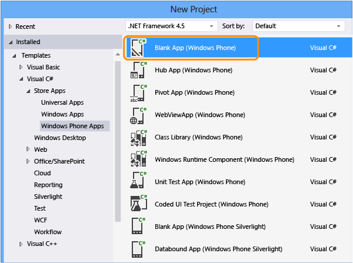

2. In Solution Explorer, open MainPage.xaml. From the Toolbox, drag a button control and a textbox control to the design surface.

     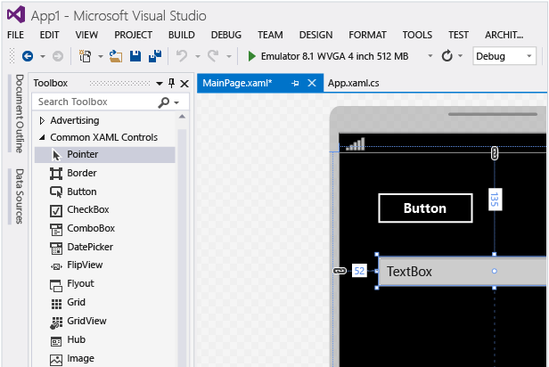

3. In the Properties window, name the button control.

     

4. Name the textbox control.

     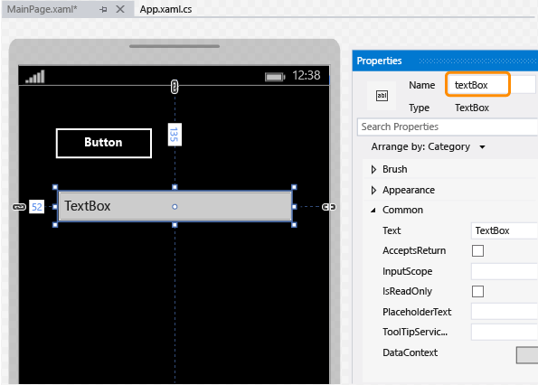

5. On designer surface, double-click the button control and add the following code:

    ```csharp
    private void button_Click_1(object sender, RoutedEventArgs e)
    {
        this.textBox.Text = this.button.Name;
    }

    ```

    ```vb
    Public NotInheritable Class MainPage
        Inherits Page

        Private Sub button_Click(sender As Object, e As RoutedEventArgs) Handles Button.Click
            Me.textBox.Text = Me.button.Name
        End Sub
    End Class
    ```

6. Press F5 to run your Windows Phone app in the emulator and verify that it’s working.

     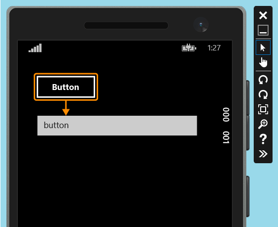

7. Exit the emulator.

## Deploy the Windows Phone app

1. Before a coded UI test can map an app’s controls, you have to deploy the app.

     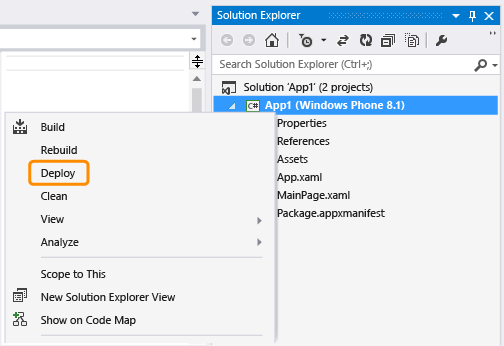

     The emulator starts. The app is now available for testing.

     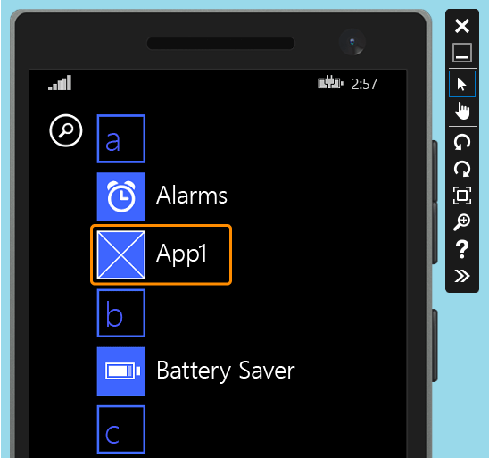

     Keep the emulator running while you create your coded UI test.

## Create a coded UI test for the Windows Phone app

[How do I create coded UI tests for Universal Windows Platform (UWP) apps?](#uwpapps)

1. Add a new coded UI test project to the solution with the Windows Phone app.

    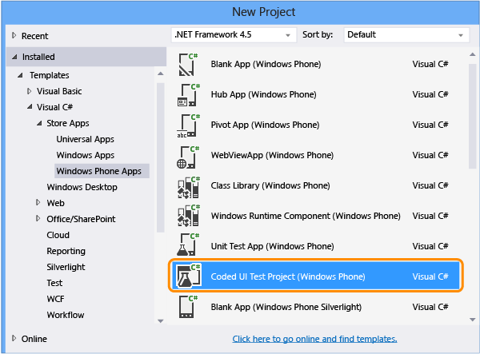

2. Choose to edit the UI map using the cross-hair tool.

    

3. Use the cross-hair tool to select the app, then copy the value for the app’s **AutomationId** property, which will be used later to start the app in the test.

    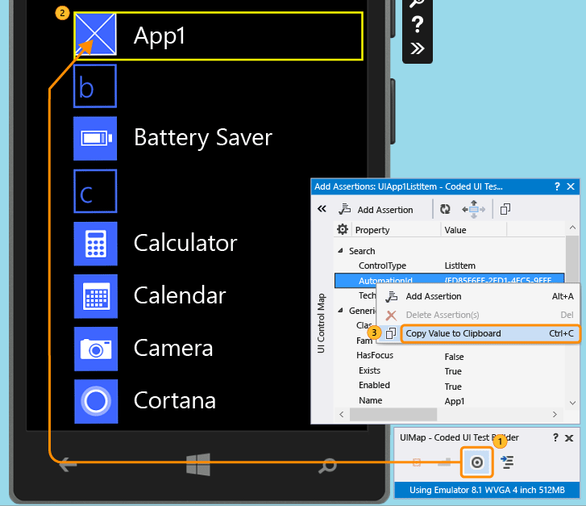

4. In the emulator, start the app and use the cross-hair tool to select the button control. Then add the button control to the UI control map.

    

5. To add the textbox control to the UI control map, repeat the previous step.

    

6. Generate code to create code for changes to the UI control map.

    

7. Use the cross-hair tool to select the textbox control, and then select the **Text** property.

    

8. Add an assertion. It will be used in the test to verify that the value is correct.

    

9. Add and generate code for the assert method.

     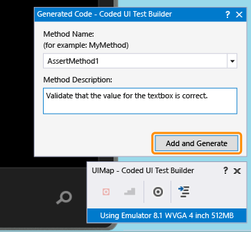

10. **Visual C#**

     In Solution Explorer, open the UIMap.Designer.cs file to view the code you just added for the assert method and the controls.

     **Visual Basic**

     In Solution Explorer, open the CodedUITest1.vb file. In the CodedUITestMethod1() test method code, right-click the call to the assertion method that was automatically added `Me.UIMap.AssertMethod1()` and choose **Go To Definition**. This will open the UIMap.Designer.vb file in the code editor so you can view the code you added for the assert method and the controls.

    > [!WARNING]
    > Do not modify the UIMap.designer.cs or UIMap.Designer.vb file directly. If you do this, the changes to the file will be overwritten each time the test is generated.

     **Assert method**

    ```csharp
    public void AssertMethod1()
    {
        #region Variable Declarations
        XamlEdit uITextBoxEdit = this.UIApp1Window.UITextBoxEdit;
        #endregion

        // Verify that the 'Text' property of 'textBox' text box equals 'button'
        Assert.AreEqual(this.AssertMethod1ExpectedValues.UITextBoxEditText, uITextBoxEdit.Text);
    }
    ```

    ```vb
    Public Sub AssertMethod1()
        Dim uITextBoxEdit As XamlEdit = Me.UIApp1Window.UITextBoxEdit

        'Verify that the 'Text' property of 'textBox' text box equals 'button'
        Assert.AreEqual(Me.AssertMethod1ExpectedValues.UITextBoxEditText, uITextBoxEdit.Text)
    End Sub
    ```

     **Controls**

    ```csharp
    #region Properties
    public virtual AssertMethod1ExpectedValues AssertMethod1ExpectedValues
    {
        get
        {
            if ((this.mAssertMethod1ExpectedValues == null))
            {
                this.mAssertMethod1ExpectedValues = new AssertMethod1ExpectedValues();
            }
            return this.mAssertMethod1ExpectedValues;
        }
    }

    public UIApp1Window UIApp1Window
    {
        get
        {
            if ((this.mUIApp1Window == null))
            {
                this.mUIApp1Window = new UIApp1Window();
            }
            return this.mUIApp1Window;
        }
    }
    #endregion

    #region Fields
    private AssertMethod1ExpectedValues mAssertMethod1ExpectedValues;

    private UIApp1Window mUIApp1Window;
    #endregion
    ```

    ```vb
    #Region "Properties"
    Public ReadOnly Property UIButtonButton() As XamlButton
        Get
            If (Me.mUIButtonButton Is Nothing) Then
                Me.mUIButtonButton = New XamlButton(Me)
                Me.mUIButtonButton.SearchProperties(XamlButton.PropertyNames.AutomationId) = "button"
            End If
            Return Me.mUIButtonButton
        End Get
    End Property

    Public ReadOnly Property UITextBoxEdit() As XamlEdit
        Get
            If (Me.mUITextBoxEdit Is Nothing) Then
                Me.mUITextBoxEdit = New XamlEdit(Me)
                Me.mUITextBoxEdit.SearchProperties(XamlEdit.PropertyNames.AutomationId) = "textBox"
            End If
            Return Me.mUITextBoxEdit
        End Get
    End Property
    #End Region

    #Region "Fields"
    Private mUIButtonButton As XamlButton

    Private mUITextBoxEdit As XamlEdit
    #End Region
    ```

11. In Solution Explorer, open the CodedUITest1.cs or CodedUITest1.vb file. You can now add code to the CodedUTTestMethod1 method for the actions needed to run the test. Use the controls that were added to the UIMap to add code:

    1. Launch the Windows Phone app using the automation ID property you copied to the clipboard previously:

       ```csharp
       XamlWindow myAppWindow = XamlWindow.Launch("ed85f6ff-2fd1-4ec5-9eef-696026c3fa7b_cyrqexqw8cc7c!App");
       ```

       ```vb
       XamlWindow.Launch("ed85f6ff-2fd1-4ec5-9eef-696026c3fa7b_cyrqexqw8cc7c!App");
       ```

    2. Add a gesture to tap the button control:

       ```csharp
       Gesture.Tap(this.UIMap.UIApp1Window.UIButtonButton);
       ```

       ```vb
       Gesture.Tap(Me.UIMap.UIApp1Window.UIButtonButton)
       ```

    3. Verify that the call to the assert method that was automatically generated comes after launching the app and tap gesture on the button:

       ```csharp
       this.UIMap.AssertMethod1();
       ```

       ```vb
       Me.UIMap.AssertMethod1()
       ```

       After the code is added, the CodedUITestMethod1 test method should appear as follows:

    ```csharp
    [TestMethod]
    public void CodedUITestMethod1()
    {
        // To generate code for this test, select "Generate Code for Coded UI Test" from the shortcut menu and select one of the menu items.

        // Launch the app.
        XamlWindow myAppWindow = XamlWindow.Launch("ed85f6ff-2fd1-4ec5-9eef-696026c3fa7b_cyrqexqw8cc7c!App");

        // Tap the button.
        Gesture.Tap(this.UIMap.UIApp1Window.UIButtonButton);

        this.UIMap.AssertMethod1();
    }
    ```

    ```vb
    <CodedUITest>
    Public Class CodedUITest1

        <TestMethod()>
        Public Sub CodedUITestMethod1()
            '
            ' To generate code for this test, select "Generate Code for Coded UI Test" from the shortcut menu and select one of the menu items.
            '
            ' Launch the app.
            XamlWindow.Launch("ed85f6ff-2fd1-4ec5-9eef-696026c3fa7b_cyrqexqw8cc7c!App")

            '// Tap the button.
            Gesture.Tap(Me.UIMap.UIApp1Window.UIButtonButton)

            Me.UIMap.AssertMethod1()
        End Sub
    ```

## Run the coded UI test

1. Build your test and then run the test using the test explorer.

     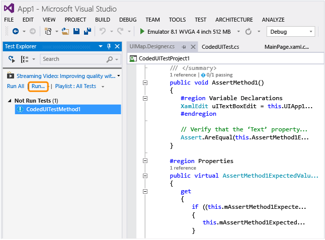

     The Windows Phone app launches, the action to tap the button is completed, and the textbox’s Text property is populated and validated using the assert method.

     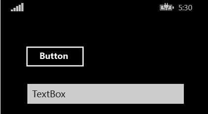

     After the test is finished, the test explorer confirms that the test passed.

     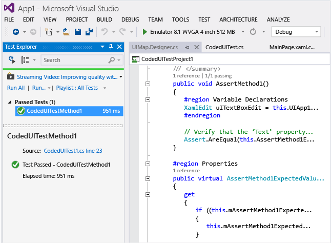

## <a name="TestingPhoneAppsCodedUI_DataDriven"></a> Use Data-driven coded UI tests on Windows Phone apps
 To test different conditions, a coded UI test can be run multiple times with different sets of data.

 Data-driven Coded UI tests for Windows Phone are defined using the DataRow attribute on a test method. In the following example, x and y use the values of 1 and 2 for the first iteration and -1 and -2 for the second iteration of the test.

```
[DataRow(1, 2, DisplayName = "Add positive numbers")]
[DataRow(-1, -2, DisplayName = "Add negative numbers")]
[TestMethod]
public void DataDrivingDemo_MyTestMethod(int x, int y)

```

## Q & A

### Q: Do I have to deploy the Windows Phone app in the emulator in order to map UI controls?
 **A**: Yes, the coded UI test builder requires that an emulator be running and the app be deployed to it. Otherwise, it will throw an error message saying that no running emulator could be found.

### <a name="TestingPhoneAppsCodedUI_EmulatorDevice"></a> Q: Can tests be executed on the emulator only, or can I also use a physical device?
 **A**: Either option is supported. The target for test execution is selected by changing the emulator type or selecting device in the device toolbar. If Device is selected, a Phone Blue device needs to be connected to one of the machine’s USB ports.

 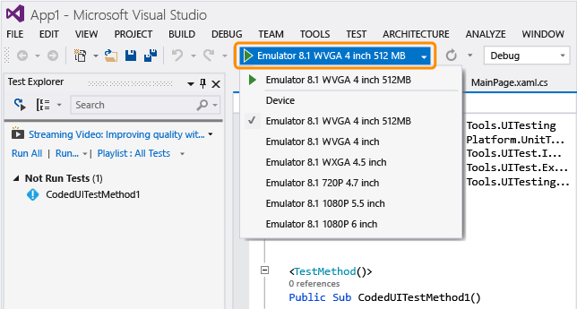

### Q: Why don’t I see the option to record my coded UI test in the Generate Code for a Coded UI Test dialog?
 **A**: The option to record is not supported for Windows Phone apps.

### Q: Can I create a coded UI test for my Windows Phone apps based on WinJS, Silverlight or HTML5?
 **A**: No, only XAML based apps are supported.

### Q: Can I create coded UI tests for my Windows Phone apps on a system that is not running Windows 8.1 or Windows 10?
 **A**: No, the Coded UI Test Project templates are only available on Windows 8.1 and Windows 10. To create automation for Universal Windows Platform (UWP) apps, you'll need Windows 10.

<a name="uwpapps"></a>
### Q: How do I create coded UI tests for Universal Windows Platform (UWP) apps?
 **A**: Depending on the platform where you're testing your UWP app, create coded UI test project in one of these ways:

- A UWP app running on local machine will run as a Store app. To test this, you must use the **Coded UI Test Project (Windows)** template. To find this template when you create a new project, go to the **Windows**, **Universal** node. Or go to the **Windows**, **Windows 8**, **Windows** node.

- A UWP app running on mobile device or emulator will run as a Phone app. To test this, you must use the **Coded UI Test Project (Windows Phone)** template. To find this template when you create a new project, go to the **Windows**, **Universal** node. Or go to the **Windows**, **Windows 8**, **Windows Phone** node.

  After you create the project, authoring a test stays the same as before.

### Q: Can I select controls that are outside the emulator?
 **A**: No, the builder will not detect them.

### Q: Can I use the coded UI test builder to map controls using a physical phone device?
 **A**: No, The builder can only map UI elements if your app has been deployed to the emulator.

### Q: Why can’t I modify the code in the UIMap.Designer file?
 **A**: Any code changes you make in the UIMapDesigner.cs file will be overwritten every time you generate code using the UIMap - Coded UI Test Builder. If you have to modify a recorded method, you must copy it to UIMap.cs file and rename it. The UIMap.cs file can be used to override methods and properties in the UIMapDesigner.cs file. You must remove the reference to the original method in the Coded UITest.cs file and replace it with the renamed method name.

### Q: Can I run a coded UI test on my Windows Phone app from the command-line?
 **A**: Yes, you use a runsettings file to specify the target device for test execution. For example:

 **vstest.console.exe “pathToYourCodedUITestDll” /settings:devicetarget.runsettings**

 Sample runsettings file:

```
<?xml version="1.0" encoding="utf-8"?>
<RunSettings>
<MSPhoneTest>
<!--to specify test execution on device, use a TargetDevice option as follows-->
<TargetDevice>Device</TargetDevice>
<!--to specify an emulator instead, use a TargetDevice option like below-->
<!--<TargetDevice>Emulator 8.1 WVGA 4 inch 512MB</TargetDevice>-->
</MSPhoneTest>
</RunSettings>
```

### Q: What are the differences between coded UI tests for XAML-based Windows Store apps and Windows Phone apps?
 **A**: These are some of the key differences:

|Feature|Windows Store apps|Windows Phone apps|
|-------------|------------------------|------------------------|
|Target for running tests|Local or remote computer. Remote computers can be specified when you use an automated test case to run tests. See [Automate a test case in Microsoft Test Manager](https://msdn.microsoft.com/library/4e02568b-9cde-47cc-b41c-82726c177e42).|Emulator or device. See, [Q: Can tests be executed on the emulator only, or can I also use a physical device?](#TestingPhoneAppsCodedUI_EmulatorDevice) in this topic.|
|Execute from the command-line|Settings file not required to specify target.|Runsettings file required to specify target.|
|Specialized classes for Shell Controls|[DirectUIControl](/previous-versions/dn248208(v=vs.140))|<xref:Microsoft.VisualStudio.TestTools.UITesting.UITestControl>|
|WebView control in a XAML app|Supported if you use Html* specialized classes to interact with HTML elements. See <xref:Microsoft.VisualStudio.TestTools.UITesting.HtmlControls>.|Not supported.|
|Execute automated tests from MTM|Supported.|Not supported.|
|Data-driven tests|See [Data-driven tests](../test/creating-a-data-driven-coded-ui-test.md) for information about using external data-sources and using DataSource attribute on a test method.|Data is specified inline, using DataRow attribute on a test method. See [Use Data-driven coded UI tests on Windows Phone apps](#TestingPhoneAppsCodedUI_DataDriven) in this topic.|

## External resources
 Microsoft Visual Studio Application Lifecycle Management blog: [Using Coded UI to test XAML-based Windows Phone apps](https://devblogs.microsoft.com/devops/using-coded-ui-to-test-xaml-based-windows-phone-apps/#comments)

## See Also
 [Use UI Automation To Test Your Code](../test/use-ui-automation-to-test-your-code.md)
