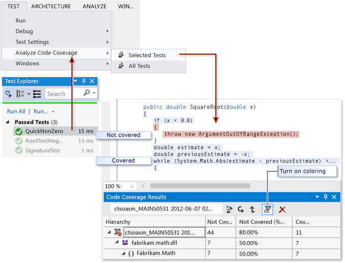

# Troubleshooting Code Coverage
[!INCLUDE[vs2017banner](../includes/vs2017banner.md)]

The code coverage analysis tool in Visual Studio collects data for native and managed assemblies (.dll or .exe files). However, in some cases, the Code Coverage Results window displays an error similar to "Empty results generated: ...." There are several possible reasons why this might happen. This topic is intended to help resolve those issues.

## What you should see
 If you choose an **Analyze Code Coverage** command on the Test menu, and if the build and tests run successfully, then you should see a list of results in the Code Coverage window. You might have to expand the items to see the detail.

 

 For more information, see [Using Code Coverage to Determine How Much Code is being Tested](../test/using-code-coverage-to-determine-how-much-code-is-being-tested.md).

## Possible reasons for seeing no results or old results

### Do you have the right edition of Visual Studio?
 You need Visual Studio Enterprise.

### No tests were executed
 Analysis
 Check your output window. In the **Show Output from** drop-down list, choose **Tests**. See if there are any warnings or errors logged.

 Explanation
 Code coverage analysis is done while tests are running. It only includes assemblies that are loaded into memory when the tests run. If none of the tests are executed then there is nothing for code coverage to report.

 Resolution
 In Test Explorer, choose **Run All** to verify that the tests run successfully. Fix any failures before using **Analyze Code Coverage**.

### You’re looking at a previous result
 When you modify and re-run your tests, a previous code coverage result can still be visible, including the code coloring from that old run.

1. Run Analyze Code Coverage.

2. Make sure that you have selected the most recent result set in the Code Coverage results window.

### .pdb (symbol) files are unavailable
 Analysis
 Open the compile target folder (typically bin\debug), and verify that for each assembly, there is a .pdb file in the same directory as the .dll or .exe file.

 Explanation
 The code coverage engine requires that every assembly has its associated .pdb file accessible during the test run. If there is no .pdb file for a particular assembly, it will not be analyzed.

 The .pdb file must be generated from the same build as the .dll or .exe files.

 Resolution
 Make sure that your build settings generate the .pdb file. If the .pdb files are not updated when the project is built, then open the project properties, select the **Build** page, choose **Advanced** and inspect **Debug Info**.

 If the .pdb and .dll or .exe files are in different places, copy the .pdb file to the same directory. It is also possible to configure code coverage engine to search for .pdb files in another location. For more information, see [Customizing Code Coverage Analysis](../test/customizing-code-coverage-analysis.md).

### Using an instrumented or optimized binary
 Analysis
 Determine if the binary has undergone any form of advanced optimization such as Profile Guided Optimization, or has been instrumented by a profiling tool such as vsinstr.exe or vsperfmon.exe.

 Explanation
 If an assembly has already been instrumented or optimized by another profiling tool, the assembly is omitted from the code coverage analysis.

 Code coverage analysis cannot be performed on such assemblies.

 Resolution
 Switch off optimization and use a new build.

### Code is not managed (.NET) or native (C++) code
 Analysis
 Verify that you are running some tests on managed or C++ code.

 Explanation
 Code coverage analysis in Visual Studio is available only on managed and native (C++) code. If you are working with third-party tools, some or all of the code might execute on a different platform.

 Resolution
 None available.

### Assembly has been installed by NGen
 Analysis
 Verify that the assembly is not loaded from the native image cache.

 Explanation
 For performance reasons, native image assemblies are not analyzed. For more information, see [Ngen.exe (Native Image Generator)](https://msdn.microsoft.com/library/44bf97aa-a9a4-4eba-9a0d-cfaa6fc53a66).

 Resolution
 Use an MSIL version of the assembly. Do not process it with NGen.

### Custom .runsettings file with bad syntax
 Analysis
 If you are using a custom .runsettings file, it might contain a syntax error.

 This results in no code coverage run at all. Either the code coverage window does not open at the end of the test run, or it shows old results.

 Explanation
 You can run your unit tests with a custom .runsettings file to configure code coverage options. The options allow you to include or exclude files. For more information, see [Customizing Code Coverage Analysis](../test/customizing-code-coverage-analysis.md).

 Resolution
 There are two possible types of faults:

- **XML error**

     Open the .runsettings file in the Visual Studio XML editor. Look for error indications.

- **Regular expression error**

  Each string in the file is a regular expression. Review each one for errors, and in particular look for :

  - Mismatched parentheses (...) or unescaped parentheses \\(...\\). If you want to match a parenthesis in the search string, you must escape it. For example, to match a function use: `.*MyFunction\(double\)`

  - Asterisk or plus at the start of an expression. To match any string of characters, use a dot followed by an asterisk: `.*`

### Custom .runsettings file with incorrect exclusions
 Analysis
 If you are using a custom .runsettings file, make sure that it includes your assembly.

 Explanation
 You can run your unit tests with a custom .runsettings file to configure code coverage options. The options allow you to include or exclude files. For more information, see [Customizing Code Coverage Analysis](../test/customizing-code-coverage-analysis.md).

 Resolution
 Remove all the `Include` nodes from the .runsettings file, and then remove all the `Exclude` nodes. If that fixes the problem, put them back in stages.

 Make sure the DataCollectors node specifies Code Coverage. Compare it with the sample in [Customizing Code Coverage Analysis](../test/customizing-code-coverage-analysis.md).

## Some code is always shown as not covered

### Initialization code in native DLLs is executed before instrumentation
 Analysis
 In statically linked native code, part of the initialization function **DllMain** and code that it calls is sometimes shown as not covered, even though the code has been executed.

 Explanation
 The code coverage tool works by inserting instrumentation into an assembly just before the application starts running. In any assembly loaded before this time, the initialization code in **DllMain** executes as soon as the assembly loads, and before the application runs. That code will appear to be not covered.

 Typically, this applies to statically loaded assemblies.

 Resolution
 None.

## See Also
 [Using Code Coverage to Determine How Much Code is being Tested](../test/using-code-coverage-to-determine-how-much-code-is-being-tested.md)
