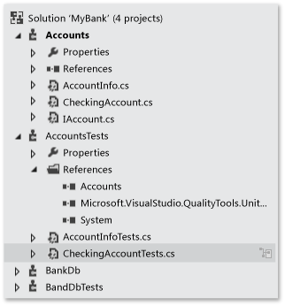
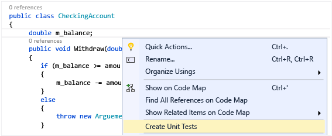
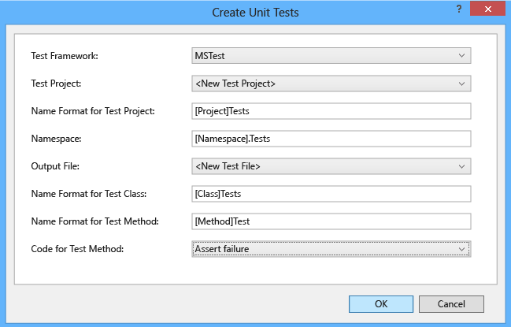
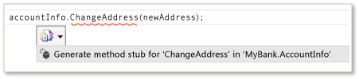
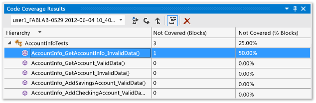
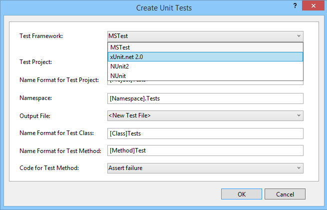

# Unit Test Basics
[!INCLUDE[vs2017banner](../includes/vs2017banner.md)]

Check that your code is working as expected by creating and running unit tests. It’s called unit testing because you break down the functionality of your program into discrete testable behaviors that you can test as individual *units*. Visual Studio Test Explorer provides a flexible and efficient way to run your unit tests and view their results in Visual Studio. Visual Studio installs the Microsoft unit testing frameworks for managed and native code. Use a *unit testing framework* to create unit tests, run them, and report the results of these tests. Rerun unit tests when you make changes to test that your code is still working correctly. When you use Visual Studio Enterprise, you can run tests automatically after every build.

 Unit testing has the greatest effect on the quality of your code when it’s an integral part of your software development workflow. As soon as you write a function or other block of application code, create unit tests that verify the behavior of the code in response to standard, boundary, and incorrect cases of input data, and that check any explicit or implicit assumptions made by the code. With *test driven development*, you create the unit tests before you write the code, so you use the unit tests as both design documentation and functional specifications.

 You can quickly generate test projects and test methods from your code, or manually create the tests as you need them. When you use IntelliTest to explore your .NET code, you can generate test data and a suite of unit tests. For every statement in the code, a test input is generated that will execute that statement. Find out how to [generate unit tests for your code](https://msdn.microsoft.com/library/dn823749.aspx).

 Test Explorer can also run third-party and open source unit test frameworks that have implemented Test Explorer add-on interfaces. You can add many of these frameworks through the Visual Studio Extension Manager and the Visual Studio gallery. See [Install third-party unit test frameworks](../test/install-third-party-unit-test-frameworks.md)

- [Quick starts](#BKMK_Quick_starts)

- [The MyBank Solution example](#BKMK_The_MyBank_Solution_example)

- [Create unit test projects and test methods](#BKMK_Creating_the_unit_test_projects)

- [Write your tests](#BKMK_Writing_your_tests)

- [Run tests in Test Explorer](#BKMK_Running_tests_in_Test_Explorer)

- [Run and view tests](#BKMK_Running_and_viewing_tests_from_the_Test_Explorer_toolbar)

## <a name="BKMK_Unit_testing_overview"></a> Unit testing overview

### <a name="BKMK_Quick_starts"></a> Quick starts
 For an introduction to unit testing that takes you directly into coding, see one of these topics:

- [Walkthrough: Creating and Running Unit Tests for Managed Code](../test/walkthrough-creating-and-running-unit-tests-for-managed-code.md)

- [Quick Start: Test Driven Development with Test Explorer](../test/quick-start-test-driven-development-with-test-explorer.md)

- [Unit testing native code with Test Explorer](https://msdn.microsoft.com/8a09d6d8-3613-49d8-9ffe-11375ac4736c)

## <a name="BKMK_The_MyBank_Solution_example"></a> The MyBank Solution example
 In this topic, we use the development of a fictional application called `MyBank` as an example. You don’t need the actual code to follow the explanations in this topic. Test methods are written in C# and presented by using the Microsoft Unit Testing Framework for Managed Code, However, the concepts are easily transferred to other languages and frameworks.

 

 Our first attempt at a design for the `MyBank` application includes an accounts component that represents an individual account and its transactions with the bank, and a database component that represents the functionality to aggregate and manage the individual accounts.

 We create a `MyBank` solution that contains two projects:

- `Accounts`

- `BankDb`

  Our first attempt at designing the `Accounts` project contain a class to hold basic information about an account, an interface that specifies the common functionality of any type of account, like depositing and withdrawing assets from the account, and a class derived from the interface that represents a checking account. We begin the Accounts projects by creating the following source files:

- `AccountInfo.cs` defines the basic information for an account.

- `IAccount.cs` defines a standard `IAccount` interface for an account, including methods to deposit and withdraw assets from an account and to retrieve the account balance.

- `CheckingAccount.cs` contains the `CheckingAccount` class that implements the `IAccounts` interface for a checking account.

  We know from experience that one thing a withdrawal from a checking account must do is to make sure that the amount withdrawn is less than the account balance. So we override the `IAccount.Withdaw` method in `CheckingAccount` with a method that checks for this condition. The method might look like this:

```csharp

public void Withdraw(double amount)
{
    if(m_balance >= amount)
    {
        m_balance -= amount;
    }
    else
    {
        throw new ArgumentException(amount, "Withdrawal exceeds balance!")
    }
}

```

 Now that we have some code, it’s time for testing.

## <a name="BKMK_Creating_the_unit_test_projects"></a> Create unit test projects and test methods
 It is often quicker to generate the unit test project and unit test stubs from your code. Or you can choose to create the unit test project and tests manually depending on your requirements.

 **Generate unit test project and unit test stubs**

1. From the code editor window, right-click and choose **Create Unit Tests** from the context menu.

    

2. Click OK to accept the defaults to create your unit tests, or change the values used to create and name the unit test project and the unit tests. You can select the code that is added by default to the unit test methods.

    

3. The unit test stubs are created in a new unit test project for all the methods in the class.

    

4. Now jump ahead to learn how to [add code to the unit test methods](#BKMK_Writing_your_tests) to make your unit test meaningful, and any extra unit tests that you might want to add to thoroughly test your code.

   **Create your unit test project and unit tests manually**

   A unit test project usually mirrors the structure of a single code project. In the MyBank example, you add two unit test projects named `AccountsTests` and `BankDbTests` to the `MyBanks` solution. The test project names are arbitrary, but adopting a standard naming convention is a good idea.

   **To add a unit test project to a solution:**

5. On the **File** menu, choose **New** and then choose **Project** (Keyboard Ctrl + Shift + N).

6. On the New Project dialog box, expand the **Installed** node, choose the language that you want to use for your test project, and then choose **Test**.

7. To use one of the Microsoft unit test frameworks, choose **Unit Test Project** from the list of project templates. Otherwise, choose the project template of the unit test framework that you want to use. To test the `Accounts` project of our example, you would name the project `AccountsTests`.

   > [!WARNING]
   > Not all third-party and open source unit test frameworks provide a Visual Studio project template. Consult the framework document for information about creating a project.

8. In your unit test project, add a reference to the code project under test, in our example to the Accounts project.

    To create the reference to the code project:

   1. Select the project in Solution Explorer.

   2. On the **Project** menu, choose **Add Reference**.

   3. On the Reference Manager dialog box, open the **Solution** node and choose **Projects**. Select the code project name and close the dialog box.

   Each unit test project contains classes that mirror the names of the classes in the code project. In our example, the `AccountsTests` project would contain the following classes:

- `AccountInfoTests` class contains the unit test methods for the `AccountInfo` class in the `BankAccount` project

- `CheckingAccountTests` class contains the unit test methods for `CheckingAccount` class.

## <a name="BKMK_Writing_your_tests"></a> Write your tests
 The unit test framework that you use and Visual Studio IntelliSense will guide you through writing the code for your unit tests for a code project. To run in Test Explorer, most frameworks require that you add specific attributes to identify unit test methods. The frameworks also provide a way—usually through assert statements or method attributes—to indicate whether the test method has passed or failed. Other attributes identify optional setup methods that are at class initialization and before each test method and teardown methods that are run after each test method and before the class is destroyed.

 The AAA (Arrange, Act, Assert) pattern is a common way of writing unit tests for a method under test.

- The **Arrange** section of a unit test method initializes objects and sets the value of the data that is passed to the method under test.

- The **Act** section invokes the method under test with the arranged parameters.

- The **Assert** section verifies that the action of the method under test behaves as expected.

  To test the `CheckingAccount.Withdraw` method of our example, we can write two tests: one that verifies the standard behavior of the method, and one that verifies that a withdrawal of more than the balance will fail. In the `CheckingAccountTests` class, we add the following methods:

```csharp
[TestMethod]
public void Withdraw_ValidAmount_ChangesBalance()
{
    // arrange
    double currentBalance = 10.0;
    double withdrawal = 1.0;
    double expected = 9.0;
    var account = new CheckingAccount("JohnDoe", currentBalance);
    // act
    account.Withdraw(withdrawal);
    double actual = account.Balance;
    // assert
    Assert.AreEqual(expected, actual);
}

[TestMethod]
[ExpectedException(typeof(ArgumentException))]
public void Withdraw_AmountMoreThanBalance_Throws()
{
    // arrange
    var account = new CheckingAccount("John Doe", 10.0);
    // act
    account.Withdraw(20.0);
    // assert is handled by the ExpectedException
}

```

 Note that `Withdraw_ValidAmount_ChangesBalance` uses an explicit `Assert` statement to determine whether the test method passes or fails, while `Withdraw_AmountMoreThanBalance_Throws` uses the `ExpectedException` attribute to determine the success of the test method. Under the covers, a unit test framework wraps test methods in try/catch statements. In most cases, if an exception is caught, the test method fails and the exception is ignored. The `ExpectedException` attribute causes the test method to pass if the specified exception is thrown.

 For more information about the Microsoft Unit Testing Frameworks, see one of the following topics:

- [Writing Unit Tests for the .NET Framework with the Microsoft Unit Test Framework for Managed Code](../test/writing-unit-tests-for-the-dotnet-framework-with-the-microsoft-unit-test-framework-for-managed-code.md)

- [Writing Unit tests for C/C++ with the Microsoft Unit Testing Framework for C++](../test/writing-unit-tests-for-c-cpp-with-the-microsoft-unit-testing-framework-for-cpp.md)

## Set timeouts for unit tests
 To set a timeout on an individual test method:

```csharp
[TestMethod]
[Timeout(2000)]  // Milliseconds
public void My_Test()
{ ...
}
```

```vb

```

 To set the timeout to the maximum allowed:

```csharp
[TestMethod]
[Timeout(TestTimeout.Infinite)]  // Milliseconds
public void My_Test ()
{ ...
}
```

## <a name="BKMK_Running_tests_in_Test_Explorer"></a> Run tests in Test Explorer
 When you build the test project, the tests appear in Test Explorer. If Test Explorer is not visible, choose **Test** on the Visual Studio menu, choose **Windows**, and then choose **Test Explorer**.

 

 As you run, write, and rerun your tests, the default view of Test Explorer displays the results in groups of **Failed Tests**, **Passed Tests**, **Skipped Tests** and **Not Run Tests**. You can choose a group heading to open the view that displays all them tests in that group.

 You can also filter the tests in any view by matching text in the search box at the global level or by selecting one of the pre-defined filters. You can run any selection of the tests at any time. The results of a test run are immediately apparent in the pass/fail bar at the top of the explorer window. Details of a test method result are displayed when you select the test.

### <a name="BKMK_Running_and_viewing_tests_from_the_Test_Explorer_toolbar"></a> Run and view tests
 The Test Explorer toolbar helps you discover, organize, and run the tests that you are interested in.

 

 You can choose **Run All** to run all your tests, or choose **Run** to choose a subset of tests to run. After you run a set of tests, a summary of the test run appears at the bottom of the Test Explorer window. Select a test to view the details of that test in the bottom pane. Choose **Open Test** from the context menu (Keyboard: F12) to display the source code for the selected test.

 If individual tests have no dependencies that prevent them from being run in any order, turn on parallel test execution with the  toggle button on the toolbar. This can noticeably reduce the time taken to run all the tests.

### <a name="BKMK_Running_tests_after_every_build"></a> Run tests after every build

> [!WARNING]
> Running unit tests after every build is supported only in Visual Studio Enterprise.

|||
|-|-|
||To run your unit tests after each local build, choose **Test** on the standard menu, choose **Run Tests After Build** on the Test Explorer toolbar.|

### <a name="BKMK_Filtering_and_grouping_the_test_list"></a> Filter and group the test list
 When you have a large number of tests, you can Type in Test Explorer search box to filter the list by the specified string. You can restrict your filter event more by choosing from the filter list.

 

|||
|-|-|
||To group your tests by category, choose the **Group By** button.|

 For more information, see [Run unit tests with Test Explorer](../test/run-unit-tests-with-test-explorer.md)

## Q&A
 **Q: How do I debug unit tests?**

 **A:** Use Test Explorer to start a debugging session for your tests. Stepping through your code with the Visual Studio debugger seamlessly takes you back and forth between the unit tests and the project under test. To start debugging:

1. In the Visual Studio editor, set a breakpoint in one or more test methods that you want to debug.

   > [!NOTE]
   > Because test methods can run in any order, set breakpoints in all the test methods that you want to debug.

2. In Test Explorer, select the test methods and then choose **Debug Selected Tests** from the shortcut menu.

   Learn more details about [debugging unit tests](../debugger/debugging-in-visual-studio.md).

   **Q: If I’m using TDD, how do I generate code from my tests?**

   **A:** Use IntelliSense to generate classes and methods in your project code. Write a statement in a test method that calls the class or method that you want to generate, then open the IntelliSense menu under the call. If the call is to a constructor of the new class, choose **Generate new type** from the menu and follow the wizard to insert the class in your code project. If the call is to a method, choose **Generate new method** from the IntelliSense menu.

   

   **Q: Can I create unit tests that take multiple sets of data as input to run the test?**

   **A:** Yes. *Data-driven test methods* let you test a range of values with a single unit test method. Use a `DataSource` attribute for the test method that specifies the data source and table that contains the variable values that you want to test.  In the method body, you assign the row values to variables using the `TestContext.DataRow[`*ColumnName*`]` indexer.

> [!NOTE]
> These procedures apply only to test methods that you write by using the Microsoft unit test framework for managed code. If you’re using a different framework, consult the framework documentation for equivalent functionality.

 For example, assume we add an unnecessary method to the `CheckingAccount` class that is named `AddIntegerHelper`. `AddIntegerHelper` adds two integers.

 To create a data-driven test for the `AddIntegerHelper` method, we first create an Access database named `AccountsTest.accdb` and a table named `AddIntegerHelperData`. The `AddIntegerHelperData` table defines columns to specify the first and second operands of the addition and a column to specify the expected result. We fill a number of rows with appropriate values.

```csharp

[DataSource(
    @"Provider=Microsoft.ACE.OLEDB.12.0;Data Source=C:\Projects\MyBank\TestData\AccountsTest.accdb",
    "AddIntegerHelperData"
)]
[TestMethod()]
public void AddIntegerHelper_DataDrivenValues_AllShouldPass()
{
    var target = new CheckingAccount();
    int x = Convert.ToInt32(TestContext.DataRow["FirstNumber"]);
    int y = Convert.ToInt32(TestContext.DataRow["SecondNumber"]);
    int expected = Convert.ToInt32(TestContext.DataRow["Sum"]);
    int actual = target.AddIntegerHelper(x, y);
    Assert.AreEqual(expected, actual);
}

```

 The attributed method runs once for each row in the table. Test Explorer reports a test failure for the method if any of the iterations fail. The test results detail pane for the method shows you the pass/fail status method for each row of data.

 Learn more about [data-driven unit tests](../test/how-to-create-a-data-driven-unit-test.md).

 **Q: Can I view how much of my code is tested by my unit tests?**

 **A:** Yes. You can determine the amount of your code that is actually being tested by your unit tests by using the Visual Studio code coverage tool. Native and managed languages and all unit test frameworks that can be run by the Unit Test Framework are supported.

 You can run code coverage on selected tests or on all tests in a solution. The Code Coverage Results window displays the percentage of the blocks of product code that were exercised by line, function, class, namespace and module.

 To run code coverage for test methods in a solution, choose **Tests** on the Visual Studio menu and then choose **Analyze code coverage**.

 Coverage results appear in the Code Coverage Results window.

 

 Learn more about [code coverage](../test/using-code-coverage-to-determine-how-much-code-is-being-tested.md) .

 **Q: How can I test methods in my code that have external dependencies?**

 **A:** Yes. If you have Visual Studio Enterprise, Microsoft Fakes can be used with test methods that you write by using unit test frameworks for managed code.

 Microsoft Fakes uses two approaches to create substitute classes for external dependencies.

1. *Stubs* generate substitute classes derived from the parent interface of the target dependency class. Stub methods can be substituted for public virtual methods of the target class.

2. *Shims* use runtime instrumentation to divert calls to a target method to a substitute shim method for non-virtual methods.

   In both approaches, you use the generated delegates of calls to the dependency method to specify the behavior that you want in the test method.

   Learn more about [isolating unit test methods with Microsoft Fakes](../test/isolating-code-under-test-with-microsoft-fakes.md).

   **Q: Can I use other unit test frameworks to create unit tests?**

   **A:** Yes, follow these steps to [find and install other frameworks](../test/install-third-party-unit-test-frameworks.md). After you restart Visual Studio, reopen your solution to create your unit tests, and then select your installed frameworks here:

   

   Your unit test stubs will be created using the selected framework.
