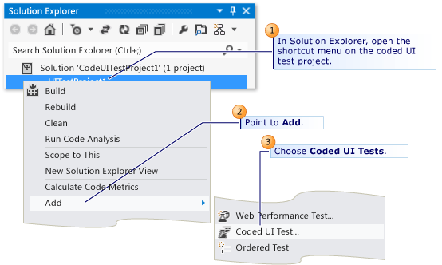
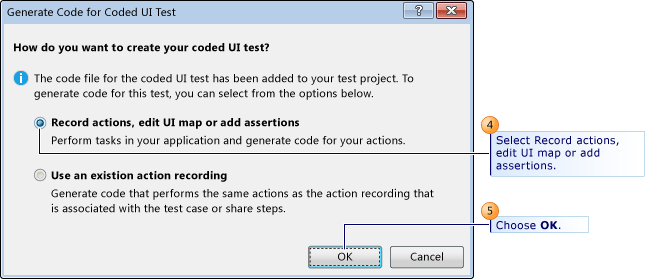
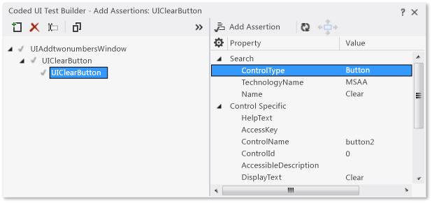
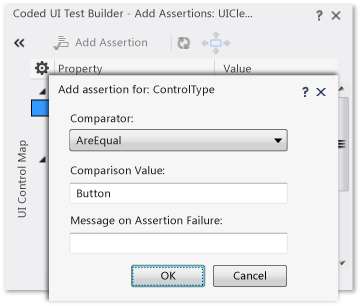
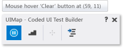

# Use UI Automation To Test Your Code
[!INCLUDE[vs2017banner](../includes/vs2017banner.md)]

Automated tests that drive your application through its user interface (UI) are known as *coded UI tests* (CUITs). These tests include functional testing of the UI controls. They let you verify that the whole application, including its user interface, is functioning correctly. Coded UI Tests are particularly useful where there is validation or other logic in the user interface, for example in a web page. They are also frequently used to automate an existing manual test.

 As shown in the following illustration, a typical development experience might be one where, initially, you simply build your application (F5) and click through the UI controls to verify that things are working correctly. You then might decide to create a coded test so that you don’t need to continue to test the application manually. Depending on the particular functionality being tested in your application, you can write code for either a functional test, or for an integration test that might or might not include testing at the UI level. If you simply want to directly access some business logic, you might code a unit test. However, under certain circumstances, it can be beneficial to include testing of the various UI controls in your application. A coded UI test can automate the initial (F5) scenario, verifying that code churn does not impact the functionality of your application.

 

 Creating a coded UI test is easy. You simply perform the test manually while the CUIT Test Builder runs in the background. You can also specify what values should appear in specific fields. The CUIT Test Builder records your actions and generates code from them. After the test is created, you can edit it in a specialized editor that lets you modify the sequence of actions.

 Alternatively, if you have a test case that was recorded in Microsoft Test Manager, you can generate code from that. For more information, see [Record and play back manual tests](/azure/devops/test/mtm/record-play-back-manual-tests).

 The specialized CUIT Test Builder and editor make it easy to create and edit coded UI tests even if your main skills are concentrated in testing rather than coding. But if you are a developer and you want to extend the test in a more advanced way, the code is structured so that it is straightforward to copy and adapt. For example, you might record a test to buy something at a website, and then edit the generated code to add a loop that buys many items.

 **Requirements**

- Visual Studio Enterprise

  For more information about which platforms and configurations are supported by coded UI tests, see [Supported Configurations and Platforms for Coded UI Tests and Action Recordings](../test/supported-configurations-and-platforms-for-coded-ui-tests-and-action-recordings.md).

  **In this topic**

- [Creating Coded UI Tests](#VerifyingCodeUsingCUITCreate)

  - [Main procedure](#VerifyingCodeUsingCUITCreate)

  - [Starting and stopping the application](#starting)

  - [Validating the properties of UI Controls](#VerifyingCodeUsingCUITGenerateAssertions)

- [Customizing your coded UI test](#VerifyingCodeCUITModify)

  - [The Generated Code](#generatedCode)

  - [Coding UI control actions and properties](#actions)

  - [Debugging](#debugging)

- [What’s Next](#VerifyCodeUsingCUITWhatsNext)

## <a name="VerifyingCodeUsingCUITCreate"></a> Creating Coded UI Tests

1. **Create a Coded UI Test project.**

    Coded UI tests must be contained in a coded UI test project. If you don’t already have a coded UI test project, create one. In **Solution Explorer**, on the shortcut menu of the solution, choose **Add**, **New Project** and then select either **Visual Basic** or **Visual C#**. Next, choose **Test**, **Coded UI Test**.

   - <em>I don't see the **Coded UI Test</em>* project templates.*

      You might be using a version of Visual Studio that does not support coded UI tests. To create coded UI tests, you must use Visual Studio Enterprise.

2. **Add a coded UI test file.**

    If you just created a Coded UI project, the first CUIT file is added automatically. To add another test file, open the shortcut menu on the coded UI test project, point to **Add**, and then choose **Coded UI Test**.

    

    In the **Generate Code for Coded UI Test** dialog box, choose **Record actions, edit UI map or add assertions**.

    

    The Coded UI Test Builder appears and Visual Studio is minimized.

    

3. **Record a sequence of actions**.

    **To start recording**, choose the **Record** icon. Perform the actions that you want to test in your application, including starting the application if that is required.

    For example, if you are testing a web application, you might start a browser, navigate to the web site, and log in to the application.

    **To pause recording**, for example if you have to deal with incoming mail, choose **Pause**.

   > [!WARNING]
   > All actions performed on the desktop will be recorded. Pause the recording if you are performing actions that may lead to sensitive data being included in the recording.

    **To delete actions** that you recorded by mistake, choose **Edit Actions**.

    **To generate code** that will replicate your actions, choose the **Generate Code** icon and type a name and description for your coded UI test method.

4. **Verify the values in UI fields such as text boxes**.

    Choose **Add Assertions** in the Coded UI Test Builder, and then choose a UI control in your running application. In the list of properties that appears, select a property, for example, **Text** in a text box. On the shortcut menu, choose **Add Assertion**. In the dialog box, select the comparison operator, the comparison value, and the error message.

    Close the assertion window and choose **Generate Code**.

    

   > [!TIP]
   > Alternate between recording actions and verifying values. Generate code at the end of each sequence of actions or verifications. If you want, you will be able to insert new actions and verifications later.

    For more details, see [Validating Properties of Controls](#VerifyingCodeUsingCUITGenerateAssertions).

5. **View the generated test code**.

    To view the generated code, close the UI Test Builder window. In the code, you can see the names that you gave to each step. The code is in the CUIT file that you created:

   ```csharp
   [CodedUITest]
   public class CodedUITest1
   { ...
     [TestMethod]
     public void CodedUITestMethod1()
     {
         this.UIMap.AddTwoNumbers();
         this.UIMap.VerifyResultValue();
         // To generate more code for this test, select
         // "Generate Code" from the shortcut menu.
     }
   }
   ```

6. **Add more actions and assertions**.

    Place the cursor at the appropriate point in the test method and then, on the shortcut menu, choose **Generate Code for Coded UI Test**. New code will be inserted at that point.

7. **Edit the detail of the test actions and the assertions**.

    Open UIMap.uitest. This file opens in the Coded UI Test Editor, where you can edit any sequence of actions that you recorded as well as edit your assertions.

    

    For more information, see [Editing Coded UI Tests Using the Coded UI Test Editor](../test/editing-coded-ui-tests-using-the-coded-ui-test-editor.md).

8. **Run the test**.

    Use Test Explorer, or open the shortcut menu in the test method, and then choose **Run Tests**. For more information about how to run tests, see [Run unit tests with Test Explorer](../test/run-unit-tests-with-test-explorer.md) and *Additional options for running coded UI tests* in the [What’s next?](#VerifyCodeUsingCUITWhatsNext) section at the end of this topic.

   The remaining sections in this topic provide more detail about the steps in this procedure.

   For a more detailed example, see  [Walkthrough: Creating, Editing and Maintaining a Coded UI Test](../test/walkthrough-creating-editing-and-maintaining-a-coded-ui-test.md). In the walkthrough, you will create a simple Windows Presentation Foundation (WPF) application to demonstrate how to create, edit, and maintain a coded UI test. The walkthrough provides solutions for correcting tests that have been broken by various timing issues and control refactoring.

### <a name="starting"></a> Starting and stopping the application under test
 *I don’t want to start and stop my application, browser, or database separately for each test. How do I avoid that?*

-  If you do not want to record the actions to start your application under test, you must start your application before you choose the **Record** icon.

- At the end of a test, the process in which the test runs is terminated. If you started your application in the test, the application usually closes.  If you do not want the test to close your application when it exits, you must add a .runsettings file to your solution and use the `KeepExecutorAliveAfterLegacyRun` option. For more information, see [Configure unit tests by using a .runsettings file](../test/configure-unit-tests-by-using-a-dot-runsettings-file.md).

-  You can add a test initialize method, identified by a [TestInitialize] attribute, which runs code at the start of each test method. For example, you could start the application from the TestInitialize method.

-  You can add a test cleanup method, identified by a [TestCleanup] attribute, that runs code at the end of each test method. For example, the method to close the application could be called from the TestCleanup method.

### <a name="VerifyingCodeUsingCUITGenerateAssertions"></a> Validating the properties of UI controls
 You can use the **Coded UI Test Builder** to add a user interface (UI) control to the [UIMap](/previous-versions/dd580454(v=vs.140)) for your test, or to generate code for a validation method that uses an assertion for a UI control.

 To generate assertions for your UI controls, choose the **Add Assertions** tool in the Coded UI Test Builder and drag it to the control on the application under test that you want to verify is correct. When the box outlines your control, release the mouse. The control class code is immediately created in the `UIMap.Designer.cs` file.

 

 The properties for this control are now listed in the **Add Assertions** dialog box.

 Another way of navigating to a particular control is to choose the arrow **(<<)** to expand the view for the **UI Control Map**. To find a parent, sibling, or child control, you can click anywhere on the map and use the arrow keys to move around the tree.

 

- *I don’t see any properties when I select a control in my application, or I don’t see the control in the UI Control Map.*

   In the application code, the control that you want to verify must have a unique ID, such as an HTML ID attribute, or a WPF UId. You might need to update the application code to add these IDs.

  Next, open the shortcut menu on the property for the UI control that you want to verify, and then point to **Add Assertion**. In the **Add Assertion** dialog box, select the **Comparator** for your assertion, for example <xref:Microsoft.VisualStudio.TestTools.UnitTesting.Assert.AreEqual%2A>, and type the value for your assertion in **Comparison Value**.

  

  When you have added all your assertions for your test, choose **OK**.

  To generate the code for your assertions and add the control to the UI map, choose the **Generate Code** icon. Type a name for your coded UI test method and a description for the method, which will be added as comments for the method. Choose **Add and Generate**. Next, choose the **Close** icon to close the **Coded UI Test Builder**. This generates code similar to the following code. For example, if the name you entered is `AssertForAddTwoNumbers`, the code will look like this example:

- Adds a call to the assert method AssertForAddTwoNumbers to the test method in your coded UI test file:

  ```
  [TestMethod]
  public void CodedUITestMethod1()
  {
      this.UIMap.AddTwoNumbers();
      this.UIMap.AssertForAddTwoNumbers();
  }
  ```

   You can edit this file to change the order of the steps and assertions, or to create new test methods. To add more code, place the cursor on the test method and on the shortcut menu choose **Generate Code for Coded UI Test**.

- Adds a method called `AssertForAddTwoNumbers` to your UI map (UIMap.uitest). This file opens in the Coded UI Test Editor, where you can edit the assertions.

   

   For more information, see [Editing Coded UI Tests Using the Coded UI Test Editor](../test/editing-coded-ui-tests-using-the-coded-ui-test-editor.md).

   You can also view the generated code of the assertion method in UIMap.Designer.cs. However, you should not edit this file. If you want to make an adapted version of the code, copy the methods to another file such as UIMap.cs, rename the methods, and edit them there.

  ```
  public void AssertForAddTwoNumbers()
  {
      ...
  }
  ```

  *The control I want to select loses focus and disappears when I try to select the Add Assertions tool from the Coded UI Test Builder. How do I select the control?*
  **Selecting a hidden control using the keyboard**

  Sometimes, when [adding controls and validating their properties](#VerifyingCodeUsingCUITGenerateAssertions), you might have to use the keyboard. For example, when you try to record a coded UI test that uses a context menu control, the list of menu items in the control will lose focus and disappear when you try to select the Add Assertions tool from the Coded UI Test Builder. This is demonstrated in the following illustration, where the context menu in Internet Explorer will lose focus and disappear if you try to select it with the Add Assertions tool.

  

  To use the keyboard to select a UI control, hover over the control with the mouse. Then hold down the **Ctrl** key and the **I** key at the same time. Release the keys. The control is recorded by the Coded UT Test Builder.

> [!WARNING]
> If you use Microsoft Lync, you must close Lync before you start the Coded UI Test Builder. Microsoft Lync interferes with the **Ctrl+I** keyboard shortcut.

 *I can’t record a mouse hover on a control. Is there a way around this?*
 **Manually recording mouse hovers**

 Under some circumstances, a particular control that’s being used in a coded UI test might require you to use the keyboard to manually record mouse hover events. For example, when you test a Windows Form or a Windows Presentation Foundation (WPF) application, there might be custom code. Or, there might be special behavior defined for hovering over a control, such as a tree node expanding when a user hovers over it. To test circumstances like these, you have to manually notify the Coded UI Test Builder that you are hovering over the control by pressing predefined keyboard keys.

 When you perform your coded UI test, hover over the control. Then press and hold Ctrl, while you press and hold the Shift and R keys on your keyboard. Release the keys. A mouse hover event is recorded by the Coded UT Test Builder.

 

 After you generate the test method, code similar to the following example will be added to the UIMap.Desinger.cs file:

```csharp
// Mouse hover '1' label at (87, 9)
Mouse.Hover(uIItem1Text, new Point(87, 9));

```

 *The key assignment for capturing mouse hover events is being used elsewhere in my environment. Can I change the default key assignment?*
 **Configuring mouse hover keyboard assignments**

 If necessary, the default keyboard assignment of Ctrl+Shift+R that is used to apply mouse hovering events in your coded UI tests can be configured to use different keys.

> [!WARNING]
> You should not have to change the keyboard assignments for mouse hover events under ordinary circumstances. Use caution when reassigning the keyboard assignment. Your choice might already be in use elsewhere within Visual Studio or the application being tested.

 To change the keyboard assignments, you must modify the following configuration file:

 `<drive letter:>\Program Files (x86)\Microsoft Visual Studio 11.0\Common7\IDE\CodedUITestBuilder.exe.config`

 In the configuration file, change the values for the `HoverKeyModifier` and `HoverKey` keys to modify the keyboard assignments:

```
<!-- Begin : Background Recorder Settings -->
<!-- HoverKey to use. -->
<add key="HoverKeyModifier" value="Control, Shift"/>
<add key="HoverKey" value="R"/>

```

 *I’m having issues with recording mouse hovers on a website. Is there a fix for this, too?*
 **Setting implicit mouse hovers for the web browser**

 In many websites, when you hover over a particular control, it expands to show additional details. Generally, these look like menus in desktop applications. Because this is a common pattern, coded UI tests enable implicit hovers for Web browsing. For example, if you record hovers in Internet Explorer, an event is fired. These events can lead to redundant hovers getting recorded. Because of this, implicit hovers are recorded with `ContinueOnError` set to `true` in the UI test configuration file. This allows playback to continue if a hover event fails.

 To enable the recording of implicit hovers in a Web browser, open the configuration file:

 `<drive letter:>\Program Files (x86)\Microsoft Visual Studio 11.0\Common7\IDE\CodedUITestBuilder.exe.config`

 Verify that the configuration file has the key `RecordImplicitiHovers` set to a to a value of `true` as shown in the following sample:

```
<!--Use this to enable/disable recording of implicit hovers.-->
<add key="RecordImplicitHover" value="true"/>

```

## <a name="VerifyingCodeCUITModify"></a> Customizing your coded UI test
 After you’ve created your coded UI test, you can edit it by using any of the following tools in Visual Studio:

- **Coded UI Test Builder:** Use the Coded UI Test Builder to add additional controls and validation to your tests. See the section [Adding controls and validating their properties](#VerifyingCodeUsingCUITGenerateAssertions) in this topic.

- **Coded UI Test Editor:** The Coded UI Test Editor lets you easily modify your coded UI tests. Using the Coded UI Test Editor, you can locate, view, and edit your test methods. You can also edit UI actions and their associated controls in the UI control map. For more information, see [Editing Coded UI Tests Using the Coded UI Test Editor](../test/editing-coded-ui-tests-using-the-coded-ui-test-editor.md).

- **Code Editor:**

  - Manually add code for the controls in your test as described in the [Coding UI control actions and properties](#actions) section in this topic.

  - After you create a coded UI test, you can modify it to be data-driven. For more information, see [Creating a Data-Driven Coded UI Test](../test/creating-a-data-driven-coded-ui-test.md).

  - In a coded UI test playback, you can instruct the test to wait for certain events to occur, such as a window to appear, the progress bar to disappear, and so on. To do this, add the appropriate UITestControl.WaitForControlXXX() method. For a complete list of the available methods, see [Making Coded UI Tests Wait For Specific Events During Playback](../test/making-coded-ui-tests-wait-for-specific-events-during-playback.md). For an example of a coded UI test that waits for a control to be enabled using the WaitForControlEnabled method, see [Walkthrough: Creating, Editing and Maintaining a Coded UI Test](../test/walkthrough-creating-editing-and-maintaining-a-coded-ui-test.md).

  - Coded UI tests include support for some of the HTML5 controls that are included in Internet Explorer 9 and Internet Explorer 10. For more information, see [Using HTML5 Controls in Coded UI Tests](../test/using-html5-controls-in-coded-ui-tests.md).

  - **Coded UI test coding guidance:**

    - [Anatomy of a Coded UI Test](../test/anatomy-of-a-coded-ui-test.md)

    - [Best Practices for Coded UI Tests](../test/best-practices-for-coded-ui-tests.md)

    - [Testing a Large Application with Multiple UI Maps](../test/testing-a-large-application-with-multiple-ui-maps.md)

    - [Supported Configurations and Platforms for Coded UI Tests and Action Recordings](../test/supported-configurations-and-platforms-for-coded-ui-tests-and-action-recordings.md)

### <a name="generatedCode"></a> The Generated Code
 When you choose **Generate Code**, several pieces of code are created:

- **A line in the test method.**

  ```csharp
  [CodedUITest]
  public class CodedUITest1
  { ...
    [TestMethod]
    public void CodedUITestMethod1()
    {
        this.UIMap.AddTwoNumbers();
        // To generate more code for this test, select
        // "Generate Code" from the shortcut menu.      }
  }
  ```

   You can right-click in this method to add more recorded actions and verifications. You can also edit it manually to extend or modify the code. For example, you could enclose some of the code in a loop.

   You can also add new test methods and add code to them in the same way. Each test method must have the `[TestMethod]` attribute.

- **A method in UIMap.uitest**

   This method includes the detail of the actions you recorded or the value that you verified. You can edit this code by opening UIMap.uitest. It opens in a specialized editor in which you can delete or refactor the recorded actions.

   Youcan also view the generated method in UIMap.Designer.cs. This method performs the actions that you recorded when you run the test.

  ```csharp
  // File: UIMap.Designer.cs
  public partial class UIMap
  {
    /// <summary>
    /// Add two numbers
    /// </summary>
    public void AddTwoNumbers()
    { ...   }
  }
  ```

  > [!WARNING]
  > You should not edit this file, because it will be regenerated when you create more tests.

   You can make adapted versions of these methods by copying them to UIMap.cs. For example, you could make a parameterized version that you could call from a test method:

  ```csharp
  // File: UIMap.cs
  public partial class UIMap // Same partial class
  {
    /// <summary>
    /// Add two numbers – parameterized version
    /// </summary>
    public void AddTwoNumbers(int firstNumber, int secondNumber)
    { ...   // Code modified to use parameters.
    }
  }
  ```

- **Declarations in UIMap.uitest**

   These declarations represent the UI controls of the application that are used by your test. They are used by the generated code to operate the controls and access their properties.

   You can also use them if you write your own code. For example, you can have your test method choose a hyperlink in a Web application, type a value in a text box, or branch off and take different testing actions based on a value in a field.

   You can add multiple coded UI tests and multiple UI map objects and files to facilitate testing a large application. For more information, see [Testing a Large Application with Multiple UI Maps](../test/testing-a-large-application-with-multiple-ui-maps.md).

  For more information about the generated code, see [Anatomy of a Coded UI Test](../test/anatomy-of-a-coded-ui-test.md).

### <a name="actions"></a> Coding UI control actions and properties
 When you work with UI test controls in coded UI tests they are separated into two parts: actions and properties.

- The first part consists of actions that you can perform on UI test controls. For example, coded UI tests can simulate mouse clicks on a UI test control, or simulate keys typed on the keyboard to affect a UI test control.

- The second part consists of enabling you to get and set properties on a UI test control. For example, coded UI tests can get the count of items in a `ListBox`, or set a `CheckBox` to the selected state.

  **Accessing Actions of UI Test Control**

  To perform actions on UI test controls, such as mouse clicks or keyboard actions, use the methods in the <xref:Microsoft.VisualStudio.TestTools.UITesting.Mouse> and <xref:Microsoft.VisualStudio.TestTools.UITesting.Keyboard> classes:

- To perform a mouse-oriented action, such as a mouse click, on a UI test control, use <xref:Microsoft.VisualStudio.TestTools.UITesting.Mouse.Click%2A>.

   `Mouse.Click(buttonCancel);`

- To perform a keyboard-oriented action, such as typing into an edit control, use <xref:Microsoft.VisualStudio.TestTools.UITesting.Keyboard.SendKeys%2A>.

   `Keyboard.SendKeys(textBoxDestination, @"C:\Temp\Output.txt");`

  **Accessing Properties of UI Test Control**

  To get and set UI control specific property values, you can directly get or set the values the properties of a control, or you can use the  <xref:Microsoft.VisualStudio.TestTools.UITesting.UITestControl.GetProperty%2A?displayProperty=fullName> and <xref:Microsoft.VisualStudio.TestTools.UITesting.UITestControl.SetProperty%2A?displayProperty=fullName> methods with the name of the specific property that you want you get or set.

  <xref:Microsoft.VisualStudio.TestTools.UITesting.UITestControl.GetProperty%2A> returns an object, which can then be cast to the appropriate <xref:System.Type>. <xref:Microsoft.VisualStudio.TestTools.UITesting.UITestControl.SetProperty%2A> accepts an object for the value of the property.

##### To get or set properties from UI test controls directly

- With controls that derive from T:Microsoft.VisualStudio.TestTools.UITesting.UITestControl, such as T:Microsoft.VisualStudio.TestTools.UITesting.HtmlControls.HtmlList or T:Microsoft.VisualStudio.TestTools.UITesting.WinControls.WinComboBox, you can get or set their property values directly, as follows:

    ```
    int i = myHtmlList.ItemCount;
    myWinCheckBox.Checked = true;
    ```

##### To get properties from UI test controls

- To get a property value from a control, use <xref:Microsoft.VisualStudio.TestTools.UITesting.UITestControl.GetProperty%2A>.

- To specify the property of the control to get, use the appropriate string from the `PropertyNames` class in each control as the parameter to <xref:Microsoft.VisualStudio.TestTools.UITesting.UITestControl.GetProperty%2A>.

- <xref:Microsoft.VisualStudio.TestTools.UITesting.UITestControl.GetProperty%2A> returns the appropriate data type, but this return value is cast as an <xref:System.Object>. The return <xref:System.Object> must then be cast as the appropriate type.

     Example:

     `int i = (int)GetProperty(myHtmlList.PropertyNames.ItemCount);`

##### To set properties for UI test controls

- To set a property in a control, use <xref:Microsoft.VisualStudio.TestTools.UITesting.UITestControl.SetProperty%2A>.

- To specify the property of the control to set, use the appropriate string from the  `PropertyNames` class as the first parameter to <xref:Microsoft.VisualStudio.TestTools.UITesting.UITestControl.SetProperty%2A>, with the property value as the second parameter.

     Example:

     `SetProperty(myWinCheckBox.PropertyNames.Checked, true);`

### <a name="debugging"></a> Debugging
 You can analyze Coded UI tests using coded UI test logs. Coded UI test logs filter and record important information about your coded UI test runs. The format of the logs lets you debug issues quickly. For more information, see [Analyzing Coded UI Tests Using Coded UI Test Logs](../test/analyzing-coded-ui-tests-using-coded-ui-test-logs.md).

## <a name="VerifyCodeUsingCUITWhatsNext"></a> What’s next?
 **Additional options for running coded UI tests:** You can run coded UI tests directly from Visual Studio, as described earlier in this topic. Additionally, you can run automated UI tests from [!INCLUDE[TCMext](../includes/tcmext-md.md)], or from [!INCLUDE[esprbuild](../includes/esprbuild-md.md)]. When coded UI tests are automated, they have to interact with the desktop when you run them, unlike other automated tests.

- [How to: Run Tests from Microsoft Visual Studio](https://msdn.microsoft.com/library/1a1207a9-2a33-4a1e-a1e3-ddf0181b1046)

- [Running Automated Tests in Microsoft Test Manager](https://msdn.microsoft.com/0632f265-63fe-4859-a413-9bb934c66835)

- [How to: Configure and Run Scheduled Tests After Building Your Application](https://msdn.microsoft.com/32acfeb1-b1aa-4afb-8cfe-cc209e6183fd)

- [Run tests in your build process](https://msdn.microsoft.com/library/d05743a1-c5cf-447e-bed9-bed3cb595e38)

- [Running automated tests from the command line](https://msdn.microsoft.com/library/f18179c6-b688-4e41-9898-8aca130c4fc3)

- [How to: Set Up Your Test Agent to Run Tests that Interact with the Desktop](/visualstudio/test/how-to-set-up-your-test-agent-to-run-tests-that-interact-with-the-desktop?view=vs-2015)

- [&#91;retired&#93; Using Coded UI Tests in Load Tests](https://msdn.microsoft.com/library/704339ff-7da7-4d5f-acb3-c3b23f4acb43)

  **Adding support for custom controls:**  The coded UI testing framework does not support every possible UI and might not support the UI you want to test. For example, you cannot immediately create a coded UI test of the UI for [!INCLUDE[ofprexcel](../includes/ofprexcel-md.md)]. However, you can create an extension to the coded UI testing framework that will support a custom control.

- [Enable Coded UI Testing of Your Controls](../test/enable-coded-ui-testing-of-your-controls.md)

- [Extending Coded UI Tests and Action Recordings to Support Microsoft Excel](../test/extending-coded-ui-tests-and-action-recordings-to-support-microsoft-excel.md)

  Coded UI Tests are often used to automate manual tests. For additional guidance, see [Testing for Continuous Delivery with Visual Studio 2012 – Chapter 5: Automating System Tests](https://go.microsoft.com/fwlink/?LinkID=255196). For more information about manual tests, see [&#91;retired&#93; Creating Manual Test Cases Using Microsoft Test Manager](https://msdn.microsoft.com/library/9989e184-c8e4-444b-998d-a1a5ec94461e). For more information about automated system tests, see [Creating Automated Tests Using Microsoft Test Manager](https://msdn.microsoft.com/7b5075ee-ddfe-411d-b1d4-94283550a5d0).

## External Resources

### Guidance
- [Testing for Continuous Delivery with Visual Studio 2012 – Chapter 2: Unit Testing: Testing the Inside](https://go.microsoft.com/fwlink/?LinkID=255188)

- [Testing for Continuous Delivery with Visual Studio 2012 – Chapter 5: Automating System Tests](https://go.microsoft.com/fwlink/?LinkID=255196)

### FAQ
- [Coded UI Tests FAQ - 1](https://go.microsoft.com/fwlink/?LinkID=230576)

- [Coded UI Tests FAQ -2](https://go.microsoft.com/fwlink/?LinkID=230578)

### Forum
- [Visual Studio UI Automation Testing (includes CodedUI)](https://go.microsoft.com/fwlink/?LinkID=224497)

## See also

- [UIMap](/previous-versions/dd580454(v=vs.140))
- <xref:Microsoft.VisualStudio.TestTools.UnitTesting.Assert>
- [Improve Code Quality](https://msdn.microsoft.com/library/73baa961-c21f-43fe-bb92-3f59ae9b5945)
- [Walkthrough: Creating, Editing and Maintaining a Coded UI Test](../test/walkthrough-creating-editing-and-maintaining-a-coded-ui-test.md)
- [Anatomy of a Coded UI Test](../test/anatomy-of-a-coded-ui-test.md)
- [Best Practices for Coded UI Tests](../test/best-practices-for-coded-ui-tests.md)
- [Testing a Large Application with Multiple UI Maps](../test/testing-a-large-application-with-multiple-ui-maps.md)
- [Editing Coded UI Tests Using the Coded UI Test Editor](../test/editing-coded-ui-tests-using-the-coded-ui-test-editor.md)
- [Supported Configurations and Platforms for Coded UI Tests and Action Recordings](../test/supported-configurations-and-platforms-for-coded-ui-tests-and-action-recordings.md)
- [Upgrading Coded UI Tests from Visual Studio 2010](../test/upgrading-coded-ui-tests-from-visual-studio-2010.md)
- [Generating a Coded UI Test from an Existing Action Recording](https://msdn.microsoft.com/library/56736963-9027-493b-b5c4-2d4e86d1d497)
