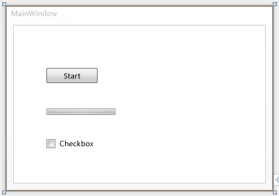
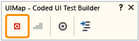

# Walkthrough: Creating, Editing and Maintaining a Coded UI Test
[!INCLUDE[vs2017banner](../includes/vs2017banner.md)]

In this walkthrough, you will create a simple Windows Presentation Foundation (WPF) application to demonstrate how to create, edit, and maintain a coded UI test. The walkthrough provides solutions for correcting tests that have been broken by various timing issues and control refactoring.

## Prerequisites
 For this walkthrough you will need:

- Visual Studio Enterprise

### Create a Simple WPF Application

1. On the **FILE** menu, point to **New**, and then select **Project**.

     The **New Project** dialog box appears.

2. In the **Installed** pane, expand **Visual C#**, and then select **Windows Desktop**.

3. Above the middle pane, verify that the target framework drop-down list is set to **.NET Framework 4.5**.

4. In the middle pane, select the **WPF Application** template.

5. In the **Name** text box, type **SimpleWPFApp**.

6. Choose a folder where you will save the project. In the **Location** text box, type the name of the folder.

7. Choose **OK**.

     The WPF Designer for Visual Studio opens and displays MainWindow of the project.

8. If the toolbox is not currently open, open it. Choose the **VIEW** menu, and then choose **Toolbox**.

9. Under the **All WPF Controls** section, drag a **Button**, **CheckBox** and **ProgressBar** control onto the MainWindow in the design surface.

10. Select the Button control. In the Properties window, change the value for the **Name** property from \<No Name> to button1. Then change the value for the **Content** property from Button to Start.

11. Select the ProgressBar control. In the Properties window, change the value for the value for the **Name** property from \<No Name> to progressBar1. Then change the value for the **Maximum** property from **100** to **10000**.

12. Select the Checkbox control. In the Properties window, change the value for the **Name** property from \<No Name> to checkBox1 and clear the **IsEnabled** property.

     

13. Double-click the button control to add a click event handler.

     The MainWindow.xmal.cs is displayed in the Code Editor with the cursor in the new button1_Click method.

14. At the top of the MainWindow class, add a delegate. The delegate will be used for the progress bar. To add the delegate, add the following code:

    ```csharp
    public partial class MainWindow : Window
    {
            private delegate void ProgressBarDelegate(System.Windows.DependencyProperty dp, Object value);

        public MainWindow()
        {

            InitializeComponent();
        }

    ```

15. In the button1_Click method, add the following code:

    ```csharp
    private void button1_Click(object sender, RoutedEventArgs e)
    {
        double progress = 0;

        ProgressBarDelegate updatePbDelegate =
            new ProgressBarDelegate(progressBar1.SetValue);

        do
        {
            progress ++;

            Dispatcher.Invoke(updatePbDelegate,
                System.Windows.Threading.DispatcherPriority.Background,
                new object[] { ProgressBar.ValueProperty, progress });
            progressBar1.Value = progress;
        }
        while (progressBar1.Value != progressBar1.Maximum);

        checkBox1.IsEnabled = true;
    }

    ```

16. Save the file.

### Verify the WPF Application Runs Correctly

1. On the **DEBUG** menu, select **Start Debugging** or press **F5**.

2. Notice that the check box control is disabled. Choose **Start**.

     In a few seconds, the progress bar should be 100% complete.

3. You can now select the check box control.

4. Close SimpleWPFApp.

### Create and Run a Coded UI Test for SimpleWPFApp

1. Locate the SimpleWPFApp application that you created earlier. By default, the application will be located at C:\Users\\<username\>\Documents\Visual Studio \<version>\Projects\SimpleWPFApp\SimpleWPFApp\bin\Debug\SimpleWPFApp.exe

2. Create a desktop shortcut to the SimpleWPFApp application. Right-click SimpleWPFApp.exe and choose **Copy**. On your desktop, right-click and choose **Paste shortcut**.

    > [!TIP]
    > A shortcut to the application makes it easier to add or modify Coded UI tests for your application because it lets you start the application quickly.

3. In Solution Explorer, right-click the solution, choose **Add** and then select **New Project**.

     The **Add New Project** dialog box appears.

4. In the **Installed** pane, expand **Visual C#**, and then select **Test**.

5. In the middle pane, select the **Coded UI Test Project** template.

6. Choose **OK**.

     In Solution Explorer, the new coded UI test project named **CodedUITestProject1** is added to your solution.

     The **Generate Code for Coded UI Test** dialog box appears.

7. Select the **Record actions, edit UI map or add assertions** option and choose **OK**.

     The UIMap – Coded UI Test Builder appears, and the Visual Studio window is minimized.

     For more information about the options in the dialog box, see [Creating Coded UI Tests](../test/use-ui-automation-to-test-your-code.md#VerifyingCodeUsingCUITCreate).

8. Choose **Start Recording** on the UIMap – Coded UI Test Builder.

     

     You can pause the recording if needed, for example if you have to deal with incoming mail.

     

    > [!WARNING]
    > All actions performed on the desktop will be recorded. Pause the recording if you are performing actions that may lead to sensitive data being included in the recording.

9. Launch the SimpleWPFApp using the desktop shortcut.

     As before, notice that the check box control is disabled.

10. On the SimpleWPFApp, choose **Start**.

     In a few seconds, the progress bar should be 100% complete.

11. Check the check box control which is now enabled.

12. Close the SimpleWPFApp application.

13. On the UIMap - Coded UI Test Builder, choose **Generate Code**.

14. In the Method Name type **SimpleAppTest** and choose **Add and Generate**. In a few seconds, the Coded UI test appears and is added to the Solution.

15. Close the UIMap – Coded UI Test Builder.

     The CodedUITest1.cs file appears in the Code Editor.

16. Save your project.

### Run the Coded UI Test

1. From the **TEST** menu, choose **Windows** and then choose **Test Explorer**.

2. From the **BUILD** menu, choose **Build Solution**.

3. In the CodedUITest1.cs file, locate the **CodedUITestMethod** method, right-click and select **Run Tests**, or run the test from Test Explorer.

     While the coded UI test runs, the SimpleWPFApp is visible. It conducts the steps that you did in the previous procedure. However, when the test tries to select the check box for the check box control, the Test Results window shows that the test failed. This is because the test tries to select the check box but is not aware that the check box control is disabled until the progress bar is 100% complete. You can correct this and similar issues by using the various `UITestControl.WaitForControlXXX()` methods that are available for coded UI testing. The next procedure will demonstrate using the `WaitForControlEnabled()` method to correct the issue that caused this test to fail. For more information, see [Making Coded UI Tests Wait For Specific Events During Playback](../test/making-coded-ui-tests-wait-for-specific-events-during-playback.md).

### Edit and Rerun the Coded UI Test

1. In the Test Explorer window, select the failed test and in the **StackTrace** section, choose the first link to **UIMap.SimpleAppTest()**.

2. The UIMap.Designer.cs file opens with the point of error highlighted in the code:

    ```csharp

    // Select 'CheckBox' check box
    uICheckBoxCheckBox.Checked = this.SimpleAppTestParams.UICheckBoxCheckBoxChecked;
    ```

3. To correct this problem, you can make the coded UI test wait for the CheckBox control to be enabled before continuing on to this line using the `WaitForControlEnabled()` method.

    > [!WARNING]
    > Do not modify the UIMap.Designer.cs file. Any code changes you make in the UIMapDesigner.cs file will be overwritten every time you generate code using the UIMap - Coded UI Test Builder. If you have to modify a recorded method, you must copy it to UIMap.cs file and rename it. The UIMap.cs file can be used to override methods and properties in the UIMapDesigner.cs file. You must remove the reference to the original method in the Coded UITest.cs file and replace it with the renamed method name.

4. In Solution Explorer, locate **UIMap.uitest** in your coded UI test project.

5. Open the shortcut menu for **UIMap.uitest** and choose **Open**.

     The coded UI test is displayed in the Coded UI Test Editor. You can now view and edit the coded UI test.

6. In the **UI Action** pane, select the test method (SimpleAppTest) that you want to move to the UIMap.cs or UIMap.vb file to facilitate custom code functionality which won’t be overwritten when the test code is recompiled.

7. Choose the **Move Code** button on the Coded UI Test Editor toolbar.

8. A Microsoft Visual Studio dialog box is displayed. It warns you that the method will be moved from the UIMap.uitest file to the UIMap.cs file and that you will no longer be able to edit the method using the Coded UI Test Editor. Choose **Yes**.

     The test method is removed from the UIMap.uitest file and no longer is displayed in the UI Actions pane. To edit the moved test file, open the UIMap.cs file from Solution Explorer.

9. On the [!INCLUDE[vsprvs](../includes/vsprvs-md.md)] toolbar, choose **Save**.

     The updates to the test method are saved in the UIMap.Designer file.

    > [!CAUTION]
    > Once you have moved the method, you can no longer edit it using the Coded UI Test Editor. You must add your custom code and maintain it using the Code Editor.

10. Rename the method from `SimpleAppTest()` to `ModifiedSimpleAppTest()`

11. Add the following using statement to the file:

    ```csharp

    using Microsoft.VisualStudio.TestTools.UITesting.WpfControls;

    ```

12. Add the following `WaitForControlEnabled()` method before the offending line of code identified previously:

    ```csharp

              uICheckBoxCheckBox.WaitForControlEnabled();

    // Select 'CheckBox' check box
    uICheckBoxCheckBox.Checked = this.SimpleAppTestParams.UICheckBoxCheckBoxChecked;

    ```

13. In the CodedUITest1.cs file, locate the **CodedUITestMethod** method and either comment out or rename the reference to the original SimpleAppTest() method and then replace it with the new ModifiedSimpleAppTest():

    ```csharp
    [TestMethod]
            public void CodedUITestMethod1()
            {
                // To generate code for this test, select "Generate Code for Coded UI Test" from the shortcut menu and select one of the menu items.
                // For more information on generated code, see http://go.microsoft.com/fwlink/?LinkId=179463
                //this.UIMap.SimpleAppTest();
                this.UIMap.ModifiedSimpleAppTest();
            }

    ```

14. On the **BUILD** menu, choose **Build Solution**.

15. Right-click the **CodedUITestMethod** method and select **Run Tests**.

16. This time the coded UI test successfully completes all the steps in the test and **Passed** is displayed in the Test Explorer window.

### Refactor a Control in the SimpleWPFApp

1. In the MainWindow.xaml file, in the Designer, select the button control.

2. At the top of the Properties window, change the **Name** property value from button1 to buttonA.

3. On the **BUILD** menu, choose **Build Solution**.

4. In Test Explorer, run **CodedUITestMethod1**.

     The test fails because the coded UI test cannot locate the button control that was originally mapped in the UIMap as button1. Refactoring can impact coded UI tests in this manner.

5. In the Test Explorer window, in the **StackTrace** section, choose the first link next to **UIMpa.ModifiedSimpleAppTest()**.

     The UIMap.cs file opens. The point of error is highlighted in the code:

    ```csharp

    // Click 'Start' button
    Mouse.Click(uIStartButton, new Point(27, 10));
    ```

     Notice that the line of code earlier in this procedure is using `UiStartButton`, which is the UIMap name before it was refactored.

     To correct the issue, you can add the refactored control to the UIMap by using the Coded UI Test Builder. You can update the test’s code to use the code, as demonstrated in the next procedure.

### Map Refactored Control and Edit and Rerun the Coded UI Test

1. In the CodedUITest1.cs file, in the **CodedUITestMethod1()** method, right-click, select **Generate Code for Coded UI Test** and then choose **Use Coded UI Test Builder**.

     The UIMap – Coded UI Test Builder appears.

2. Using the desktop shortcut you created earlier, run the SimpleWPFApp application that you created earlier.

3. On the UIMap – Coded UI Test Builder, drag the crosshair tool to the **Start** button on the SimpleWPFApp.

     The **Start** button is enclosed in a blue box and the Coded UI Test Builder takes a few seconds to process the data for the selected control and displays the controls properties. Notice that the **AutomationUId** is named **buttonA**.

4. In the properties for the control, choose the arrow at the upper-left corner to expand the UI Control Map. Notice that **UIStartButton1** is selected.

5. In the toolbar, choose the **Add control to UI Control Map**.

     The status at the bottom of the window verifies the action by displaying **Selected control has been added to the UI control map**.

6. On the UIMap – Coded UI Test Builder, choose **Generate Code**.

     The Coded UI Test Builder – Generate Code appears with a note indicating that no new method is required and that code will only be generated for the changes to the UI control map.

7. Choose **Generate**.

8. Close SimpleWPFApp.exe.

9. Close UIMap – Coded UI Test Builder.

     The UIMap – Coded UI Test Builder takes a few seconds to process the UI control map changes.

10. In Solution Explorer, open the UIMap.Designer.cs file.

11. In the UIMap.Designer.cs file, locate the UIStartButton1 property. Notice the `SearchProperties` is set to `"buttonA"`:

    ```csharp

    public WpfButton UIStartButton1
            {
                get
                {
                    if ((this.mUIStartButton1 == null))
                    {
                        this.mUIStartButton1 = new WpfButton(this);
                        #region Search Criteria
                        this.mUIStartButton1.SearchProperties[WpfButton.PropertyNames.AutomationId] = "buttonA";
                        this.mUIStartButton1.WindowTitles.Add("MainWindow");
                        #endregion
                    }
                    return this.mUIStartButton1;
                }
            }

    ```

     Now you can modify the coded UI test to use the newly mapped control. As pointed out in the previous procedure if you want to override any methods or properties in the coded UI test, you must do so in the UIMap.cs file.

12. In the UIMap.cs file, add a constructor and specify the `SearchProperties` property of the `UIStartButton` property to use the `AutomationID` property with a value of `"buttonA":`

    ```csharp

    public UIMap()
            {
                this.UIMainWindowWindow.UIStartButton.SearchProperties[WpfButton.PropertyNames.AutomationId] = "buttonA";
            }

    ```

13. On the **BUILD** menu, choose **Build Solution**.

14. In Test Explorer, run CodedUITestMethod1.

     This time, the coded UI test successfully completes all the steps in the test.  In the Test Results Window, you will see a status of **Passed**.

## External Resources

### Videos
  [Coded UI Tests-DeepDive-Episode1-GettingStarted](https://go.microsoft.com/fwlink/?LinkID=230573)

  [Coded UI Tests-DeepDive-Episode2-MaintainenceAndDebugging](https://go.microsoft.com/fwlink/?LinkID=230574)

  [Coded UI Tests-DeepDive-Episode3-HandCoding](https://go.microsoft.com/fwlink/?LinkID=230575)

### Hands on lab
 [MSDN Virtual Lab: Introduction to Creating Coded UI Tests with Visual Studio 2010](https://go.microsoft.com/fwlink/?LinkID=22508)

### FAQ
 [Coded UI Tests FAQ - 1](https://go.microsoft.com/fwlink/?LinkID=230576)

 [Coded UI Tests FAQ -2](https://go.microsoft.com/fwlink/?LinkID=230578)

### Forum
 [Visual Studio UI Automation Testing (includes CodedUI)](https://go.microsoft.com/fwlink/?LinkID=224497)

## See Also
 [Use UI Automation To Test Your Code](../test/use-ui-automation-to-test-your-code.md)
 [Getting Started with the WPF Designer](https://msdn.microsoft.com/18e61d03-b96a-4058-a166-8ec6b3f6116b)
 [Supported Configurations and Platforms for Coded UI Tests and Action Recordings](../test/supported-configurations-and-platforms-for-coded-ui-tests-and-action-recordings.md)
 [Editing Coded UI Tests Using the Coded UI Test Editor](../test/editing-coded-ui-tests-using-the-coded-ui-test-editor.md)
