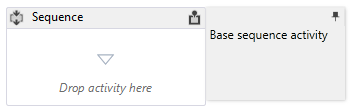
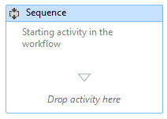

# How to: Add comments to a workflow in the Workflow Designer
To facilitate creating larger, more complicated workflows, [!INCLUDE[net_v45](../includes/net-v45-md.md)] allows the developer to add annotations to the following types of item in the designer:

- <xref:System.Activities.Activity>

- <xref:System.Activities.Statements.State>

- <xref:System.Activities.Statements.Transition>

- Classes derived from <xref:System.Activities.Statements.FlowNode>

- <xref:System.Activities.Variable>

- <xref:System.Activities.Argument>

> [!IMPORTANT]
> The contents of an annotation are saved as plain text to the XAML file associated with the workflow, and could potentially be read by others. Be cautious when entering sensitive information into an annotation.

### Adding an annotation to an activity in the designer

1. In the workflow designer, right-click on an item in the workflow designer and select **Annotations**, **Add Annotation**.

2. Add the text of the annotation in the space provided.

3. The item will show an annotation icon. Hovering over the annotation icon will display the text of the annotation.

     

### Displaying an annotation in an activity's designer

1. With an activity designer which has an annotation displaying outside the activity, click the **Pin** icon in the annotation adorner.

2. The annotation will be displayed in the activity's designer. In the screenshot below, the annotation "Starting activity in the workflow" is displayed in the activity's designer.

     

3. To display the annotation outside the activity’s designer, hover over the annotation area in the activity’s designer and click the **Unpin** icon

     

### Showing or hiding all annotations

1. Right-click an activity that has an annotation. Select **Annotations**, **Show All Annotations**.

2. All the annotations will be displayed in the activity's designers.

3. To display all annotations outside the activity's designers, right-click on the activity and select **Annotations**, **Hide All Annotations**.

### Editing or deleting an annotation for an activity

1. Right-click on an activity that has an annotation.

2. Select **Annotations**, **Edit Annotation** or **Delete Annotation**.

3. The annotation will be opened for editing or deleted.

4. To delete all the annotations at once, right-click the workflow designer and select **Annotation**, **Delete All Annotations**.

### Adding, editing, and deleting an annotation for a variable or argument

1. Right-click on a variable or argument and select Add Annotation.

2. Enter the text of the annotation. The variable or argument will display an annotation icon.

3. Right-click on a variable or argument that has an annotation. Select Edit Annotation.

4. The annotation will be opened for editing.

5. Right-click on a variable or argument that has an annotation. Select Delete Annotation.

6. The annotation will be deleted.