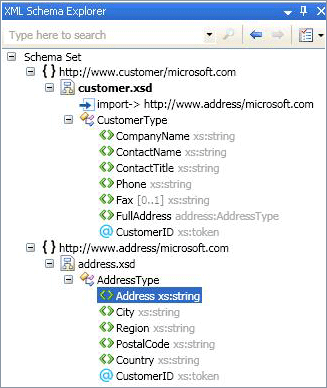

# XML Schema Explorer
[!INCLUDE[vs2017banner](../includes/vs2017banner.md)]

The XML Schema Explorer is integrated with Microsoft Visual Studio and the XML Editor to enable you to work with XML Schema definition language (XSD) schemas. When you open an XML Schema file, the **Schema Set** node appears in the XML Schema Explorer. All the included, imported, or redefined schemas for your target file, as well as any files that are referenced through an `include` or `import` statement, also appear in the XML Schema Explorer.

 The XML Schema Explorer enables you to do the following:

- Get a quick overview of the schema set.

- Browse and navigate the tree.

- Perform keyword and schema-specific searches. For more information, see [Searching the Schema Set](../xml-tools/searching-the-schema-set.md).

- Add the search results to the Graph View or Content Modle View

- Sort the tree by document order, type, or name. For more information, see [Sorting, Filtering, and Grouping](../xml-tools/sorting-filtering-and-grouping-xml-schema-explorer.md).

- Open the XML Editor and jump to code locations in the XSD file. For more information, see [Integration with XML Editor](../xml-tools/integration-with-xml-editor.md).

- Generate sample XML for global elements.

  The XML Schema Explorer provides a hierarchal view of the schema set through a tree view. The XML Schema Explorer also provides search, filtering, navigation, and sorting. To access the XML Schema Explorer, do one of the following:

- If you are on the [Start View](../xml-tools/start-view.md), click the **XML Schema Explorer** link.

- If you are on the [Graph View](../xml-tools/graph-view.md) or the [Content Model View](../xml-tools/content-model-view.md) and have nodes in your workspace, use the context menu to select the XML Schema Explorer.

- You can also select the XML Schema Explorerfrom the **View** menu.

- You can access the XML Schema Explorerfrom a .vb file that has a Visual Basic XML literal associated with an .xsd file. To see the schema set in the XML Schema Explorer, right click an XML node in an XML literal or an XML namespace import and select the **Show in Schema Explorer** command. For more information, see [Integration of XML Literals with XML Schema Explorer](../xml-tools/integration-of-xml-literals-with-xml-schema-explorer.md).

## Tree View
 The XML Schema Explorer displays pre-compiled schema set information in a tree structure. The tree structure is organized as follows:

- At the top level is the schema set node.

- The second level contains the namespaces.

- The third level contains the files.

- The fourth level contains the global nodes. This can include elements, groups, complex types, simple types, attributes, attribute groups, and `include`, `import`, and `redefine` statements.

  The following is an example of a tree structure:

  

## Selection and Activation
 To highlight and select a node, click once in the Schema Explorer.

 To activate a node, double-click it or press **Enter** when the node is selected.

- Activating a node opens the file in which this node is defined (if the file is not already open) and selects the node in the file.

- Activating a file node opens the selected file (if it is not already open) and highlights the `<schema>` node.

- Activating a SchemaSet or a namespace node does nothing.

## Draging and Dropping Nodes
 You can drag and drop global nodes, file nodes, and namespace nodes onto an XSD Designer view. If the current view is the [Start View](../xml-tools/start-view.md), dragging a node on to the view will open the [Graph View](../xml-tools/graph-view.md). If the current view is the [Content Model View](../xml-tools/content-model-view.md) or Graph View, the view will not change when you drop a node onto it.

 Dropping files on the view will add all the global nodes in the file to the [XSD Designer Workspace](../xml-tools/xml-schema-designer-workspace.md). Dropping namespaces on the view will add all the global nodes in the namespace to the workspace. The workspace is shared between all the views.

 You cannot drag and drop local nodes or imports.

## In This Section

- [Searching the Schema Set](../xml-tools/searching-the-schema-set.md)

- [Sorting, Filtering, and Grouping](../xml-tools/sorting-filtering-and-grouping-xml-schema-explorer.md)

- [Context Menus](../xml-tools/context-menus-xml-schema-explorer.md)

- [Integration of XML Literals with XML Schema Explorer](../xml-tools/integration-of-xml-literals-with-xml-schema-explorer.md)

## See Also
 [How to: Add Nodes to the Workspace from the XML Schema Explorer](../xml-tools/how-to-add-nodes-to-the-workspace-from-the-xml-schema-explorer.md)
