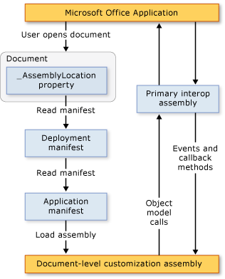

# Architecture of document-level customizations

  Visual Studio 2013 includes projects for creating document-level customizations for Microsoft Office Word and Microsoft Office Excel. This topic describes the following aspects of document-level customizations:

- [Understand customizations](#UnderstandingCustomizations)

- [Components of customizations](#Components)

- [How customizations work with Microsoft Office applications](#HowCustomizationsWork)

  [!INCLUDE[appliesto_alldoc](../vsto/includes/appliesto-alldoc-md.md)]

  For general information about creating document-level customizations, see [Office solutions development overview &#40;VSTO&#41;](../vsto/office-solutions-development-overview-vsto.md), [Get started programming document-level customizations for Word](../vsto/getting-started-programming-document-level-customizations-for-word.md), and [Get started programming document-level customizations for Excel](../vsto/getting-started-programming-document-level-customizations-for-excel.md).

##  Understand customizations
 When you use the Office developer tools in Visual Studio to build a document-level customization, you create a managed code assembly that is associated with a specific document. A document or workbook with a linked assembly is said to have managed code extensions. For more information, see [Design and create Office solutions](../vsto/designing-and-creating-office-solutions.md).

 When a user opens the document, the assembly is loaded by the Microsoft Office application. After the assembly is loaded, the customization can respond to events while the document is open. The customization can also call into the object model to automate and extend the application while the document is open, and it can use any of the classes in the .NET Framework.

 The assembly communicates with the application's COM components through the primary interop assembly of the application. For more information, see [Office primary interop assemblies](../vsto/office-primary-interop-assemblies.md) and [Office solutions development overview &#40;VSTO&#41;](../vsto/office-solutions-development-overview-vsto.md).

 If a user opens multiple document-level customizations at the same time, each assembly is loaded in a different application domain. This means that one solution that behaves incorrectly cannot cause other solutions to fail. Document-level customizations are designed to work with a single document in a single application domain. They are not designed for cross-document communication. For more information about application domains, see [Application domains](/dotnet/framework/app-domains/application-domains).

> [!NOTE]
> Document-level customizations that you create by using the Office developer tools in Visual Studio are designed to be used only when the application is started by an end user. If the application is started programmatically, for example, by using Automation, the customization might not work as expected.

### Design-time and run-time experiences
 To understand the architecture of document-level customizations, it helps to understand the experiences of designing a solution and of running a solution.

#### Design time
 The design-time experience includes the following steps:

1. The developer creates a document-level project in Visual Studio. The project includes the document and the assembly that runs behind the document. The document might already exist (created by a designer), or a new document can be created along with the project.

2. The designer—either the developer who creates the project or someone else—creates the final look and feel of the document for the end user.

#### Runtime
 The run-time experience includes the following steps:

1. The end user opens a document or workbook that has managed code extensions.

2. The document or workbook loads the compiled assembly.

3. The assembly responds to events as the user works in the document or workbook.

#### Developer and end-user perspective compared
 Because the developer works primarily in Visual Studio, and the end user works in Word or Excel, there are two ways of understanding document-level customizations.

|Developer's Perspective|End User's Perspective|
|-----------------------------|----------------------------|
|Using Visual Studio, the developer writes code that is accessible to Word and Excel.   Although it might seem that the developer is creating an executable file that runs Word or Excel, the process actually works the other way around. The document is associated with an assembly and contains a pointer to that assembly. When the document opens, Word or Excel locates the assembly and runs the code in response to all handled events.|Those who use the solution simply open the document or workbook (or create a new document from a template) just as they would open any other Microsoft Office file.   The assembly provides customizations in the document or workbook such as automatically populating it with current data, or showing a dialog box to request information.|

### Supported document formats for document-level customizations
 When you create a customization project, you can choose the format of the document that you want to use in the project. For more information, see [How to: Create Office projects in Visual Studio](../vsto/how-to-create-office-projects-in-visual-studio.md).

 The following table lists the document formats you can use in document-level customizations for Excel and Word.

|Excel|Word|
|-----------|----------|
|Excel workbook (*.xlsx*)   Excel macro-enabled workbook (*.xlsm*)   Excel binary workbook (*.xlsb*)   Excel 97-2003 workbook (*.xls*)   Excel template (*.xltx*)   Excel macro-enabled template (*.xltm*)   Excel 97-2003 template (*.xlt*)|Word document (*.docx*)   Word macro-enabled document (*.docm*)   Word 97-2003 document (*.doc*)   Word template (*.dotx*)   Word macro-enabled template (*.dotm*)   Word 97-2003 template (*.dot*)|

 You should design managed code extensions only for documents in the supported formats. Otherwise, certain events might not be raised when the document opens in the application. For example, the <xref:Microsoft.Office.Tools.Excel.Workbook.Open> event is not raised when you use managed code extensions with workbooks saved in the Excel XML spreadsheet format or in the web page (*.htm*; *.html*) format.

### Support for Word documents that have .xml file name extensions
 The document-level project templates do not allow you to create projects based on the following file formats:

- Word XML Document (*\*xml*).

- Word 2003 XML Document (*\*xml*).

  If you want your end users to use customizations in these file formats, build and deploy a customization that uses one of the supported file formats specified in the table above. After installing the customization, end users can save the document in the Word XML Document (*\*xml*) format or the Word 2003 XML Document (*\*xml*) format, and the customization will continue to work as expected.

##  Components of customizations
 The main components of a customization are the document and the assembly. In addition to these components, there are several other parts that play an important role in how Microsoft Office applications discover and load customizations.

### Deployment manifest and application manifest
 Customizations use deployment manifests and application manifests to identify and load the most current version of the customization assembly. The deployment manifest points to the current application manifest. The application manifest points to the customization assembly, and specifies the entry point class (or classes) to execute in the assembly. For more information, see [Application and deployment manifests in Office solutions](../vsto/application-and-deployment-manifests-in-office-solutions.md).

### Visual Studio Tools for Office Runtime
 To run document-level customizations that are created by using the Office developer tools in Visual Studio, end-user computers must have the  Visual Studio Tools for Office runtime  installed. The  Visual Studio Tools for Office runtime  includes unmanaged components that load the customization assembly, and also a set of managed assemblies. These managed assemblies provide the object model that your customization code uses to automate and extend the host application.

 For more information, see [Visual Studio tools for Office runtime overview](../vsto/visual-studio-tools-for-office-runtime-overview.md).

##  How customizations work with Microsoft Office applications
 When a user opens a document that is part of a Microsoft Office customization, the application uses the deployment manifest that is linked to the document to locate and load the most current version of the customization assembly. The location of the deployment manifest is stored in a custom document property named **AssemblyLocation**. The string that identifies this location is inserted into the property when you build the solution.

 The deployment manifest points to the application manifest, which then points to the most current assembly. For more information, see [Application and deployment manifests in Office solutions](../vsto/application-and-deployment-manifests-in-office-solutions.md).

 The following illustration shows the basic architecture of a document-level customization.

 

> [!NOTE]
> In Office solutions that target the .NET Framework 4, solutions call into the object model of the host application by using primary interop assembly (PIA) type information that is embedded in the solution assembly, instead of calling into the PIA directly. For more information, see [Design and create Office solutions](../vsto/designing-and-creating-office-solutions.md).

### Loading process
 The following steps occur when a user opens a document that is part of a Microsoft Office solution.

1. The Microsoft Office application checks the custom document properties to see whether there are managed code extensions associated with the document. For more information, see [Custom document properties overview](../vsto/custom-document-properties-overview.md).

2. If there are managed code extensions, the application loads *VSTOEE.dll*, which loads *VSTOLoader.dll*. These are unmanaged DLLs that are the loader components for the Visual Studio 2010 Tools for Office runtime. For more information, see [Visual Studio Tools for Office runtime overview](../vsto/visual-studio-tools-for-office-runtime-overview.md).

3. *VSTOLoader.dll* loads the .NET Framework and starts the managed portion of the  Visual Studio Tools for Office runtime .

4. If the document is opened from a location other than the local computer, the  Visual Studio Tools for Office runtime  verifies that the location of the document is in the **Trusted Locations** list in the **Trust Center Settings** for that particular Office application. If the document location is not in a trusted location, the customization is not trusted, and the load process stops here.

5. The  Visual Studio Tools for Office runtime  installs the solution if it has not been installed yet, downloads the most recent application and deployment manifests, and performs a series of security checks. For more information, see [Secure Office solutions](../vsto/securing-office-solutions.md).

6. If the customization is trusted to run, the  Visual Studio Tools for Office runtime  uses the deployment manifest and application manifest to check for assembly updates. If a new version of the assembly is available, the runtime downloads the new version of the assembly to the ClickOnce cache on the client computer. For more information, see [Deploy an Office solution](../vsto/deploying-an-office-solution.md).

7. The  Visual Studio Tools for Office runtime  creates a new application domain in which to load the customization assembly.

8. The  Visual Studio Tools for Office runtime  loads the customization assembly into the application domain.

9. The  Visual Studio Tools for Office runtime  calls the **Startup** event handler in your customization assembly. For more information, see [Events in Office projects](../vsto/events-in-office-projects.md).

## Related content
- [Architecture of Office solutions in Visual Studio](../vsto/architecture-of-office-solutions-in-visual-studio.md)
- [Architecture of VSTO Add-ins](../vsto/architecture-of-vsto-add-ins.md)
- [Visual Studio Tools for Office runtime overview](../vsto/visual-studio-tools-for-office-runtime-overview.md)
- [Secure Office solutions](../vsto/securing-office-solutions.md)
- [Design and create Office solutions](../vsto/designing-and-creating-office-solutions.md)
- [Custom document properties overview](../vsto/custom-document-properties-overview.md)
- [Cached data in document-level customizations](../vsto/cached-data-in-document-level-customizations.md)
