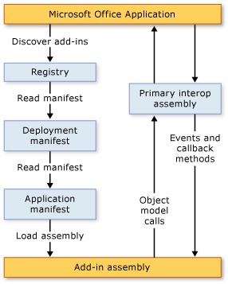

# Architecture of VSTO Add-ins

  VSTO Add-ins created by using the Office developer tools in Visual Studio have architectural features that emphasize stability and security, and enable them to work closely with Microsoft Office. This topic describes the following aspects of VSTO Add-ins:

- [Understand VSTO Add-ins](#UnderstandingAddIns)

- [Components of VSTO Add-ins](#AddinComponents)

- [How VSTO Add-ins work with Microsoft Office applications](#HowAddinsWork)

  [!INCLUDE[appliesto_allapp](../vsto/includes/appliesto-allapp-md.md)]

  For general information about creating VSTO Add-ins, see [Office solutions development overview &#40;VSTO&#41;](../vsto/office-solutions-development-overview-vsto.md) and [Get started programming VSTO Add-ins](../vsto/getting-started-programming-vsto-add-ins.md).

##  Understand VSTO Add-ins
 When you use the Office developer tools in Visual Studio to build a VSTO Add-in, you create a managed code assembly that is loaded by a Microsoft Office application. After the assembly is loaded, the VSTO Add-in can respond to events that are raised in the application (for example, when a user clicks a menu item). The VSTO Add-in can also call into the object model to automate and extend the application, and it can use any of the classes in the .NET Framework.

 The assembly communicates with the application's COM components through the primary interop assembly of the application. For more information, see [Office primary interop assemblies](../vsto/office-primary-interop-assemblies.md) and [Office solutions development overview &#40;VSTO&#41;](../vsto/office-solutions-development-overview-vsto.md).

 If multiple VSTO Add-ins are installed for an application, each VSTO Add-in is loaded in a different application domain. This means that one VSTO Add-in that behaves incorrectly cannot cause other VSTO Add-ins to fail. It also helps to ensure that when the application is closed, all the VSTO Add-in assemblies are unloaded from memory. For more information about application domains, see [Application domains](/dotnet/framework/app-domains/application-domains).

> [!NOTE]
> VSTO Add-ins that you create by using the Office developer tools in Visual Studio are designed to be used only when the host Microsoft Office application is started by an end user. If the application is started programmatically (for example, by using Automation), the VSTO Add-in might not work as expected.

##  Components of VSTO Add-ins
 Although the VSTO Add-in assembly is the main component, there are several other components that play an important role in how Microsoft Office applications discover and load VSTO Add-ins.

### Registry entries
 Microsoft Office applications discover VSTO Add-ins by looking for a set of registry entries. For a complete list of the registry entries used by VSTO Add-ins, see [Registry entries for VSTO Add-ins](../vsto/registry-entries-for-vsto-add-ins.md).

 When you build your solution, Visual Studio creates all of the required registry entries on the development computer so that you can debug and run your VSTO Add-in. For more information, see [Build Office solutions](../vsto/building-office-solutions.md).

 If you use ClickOnce to deploy your solution, the Setup program generated by the publish process automatically creates the registry keys on the end-user computer. For more information, see [Deploy an Office solution by using ClickOnce](../vsto/deploying-an-office-solution-by-using-clickonce.md).

### Deployment manifest and application manifest
 VSTO Add-ins use deployment manifests and application manifests to identify and load the most current version of the VSTO Add-in assembly. The deployment manifest points to the current application manifest. The application manifest points to the VSTO Add-in assembly, and specifies the entry point class to execute in the assembly. For more information, see [Application and deployment manifests in Office solutions](../vsto/application-and-deployment-manifests-in-office-solutions.md).

### Visual Studio Tools for Office Runtime
 To run VSTO Add-ins that are created by using the Office developer tools in Visual Studio, end-user computers must have the  Visual Studio Tools for Office runtime  installed. The runtime includes unmanaged components and a set of managed assemblies. The unmanaged components load the VSTO Add-in assembly. The managed assemblies provide the object model that your VSTO Add-in code uses to automate and extend the host application.

 For more information, see [Visual Studio Tools for Office runtime overview](../vsto/visual-studio-tools-for-office-runtime-overview.md).

##  How VSTO Add-ins work with Microsoft Office applications
 When a user starts a Microsoft Office application, the application uses the deployment manifest and the application manifest to locate and load the most current version of the VSTO Add-in assembly. The following illustration shows the basic architecture of these VSTO Add-ins.

 

> [!NOTE]
> In Office solutions that target the .NET Framework 4 or the .NET Framework 4.5, solutions call into the object model of the host application by using PIA type information that is embedded in the solution assembly, instead of calling into the PIA directly. For more information, see [Design and create Office solutions](../vsto/designing-and-creating-office-solutions.md).

### Loading process
 The following steps occur when a user starts an application:

1. The application checks the registry for entries that identify VSTO Add-ins that were created by using the Office developer tools in Visual Studio.

2. If the application finds these registry entries, the application loads VSTOEE.dll, which loads VSTOLoader.dll. These are unmanaged DLLs that are the loader components for the Visual Studio 2010 Tools for Office Runtime. For more information, see [Visual Studio Tools for Office runtime overview](../vsto/visual-studio-tools-for-office-runtime-overview.md).

3. *VSTOLoader.dll* loads the .NET Framework and starts the managed portion of the  Visual Studio Tools for Office runtime .

4. The  Visual Studio Tools for Office runtime  checks for manifest updates, and downloads the most recent application and deployment manifests.

5. The  Visual Studio Tools for Office runtime  performs a series of security checks. For more information, see [Secure Office solutions](../vsto/securing-office-solutions.md).

6. If the VSTO Add-in is trusted to run, the  Visual Studio Tools for Office runtime  uses the deployment manifest and application manifest to check for assembly updates. If a new version of the assembly is available, the runtime downloads the new version of the assembly to the ClickOnce cache on the client computer. For more information, see [Deploy an Office solution](../vsto/deploying-an-office-solution.md).

7. The  Visual Studio Tools for Office runtime  creates a new application domain in which to load the VSTO Add-in assembly.

8. The  Visual Studio Tools for Office runtime  loads the VSTO Add-in assembly into the application domain.

9. The  Visual Studio Tools for Office runtime  calls the <xref:Microsoft.Office.Tools.AddInBase.RequestComAddInAutomationService%2A> method in your VSTO Add-in, if you have overridden it.

     You can optionally override this method to expose an object in your VSTO Add-in to other Microsoft Office solutions. For more information, see [Call code in VSTO Add-ins from other Office solutions](../vsto/calling-code-in-vsto-add-ins-from-other-office-solutions.md).

10. The  Visual Studio Tools for Office runtime  calls the <xref:Microsoft.Office.Tools.AddInBase.RequestService%2A> method in your VSTO Add-in, if you have overridden it.

     You can optionally override this method to extend a Microsoft Office feature by returning an object that implements an extensibility interface. For more information, see [Customize UI features by using extensibility interfaces](../vsto/customizing-ui-features-by-using-extensibility-interfaces.md).

    > [!NOTE]
    > The  Visual Studio Tools for Office runtime  makes separate calls to the <xref:Microsoft.Office.Tools.AddInBase.RequestService%2A> method for each extensibility interface that is supported by the host application. Although the first call to the <xref:Microsoft.Office.Tools.AddInBase.RequestService%2A> method usually happens before the call to the `ThisAddIn_Startup` method, your VSTO Add-in should not make any assumptions about when the <xref:Microsoft.Office.Tools.AddInBase.RequestService%2A> method will be called, or how many times it will be called.

11. The  Visual Studio Tools for Office runtime  calls the `ThisAddIn_Startup` method in your VSTO Add-in. This method is the default event handler for the <xref:Microsoft.Office.Tools.AddInBase.Startup> event. For more information, see [Events in Office projects](../vsto/events-in-office-projects.md).

## Related content
- [Architecture of Office solutions in Visual Studio](../vsto/architecture-of-office-solutions-in-visual-studio.md)
- [Architecture of document-level customizations](../vsto/architecture-of-document-level-customizations.md)
- [Visual Studio Tools for Office runtime overview](../vsto/visual-studio-tools-for-office-runtime-overview.md)
- [Program VSTO Add-Ins](../vsto/programming-vsto-add-ins.md)
- [Develop Office solutions](../vsto/developing-office-solutions.md)
- [Secure Office solutions](../vsto/securing-office-solutions.md)
- [Deploy an Office solution](../vsto/deploying-an-office-solution.md)
