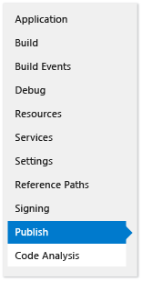
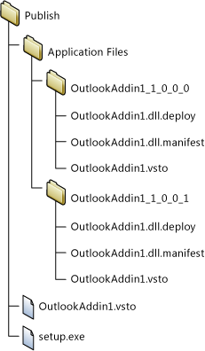
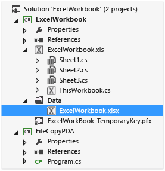
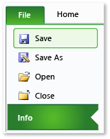
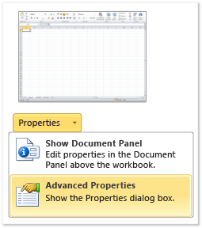
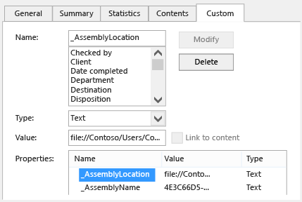

# Deploy an Office solution by using ClickOnce

  You can deploy your Office solution in fewer steps if you use ClickOnce. If you publish updates, your solution will automatically detect and install them. However, ClickOnce requires that you install your solution separately for each user of a computer. Therefore, you should consider using Windows Installer (*.msi*) if more than one user will run your solution on the same computer.

## In this topic

- [Publish the solution](#Publish)

- [Decide how you want to grant trust to the solution](#Trust)

- [Help users install the solution](#Helping)

- [Put the document of a solution onto the end user's computer (document-level customizations only)](#Put)

- [Put the document of a solution onto a server that's running SharePoint (document-level customizations only)](#SharePoint)

- [Create a custom installer](#Custom)

- [Publish an update](#Update)

- [Change the installation location of a solution](#Location)

- [Roll back a solution to an earlier version](#Roll)

  For more information about how to deploy an Office solution by creating a Windows Installer file, see [Deploy an Office solution by using Windows Installer](../vsto/deploying-a-vsto-solution-by-using-windows-installer.md).

## <a name="Publish"></a> Publish the solution
 You can publish your solution by using the **Publish Wizard** or the **Project Designer**. In this procedure, you'll use the **Project Designer** because it provides the complete set of publishing options. See [Publish wizard &#40;Office development in Visual Studio&#41;](../vsto/publish-wizard-office-development-in-visual-studio.md).

#### To publish the solution

1. In **Solution Explorer**, choose the node that's named for your project.

2. On the menu bar, choose **Project**, *ProjectName* **Properties**.

3. In the **Project Designer**, choose the **Publish** tab, which the following illustration shows.

    

4. In the **Publishing Folder Location (ftp server, or file path)** box, enter the path of the folder where you want the **Project Designer** to copy the solution files.

    You can enter any of the following types of paths.

   - A local path (for example, *C:\FolderName\FolderName*).

   - A Uniform Naming Convention (UNC) path to a folder on your network (for example, *\\\ServerName\FolderName*).

   - A relative path (for example, *PublishFolder\\*, which is the folder into which the project is published by default).

5. In the **Installation Folder URL** box, enter the fully qualified path of the location where end users will find your solution.

    If you don't know the location yet, don't enter anything into this field. By default, ClickOnce looks for updates in the folder from which your users install the solution.

6. Choose the **Prerequisites** button.

7. In the **Prerequisites** dialog box, ensure that the **Create setup program to install prerequisite components** check box is selected.

8. In the **Choose which prerequisites to install** list, select the check boxes for **Windows Installer 4.5** and the appropriate .NET Framework package.

    For example, if your solution targets the .NET Framework 4.5, select the check boxes for **Windows Installer 4.5** and **Microsoft .NET Framework 4.5 Full**.

9. If your solution targets the .NET Framework 4.5, also select the **Visual Studio 2010 Tools for Office Runtime** check box.

    > [!NOTE]
    > By default, this check box doesn't appear. To show this check box, you must create a Bootstrapper package. See [Create a Bootstrapper package for an Office 2013 VSTO Add-in with Visual Studio 2012](create-vsto-add-ins-for-office-by-using-visual-studio.md).

10. Under **Specify the install location for prerequisites**, choose one of the options that appear, and then choose the **OK** button.

     The following table describes each option.

    |Option|Description|
    |------------|-----------------|
    |**Download prerequisites from the component vendor's web site**|The user is prompted to download and install these prerequisites from the vendor.|
    |**Download prerequisites from the same location as my application**|The prerequisite software is installed with the solution. If you choose this option, Visual Studio copies all of the prerequisite packages to the publish location for you. For this option to work, the prerequisite packages must be on the development computer.|
    |**Download prerequisites from the following location**|Visual Studio copies all of the prerequisite packages to the location that you specify and installs them with the solution.|

     See [Prerequisites dialog box](../ide/reference/prerequisites-dialog-box.md).

11. Choose the **Updates** button, specify how often you want each end user's VSTO Add-in or customization to check for updates, and then choose the **OK** button.

    > [!NOTE]
    > If you're deploying by using a CD or a removable drive, choose the **Never check for updates** option button.

     For information about how to publish an update, see [Publish an update](#Update).

12. Choose the **Options** button, review the options in the **Options** dialog box, and then choose the **OK** button.

13. Choose the **Publish Now** button.

     Visual Studio adds the following folders and files to the publishing folder that you specified earlier in this procedure.

    - The **Application Files** folder.

    - The setup program.

    - A deployment manifest that points to the deployment manifest of the most recent version.

      The **Application Files** folder contains a subfolder for each version that you publish. Each version-specific subfolder contains the following files.

    - An application manifest.

    - A deployment manifest.

    - Customization assemblies.

      The following illustration shows the structure of the publish folder for an Outlook VSTO Add-in.

      

    > [!NOTE]
    > ClickOnce appends the *.deploy* extension to assemblies so that a secured installation of Internet Information Services (IIS) won't block the files because of an unsafe extension. When the user installs the solution, ClickOnce removes the *.deploy* extension.

14. Copy the solution files to the installation location that you specified earlier in this procedure.

## <a name="Trust"></a> Decide how you want to grant trust to the solution
 Before a solution can run on user computers, either you must grant trust or users must respond to a trust prompt when they install the solution. To grant trust to the solution, sign the manifests by using a certificate that identifies a known and trusted publisher. See [Trust the solution by signing the application and deployment manifests](../vsto/granting-trust-to-office-solutions.md#Signing).

 If you're deploying a document-level customization and you want to put the document into a folder on the user's computer or make the document available on a SharePoint site, ensure that Office trusts the location of the document. See [Grant trust to documents](../vsto/granting-trust-to-documents.md).

## <a name="Helping"></a> Help users install the solution
 Users can install the solution by running the setup program, opening the deployment manifest, or during document-level customization, opening the document directly. As a best practice, users should install your solution by using the setup program. The other two approaches don't ensure that the prerequisite software is installed. If users want to open the document from the installation location, they must add it to the list of trusted locations in the Trust Center of the Office application.

### Opening the document of a document-level customization
 Users can open the document of a document-level customization directly from the installation location or by copying the document to their local computer and then opening the copy.

 As a best practice, users should open a copy of the document on their computers so that multiple users won't try to open the same copy at the same time. To enforce this practice, you can configure your setup program to copy the document to user computers. See [Put the document of a solution onto the end user's computer (document-level customizations only)](#Put).

### Install the solution by opening the deployment manifest from an IIS website
 Users can install an Office solution by opening the deployment manifest from the web. However, a secured installation of Internet Information Services (IIS) will block files that have the *.vsto* extension. The MIME type must be defined in IIS before you can deploy an Office solution by using IIS.

##### To add the .vsto MIME type to IIS 6.0

1. On the server that's running IIS 6.0, choose **Start** > **All Programs** > **Administrative Tools** >  **Internet Information Services (IIS) Manager**.

2. Choose the computer name, the **Web Sites** folder, or the web site that you're configuring.

3. On the menu bar, choose **Action** > **Properties**.

4. On the **HTTP Headers** tab, choose the **MIME Types** button.

5. In the **MIME Types** window, choose the **New** button.

6. In the **MIME Type** window, enter **.vsto** as the extension, enter **application/x-ms-vsto** as the MIME type, and then apply the new settings.

    > [!NOTE]
    > For the changes to take effect, you must restart the World Wide Web Publishing Service or wait for the worker process to recycle. You must then flush the browser's disk cache and then try to open the *.vsto* file again.

##### To add the .vsto MIME type to IIS 7.0

1. On the server that's running IIS 7.0, choose **Start** > **All Programs** > **Accessories**.

2. Open the shortcut menu for **Command Prompt**, and then choose  **Run as administrator.**

3. In the **Open** box, enter the following path, and then choose the **OK** button.

    ```cmd
    %windir%\system32\inetsrv
    ```

4. Enter the following command, and then apply the new settings.

    ```cmd
    set config /section:staticContent /+[fileExtension='.vsto',mimeType='application/x-ms-vsto']
    ```

    > [!NOTE]
    > For the changes to take effect, you must restart the World Wide Web Publishing Service, or you must wait for the worker process to recycle. You must then flush the browser's disk cache and then try to open the *.vsto* file again.

## <a name="Put"></a> Put the document of a solution onto the end user's computer (document-level customizations only)
 You can copy the document of your solution onto the end user's computer for them by creating a post-deployment action. That way, the user doesn't have to manually copy the document from the installation location to their computer after they install your solution. You'll have to create a class that defines the post-deployment action, build and publish the solution, modify the application manifest, and re-sign the application and deployment manifest.

 The following procedures assume that your project name is **ExcelWorkbook** and that you publish the solution into a created folder named **C:\publish** on your computer.

### Create a class that defines the post-deployment action

1. On the menu bar, choose **File** > **Add** > **New Project**.

2. In the **Add New Project** dialog box, in the **Installed Templates** pane, choose the **Windows** folder.

3. In the **Templates** pane, choose the **Class Library** template.

4. In the **Name** field, enter **FileCopyPDA**, and then choose the **OK** button.

5. In **Solution Explorer**, choose the **FileCopyPDA** project.

6. On the menu bar, choose **Project** > **Add Reference**.

7. On the **.NET** tab, add references to `Microsoft.VisualStudio.Tools.Applications.Runtime` and `Microsoft.VisualStudio.Tools.Applications.ServerDocument`.

8. Rename the class to `FileCopyPDA`, and then replace the contents of the file with the code. This code performs the following tasks:

   - Copies the document to the user's desktop.

   - Changes the _AssemblyLocation property from a relative path to a fully qualified path for the deployment manifest.

   - Deletes the file if the user uninstalls the solution.

     ### [C#](#tab/csharp)
     :::code language="csharp" source="../vsto/codesnippet/CSharp/trin_excelworkbookpda/filecopypda/class1.cs" id="Snippet7":::

     ### [VB](#tab/vb)
     :::code language="vb" source="../vsto/codesnippet/VisualBasic/trin_excelworkbookpda/filecopypda/class1.vb" id="Snippet7":::
     ---

### Build and publish the solution

1. In **Solution Explorer**, open the shortcut menu for the **FileCopyPDA** project, and then choose **Build**.

2. Open the shortcut menu for the **ExcelWorkbook** project, and then choose **Build**.

3. Open the shortcut menu for the **ExcelWorkbook** project, and then choose **Add Reference**.

4. In the **Add Reference** dialog box, choose the **Projects** tab, choose **FileCopyPDA**, and then choose the **OK** button.

5. In **Solution Explorer**, choose the **ExcelWorkbook** project.

6. On menu bar, choose **Project** > **New Folder**.

7. Enter **Data**, and then choose the **Enter** key.

8. In **Solution Explorer**, choose the **Data** folder.

9. On the menu bar, choose **Project** > **Add Existing Item**.

10. In the **Add Existing Item** dialog box, browse to the output directory for the **ExcelWorkbook** project, choose the **ExcelWorkbook.xlsx** file, and then choose the **Add** button.

11. In **Solution Explorer** choose the **ExcelWorkbook.xlsx** file.

12. In the **Properties** window, change the **Build Action** property to **Content** and the **Copy to Output Directory** property to **Copy if newer**.

     When you've completed these steps, your project will resemble the following illustration.

     

13. Publish the **ExcelWorkbook** project.

### Modify the application manifest

1. Open the solution directory, **c:\publish**, by using **File Explorer**.

2. Open the **Application Files** folder, and then open the folder that corresponds to the most recent published version of your solution.

3. Open the **ExcelWorkbook.dll.manifest** file in a text editor such as Notepad.

4. After the `</vstav3:update>` element, add following code. For the class attribute of the `<vstav3:entryPoint>` element, use the following syntax: *NamespaceName.ClassName*. In the following example, the namespace and class names are the same, so the resulting entry point name is `FileCopyPDA.FileCopyPDA`.

    ```xml
    <vstav3:postActions>
      <vstav3:postAction>
        <vstav3:entryPoint
          class="FileCopyPDA.FileCopyPDA">
          <assemblyIdentity
            name="FileCopyPDA"
            version="1.0.0.0"
            language="neutral"
            processorArchitecture="msil" />
        </vstav3:entryPoint>
        <vstav3:postActionData>
        </vstav3:postActionData>
      </vstav3:postAction>
    </vstav3:postActions>
    ```

### Re-sign the application and deployment manifests

1. In the **%USERPROFILE%\Documents\Visual Studio 2013\Projects\ExcelWorkbook\ExcelWorkbook** folder, copy the **ExcelWorkbook_TemporaryKey.pfx** certificate file, and then paste it into the *PublishFolder* **\Application Files\ExcelWorkbook**\__MostRecentPublishedVersion_ folder.

2. Open the Visual Studio command prompt, and then change directories to the **c:\publish\Application Files\ExcelWorkbook**\__MostRecentPublishedVersion_ folder (for example, **c:\publish\Application Files\ExcelWorkbook_1_0_0_4**).

3. Sign the modified application manifest by running the following command:

    ```cmd
    mage -sign ExcelWorkbook.dll.manifest -certfile ExcelWorkbook_TemporaryKey.pfx
    ```

     The message "ExcelWorkbook.dll.manifest successfully signed" appears.

4. Change to the **c:\publish** folder, and then update and sign the deployment manifest by running the following command:

    ```cmd
    mage -update ExcelWorkbook.vsto -appmanifest "Application Files\Ex
    celWorkbookMostRecentVersionNumber>\ExcelWorkbook.dll.manifest" -certfile "Application Files\ExcelWorkbookMostRecentVersionNumber>\ExcelWorkbook_TemporaryKey.pfx"
    ```

    > [!NOTE]
    > In the previous example, replace MostRecentVersionNumber with the version number of the most recently published version of your solution (for example, **1_0_0_4**).

     The message "ExcelWorkbook.vsto successfully signed" appears.

5. Copy the *ExcelWorkbook.vsto* file to the **c:\publish\Application Files\ExcelWorkbook**\__MostRecentVersionNumber_ directory.

## <a name="SharePoint"></a> Put the document of a solution onto a server that's running SharePoint (document-level customizations only)
 You can publish your document-level customization to end users by using SharePoint. When users go to the SharePoint site and open the document, the runtime automatically installs the solution from the shared network folder to the user's local computer. After the solution is installed locally, the customization will still function even if the document is copied elsewhere, such as the desktop.

#### To put the document on a server that's running SharePoint

1. Add the solution document to a document library on a SharePoint site.

2. Perform the steps for one of the following approaches:

    - Use the Office Configuration Tool to add the server that's running SharePoint to the Trust Center in Word or Excel on all user computers.

         See [Security policies and settings in Office 2010](/previous-versions/office/office-2010/cc178946(v=office.14)).

    - Ensure that each user performs the following steps.

        1. On the local computer, open Word or Excel, choose the **File** tab, and then choose the **Options** button.

        2. In the **Trust Center** dialog box, choose the **Trusted Locations** button.

        3. Select the **Allow Trusted Locations on my network (not recommended)** check box, and then choose the **Add new location** button.

        4. In the **Path** box, enter the URL of the SharePoint document library that contains the document that you uploaded (for example, *http://SharePointServerName/TeamName/ProjectName/DocumentLibraryName*).

             Don't add the name of the default Web page, such as *default.aspx* or *AllItems.aspx*.

        5. Select the **Subfolders of this location are also trusted** check box, and then choose the **OK** button.

             When users open the document from the SharePoint site, the document opens, and the customization is installed. Users can copy the document to their desktop. The customization will still run because properties in the document point to the network location of the document.

## <a name="Custom"></a> Create a custom installer
 You can create a custom installer for your Office solution, instead of using the setup program that's created for you when you publish the solution. For example, you could use a sign in script to start the installation, or you could use a batch file to install the solution without user interaction. These scenarios work best if the prerequisites are already installed on end-user computers.

 As part of your custom installation process, call the installer tool for Office solutions (*VSTOInstaller.exe*), which is installed in the following location by default:

 *%commonprogramfiles%\microsoft shared\VSTO\10.0\VSTOInstaller.exe*

 If the tool isn't in that location, you can use the **HKEY_LOCAL_MACHINE\SOFTWARE\Microsoft\VSTO Runtime Setup\v4\InstallerPath** or **HKEY_LOCAL_MACHINE\SOFTWARE\Wow6432Node\Microsoft\VSTO Runtime Setup\v4\InstallerPath** registry key to find the path to that tool.

 You can use the following parameters with *VSTOinstaller.exe*.

| Parameter | Definition |
|------------------| - |
| /Install or /I | Install the solution. You must follow this option with the path of a deployment manifest. You can specify a path on the local computer, a universal naming convention (UNC) file share. You can specify a local path (*C:\FolderName\PublishFolder*), a relative path (*Publish\\*), or a fully qualified location (*\\\ServerName\FolderName* or http://<em>ServerName/FolderName</em>). |
| /Uninstall or /U | Uninstall the solution. You must follow this option with the path of a deployment manifest. You can specify a path can be on the local computer, a UNC file share. You can specify a local path (*c:\FolderName\PublishFolder*), a relative path (*Publish\\*), or a fully qualified location (*\\\ServerName\FolderName* or http://<em>ServerName/FolderName</em>). |
| /Silent or /S | Install or uninstall without prompting the user for input or displaying any messages. If a trust prompt is required, the customization isn't installed or updated. |
| /Help or /? | Display the Help information. |

 When you run *VSTOinstaller.exe*, the following error codes might appear.

|Error Code|Definition|
|----------------|----------------|
|0|The solution was successfully installed or uninstalled, or the VSTOInstaller Help appeared.|
|-100|One or more command-line options aren't valid or was set more than once. For more information, enter "vstoinstaller /?" or see [Create a custom installer for a ClickOnce Office solution](/previous-versions/bb772078(v=vs.110)).|
|-101|One or more command-line options aren't valid. For more information, enter "vstoinstaller /?".|
|-200|The deployment manifest URI isn't valid. For more information, enter "vstoinstaller /?".|
|-201|The solution couldn't be installed because the deployment manifest isn't valid. See [Deployment manifests for Office solutions](../vsto/deployment-manifests-for-office-solutions.md).|
|-202|The solution couldn't be installed because the Visual Studio Tools for Office section of the application manifest isn't valid. See [Application manifests for Office solutions](../vsto/application-manifests-for-office-solutions.md).|
|-203|The solution couldn't be installed because a download error occurred. Check the URI or network file location of the deployment manifest, and then try again.|
|-300|The solution couldn't be installed because a security exception occurred. See [Secure Office solutions](../vsto/securing-office-solutions.md).|
|-400|The solution couldn't be installed.|
|-401|The solution couldn't be uninstalled.|
|-500|The operation has been canceled because the solution couldn't be installed or uninstalled or the deployment manifest couldn't be downloaded.|

## <a name="Update"></a> Publish an update
 To update a solution, you publish it again by using the **Project Designer** or **Publish Wizard**, and then you copy the updated solution to the installation location. When you copy the files to the installation location, make sure that you overwrite the previous files.

 The next time that the solution checks for an update, it will find and load the new version automatically.

## <a name="Location"></a> Change the installation location of a solution
 You can add or change the installation path after a solution is published. You might want to change the installation path for one or more of the following reasons:

- The setup program was compiled before the installation path was known.

- The solution files have been copied to a different location.

- The server that hosts the installation files has a new name or location.

  To change the installation path of a solution, you must update the setup program, and then users must run it. For document-level customizations, users must also update a property in their document to point to the new location.

> [!NOTE]
> If you don't want to ask users to update their document properties, you can ask users to get the updated document from the installation location.

#### To change the installation path in the setup program

1. Open a **Command Prompt** window, and then change directories to the installation folder.

2. Run the setup program, and include the `/url` parameter, which takes the new installation path as a string.

    The following example shows how to change the installation path to a location on the Fabrikam website, but you can replace that URL with the path that you want:

   ```cmd
   setup.exe /url="http://www.fabrikam.com/newlocation"
   ```

   > [!NOTE]
   > If a message appears and state that the signature of the executable will be invalidated, the certificate that was used to sign the solution is no longer valid, and the publisher is unknown. As a result, users will need to confirm that they trust the source of the solution before they can install it.

   > [!NOTE]
   > To display the current value of the URL, run `setup.exe /url`.

   For document-level customizations, users must open the document and then update its _AssemblyLocation property. The following steps describe how users can perform this task.

#### To update the _AssemblyLocation property in a document

1. On the **File** tab, choose **Info**, which the following illustration shows.

     

2. In the **Properties** list, choose **Advanced Properties**, which the following illustration shows.

     

3. On the **Custom** tab in the **Properties** list, choose _AssemblyLocation, as the following illustration shows.

     

     The **Value** box contains the deployment manifest identifier.

4. Before the identifier, enter the fully qualified path of the document, followed by a bar, in the format *Path*|*Identifier* (for example, *File://ServerName/FolderName/FileName|74744e4b-e4d6-41eb-84f7-ad20346fe2d9*.

     For more information about how to format this identifier, see [Custom document properties overview](../vsto/custom-document-properties-overview.md).

5. Choose the **OK** button, and then save and close the document.

6. Run the setup program without the /url parameter to install the solution in the specified location.

## <a name="Roll"></a> Roll back a solution to an earlier version
 When you roll back a solution, you revert users back to an earlier version of that solution.

#### To roll back a solution

1. Open the installation location of the solution.

2. In the top-level publish folder, delete the deployment manifest (the *.vsto* file).

3. Find the subfolder for the version to which you want to roll back.

4. Copy the deployment manifest from that subfolder to the top-level publish folder.

     For example, to roll back a solution that's called **OutlookAddIn1** from version 1.0.0.1 to version 1.0.0.0, copy the file **OutlookAddIn1.vsto** from the **OutlookAddIn1_1_0_0_0** folder. Paste the file into the top-level publish folder, overwriting the version-specific deployment manifest for **OutlookAddIn1_1_0_0_1** that was already there.

     The following illustration shows the publish folder structure in this example.

     

     The next time that a user opens the application or customized document, the deployment manifest change is detected. The earlier version of the Office solution runs from the ClickOnce cache.

> [!NOTE]
> Local data is saved for only one previous version of a solution. If you roll back two versions, local data isn't retained. For more information about local data, see [Access local and remote data in ClickOnce applications](../deployment/accessing-local-and-remote-data-in-clickonce-applications.md).

## Related content

- [Deploy an Office solution](../vsto/deploying-an-office-solution.md)
- [Publish Office solutions](../vsto/deploying-an-office-solution-by-using-clickonce.md)
- [How to: Publish an Office solution by using ClickOnce](/previous-versions/bb386095(v=vs.110))
- [How to: Install a ClickOnce Office solution](/previous-versions/bb608592(v=vs.110))
- [How to: Publish a document-level Office solution to a SharePoint server by using ClickOnce](/previous-versions/bb608595(v=vs.110))
- [Create a custom installer for a ClickOnce office solution](/previous-versions/bb772078(v=vs.110))
