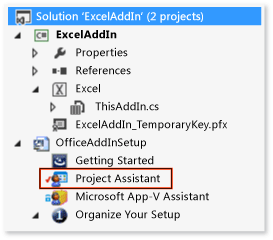
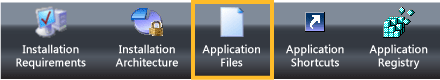
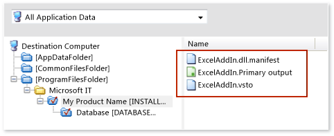
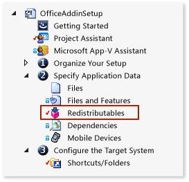
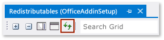
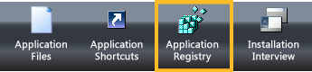

# Deploy an Office solution by using Windows Installer

Learn how to create a Windows Installer for your Office solution by using [!INCLUDE[vs_dev12](../vsto/includes/vs-dev12-md.md)].

By using Visual Studio to create a Windows Installer, you can deploy an Office solution that requires administrative access on the end user's computer. For example, you can use such a file to install a solution only once for all users of a computer. You can also deploy an Office solution by using ClickOnce, but that solution must be installed separately for each user of the computer.

[!include[Add-ins note](includes/addinsnote.md)]

## In this topic

- [Download VSTO Add-in samples](#Download)

- [Get InstallShield Limited Edition](#Obtain)

- [Decide how to grant trust to the solution](#ApplySecurity)

- [Create a setup project](#Create)

- [Add the project output](#Add)

- [Add the deployment and application manifests](#AddD)

- [Configure the dependent components as prerequisites](#Configure)

- [Specify where you want to deploy the solution on the user's computer](#Location)

- [Configure a VSTO Add-in](#ConfigureRegistry)

- [Configure a document-level customization](#ConfigureDocument)

- [Build the setup project](#Build)

For more information about how to deploy an Office solution by using ClickOnce, see [Deploy an Office solution by using ClickOnce](../vsto/deploying-an-office-solution-by-using-clickonce.md).

For information about how to create a Windows Installer file by using [!INCLUDE[vs_dev10_long](../sharepoint/includes/vs-dev10-long-md.md)], see [Deploy a Visual Studio 2010 Tools for Office solution using Windows Installer](/previous-versions/visualstudio/visual-studio-2010/ff937654(v=msdn.10)).

## <a name="Download"></a>Download samples
This topic refers to the following downloadable samples.

|Sample<br /><br />|Description<br /><br />|
|----------|---------------|
|[ExcelAddIn](https://code.msdn.microsoft.com/VSTO-Deploy-an-Office-fbcc09ad)<br /><br />|An Excel VSTO Add-in that you can install on a computer that runs a 32-bit or 64-bit version of Office.<br /><br />|
|[ExcelWorkbook](https://code.msdn.microsoft.com/VSTO-Deploy-a-Customization-f70fae33)<br /><br />|An Excel document-level customization that you can install on a computer that runs a 32-bit or 64-bit version of Office.<br /><br />|

## <a name="ApplySecurity"></a>Decide how to grant trust to the solution
Before a solution can run on user computers, you must grant trust in either of the following ways, or users must respond to a trust prompt when they install the solution.

- Sign the manifests by using a certificate that identifies a known and trusted publisher. For more information, see [Trust the solution by signing the application and deployment manifests](../vsto/granting-trust-to-office-solutions.md#Signing).

- Install the solution to the Program Files directory on the user's computer.

> [!NOTE]
> For document-level customizations, the location of the document must also be trusted. For more information, see [Grant trust to documents](../vsto/granting-trust-to-documents.md).

## <a name="Obtain"></a>Get InstallShield Limited Edition

You can create a Windows Installer file by using InstallShield Limited Edition (ISLE), which is free if you've installed Visual Studio. ISLE replaces the functionality of the project templates for setup and deployment that previous versions of Visual Studio offered.

### To get InstallShield Limited Edition

1. On the menu bar, choose **File** > **New** > **Project**.

   The **New Project** dialog box opens.

2. In the templates pane, expand **Other Project Types**, and then choose the **Setup and Deployment** template.

3. In the list of project types for **Setup and Deployment**, choose **Enable InstallShield Limited Edition**, and then choose the **OK** button.

   A page appears that provides information about how to get InstallShield Limited Edition.

4. On that page, choose the **Go to the download web site** link.

5. On the download page for InstallShield Limited Edition, enter the required information into the appropriate fields, and then choose the **Download Now** link.

   After you download, install, and activate the product, the **InstallShield Limited Edition Project** template appears in Visual Studio.

## <a name="Create"></a>Create a setup project

1. In [!INCLUDE[vsprvs](../sharepoint/includes/vsprvs-md.md)], open the Office project that you want to deploy.

   The VSTO Add-in samples that are associated with this topic contain a project that's named **ExcelAddIn**. The document-level customization samples contain a project that's named **ExcelWorkbook**. This topic will refer to the Office project in your solution by using one of those two names.

2. On the menu bar, choose **File** > **Add** > **New Project**.

   The **Add New Project** dialog box opens.

3. In the templates pane, expand **Other Project Types**, and then choose the **Setup and Deployment** template.

4. In the list of project types for **Setup and Deployment**, choose **InstallShield Limited Edition Project**, name the project, and then choose the **OK** button.

   The InstallShield setup project that you created appears in your solution.

   The samples for this topic contain a setup project that's named **OfficeAddInSetup**. This topic will refer to the setup project in your solution by using the same name.

## <a name="Add"></a>Add the project output

You configure the **OfficeAddInSetup** project to include the output of your Office project. For VSTO Add-in projects, the project output is the solution assembly only. For document-level customization projects, the project output includes not only the solution assembly but also the document itself.

### To add the project output

1. In **Solution Explorer**, expand the **OfficeAddInSetup** project node, and then choose the **Project Assistant** file, which the following illustration shows.

   

2. On the menu bar, choose **View** > **Open**.

3. At the bottom of the **Project assistant** page, choose the **Application Files** button, which the following illustration shows.

   

4. In the **Application Files** page, choose the **Add Project Outputs** button.

5. In the **Visual Studio Output Selector** dialog box, select the **Primary Output** check box, and then choose the **OK** button.

## <a name="AddD"></a>Add the deployment and application manifests

1. In the **Application Files** page, choose the **Add Files** button.

2. In the **Open** dialog box, browse to the output directory of the **ExcelAddIn** project.

   Usually, the output directory is the **bin\release** subfolder of the project root directory, depending on the build configuration that you choose.

3. In the output directory, choose the **ExcelAddIn.vsto** and **ExcelAddIn.dll.manifest** files, and then choose the **Open** button.

   The **Application Files** page now contains the project output file, the deployment manifest, and the application manifest, as the following illustration shows.

   

## <a name="Configure"></a>Configure the dependent components as prerequisites

In your setup application, you must include not only the following components but also any other components that are required for your solution to run.

- The version of the .NET Framework that your Office solution targets.

- The Microsoft Visual Studio 2010 Tools for Office Runtime.

### Add the .NET Framework 4 or the .NET Framework 4.5 as a prerequisite

1. In **Solution Explorer**, expand the **OfficeAddInSetup** project node, expand the **Specify Application Data** node, and then choose the **Redistributables** file, which the following illustration shows.

   

2. On the menu bar, choose **View** > **Open**.

   The **Redistributables** page opens.

3. In the list of redistributable components, select appropriate the check box for the version of the .NET Framework that your solution targets.

   For example, if your solution targets the [!INCLUDE[net_v45](../vsto/includes/net-v45-md.md)], select the **Microsoft .NET Framework 4.5 Full** check box. A dialog box might appear asking whether you want to install the redistributable component, which InstallShield requires before you can add the component as a prerequisite. If this dialog box doesn't appear, the component already exists on your computer.

4. If this dialog box appears, choose the **No** button.

### <a name="AddToolsForOffice"></a>Add the Visual Studio 2010 Tools for Office Runtime

The **Redistributables** page contains an item that's named **Microsoft VSTO 2010 Runtime**, but it refers to an older version of the runtime. Therefore, you could manually create a configuration file that refers to the most recent version. You must then put that file into the same directory as the configuration files for all of the other items that appear in the **Redistributables** page.

#### To add the Visual Studio 2010 Tools for Office runtime as a prerequisite

1. Open Notepad, and then paste the following XML into a text file.

   ```xml
   <?xml version="1.0" encoding="UTF-8"?>
   <SetupPrereq>
   <conditions>
       <condition Type="32" Comparison="2" Path="HKEY_LOCAL_MACHINE\SOFTWARE\Microsoft\VSTO Runtime Setup\v4R" FileName="Version" ReturnValue="10.0.50903" Bits="2"></condition>
   <condition Type="32" Comparison="2" Path="HKEY_LOCAL_MACHINE\SOFTWARE\Wow6432Node\Microsoft\VSTO Runtime Setup\v4R" FileName="Version" ReturnValue="10.0.50903" Bits="2"></condition>
   </conditions>
   <files>
       <file LocalFile="<ISProductFolder>\SetupPrerequisites\VSTOR\vstor_redist.exe" URL="http://download.microsoft.com/download/C/0/0/C001737F-822B-48C2-8F6A-CDE13B4B9E9C/vstor_redist.exe" CheckSum="88b8aa9e8c90818f98c80ac4dd998b88" FileSize=" 0,40117912"></file>
   </files>
   <execute file="vstor_redist.exe" returncodetoreboot="1641,3010" requiresmsiengine="1">
   </execute>
   <properties Id="{15965040-56BB-49B8-A88F-3525C48D9BA8}" Description="This prerequisite installs the most recent version of the Microsoft Visual Studio 2010 Tools for Office Runtime." >
   </properties>

   </SetupPrereq>
   ```

2. Generate a GUID in Visual Studio. On the **Tools** menu, choose **Create GUID**.

3. In the **GUID generator** program, choose the **Registry Format** option button, choose the **Copy** button, and then choose the **Exit** button.

4. In Notepad, replace the text **Your GUID goes here** by pasting the GUID in its place.

   The **&lt;properties&gt;** element of your file resembles the following.

   ```xml
   <properties Id="{87989B73-21DC-4403-8FD1-0C68A41A6D8C}" Description="This prerequisite installs the most recent version of the Microsoft Visual Studio 2010 Tools for Office Runtime." >
   </properties>
   ```

5. On the menu bar in Notepad, choose **File** > **Save**.

6. In the **Save As** dialog box, browse to your **Desktop** folder.

7. In the **Save as type** list, choose **All Files (&#42;.&#42;)**.

8. In the **File name** box, enter **Visual Studio 2010 Tools for Office Runtime.prq**, and then choose the **Save** button.

   > [!NOTE]
   > Make sure that you add **.prq** at the end of the file name to identify this file as a prerequisite file.

9. Close Notepad.

10. From your **Desktop** folder, copy the *Visual Studio 2010 Tools for Office Runtime.prq* file to one of the following directories on your computer.

   For 32-bit operating systems: *%ProgramFiles%\InstallShield\2013LE\SetupPrerequisites\\*

   For 64-bit operating systems: *%ProgramFiles(x86)%\2013LE\SetupPrerequisites\\*

11. In the **Redistributable** page of the InstallShield project, choose the **Refresh** button to refresh the list of redistributable components, as the following illustration shows.

   

12. In the list of redistributable components, select the **Visual Studio 2010 Tools for Office Runtime** check box.

   A dialog box might appear asking whether you want to install the redistributable component. If this dialog box doesn't appear, you can skip to the [Specify where you want to deploy the solution on the user's computer](#Location) section of this topic.

13. If this dialog box appears, choose the **No** button.

## <a name="Location"></a>Specify where to install the solution on the user's computer

1. In **Solution Explorer**, expand the **OfficeAddInSetup** node, expand the **Organize your Setup** node, and then choose the **General Information** file.

2. On the menu bar, choose **View** > **Open**.

3. In the list of properties, choose the **Browse** button next to the **INSTALLDIR** property.

4. In the **Set INSTALLDIR** dialog box, choose a folder on the user's computer where you want to install the solution.

   > [!NOTE]
   > You can also create subdirectories in the **Set INSTALLDIR** dialog box by opening the shortcut menu for any folder in the list.

## <a name="ConfigureRegistry"></a>Configure a VSTO Add-in

You can specify whether you want your VSTO Add-in to be installed for all users of the computer (per-computer), or only for the user performing the installation (per-user).

If you want to support per-computer installations, create two separate installers. You can split installers based on the Office version (32-bit and 64-bit) or on the Windows version (32-bit and 64-bit) that the user is running.

Per-user installations require only one installer regardless of Office or Windows version.

> [!NOTE]
> This section applies only if you're deploying a VSTO Add-in. If you're deploying a document-level customization, you can immediately go to the [Configure a document-level customization](#ConfigureDocument) section.

### To specify whether you want to support per-user or per-computer installations

1. In **Solution Explorer**, expand the **OfficeAddInSetup** project node, expand the **Organize Your Setup** node, and then choose the **General Information** file.

2. On the menu bar, choose **View** > **Open**.

   The properties of the setup project appear.

3. In the list for the **AllUSERS** property, specify whether you want this solution to be installed for all users of the computer or for only the user who installs the solution.

   To install the VSTO Add-in for the current user, choose **ALLUSERS="" (Per-user installation)**. To install the VSTO Add-in for all users of the computer, choose **ALLUSERS=1 (Per-machine installation)**

   In the next procedure, you'll create registry keys to enable the Office application to discover and load the VSTO Add-in. See [Registry entries for VSTO Add-ins](../vsto/registry-entries-for-vsto-add-ins.md).

### To create registry keys

1. In **Solution Explorer**, choose the **Project Assistant** node.

   On the menu bar, choose **View** > **Open**.

2. At the bottom of the **Project assistant** page, choose the **Application Registry** button, which the following illustration shows.

   

   The **Application Registry** page appears.

3. Under **Do you want to configure the registry data that your application will install?**, choose the **Yes** option button.

4. In the **Destination computer's Registry view** list, add the key hierarchy that enables the type of installer you want to create.

   The path that you configure in this section depends on whether you create a per-user installer or a per-computer installer.

   **Per-user installer**

   **HKEY_CURRENT_USER\Software\Microsoft\Office\Excel\Addins\SampleCompany.ExcelAddIn**

   **Per-computer installers based on Office version**

| Office version<br /><br /> | InstallShield Configuration Path<br /><br /> |
|----------------------------| - |
| 32-bit<br /><br /> | **HKEY_LOCAL_MACHINE\SOFTWARE(32-Bit)\Microsoft\Office\Excel\Addins\SampleCompany.ExcelAddIn**<br /><br /> |
| 64-bit<br /><br /> | **HKEY_LOCAL_MACHINE\SOFTWARE(64-Bit)\Microsoft\Office\Excel\Addins\SampleCompany.ExcelAddIn**<br /><br /> |

   **Per-computer installers based on Windows version**

| Windows version<br /><br /> | InstallShield Configuration Path<br /><br /> |
|-----------------------------| - |
| 32-bit<br /><br /> | **HKEY_LOCAL_MACHINE\SOFTWARE(32-Bit)\Microsoft\Office\Excel\Addins\SampleCompany.ExcelAddIn**<br /><br /> |
| 64-bit<br /><br /> | **HKEY_LOCAL_MACHINE\SOFTWARE(32-Bit)\Microsoft\Office\Excel\Addins\SampleCompany.ExcelAddIn**<br /><br />**HKEY_LOCAL_MACHINE\SOFTWARE(64-Bit)\Microsoft\Office\Excel\Addins\SampleCompany.ExcelAddIn**<br /><br /> |

   > [!NOTE]
   > An installer for 64-bit Windows requires two registry paths because it's possible for users to run 32-bit and 64-bit versions of Office on a computer that runs 64-bit Windows.

   > [!NOTE]
   > As a best practice, start the name of your VSTO Add-in with the name of your company. This convention increases the chance that the key will be unique and decreases the chance of conflict with a VSTO Add-in from another supplier. Add-ins that have the same name can, for example, overwrite each other's registration keys. This approach can't guarantee that the key will be unique but can reduce potential name collisions.

5. After you've created the hierarchy of keys, open the shortcut menu for the **SampleCompany.ExcelAddIn** key, choose **New**, and then choose **String Value**.

   The new string value appears in **the Destination computer's Registry data** list. The name of the string value is highlighted so that you can rename it.

6. Rename the value to **Description**.

7. Repeat this process to create the following values.

|Value Type<br /><br />|Name<br /><br />|
|--------------|--------|
|String Value<br /><br />|**FriendlyName**<br /><br />|
|DWORD Value<br /><br />|**LoadBehavior**<br /><br />|
|String Value<br /><br />|**Manifest**<br /><br />|

8. Open the shortcut menu for the **Description** value, and then choose **Modify**.

   The **Edit Data** dialog box appears.

9. In the **Value data** text box, enter **Excel Demo Add-In**, and then choose the **OK** button.

   This description appears when the user opens the Office application, opens the **Options** dialog box, and then, in the **Add-Ins** pane, chooses the VSTO Add-in.

10. Open the shortcut menu for the **FriendlyName** value, and then choose **Modify**.

   The **Edit Data** dialog box appears.

11. In the **Value data** text box, enter **Excel Demo Add-In**, and then choose the **OK** button.

   This string appears in the **COM Add-Ins** dialog box in the Office application. By default, the value of the string is the VSTO Add-in ID.

12. Open the shortcut menu for the **LoadBehavior** value, and then choose **Modify**.

   The **Edit Data** dialog box appears.

13. In the **Value data** text box, enter **3**, and then choose the **OK** button.

   A value of 3 loads the VSTO Add-in when the application starts. For more information about LoadBehavior values, see [Registry entries for VSTO Add-ins](../vsto/registry-entries-for-vsto-add-ins.md).

14. Open the shortcut menu for the **Manifest** value, and then choose **Modify**.

   The **Edit Data** dialog box appears.

15. In the **Value data** text box, enter **file:///[INSTALLDIR]ExcelAddIn.vsto|vstolocal**, and then choose the **OK** button.

   The Visual Studio 2010 Tools for Office Runtime uses this path to locate the deployment manifest. The **[INSTALLDIR]** portion of this path is a macro that maps to the **INSTALLDIR** property in the **General Information** property page of your InstallShield setup project. This property specifies the location on the target computer to install the VSTO Add-in. The **|vstolocal** suffix ensures that your solution is loaded from the installation folder, not the ClickOnce cache.

> [!IMPORTANT]
> If you create a custom form region in a VSTO Add-in for Outlook, you must create more registry entries to register the region with Outlook. For more information, see [Registry entries for Outlook form regions](../vsto/registry-entries-for-vsto-add-ins.md#OutlookEntries).

## <a name="ConfigureDocument"></a>Configure a document-level customization

This section applies only if you're deploying a document-level customization. If you're deploying a VSTO Add-in, you can go immediately to the [Build the setup project](#Build) section.

Document-level customizations don't use registry keys. Instead, custom document properties contain the location of the deployment manifest.

To modify custom properties, you create a program that removes the document-level customization from the document, modifies the appropriate properties, and then reattaches customization to the document. You then create a custom action that runs the program, and you add that action to your setup project.

### To create a program that modifies document properties

1. On the menu bar, choose **File** > **Add** > **New Project**.

   The **Add New Project** dialog box appears.

2. In the templates pane, under the node for the language that you want to use, choose the **Windows** folder.

3. In the list of project types for **Windows**, choose the **Console Application** template.

4. Name the project **SetExcelDocumentProperties**, and then choose the **OK** button.

5. In **Solution Explorer**, choose the **Show All Files** button, open the shortcut menu for the **SetExcelDocumentProperties** project node, and then choose **Add Reference**.

6. In the **Reference Manager** dialog box, choose the **Extensions** tab, and then select the check box next to the following assemblies, and then choose the **OK** button.

   - Microsoft.VisualStudio.Tools.Applications.Runtime

   - Microsoft.VisualStudio.Tools.Applications.ServerDocument

7. In **Solution Explorer**, choose the **Program.cs** file (for C# applications) or the **Module1.vb** file (for Visual Basic applications).

8. On the menu bar, choose **View** > **Open**.

9. Replace the contents of the entire file with the following code.

:::code language="vb" source="../vsto/codesnippet/VisualBasic/setexceldocumentproperties/module1.vb" id="Snippet1":::
:::code language="csharp" source="../vsto/codesnippet/CSharp/setexceldocumentproperties/program.cs" id="Snippet1":::

10. Compile the project.

### To add a custom action that runs your program

1. In **Solution Explorer**, expand the **OfficeAddInSetup** project node, and then choose the **Project Assistant** file, which the following illustration shows.

   

2. On the menu bar, choose **View** > **Open**.

3. At the bottom of the **Project assistant** page, choose the **Application Files** button, which the following illustration shows.

   

4. In the **Application Files** page, choose the **Add Project Outputs** button.

   The **Visual Studio Output Selector** dialog box appears.

5. Under the **SetExcelDocumentProperties** node, select the **Primary Output** check box, and then choose the **OK** button.

6. In **Solution Explorer**, under the **OfficeAddInSetup** node, expand the **Define Setup Requirements and Actions** node, and then choose the **Custom Actions** folder.

7. On the menu bar, choose **View** > **Open**.

   A list of events appear in a pane to the side of the screen.

   > [!NOTE]
   > Only a few events that appear in this list are available in InstallShield Limited Edition. In this procedure, you'll run the program by using the **After Setup Complete Success dialog** event.

8. In the list of events, under **Custom Actions During Installation**, open the shortcut menu for the **After Setup Complete Success dialog** event, and then choose **New EXE**.

   A custom action that's named **NewCustomAction1** appears under the **After Setup Complete Success dialog** event. A set of properties for the custom action appears in a pane next to the events.

   > [!IMPORTANT]
   > Two **After Setup Complete Success dialog** events appear in the list of events. Make sure that you choose the instance of the **After Setup Complete Success dialog** event that appears under the **Custom Actions During Installation** node.

9. In the list for the **Source Location** property, choose **Installed with the Product**.

10. Choose the **Browse** button next to the **File Name** property.

11. In the **Browse for a Destination File** dialog box, browse to the **SetExcelDocumentProperties.Primary.output** file, and then choose the **Open** button.

    The location of this file depends on the folder that you specified for the **INSTALLDIR** property of the setup project. For example, if you set that property to a folder that's named **[PersonalFolder]DemoWorkbookApp**, you can find the **SetExcelDocumentProperties.Primary.output** file by browsing to **[ProgramFilesFolder]\DemoWorkbookApp**.

    In the next few steps, you'll get the solution ID of the document and then pass that ID as a parameter to the console application. You'll also pass the location of the document, the deployment manifest, and the document assembly.

12. Open the shortcut menu for the **ExcelWorkbook** project, and then choose **Open Folder in Windows Explorer** or **Open Folder in File Explorer** depending on your operating system.

    The folder that contains your solution opens.

13. Open the project file of your solution in Notepad. For Visual Basic projects, the name of the file is *ExcelWorkbook.vbproj*. For C# projects, the name of the file is *ExcelWorkbook.csproj*.

14. In the project file, search for the **&lt;SolutionID&gt;** element, copy its value to the Clipboard, and then close Notepad.

    You pass this value into the console app as a parameter.

15. In the properties page of **NewCustomAction1**, set the **Command Line** property to the following line of text.

   ```cmd
   /assemblyLocation="[INSTALLDIR]ExcelWorkbook.dll" /deploymentManifestLocation="[INSTALLDIR]ExcelWorkbook.vsto" /documentLocation="[INSTALLDIR]ExcelWorkbook.xlsx" /solutionID="Your Solution ID"
   ```

16. Replace **Your Solution ID** with the solution ID that you copied to the Clipboard.

   > [!IMPORTANT]
   > Test your installer to verify that the console application that this custom action runs can access documents in the [INSTALLDIR] directory. Some directories on the user's computer might require administrative access (for example, the Program Files directory). If you're deploying your solution to a directory that requires administrative access, you should open the **Properties** dialog box of the *setup.exe* file, choose the **Compatibility** tab, and then select the **Run this program as administrator** check box before you distribute the installer. If you don't want users to run the setup program with administrative permissions, set the [INSTALLDIR] property to a directory to which the user probably has access already, such as the **Documents** directory. For more information, see the [Specify Where You Want to Install the Solution on the user's computer](#Location) section of this topic.

## <a name="Build"></a>Build the setup project

1. In **Solution Explorer**, expand the **Prepare for Release** node, and then choose the **Releases** file.

2. On the menu bar, choose **View** > **Open**.

   The **Builds** explorer opens in a side pane so that you can choose the type of release that you want to create.

3. In the **Builds** explorer, choose the **SingleImage** folder.

4. In the pane next to the **Builds** explorer, choose the **Setup.exe** tab.

5. In the **Setup.exe** property page, from the **InstallShield Prerequisites Location** list, choose **Download From The Web**.

6. On the menu bar, choose **Build** > **Configuration Manager**.

7. In the **Active solution configuration** list, choose **SingleImage**.

8. In the **Project contexts** table, in the **Configuration** column of the **OfficeAddInSetup** project, choose **SingleImage**, and then choose the **Close** button.

9. On the menu bar, choose **Build** > **Build OfficeAddInSetup**.

   After the build completes, you can locate the *setup.exe* file of the **OfficeAddInSetup** project at the following location: <em>OfficeAddInSetupProjectRoot</em>**\OfficeAddInSetup\Express\SingleImage\DiskImages\DISK1\\**

## See also

- [Office solution prerequisites for deployment](/previous-versions/bb608617(v=vs.110))
- [Deploy an Office solution](../vsto/deploying-an-office-solution.md)
- [Registry entries for VSTO Add-ins](../vsto/registry-entries-for-vsto-add-ins.md)
- [Custom document properties overview](../vsto/custom-document-properties-overview.md)
- [Grant trust to Office solutions](../vsto/granting-trust-to-office-solutions.md)
- [Grant trust to documents](../vsto/granting-trust-to-documents.md)
- [Deploy a Visual Studio 2010 Tools for Office solution using Windows Installer](/previous-versions/visualstudio/visual-studio-2010/ff937654(v=msdn.10))