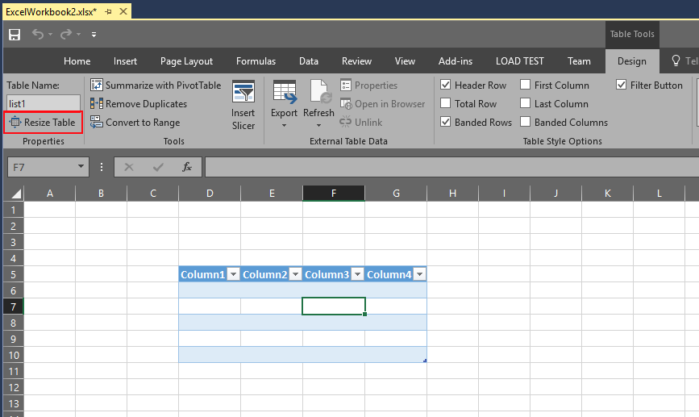

# How to: Resize ListObject controls
  You set the size of a <xref:Microsoft.Office.Tools.Excel.ListObject> control when you add it to a Microsoft Office Excel workbook; however, you might want to resize it at a later time. For example, you might want to change a two-column list to three columns.

 [!INCLUDE[appliesto_xlalldocapp](../vsto/includes/appliesto-xlalldocapp-md.md)]

 You can resize <xref:Microsoft.Office.Tools.Excel.ListObject> controls at design time or at run time in document-level projects. You can resize <xref:Microsoft.Office.Tools.Excel.ListObject> controls at run time in a VSTO Add-in project.

 This topic describes the following tasks:

- [Resize ListObject controls at design time](#designtime)

- [Resize ListObject controls at run time in a document-level project](#runtimedoclevel)

- [Resize ListObject controls at run time in a VSTO Add-in project](#runtimeaddin)

  For more information about <xref:Microsoft.Office.Tools.Excel.ListObject> controls, see [ListObject control](../vsto/listobject-control.md).

##  Resize a ListObject control at design time
 To resize a list, you can click and drag one of the sizing handles, or you can redefine its size in the **Resize List** dialog box.

### To resize a list by using the Resize List dialog box

1. Click anywhere in the  <xref:Microsoft.Office.Tools.Excel.ListObject> table. The **Table Tools** > **Design** tab in the ribbon appears.

2. In the Properties section, click on **Resize Table**.

    

3. Select the new data range for your table.

4. Click **OK**.

##  Resize a ListObject control at run time in a document-level project
 You can resize a <xref:Microsoft.Office.Tools.Excel.ListObject> control at run time by using the <xref:Microsoft.Office.Tools.Excel.ListObject.Resize%2A> method. You cannot use this method to move the <xref:Microsoft.Office.Tools.Excel.ListObject> control to a new location on the worksheet. The headers must remain in the same row, and the resized <xref:Microsoft.Office.Tools.Excel.ListObject> control must overlap the original list object. The resized <xref:Microsoft.Office.Tools.Excel.ListObject> control must contain a header row, and at least one row of data.

### To resize a list object programmatically

1. Create a <xref:Microsoft.Office.Tools.Excel.ListObject> control that spans cell **A1** through **B3** on `Sheet1`.

     :::code language="csharp" source="../vsto/codesnippet/CSharp/Trin_VstcoreHostControlsExcelCS/Sheet1.cs" id="Snippet6":::
     :::code language="vb" source="../vsto/codesnippet/VisualBasic/Trin_VstcoreHostControlsExcelVB/Sheet1.vb" id="Snippet6":::

2. Resize the list to include cells **A1** through **C5**.

     :::code language="csharp" source="../vsto/codesnippet/CSharp/Trin_VstcoreHostControlsExcelCS/Sheet1.cs" id="Snippet7":::
     :::code language="vb" source="../vsto/codesnippet/VisualBasic/Trin_VstcoreHostControlsExcelVB/Sheet1.vb" id="Snippet7":::

##  Resize a ListObject at run time in a VSTO Add-in project
 You can resize a <xref:Microsoft.Office.Tools.Excel.ListObject> control on any open worksheet at run time. For more information about how to add a <xref:Microsoft.Office.Tools.Excel.ListObject> control to a worksheet by using a VSTO Add-in, see [How to: Add ListObject controls to worksheets](../vsto/how-to-add-listobject-controls-to-worksheets.md).

### To resize a list object programmatically

1. Create a <xref:Microsoft.Office.Tools.Excel.ListObject> control that spans cell **A1** through **B3** on `Sheet1`.

     :::code language="csharp" source="../vsto/codesnippet/CSharp/Trin_Excel_Dynamic_Controls/ThisAddIn.cs" id="Snippet12":::
     :::code language="vb" source="../vsto/codesnippet/VisualBasic/Trin_Excel_Dynamic_Controls/ThisAddIn.vb" id="Snippet12":::

2. Resize the list to include cells **A1** through **C5**.

     :::code language="csharp" source="../vsto/codesnippet/CSharp/Trin_Excel_Dynamic_Controls/ThisAddIn.cs" id="Snippet13":::
     :::code language="vb" source="../vsto/codesnippet/VisualBasic/Trin_Excel_Dynamic_Controls/ThisAddIn.vb" id="Snippet13":::

## See also
- [Extend Word documents and Excel workbooks in VSTO Add-ins at run time](../vsto/extending-word-documents-and-excel-workbooks-in-vsto-add-ins-at-run-time.md)
- [Controls on Office documents](../vsto/controls-on-office-documents.md)
- [Add controls to Office documents at run time](../vsto/adding-controls-to-office-documents-at-run-time.md)
- [Host items and host controls overview](../vsto/host-items-and-host-controls-overview.md)
- [Automate Excel by using extended objects](../vsto/automating-excel-by-using-extended-objects.md)
- [ListObject control](../vsto/listobject-control.md)
- [How to: Add ListObject controls to worksheets](../vsto/how-to-add-listobject-controls-to-worksheets.md)
- [How to: Resize Bookmark controls](../vsto/how-to-resize-bookmark-controls.md)
- [How to: Resize NamedRange controls](../vsto/how-to-resize-namedrange-controls.md)
