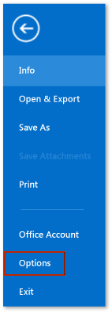
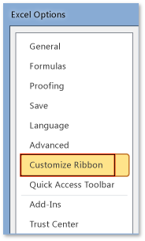
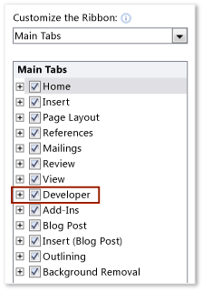

# How to: Show the Developer tab on the ribbon
  To access the **Developer** tab on the ribbon of an Office application, you must configure it to show that tab because it doesn't appear by default. For example, you must show that tab if you want to add a <xref:Microsoft.Office.Tools.Word.GroupContentControl> to a document-level customization for Word.

> [!NOTE]
> This guidance applies to Office 2010 or later applications only. If you want to show this tab in the 2007 Microsoft Office System, see the following version of this topic [How to: Show the Developer tab on the ribbon](https://web.archive.org/web/20140303033431/msdn.microsoft.com/library/bb608625(v=vs.90).aspx
).

 [!INCLUDE[appliesto_ribbon](../vsto/includes/appliesto-ribbon-md.md)]

> [!NOTE]
> Access doesn't have a **Developer** tab.

[!include[Add-ins note](includes/addinsnote.md)]

## To show the Developer tab

1. Start any of the Office applications supported by this topic. See the **Applies to:** note earlier in this topic.

2. On the **File** tab, choose the **Options** button.

     The following figure shows the **File** tab and **Options** button in Office 2010.

     

     The following figure shows the **File** tab in Office 2013.

     

     The following figure shows the **Options** button in Office 2013.

     

3. In the _ApplicationName_**Options** dialog box, choose the **Customize Ribbon** button.

     The following figure shows the **Options** dialog box and the **Customize Ribbon** button in Excel 2010. The location of this button is similar in all other applications listed in the "Applies to" section near the top of this topic.

     

4. In the list of main tabs, select the **Developer** check box.

     The following figure shows the **Developer** check box in Word 2010 and [!INCLUDE[Word_15_short](../vsto/includes/word-15-short-md.md)]. The location of this check box is similar in all other applications listed in the "Applies to" section near the top of this topic.

     

5. Choose the **OK** button to close the **Options** dialog box.

## See also
- [Office UI customization](../vsto/office-ui-customization.md)
