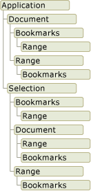

# Word object model overview

  When you develop Word solutions in Visual Studio, you interact with the Word object model. This object model consists of classes and interfaces that are provided in the primary interop assembly for Word, and are defined in the <xref:Microsoft.Office.Interop.Word> namespace.

 [!INCLUDE[appliesto_wdalldocapp](../vsto/includes/appliesto-wdalldocapp-md.md)]

 This topic provides a brief overview of the Word object model. For resources where you can learn more about the entire Word object model, see [Use the Word object model documentation](#WordOMDocumentation).

 For information about using the Word object model to perform specific tasks, see the following topics:

- [Work with documents](../vsto/working-with-documents.md)

- [Work with text in documents](../vsto/working-with-text-in-documents.md)

- [Work with tables](../vsto/working-with-tables.md)

##  Understand the Word object model
 Word provides hundreds of objects with which you can interact. These objects are organized in a hierarchy that closely follows the user interface. At the top of the hierarchy is the <xref:Microsoft.Office.Interop.Word.Application> object. This object represents the current instance of Word. The <xref:Microsoft.Office.Interop.Word.Application> object contains the <xref:Microsoft.Office.Interop.Word.Document>, <xref:Microsoft.Office.Interop.Word.Selection>, <xref:Microsoft.Office.Interop.Word.Bookmark>, and <xref:Microsoft.Office.Interop.Word.Range> objects. Each of these objects has many methods and properties that you can access to manipulate and interact with the object.

 The following illustration shows one view of these objects in the hierarchy of the Word object model.

 

 At first glance, objects appear to overlap. For example, the <xref:Microsoft.Office.Interop.Word.Document> and <xref:Microsoft.Office.Interop.Word.Selection> objects are both members of the <xref:Microsoft.Office.Interop.Word.Application> object, but the <xref:Microsoft.Office.Interop.Word.Document> object is also a member of the <xref:Microsoft.Office.Interop.Word.Selection> object. Both the <xref:Microsoft.Office.Interop.Word.Document> and <xref:Microsoft.Office.Interop.Word.Selection> objects contain <xref:Microsoft.Office.Interop.Word.Bookmark> and <xref:Microsoft.Office.Interop.Word.Range> objects. The overlap exists because there are multiple ways you can access the same type of object. For example, you apply formatting to a <xref:Microsoft.Office.Interop.Word.Range> object; but you may want to access the range of the current selection, of a particular paragraph, of a section, or of the entire document.

 The following sections briefly describe the top-level objects and how they interact with each other. These objects include the following five:

- Application object

- Document object

- Selection object

- Range object

- Bookmark object

  In addition to the Word object model, Office projects in Visual Studio provide *host items* and *host controls* that extend some objects in the Word object model. Host items and host controls behave like the Word objects they extend, but they also have additional functionality such as data-binding capabilities and extra events. For more information, see [Automate Word by using extended objects](../vsto/automating-word-by-using-extended-objects.md) and [Host items and host controls overview](../vsto/host-items-and-host-controls-overview.md).

### Application object
 The <xref:Microsoft.Office.Interop.Word.Application> object represents the Word application, and is the parent of all of the other objects. Its members usually apply to Word as a whole. You can use its properties and methods to control the Word environment.

 In VSTO Add-in projects, you can access the <xref:Microsoft.Office.Interop.Word.Application> object by using the `Application` field of the `ThisAddIn` class. For more information, see [Program VSTO Add-ins](../vsto/programming-vsto-add-ins.md).

 In document-level projects, you can access the <xref:Microsoft.Office.Interop.Word.Application> object by using the <xref:Microsoft.Office.Tools.Word.Document.Application%2A> property of the `ThisDocument` class.

### Document object
 The <xref:Microsoft.Office.Interop.Word.Document> object is central to programming Word. It represents a document and all of its contents. When you open a document or create a new document, you create a new <xref:Microsoft.Office.Interop.Word.Document> object, which is added to the <xref:Microsoft.Office.Interop.Word.Documents> collection of the <xref:Microsoft.Office.Interop.Word.Application> object. The document that has the focus is called the active document. It is represented by the <xref:Microsoft.Office.Interop.Word._Application.ActiveDocument%2A> property of the <xref:Microsoft.Office.Interop.Word.Application> object.

 The Office development tools in Visual Studio extend the <xref:Microsoft.Office.Interop.Word.Document> object by providing the <xref:Microsoft.Office.Tools.Word.Document> type. This type is a *host item* that gives you access to all features of a <xref:Microsoft.Office.Interop.Word.Document> object, and adds additional events and the ability to add managed controls.

 When you create a document-level project, you can access <xref:Microsoft.Office.Tools.Word.Document> members by using the generated `ThisDocument` class in your project. You can access members of the <xref:Microsoft.Office.Tools.Word.Document> host item by using the **Me** or **this** keywords from code in the `ThisDocument` class, or by using `Globals.ThisDocument` from code outside the `ThisDocument` class. For more information, see [Program document-level customizations](../vsto/programming-document-level-customizations.md). For example, to select the first paragraph in the document, use the following code.

 ### [C#](#tab/csharp)
 :::code language="csharp" source="../vsto/codesnippet/CSharp/Trin_VstcoreWordAutomationCS/ThisDocument.cs" id="Snippet120":::

 ### [VB](#tab/vb)
 :::code language="vb" source="../vsto/codesnippet/VisualBasic/Trin_VstcoreWordAutomationVB/ThisDocument.vb" id="Snippet120":::
 ---

 In VSTO Add-in projects, you can generate <xref:Microsoft.Office.Tools.Word.Document> host items at run time. You can use the generated host item to add controls to the associated document. For more information, see [Extend Word documents and Excel workbooks in VSTO Add-ins at run time](../vsto/extending-word-documents-and-excel-workbooks-in-vsto-add-ins-at-run-time.md).

### Selection object
 The <xref:Microsoft.Office.Interop.Word.Selection> object represents the area that is currently selected. When you perform an operation in the Word user interface, such as bolding text, you select, or highlight the text and then apply the formatting. The <xref:Microsoft.Office.Interop.Word.Selection> object is always present in a document. If nothing is selected, then it represents the insertion point. In addition, a selection can encompass multiple blocks of text that are not contiguous.

### Range object
 The <xref:Microsoft.Office.Interop.Word.Range> object represents a contiguous area in a document, and is defined by a starting character position and an ending character position. You are not limited to a single <xref:Microsoft.Office.Interop.Word.Range> object. You can define multiple <xref:Microsoft.Office.Interop.Word.Range> objects in the same document. A <xref:Microsoft.Office.Interop.Word.Range> object has the following characteristics:

- It can consist of the insertion point alone, a range of text, or the entire document.

- It includes non-printing characters such as spaces, tab characters, and paragraph marks.

- It can be the area represented by the current selection, or it can represent an area different from the current selection.

- It is not visible in a document, unlike a selection, which is always visible.

- It is not saved with a document and exists only while the code is running.

  When you insert text at the end of a range, Word automatically expands the range to include the inserted text.

### Content control objects
 A <xref:Microsoft.Office.Interop.Word.ContentControl> provides a way for you to control the input and presentation of text and other types of content in Word documents. A <xref:Microsoft.Office.Interop.Word.ContentControl> can display several different types of UI that are optimized for use in Word documents, such as a rich text control, a date picker, or a combo box. You can also use a <xref:Microsoft.Office.Interop.Word.ContentControl> to prevent users from editing sections of the document or template.

 Visual Studio extends the <xref:Microsoft.Office.Interop.Word.ContentControl> object into several different host controls. Whereas the <xref:Microsoft.Office.Interop.Word.ContentControl> object can display any of the different types of UI that are available for content controls, Visual Studio provides a different type for each content control. For example, you can use a <xref:Microsoft.Office.Tools.Word.RichTextContentControl> to create a rich text control, or you can use a <xref:Microsoft.Office.Tools.Word.DatePickerContentControl> to create a date picker. These host controls behave like the native <xref:Microsoft.Office.Interop.Word.ContentControl>, but they have additional events and data-binding capabilities. For more information, see [Content controls](../vsto/content-controls.md).

### Bookmark object
 The <xref:Microsoft.Office.Interop.Word.Bookmark> object represents a contiguous area in a document, with both a starting position and an ending position. You can use bookmarks to mark a location in a document, or as a container for text in a document. A <xref:Microsoft.Office.Interop.Word.Bookmark> object can consist of the insertion point, or be as large as the entire document. A <xref:Microsoft.Office.Interop.Word.Bookmark> has the following characteristics that set it apart from the <xref:Microsoft.Office.Interop.Word.Range> object:

- You can name the bookmark at design time.

- <xref:Microsoft.Office.Interop.Word.Bookmark> objects are saved with the document, and thus are not deleted when the code stops running or your document is closed.

- Bookmarks can be hidden or made visible by setting the <xref:Microsoft.Office.Interop.Word.View.ShowBookmarks%2A> property of the <xref:Microsoft.Office.Interop.Word.View> object to **false** or **true**.

  Visual Studio extends the <xref:Microsoft.Office.Interop.Word.Bookmark> object by providing the <xref:Microsoft.Office.Tools.Word.Bookmark> host control. The <xref:Microsoft.Office.Tools.Word.Bookmark> host control behaves like a native <xref:Microsoft.Office.Interop.Word.Bookmark>, but has additional events and data-binding capabilities. You can bind data to a bookmark control on a document in the same way that you bind data to a text box control on a Windows Form. For more information, see [Bookmark control](../vsto/bookmark-control.md).

##  Use the Word object model documentation
 For complete information about the Word object model, you can refer to the Word primary interop assembly (PIA) reference and the Visual Basic for Applications (VBA) object model reference.

### Primary interop assembly reference
 The Word PIA reference documentation describes the types in the primary interop assembly for Word. This documentation is available from the following location: [Word 2010 primary interop assembly reference](../vsto/office-primary-interop-assemblies.md).

 For more information about the design of the Word PIA, such as the differences between classes and interfaces in the PIA and how events in the PIA are implemented, see [Overview of classes and interfaces in the Office primary interop assemblies](/previous-versions/office/office-12/ms247299(v=office.12)).

### VBA object model reference
 The VBA object model reference documents the Word object model as it is exposed to VBA code. For more information, see [Word 2010 object model reference](/office/vba/api/overview/Word/object-model).

 All of the objects and members in the VBA object model reference correspond to types and members in the Word PIA. For example, the Document object in the VBA object model reference corresponds to the <xref:Microsoft.Office.Interop.Word.Document> object in the Word PIA. Although the VBA object model reference provides code examples for most properties, methods, and events, you must translate the VBA code in this reference to Visual Basic or Visual C# if you want to use them in a Word project that you create by using Visual Studio.

## Related content
- [Office primary interop assemblies](../vsto/office-primary-interop-assemblies.md)
- [Automate Word by using extended objects](../vsto/automating-word-by-using-extended-objects.md)
- [Work with documents](../vsto/working-with-documents.md)
- [Work with text in documents](../vsto/working-with-text-in-documents.md)
- [Work with tables](../vsto/working-with-tables.md)
- [Host items and host controls overview](../vsto/host-items-and-host-controls-overview.md)
- [Programmatic limitations of host items and host controls](../vsto/programmatic-limitations-of-host-items-and-host-controls.md)
- [Optional parameters in Office solutions](../vsto/optional-parameters-in-office-solutions.md)
