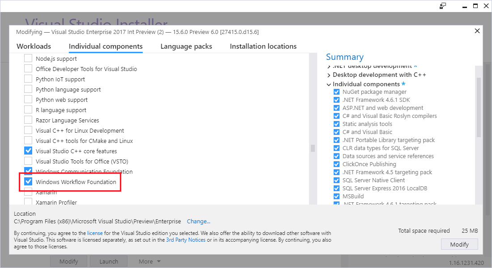

# Develop apps with the Workflow Designer

The Workflow Designer is a visual designer and debugger for the graphical construction and debugging of [Windows Workflow Foundation](/dotnet/framework/windows-workflow-foundation/index) (WF) applications in Visual Studio. It enables you to compose a composite workflow application, activity library, or Windows Communication Foundation (WCF) service through the use of templates and activity designers.

## Install Windows Workflow Foundation

To use Workflow project templates in Visual Studio, first install the **Windows Workflow Foundation** component.

1. Open Visual Studio Installer. A quick way to open it is by selecting **Tools** > **Get Tools and Features** in Visual Studio.

1. In Visual Studio Installer, select the **Individual components** tab.

1. Scroll down to the **Development activities** category and then select the **Windows Workflow Foundation** component.

   

1. Select **Modify**.

   Visual Studio installs the **Windows Workflow Foundation** component.

## Related content

- [Windows Workflow Foundation (.NET Framework)](/dotnet/framework/windows-workflow-foundation/index)
