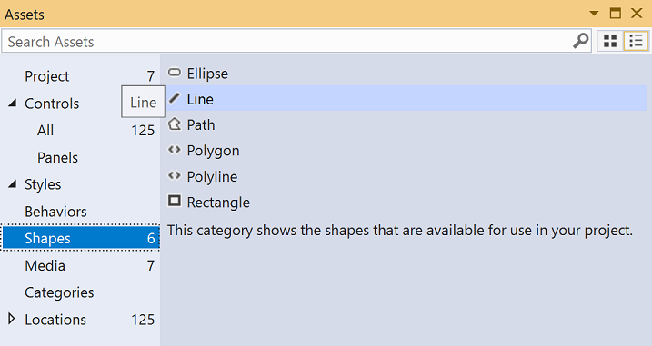

# Blend for Visual Studio overview

Blend for Visual Studio helps you design XAML-based Windows and Web applications. It provides the same basic XAML design experience as Visual Studio and adds visual designers for advanced tasks such as animations and behaviors. For a comparison between Blend and Visual Studio, see [Design XAML in Visual Studio and Blend for Visual Studio](../xaml-tools/designing-xaml-in-visual-studio.md).

Blend for Visual Studio is a component of Visual Studio. To install Blend, in the **Visual Studio Installer** choose either the **Universal Windows Platform development** or **.NET desktop development** workload. Both of these workloads include the Blend for Visual Studio component.

&nbsp;&nbsp;&nbsp;&nbsp;

If you're new to Blend for Visual Studio, take a moment to become familiar with the unique features of the workspace. This topic takes you on a quick tour.

::: moniker range=">= vs-2022"
## Open Blend

To switch to the Blend UI, open a XAML-based project in Visual Studio and select **View** > **Design in Blend...**, and the Blend for Visual Studio UI opens.
::: moniker-end

## Tools panel

You can use the **Tools** panel in Blend for Visual Studio to create and modify objects in your application. The **Tools** panel appears on the left-hand side of the XAML designer when you have a *.xaml* file open.

You create the objects by selecting a tool and drawing on the artboard with your mouse.

> [!TIP]
> Some of the tools in the **Tools** panel have variations, for example, instead of a rectangle, you can choose an ellipse or a line. To access these variations, right-click or click and hold on the tool.
>
> 

### Selection tools

Select objects and paths. Use the **Direct Selection** tool to select nested objects and path segments.

### View tools

Adjust the view of the artboard, such as for panning and zooming.

### Brush tools

Work with the visual attributes of an object, such as transforming a brush or applying a gradient.

### Object tools

Draw the most common objects on the artboard, such as paths, shapes, layout panels, text, and controls.

### Asset tools

Access the Assets window and show the most recently used asset from the library.

## Assets window

The **Assets** window contains all the available controls and is similar to the **Toolbox** in Visual Studio. In addition to controls, you'll find everything you can add to your artboard in the **Assets** window, including styles, media, behaviors, and effects. To open the **Assets** window, choose **View** > **Assets Window** or press **Ctrl**+**Alt**+**X**.

- Enter text in the **Search Assets** box to filter the list of assets.
- Switch between Grid mode and List mode view view of assets by using the buttons at the top right.

## Objects and Timeline window

Use this window to organize the objects on your artboard and, if you want, to animate them. To open the **Objects and Timeline** window, choose **View** > **Document Outline**. In addition to the functionality provided in the [Document Outline window](creating-a-ui-by-using-xaml-designer-in-visual-studio.md#document-outline-window) in Visual Studio, the Objects and Timeline window in Blend for Visual Studio has a timeline composition area on the right. Use the timeline when you're creating and editing animations.

Use the storyboard-related buttons  to create, delete, close, or select a storyboard. Use the Timeline composition area on the right to view the timeline and move keyframes.

Hover over each button in the window to learn more about the available functionality.

## See also

- [Animate objects](../xaml-tools/animate-objects-in-xaml-designer.md)
- [Draw shapes and paths](../xaml-tools/draw-shapes-and-paths.md)
- [Designing XAML in Visual Studio and Blend for Visual Studio](../xaml-tools/designing-xaml-in-visual-studio.md)
