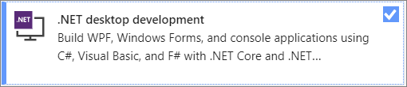
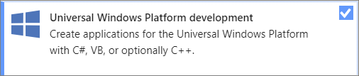

# Design XAML in Visual Studio and Blend for Visual Studio

Visual Studio and Blend for Visual Studio both provide visual tools for building engaging user interfaces and rich media experiences with XAML for a variety of app types. Both integrated development environments (IDE) share a common set of features, including a visual XAML editor (designer). Blend for Visual Studio, which supports the WPF and UWP platforms, provides additional tools for designing visual states and creating animations.

You can switch back and forth between Visual Studio and Blend for Visual Studio, and you can even have the same project open in both IDEs at the same time. Changes that are saved to XAML files in one IDE can be applied via automatic reload when you switch to the other IDE. You can control the reload behavior by navigating to **Tools** > **Options** > **Environment** > **Documents** in either IDE.

## Installation

- To create WPF apps, install the **.NET desktop development** workload in Visual Studio. Blend for Visual Studio will also be installed.

     

- To create UWP apps, install the **Universal Windows Platform development** workload in Visual Studio. Blend for Visual Studio will also be installed.

     

## Shared capabilities

For most fundamental development tasks, Visual Studio and Blend for Visual Studio share the same set of windows and capabilities, with some subtle differences. Some highlights include:

- **IntelliSense:** Both IDEs support IntelliSense capabilities such as statement completion.

- **Debugging:** You can debug in [Visual Studio](inspect-xaml-properties-while-debugging.md) and [Blend for Visual Studio](../xaml-tools/debug-xaml-in-blend.md), including setting breakpoints in code to debug a running app and using [Hot Reload](../xaml-tools/xaml-hot-reload.md) to change your XAML code while the app is running. To maintain a consistent debugging experience with Visual Studio, Blend for Visual Studio includes most of Visual Studio's debugging windows and toolbars.

- **File reload:** You can edit your XAML files in either Visual Studio or Blend for Visual Studio. Edited files that have been saved reload automatically as you switch between IDEs. You can control the reload behavior by navigating to **Tools** > **Options** > **Environment** > **Documents** in either IDE.

- **Synchronized layouts and settings:** Design customization tool window layouts and settings preferences for either Visual Studio or Blend for Visual Studio are synchronized across your devices and versions when you sign in with the same personalization account. See [Synchronize settings across multiple computers](../ide/synchronized-settings-in-visual-studio.md).

## Advanced capabilities in Blend for Visual Studio

To increase your productivity, consider using Blend for Visual Studio for the following tasks. These are the areas where Blend for Visual Studio offers more functionality than the Visual Studio designer or code alone.

| Task | Visual Studio | Blend for Visual Studio | More information |
| - | - | - | - |
| **Design visual states** | There is no tool to help you design visual states; you must create them programmatically. | Use design tools to change the appearance of a control based on its state. | [Visual states](modify-the-style-of-objects-in-blend.md#visual-states) |
| **Create animations** |There is no design tool for animations; you have to create them programmatically. This requires an understanding of the animation and timing system in WPF and extensive coding expertise.|You create animations visually and can preview them in Blend for Visual Studio. This is faster and more accurate than building your animations in code. You can add triggers to handle user interaction, and you can switch to code to add event handlers and other functionality.|[Animate objects](../xaml-tools/animate-objects-in-xaml-designer.md)|
|**Turn shapes and text into paths for easier manipulation**|Not supported.|You can make subtle or dramatic changes to shapes (such as rectangles and ellipses) by converting them to paths, which provide better editing control. You can reshape or combine paths, and create compound paths from multiple shapes.  You can also convert text blocks into paths to manipulate them as vector images.|[Draw shapes and paths](../xaml-tools/draw-shapes-and-paths.md)|
|**Edit controls, templates, and styles**|Requires coding and knowledge of WPF styles and templates.|Turn any image into a control.  Use the template editing tools to make changes to controls, styles, and templates with just a few mouse clicks.  For example, you can use Blend for Visual Studio style resources to implement common WPF controls (such as buttons, list boxes, scroll bars, menus, etc.), and change their color, style, or underlying template directly in Blend for Visual Studio. You can then switch to code for finishing touches if you want.|[Modify the style of objects](modify-the-style-of-objects-in-blend.md)|
|**Connect your UI to data**|You can create a data source from resources such as a SQL Server database, WCF or web service, object, or SharePoint list, and then bind the data source to your UI controls.  Design-time data must be created by hand for an interactive design experience.|For .NET Framework apps, create sample data easily for prototyping and testing. Switch to live data when you're ready.  Blend for Visual Studio's data generation capabilities are outstanding (you can add names, numbers, URLs, and photos easily on the fly), and can save you a lot of time.  For live data, you can bind your UI controls to an XML file or to any CLR data source.|[Display data](display-data-in-blend.md)|

For more information about advanced XAML design, see [Create a UI by using Blend for Visual Studio](../xaml-tools/creating-a-ui-by-using-blend-for-visual-studio.md).

## Related content

- [XAML overview](xaml-overview.md)
- [Blend for Visual Studio overview](creating-a-ui-by-using-blend-for-visual-studio.md)
