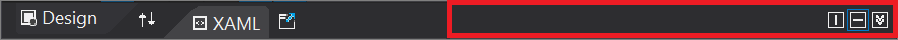
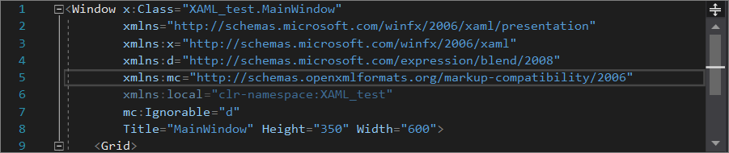

# XAML code editor

The XAML code editor in the [Visual Studio IDE](../get-started/visual-studio-ide.md) includes all the tools you need to create WPF and UWP apps for the Windows platform. This article outlines the role the code editor plays when you develop XAML-based apps, and on the features that are unique to the XAML code editor in Visual Studio 2019. 

To start, let's take a look at the IDE (integrated development environment) with an open WPF project. The following image shows several of the key IDE tools you'll use along with the XAML code editor. From the bottom left of the image going clockwise, they are: 

- The **[XAML code editor](#xaml-code-editor-ui)** window—the subject of this article—where you create and edit your code. 
- The **[XAML Designer](creating-a-ui-by-using-xaml-designer-in-visual-studio.md)** window, where you design your UI.
- The **[Toolbox](../ide/reference/toolbox.md)** dockable window, where you add controls to your UI.
- The **[Debug](../debugger/debugger-feature-tour.md)** button, where you run your code and debug it.  (You can also edit your code in real-time while you're debugging with [XAML Hot Reload](xaml-hot-reload.md).)
- The **[Solution Explorer](../ide/solutions-and-projects-in-visual-studio.md)** window, where you manage your files, projects, and solutions. 
- The **[Properties](../ide/reference/properties-window.md)** window, where you change the way your UI looks.

To continue, let's learn more about the XAML code editor. 

## XAML code editor UI

The code editor window for XAML apps shares some UI (user interface) elements that also appear in our standard IDE, it also includes a few unique features that make developing XAML apps easier.

Here's a look at the XAML code editor window itself.

Next, let's take a look at the functions of each of the UI elements in the code editor.

### Top left, first row

Starting at the top left, and from left to right, there's a **Design** tab, a **Swap Panes** button, a **XAML** tab, and a **Pop-Out XAML** button.

Here's how they work: 

- The **Design** tab changes the focus from the XAML code editor to the XAML Designer.
- The **Swap Panes** button reverses the location of the XAML Designer and the XAML code editor in the IDE.
- The **XAML** tab changes the focus back to the XAML code editor.
- The **Pop Out XAML** button creates a separate XAML code editor window that's outside of the IDE.

### Top right, first row

Continuing at the top right, and from left to right, there's a **Vertical Split** button, a **Horizontal Split** button, and a **Collapse Panes** button.

Here's how they work:

- The **Vertical Split** button changes the location of the XAML Designer and the XAML code editor in the IDE from a horizontal alignment to a vertical alignment.
- The **Horizontal Split** button changes the location of the XAML Designer and the XAML code editor in the IDE from a vertical alignment to a horizontal alignment.
- The **Collapse Pane** button hides the XAML code editor temporarily while you focus on using the XAML Designer within the IDE. (To restore the XAML code editor, choose the same button again, which is now named the **Expand Pane** button.)

> [!TIP]
> You can run two parallel instances of the XAML code editor concurrently by using both the **Pop Out XAML** button and the **Expand Pane** button.
>
> You might find it useful to have one larger window open that reveals more of your code in context and a smaller pane open that has its focus directly on the code that you're working on.

### Top left, second row

In the second row of the top left, there are two Window dropdown lists. However, if you view the Tooltip for these UI elements, it further identifies them as the "Element: Window" and the "Member: Window".

The Window dropdown lists have different functions, as follows:

- The **Element: Window** on the left helps you view and navigate to sibling or parent elements. 

  Specifically, it shows you an outline-like view that reveals the tag structure of your code. When you select from the list, your focus in the code editor will snap to the line of code that includes the element you selected.

    

- The **Member: Window** on the right helps you view and navigate to attribute or child elements.

    Specifically, it shows you a list of the properties in your code. When you select from the list, your focus in the code editor will snap to the line of code that includes the property you selected.

    

### Middle pane, code editor

The middle pane is the "code" part of the XAML code editor. It includes most of the features that you'll find in the [IDE code editor](../get-started/tutorial-editor.md). We'll touch on several of the universal IDE features that can help you develop your XAML code. We'll also highlight the unique-to-XAML features in the IDE, too.

#### Quick actions

- Unused Usings, lightbulb for removing (Quick Actions)

#### Change tracking

The color of the left margin allows you to keep track of the changes you have made in a file. Here's how the colors relate to the actions you take:

- Changes you have made since the file was opened but not saved are denoted by a **yellow** bar on the left margin (known as the selection margin). 
- After you have saved the changes (but before closing the file), the bar turns **green**. 
- If you undo a change after you have saved the file, the bar turns **orange**. 

To turn this feature off and on, change the **Track changes** option in the **Text Editor** settings (**Tools** > **Options** > **Text Editor**).

#### Right-click menu

When you are editing your code in the XAML code editor, there are several features that you can access by using the right-click menu. 

Some of these features are available universally in the Visual Studio IDE, and some are specific to the XAML code editor. Here's what each feature does and how it's useful.

- View Code. This setting  

- Quick Actions
- Only expands a lightbulb if its available
- Rename (namespaces only)
- Peek Definition
- Go To Definition
- Snippet Features
- Surround With
- Insert Snippet
- Outline

### Middle pane, scroll bar

In the scroll bar of the code editor, there's a **Split** button at the top right. When you choose it, you can open another code editor pane. This is useful because they operate independently of each other, so you can use them to work on code in different locations. 

For more information, see the [Manage editor windows](../ide/how-to-manage-editor-windows.md).

You can also change how the scroll bar looks and what additional features it contains. For example, many people appreciate using map mode, which 

## XAML-specific features

- XAML support for snippets
- XAML #regions
- XAML Comments
- Lightbulbs
    - All Platforms - Adding missing namespace
    - UWP – Add conditional XAML
- XAML Rename namespace using F2
- Structure Analyzers (dotted lines between the tags vertically)
- Only between tags and not container properties
- Settings

## XAML optional settings

You can use the [Options](../ide/reference/options-dialog-box-visual-studio.md) dialog box to change the default settings for the XAML code editor. To view the settings, choose **Tools** > **Options** > **Text Editor** > **XAML**. 

> [!NOTE]
> You can also use keyboard shortcuts to access the Options dialog box. Here's how: 
>
> Press **Ctrl**+**Q** to search the IDE, type **Options**, and then press **Enter**. Next, press **Ctrl**+**E** to search the Options dialog box, type **Text Editor**, press **Enter**, type **XAML**, and then press **Enter**.
>  
> For more information about keyboard shortcuts, see the [Shortcut tips for Visual Studio](../ide/productivity-shortcuts.md#code-editor) page.

### XAML-specific options

Here are the settings in the Options dialog that can enhance your editing experience when you develop XAML apps.

- Formatting Options (XAML specific) described
- General
- Spacing
- Misc.
- Capitalize event handlers there to support proper casing, off by default since its new

## Next steps

To learn more about how to edit your code in real-time while you're running your app in debug mode, see the [XAML Hot Reload](xaml-hot-reload.md) page.

## See also

- [Visual Studio code editor features](../ide/writing-code-in-the-code-and-text-editor.md)
- [XAML in UWP apps](/windows/uwp/xaml-platform/xaml-overview)
- [XAML in Xamarin.Forms apps](/xamarin/xamarin-forms/xaml/)
