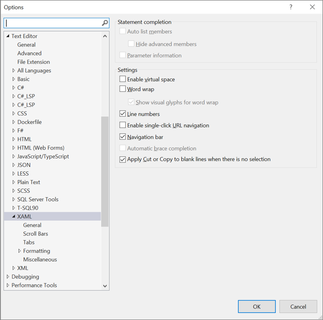

# XAML code editor

The XAML code editor in the [Visual Studio IDE](../get-started/visual-studio-ide.md) includes all the tools you need to create WPF and UWP apps for the Windows platform. This article outlines the role the code editor plays when you develop XAML-based apps, and on the features that are unique to the XAML code editor in Visual Studio 2019. 

To start, let's take a look at the IDE (integrated development environment) with an open WPF project. The following image shows several of the key IDE tools you'll use along with the XAML code editor. From the bottom left of the image going clockwise, they are: 

- The **[XAML code editor](#xaml-code-editor-ui)** window—the subject of this article—where you create and edit your code. 
- The **[XAML Designer](creating-a-ui-by-using-xaml-designer-in-visual-studio.md)** window, where you design your UI.
- The **[Toolbox](../ide/reference/toolbox.md)** dockable window, where you add controls to your UI.
- The **[Debug](../debugger/debugger-feature-tour.md)** button, where you run your code and debug it.  (You can also edit your code in real-time while you're debugging with [XAML Hot Reload](xaml-hot-reload.md).)
- The **[Solution Explorer](../ide/solutions-and-projects-in-visual-studio.md)** window, where you manage your files, projects, and solutions. 
- The **[Properties](../ide/reference/properties-window.md)** window, where you change the way your UI looks.

To continue, let's learn more about the XAML code editor. 

## XAML code editor UI

The code editor window for XAML apps shares some UI (user interface) elements that also appear in our standard IDE, it also includes a few unique features that make developing XAML apps easier.

Here's a look at the XAML code editor window itself.

Next, let's take a look at the functions of each of the UI elements in the code editor.

### Top left, first row

Starting at the top left, and from left to right, there's a Design tab, a Swap Panes button, a XAML tab, and a Pop-Out XAML button.

Here's how to use each of these tabs and buttons: 

- To change the focus from the XAML code editor to the XAML Designer, choose the **Design** tab.
- To reverse the location of the XAML Designer and the XAML code editor in the IDE, choose the **Swap Panes** button.
- To change the focus back to the XAML code editor, choose the **XAML** tab.
- To create a separate XAML code editor window that is outside of the IDE, choose the **Pop Out XAML** button.

### Top right, first row

Continuing at the top right, and from left to right, there's a Vertical Split button, a Horizontal Split button, and a Collapse Panes button.

Here's how to use each of these buttons:

- To change the location of the XAML Designer and the XAML code editor in the IDE from a horizontal alignment to a vertical alignment, choose the **Vertical Split** button.
- To change the location of the XAML Designer and the XAML code editor in the IDE from a vertical alignment to a horizontal alignment, choose the **Horizontal Split** button.
- To hide the XAML code editor temporarily while you focus on using the XAML Designer within the IDE, choose the **Collapse Pane** button. (To restore the XAML code editor, choose the same button again, now named the **Expand Pane** button.)

> [!TIP]
> You can run two parallel instances of the XAML code editor concurrently by using both the **Pop Out XAML** button and the **Expand Pane** button.
>
> You might find it useful to have one larger window open that reveals more of your code in context and a smaller pane open that has its focus directly on the code that you're working on.

### Top left, second row

In the second row of the top left, there are two Window dropdown lists.

Although the Window dropdown menus share the same name, they have different functions:

- To view and navigate to sibling or parent elements, choose **Element: Window** on the left.

    

    The Element: Window shows you an outline-like view that reveals the tag structure of your code. When you select from the list, your focus in the code editor will snap to the line of code that includes the element you selected.

- To view and navigate to attribute or child elements, choose **Member: Window** on the right. 

    

    The Member: Window shows you a list of the properties in your code. When you select from the list, your focus in the code editor will snap to the line of code that includes the property you selected.
    
### Middle pane, left side icons 

[see if we have docs for what the colors means]

### Middle pane, right side scrollbar indicators

- Button to drag out two parallel code editors
- Unused Usings, lightbulb for removing

Annotated with highlights

Right-click menu

- Quick Actions
- Only expands a lightbulb if its available
- Rename (namespaces only)
- Peek Definition
- Go To Definition
- Snippet Features
- Surround With
- Insert Snippet
- Outline

Highlight unique things

- XAML support for snippets
- XAML #regions
- XAML Comments
- Lightbulbs
- All Platforms - Adding missing namespace
- UWP – Add conditional XAML
- XAML Rename namespace using F2
- Structure Analyzers (dotted lines between the tags vertically)
- Only between tags and not container properties
- Settings

## XAML code editor settings

You can use the [Options]() dialog box to change the default settings for the XAML code editor. 

To view the different settings, choose **Tools** > **Options** > **Text Editor** > **XAML**. Alternatively, Then, choose 

Text Editors > XAML > General)

## XAML-specific tools

There are many ways to customize your experience by changing the settings in Options (the Tools > Options menu in Visual Studio. Here are the options that are specific to XAML code editor.

What's specific to XAML:

- Formatting Options (XAML specific) described
- General
- Spacing
- Misc.
- Capitalize event handlers there to support proper casing, off by default since its new

## Next steps

To get started coding, see the [Title Name](pagename.md) page.

## See also

- [Visual Studio code editor features](../ide/writing-code-in-the-code-and-text-editor.md)
- [XAML in UWP apps](/windows/uwp/xaml-platform/xaml-overview)
- [XAML in Xamarin.Forms apps](/xamarin/xamarin-forms/xaml/)
