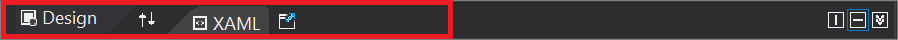
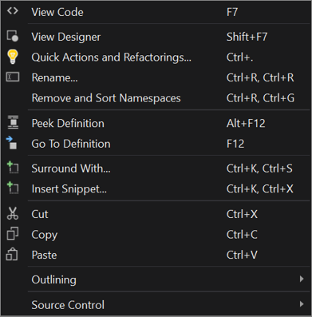
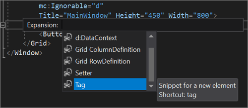

# XAML code editor

The XAML code editor in the [Visual Studio IDE](../get-started/visual-studio-ide.md) includes all the tools you need to create WPF and UWP apps for the Windows platform, and for  [Xamarin.Forms](/xamarin/xamarin-forms/) or [.NET MAUI](/dotnet/maui). This article outlines both the role the code editor plays when you develop XAML-based apps, and the features that are unique to the XAML code editor in Visual Studio 2019.

To start, let's take a look at the IDE (integrated development environment) with an open WPF project. The following image shows several of the key IDE tools you'll use along with the XAML code editor.

:::image type="content" source="media/xaml-code-editor-overview-sml.png" alt-text="The Visual Studio 2019 IDE with an open WPF project in XAML" lightbox="media/xaml-code-editor-overview-lrg.png":::

From the bottom left of the image going clockwise, the key IDE tools are as follows:

- The **[XAML code editor](#xaml-code-editor-ui)** window&mdash;the subject of this article&mdash;where you create and edit your code.
- The **[XAML Designer](creating-a-ui-by-using-xaml-designer-in-visual-studio.md)** window, where you design your UI.
- The **[Toolbox](../ide/reference/toolbox.md)** dockable window, where you add controls to your UI.
- The **[Debug](../debugger/debugger-feature-tour.md)** button, where you run your code and debug it. <br>(You can also edit your code in real time while you're debugging with [XAML Hot Reload](xaml-hot-reload.md).)
- The **[Solution Explorer](../ide/solutions-and-projects-in-visual-studio.md)** window, where you manage your files, projects, and solutions.
- The **[Properties](../ide/reference/properties-window.md)** window, where you change the way your UI looks and how the UI controls work.

To continue, let's learn more about the XAML code editor.

## XAML code editor UI

While the code editor window for XAML apps shares some UI (user interface) elements that also appear in our standard IDE, it also includes a few unique features that make developing XAML apps easier.

Here's a look at the XAML code editor window itself.


Next, let's take a look at the functions of each of the UI elements in the code editor.

### First row

In the first row at the top of the XAML code window, on the left, there's a **Design** tab, a **Swap Panes** button, a **XAML** tab, and a **Pop Out XAML** button.



Here's how they work:

- The **Design** tab changes the focus from the XAML code editor to the XAML Designer.
- The **Swap Panes** button reverses the location of the XAML Designer and the XAML code editor in the IDE.
- The **XAML** tab changes the focus back to the XAML code editor.
- The **Pop Out XAML** button creates a separate XAML code editor window that's outside of the IDE.

Continuing at the right, there's a **Vertical Split** button, a **Horizontal Split** button, and a **Collapse Panes** button.


Here's how they work:

- The **Vertical Split** button changes the location of the XAML Designer and the XAML code editor in the IDE from a horizontal alignment to a vertical alignment.
- The **Horizontal Split** button changes the location of the XAML Designer and the XAML code editor in the IDE from a vertical alignment to a horizontal alignment.
- The **Collapse Pane** button enables you to collapse what's in the bottom pane, whether that's the code editor or the Designer. (To restore the bottom pane, choose the same button again, which is now named the **Expand Pane** button.)

<!-- [!TIP]
> You can run two parallel instances of the XAML code editor concurrently by using both the **Pop Out XAML** button and the **Expand Pane** button.
>
> You might find it useful to have one larger window open that reveals more of your code in context and a smaller pane open that has its focus directly on the code that you're working on. -->

### Second row

In the second row at the top of the XAML code window, there are two Window dropdown lists. However, if you view the Tooltip for these UI elements, it further identifies them as the "Element: Window" and the "Member: Window".


The Window dropdown lists have different functions, as follows:

- The **Element: Window** on the left helps you view and navigate to sibling or parent elements.

  Specifically, it shows you an outline-like view that reveals the tag structure of your code. When you select from the list, your focus in the code editor will snap to the line of code that includes the element you selected.

    

- The **Member: Window** on the right helps you view and navigate to attribute or child elements.

    Specifically, it shows you a list of the properties in your code. When you select from the list, your focus in the code editor will snap to the line of code that includes the property you selected.

    

### Middle pane, code editor

The middle pane is the "code" part of the XAML code editor. It includes most of the features that you'll find in the [IDE code editor](../get-started/tutorial-editor.md). We'll touch on several of the universal IDE features that can help you develop your XAML code. We'll also highlight the unique-to-XAML features in the IDE, too.


#### Quick Actions

You can use [Quick Actions](../ide/quick-actions.md) to refactor, generate, or otherwise modify code with a single action.

For example, one useful task that you can perform by using Quick Actions is to **Remove unnecessary usings** from the C# code in the **MainWindow.xaml.cs** tab.

Here's how:

1. Hover over a using statement, choose the lightbulb icon, and then choose **Remove Unnecessary Usings** from the drop-down list.

    

1. Choose whether you want to fix all occurrences in the **Document**, the **Project**, or the **Solution**.
1. View the **Preview** dialog, and then choose **Apply**.

You can also access this feature from the menu bar. To do so, choose **Edit** > **IntelliSense** > **Remove and Sort Usings**.

For more information about usings settings, see the [Sort usings](../ide/reference/sort-usings.md) page. For more information about IntelliSense, see the [IntelliSense in Visual Studio](../ide/using-intellisense.md) page. And, for more information about some of the typical ways that developers use Quick Actions, see the [Common Quick Actions](../ide/common-quick-actions.md) page.

#### Change tracking

The color of the left margin allows you to keep track of the changes you have made in a file. Here's how the colors relate to the actions you take:

- Changes you have made since the file was opened but not saved are denoted by a **yellow** bar on the left margin (known as the selection margin).

    

- After you have saved the changes (but before closing the file), the bar turns **green**.

    

To turn this feature off and on, change the **Track changes** option in the **Text Editor** settings (**Tools** > **Options** > **Text Editor**).

For more information about change tracking&mdash;to include the wavy lines (also known as "squiggles") that appear under code strings&mdash;see the **[Editor features](../ide/writing-code-in-the-code-and-text-editor.md#editor-features)** section of the [Features of the Visual Studio code editor](../ide/writing-code-in-the-code-and-text-editor.md) page.

#### Right-click context menu

When you're editing your code in the XAML code editor, there are several features that you can access by using the right-click context menu. Most of these features are available universally in the Visual Studio IDE, while some are specific to using a code editor along with a Design window.



Here's what each feature does and how it's useful:

- **View Code** - Opens the programming language code window, which is typically tabbed next to the default view that includes the Design window and the XAML code editor.
- **View Designer** - Opens the default view that includes the Design window and the XAML code editor. (If you are already in the default view, it does nothing.)
- **Quick Actions and Refactorings** - Refactors, generates, or otherwise modifies code with a single action. When you hover over code, you'll see a lightbulb icon when a quick action or refactoring is available. <br>See also: [Quick Actions](../ide/quick-actions.md) and [Refactor code](../ide/refactoring-in-visual-studio.md).
- **Rename...** - Renames namespaces only. If you don't have a namespace to rename, you'll receive an error message that says "Only namespace prefixes can be renamed."
- **Remove and Sort Namespaces** - Removes unused namespaces and then sorts those namespaces that remain.
- **Peek Definition** - Previews the definition of a type without leaving your current location in the editor. <br>See also: [Peek Definition](../ide/go-to-and-peek-definition.md#peek-at-a-definition) and [View and edit code by using Peek Definition](../ide/how-to-view-and-edit-code-by-using-peek-definition-alt-plus-f12.md).
- **Go To Definition** - Navigates to the source of a type or member, and opens the result in a new tab. <br>See also: [Go To Definition](../ide/go-to-and-peek-definition.md#go-to-a-definition).
- **Surround with...** - Use surround-with code snippets, which are added around a selected block of code. <br>See also: [Expansion snippets and surround-with snippets](../ide/code-snippets.md#expansion-snippets-and-surround-with-snippets).
- **Insert Snippet** - Inserts a code snippet at the cursor location.
- **Cut** - Self-explanatory
- **Copy** - Self-explanatory
- **Paste** - Self-explanatory
- **Outlining** - Expand and collapse sections of code. <br>See also: [Outlining](../ide/outlining.md).
- **Source Control** - View the history of code contributions to an open-source repository.

### Middle pane, scroll bar

The scroll bar can do more than scroll through your code. You can also use it to open another code editor pane. And, you can use the scroll bar to help you code more efficiently by adding annotations to it, or by using different display modes.

#### Split the code window

In the scroll bar of the code editor, there's a **Split** button at the top right. When you choose it, you can open another code editor pane. This is useful because they operate independently of each other, so you can use them to work on code in different locations.


For more information about how to split an editor window, see the [Manage editor windows](../ide/how-to-manage-editor-windows.md) page.

#### Use annotations or map mode

You can also change how the scroll bar looks and what additional features it contains. For example, many people like to include *annotations* in the scroll bar, which provide visual cues such as code changes, breakpoints, bookmarks, errors, and caret position.

Others appreciate using *map mode*, which displays lines of code in miniature on the scroll bar. Developers who have a lot of code in a file might find that map mode tracks to lines of code more effectively than does the default scroll bar.

For more information about how to change the default settings of the scroll bar, see the  [Customize the scroll bar](../ide/how-to-track-your-code-by-customizing-the-scrollbar.md) page.

## XAML-specific features

Most of the following features are universally available in the Visual Studio IDE, yet there are added dimensions to some of them that make coding easier for XAML developers.

### XAML code snippets

Code snippets are small blocks of reusable code that you can insert into in a code file by using the right-click context menu command **Insert snippet** or a combination of keyboard shortcuts (**Ctrl**+**K**, **Ctrl**+**X**). We've enhanced [IntelliSense](../ide/using-intellisense.md) so that it supports showing XAML snippets, which work for both built-in snippets and any custom snippets that you add manually. Some out-of-the-box XAML snippets include `#region`, `Column definition`, `Row definition`, `Setter`, and `Tag`.



For more information, see the [Code snippets](../ide/code-snippets.md) and [C# code snippets](../ide/visual-csharp-code-snippets.md) pages.

### XAML #region support

In Visual Studio, #region support is available for XAML developers in WPF, UWP, [Xamarin.Forms](/xamarin/xamarin-forms/), and [.NET MAUI](/dotnet/maui). In Visual Studio 2019, we continue to make incremental improvements to #region support. For example, in [version 16.4](/visualstudio/releases/2019/release-notes-v16.4/) and later, #region options show as you begin to type `<!`.


You can use regions when you want to group sections of your code that you also want to expand or collapse.

```xaml
    <!--#region NameOfRegion-->
    Your code is here
    <!--#endregion-->
```

For more information about regions, see the [#region (C# Reference)](/dotnet/csharp/language-reference/preprocessor-directives/preprocessor-region/) page. And for more information about expanding and collapsing sections of code, see the [Outlining](../ide/outlining.md) page.

### XAML comments

Developers often prefer to document their code by using comments. You can add comments to the XAML code that's in the **MainWindow.xaml** tab in the following ways:

- Enter `<!--` before a comment and then add `-->` after the comment.
- Enter `<!` and then choose `!--` from the list of options.

  

- Select code that you want to surround with a comment and then choose the **Comment** button from the toolbar in the IDE. To reverse the action, choose the **Uncomment** button.

  

- Select code that you want to surround with a comment, and then press **Ctrl**+**K**, **Ctrl**+**C**. To uncomment selected code, press **Ctrl**+**K**, **Ctrl**+**U**.

For more information about how to use comments in the C# code that's in the **MainWindow.xaml.cs** tab, see the [Documentation comments](/dotnet/csharp/language-reference/language-specification/documentation-comments/) page.

### XAML lightbulbs

Lightbulb icons that appear in your XAML code are part of the [Quick Actions](../ide/quick-actions.md) that you can use to refactor, generate, or otherwise modify code.

Here are a few examples of how they can benefit your XAML coding experience:

- **Remove unnecessary namespaces**. In the XAML code editor, unnecessary namespaces appear in dimmed text. If you hover your cursor over an unnecessary using, a lightbulb will appear. When you choose the **Remove Unnecessary Namespaces** option from the drop-down list, you'll see a preview of that which you can remove.

  

- **Rename namespace**. This feature, available from the right-click context menu after you highlight a namespace, makes it easy to change multiple instances of a setting at one time. You can also access this feature by using the menu bar, **Edit** > **Refactor** > **Rename**, or by pressing **Ctrl**+**R**, and then **Ctrl**+**R** again.

  

  For more information, see the [Rename a code symbol refactoring](../ide/reference/rename.md) page.

### Conditional XAML for UWP

Conditional XAML provides a way to use the [ApiInformation.IsApiContractPresent](/uwp/api/windows.foundation.metadata.apiinformation.isapicontractpresent/) method in XAML markup. This lets you set properties and instantiate objects in markup based on the presence of an API without needing to use code behind.

For more information, see the [Conditional XAML](/windows/uwp/debug-test-perf/conditional-xaml/) page, and the [Host UWP XAML controls in desktop apps (XAML Islands)](/windows/apps/desktop/modernize/xaml-islands/) page.

### XAML Structure Visualizer

The Structure Visualizer feature in the code editor shows structure guide lines, which are vertical dashed lines that indicate matching open and closed tag elements in your code. These vertical lines make it easier to see where logical blocks begin and end.

For more information, see the [Navigate code](../ide/navigating-code.md) page.

### IntelliCode for XAML

When you add a XAML tag to your code, you typically start with a left angle bracket `<`. When you type that angle bracket, an IntelliCode menu appears that lists several of the more popular XAML tags. Choose the one that you want to quickly add it to your code.

You can recognize the IntelliCode selections because they appear at the top of the list and are starred.


For more information, see the [Overview of IntelliCode](/visualstudio/intellicode/overview/) page.

### Settings

For more information about *all* the settings in the Visual Studio IDE, see the [Features of the code editor](../ide/writing-code-in-the-code-and-text-editor.md) page.

## XAML optional settings

You can use the [Options](../ide/reference/options-dialog-box-visual-studio.md) dialog box to change the default settings for the XAML code editor. To view the settings, choose **Tools** > **Options** > **Text Editor** > **XAML**.


> [!NOTE]
> You can also use keyboard shortcuts to access the Options dialog box. Here's how: Press **Ctrl**+**Q** to search the IDE, type **Options**, and then press **Enter**. Next, press **Ctrl**+**E** to search the Options dialog box, type **Text Editor**, press **Enter**, type **XAML**, and then press **Enter**.
>
> For more information about keyboard shortcuts, see the [Shortcut tips for Visual Studio](../ide/productivity-shortcuts.md#code-editor) page.

### Universal text editor options

In the [Options](../ide/reference/options-text-editor-xaml-formatting.md) dialog box for XAML, the following first three items are universal to all programming languages that the Visual Studio IDE supports. Visit the linked information in the following table to learn more about these options and how to use them.

|Name  |More info  |
|---------|---------|
|General  | [Options dialog box: Text Editor > All Languages](../ide/reference/options-text-editor-all-languages.md) |
|Scroll bars | [Options, Text Editor, All Languages, Scroll Bars](../ide/reference/options-text-editor-all-languages-scroll-bars.md) |
|Tabs  |  [Options, Text Editor, All Languages, Tabs](../ide/reference/options-text-editor-all-languages-tabs.md) |

### XAML-specific text editor options

The following table lists the settings in the [Options](../ide/reference/options-text-editor-xaml-formatting.md) dialog box that can enhance your editing experience when you develop XAML-based apps. Visit the linked information to learn more about these options and how to use them.

|Name  |More info  |
|---------|---------|
|Formatting | [Options, Text Editor, XAML, Formatting](../ide/reference/options-text-editor-xaml-formatting.md) |
|Miscellaneous |  [Options, Text Editor, XAML, Miscellaneous](../ide/reference/options-text-editor-xaml-miscellaneous.md) |

> [!TIP]
> The **Capitalize event handler method name** setting in the **Miscellaneous** section is especially useful to XAML developers. This setting is *off* by default because it's new, but we suggest that you set it to *on* to support proper casing in your code.

## Next steps

To learn more about how to edit your code in real time while you're running your app in debug mode, see the [XAML Hot Reload](xaml-hot-reload.md) page.

## See also

- [Visual Studio code editor features](../ide/writing-code-in-the-code-and-text-editor.md)
- [XAML in UWP apps](/windows/uwp/xaml-platform/xaml-overview/)
- [XAML in Xamarin.Forms apps](/xamarin/xamarin-forms/xaml/)
- [XAML in .NET MAUI apps](/dotnet/maui/xaml/)
