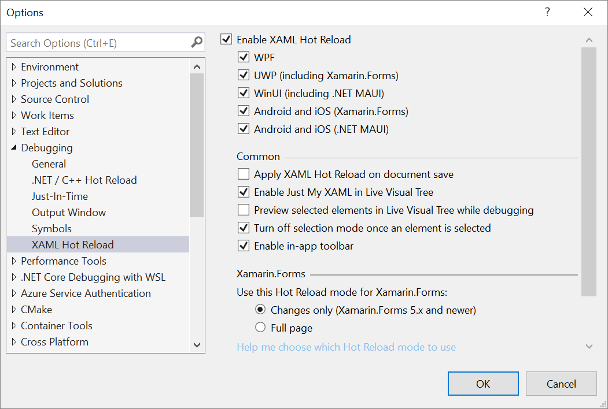
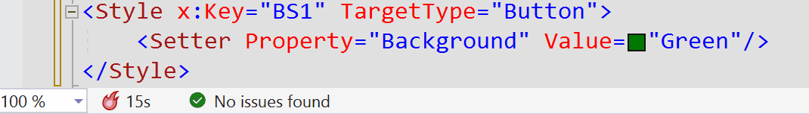

# Troubleshooting XAML Hot Reload

 [!INCLUDE [Visual Studio](~/includes/applies-to-version/vs-windows-only.md)]

This troubleshooting guide includes detailed instructions that should resolve most issues that prevent XAML Hot Reload from working correctly.

XAML Hot Reload is supported for WPF and UWP apps. For details on operating system and tooling requirements, see [Write and debug running XAML code with XAML Hot Reload](xaml-hot-reload.md).

## If Hot Reload is not available

If you see the message "Hot Reload is not available" in the in-app toolbar while debugging your app, follow the instructions described in this article to resolve the issue.

### Verify that XAML Hot Reload is enabled

::: moniker range="vs-2019"

The feature is enabled by default in Visual Studio 2019 and later versions. When you start debugging your app, make sure you see the in-app toolbar, which confirms that XAML Hot Reload is available:

::: moniker-end

::: moniker range="vs-2022"

The feature is enabled by default in Visual Studio 2022 and later versions. When you start debugging your app, make sure you see the in-app toolbar, which confirms that XAML Hot Reload is available:

::: moniker-end

If you do not see the in-app toolbar, then select **Debug** > **Options** > **XAML Hot Reload** from the Visual Studio menu bar. Next, in the **Options** dialog box, make sure that the **Enable XAML Hot Reload** option is selected.

### Verify that you use Start Debugging rather than Attach to Process

XAML Hot Reload requires that the environment variable `ENABLE_XAML_DIAGNOSTICS_SOURCE_INFO` is set to 1 at the time application starts. Visual Studio sets this automatically as part of the **Debug** > **Start Debugging** (or **F5**) command. If you want to use XAML Hot Reload with the **Debug** > **Attach to Process** command instead, then set the environment variable yourself.

> [!NOTE]
> To set an environment variable, use the Start button to search for "environment variable" and choose **Edit the system environment variables**. In the dialog box that opens, choose **Environment Variables**, then add it as a user variable, and set the value to `1`. To clean up, remove the variable when you are finished debugging.

### Verify that your MSBuild properties are correct

By default, source info is included in a Debug configuration. It is controlled by MSBuild properties in your project files (such as *.csproj). For WPF, the property is `XamlDebuggingInformation`, which must be set to `True`. For UWP, the property is `DisableXbfLineInfo`, which must be set to `False`. For example:

WPF:

`<XamlDebuggingInformation>True</XamlDebuggingInformation>`

UWP:

`<DisableXbfLineInfo>False</DisableXbfLineInfo>`

### Verify that you are using the correct build configuration name

You must either manually set the correct MSBuild property to support XAML Hot Reload (see previous section), or you must use the default build configuration name (Debug). If you don't set the MSBuild property correctly, a custom build configuration name won't work, nor will a Release build.

### Verify that your XAML file has no errors

If your XAML file shows errors in the **Error List**, then XAML Hot Reload may not work.

::: moniker range=">= vs-2022"

### Enable more thorough search to update resource references and styles

Setting `XAML_HOT_RELOAD_ACCURACY_OVER_PERF` environment variable to 1 will enable more extensive search for updating resource references and styles for WPF applications. Beware that for certain applications (like the ones using common 3rd party toolkits) this can cause significant delays to apply XAML Hot Reload. You will notice hot reload progress timer in editor status bar. 
 

::: moniker-end

## Known limitations

The following are known limitations of XAML Hot Reload. To work around any limitation that you run into, just stop the debugger, and then complete the operation.

|Limitation|WPF|UWP|Notes|
|-|-|-|-|
|Wiring events to controls while the app is running|Not Supported|Not supported|See error: *Ensure Event Failed*. In WPF, you can reference an existing event handler. In UWP apps, referencing an existing event handler isn't supported.|
|Creating resource objects in a resource dictionary such as those in your app's Page/Window or *App.xaml*|Supported starting in Visual Studio 2019 [version 16.2](/visualstudio/releases/2019/release-notes-v16.2) and later|Supported|Examples:  - Adding a `SolidColorBrush` into a resource dictionary for use as a `StaticResource`. Note: Static resources, style converters, and other elements written into a resource dictionary can be applied/used while using XAML Hot Reload. Only the creation of the resource isn't supported.  - Changing the resource dictionary `Source` property.|
|Adding new controls, classes, windows, or other files to your project while the app is running|Not Supported|Not Supported|None|
|Managing NuGet packages (adding/removing/updating packages)|Not Supported|Not Supported|None|
|Changing data binding that uses the {x:Bind} markup extension|N/A|Supported starting in Visual Studio 2019|This requires Windows 10 version 1809 (build 10.0.17763) and later. Not supported in Visual Studio 2017 or previous versions.|
|Changing x:Uid directives isn't supported|N/A|Not Supported|None|
|Using multiple processes | Supported | Supported | Supported in Visual Studio 2019 [version 16.6](/visualstudio/releases/2019/release-notes-v16.6) and later. |
|Editing Styles in themes\generic.xaml |Not Supported| Not supported| XAML Hot Reload creates new styles; the original ones are sealed. Platforms cache styles from generic.xaml after they are applied to controls, which makes them inaccessible for replacement. |

## Error messages

You might come across the following errors while using XAML Hot Reload.

|Error message|Description|
|-|-|
|Ensure Event Failed|Error indicates you're attempting to wire an event to one of your controls, which isn't supported while your application is running.|
|This change isn't supported by XAML Hot Reload and won't be applied during the debugging session.|Error indicates that the change you're attempting isn't supported by XAML Hot Reload. Stop the debugging session, make the change, and then restart the debugging session.  |

If you find an unsupported scenario that you'd like to see supported, let us know by using our [Suggest a feature](../ide/suggest-a-feature.md) option.