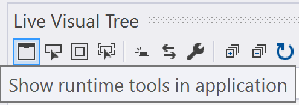

# Troubleshooting XAML Hot Reload

This troubleshooting guide includes detailed instructions that should resolve most issues that prevent XAML Hot Reload from working correctly.

XAML Hot Reload is supported for WPF and UWP apps. For details on operating system and tooling requirements, see [Write and debug running XAML code with XAML Hot Reload](xaml-hot-reload.md).

## Hot Reload is not available

If you see the message "Hot Reload is not available" in the in-app toolbar while debugging your app, follow the instructions described in this article to resolve the issue.

## Verify that XAML Hot Reload is enabled

The feature is enabled by default. When you start debugging your app, make sure you see the in-app toolbar, which confirms that XAML Hot Reload is available:

If you do not see the in-app toolbar, then open **Debug** > **Options** > **General**. Make sure that both options, **Enable UI Debugging Tools for XAML** and **Enable XAML Hot Reload** are selected.

If these options are selected, then go to Live Visual Tree (**Debug** > **Windows** > **Live Visual Tree**) and make sure that **Show runtime tools in application** toolbar button (on the far left) is selected.

## Verify that you use Start Debugging rather than Attach to Process

XAML Hot Reload requires that the environment variable `ENABLE_XAML_DIAGNOSTICS_SOURCE_INFO` is set to 1 at the time application starts. Visual Studio sets this automatically as part of the **Debug** > **Start Debugging** (or **F5**) command. If you want to use XAML Hot Reload with the **Debug** > **Attach to Process** command instead, then set the environment variable yourself.

> [!NOTE]
> To set an environment variable, use the Start button to search for "environment variable" and choose **Edit the system environment variables**. In the dialog box that opens, choose **Environment Variables**, then add it as a user variable, and set the value to `1`. To clean up, remove the variable when you are finished debugging.

## Verify that your MSBuild properties are correct

By default, source info is included in a Debug configuration. It is controlled by MSBuild properties in your project files (such as *.csproj). For WPF, the property is `XamlDebuggingInformation`, which must be set to `True`. For UWP, the property is `DisableXbfLineInfo`, which must be set to `False`. For example:

WPF:

`<XamlDebuggingInformation>True</XamlDebuggingInformation>`

UWP:

`<DisableXbfLineInfo>False</DisableXbfLineInfo>`

## Verify that you are using the correct build configuration name

You must either manually set the correct MSBuild property to support XAML Hot Reload (see previous section), or you must use the default build configuration name (Debug). If you don't set the MSBuild property correctly, a custom build configuration name won't work, nor will a Release build.

## Verify that your XAML file has no errors

If your XAML file shows errors in the **Error List**, then XAML Hot Reload may not work.

## See also

[Write and debug running XAML code with XAML Hot Reload](xaml-hot-reload.md)
