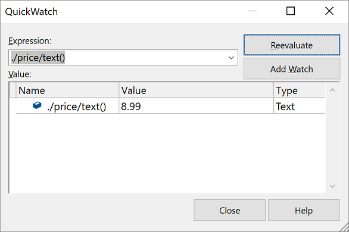

# Evaluate XPath expressions

You can evaluate XPath expressions by using the **QuickWatch** window during debugging. The XPath expression must be valid according to the W3C XPath 1.0 recommendation. The current XSLT context (that is, the `self::node()` node in the **Locals** window) provides the evaluation context for the XPath expression.

When evaluating an XPath expression:

- Built-in XPath functions are supported.

- Built-in XSLT functions and user-defined functions are not supported.

> [!NOTE]
> XSLT debugging is only available in the Enterprise edition of Visual Studio.

## Evaluate an XPath expression

The following procedure uses the *below-average.xsl* and *books.xml* files from the [Walkthrough: Debug an XSLT style sheet](../xml-tools/walkthrough-debug-an-xslt-style-sheet.md#sample-files) page.

1. Insert a breakpoint at the `xsl:if` start tag.

2. To start debugging, choose **XML** > **Start XSLT Debugging** on the menu bar (or, press **Alt**+**F5**).

   The debugger starts and breaks on the `xsl:if` tag.

3. Right-click and select **QuickWatch**.

   The **QuickWatch** window opens.

4. Enter `./price/text()` in the **Expression** field of the **QuickWatch** dialog box, and then choose **Reevaluate**.

   The price of the current book node appears in the **Value** box.

   

5. Change the XPath expression to `./price/text() < $bookAverage` and click **Reevaluate**.

   The **Value** box shows that the XPath expression evaluates to `true`.

## See also

- [Debugging XSLT](../xml-tools/debugging-xslt.md)
